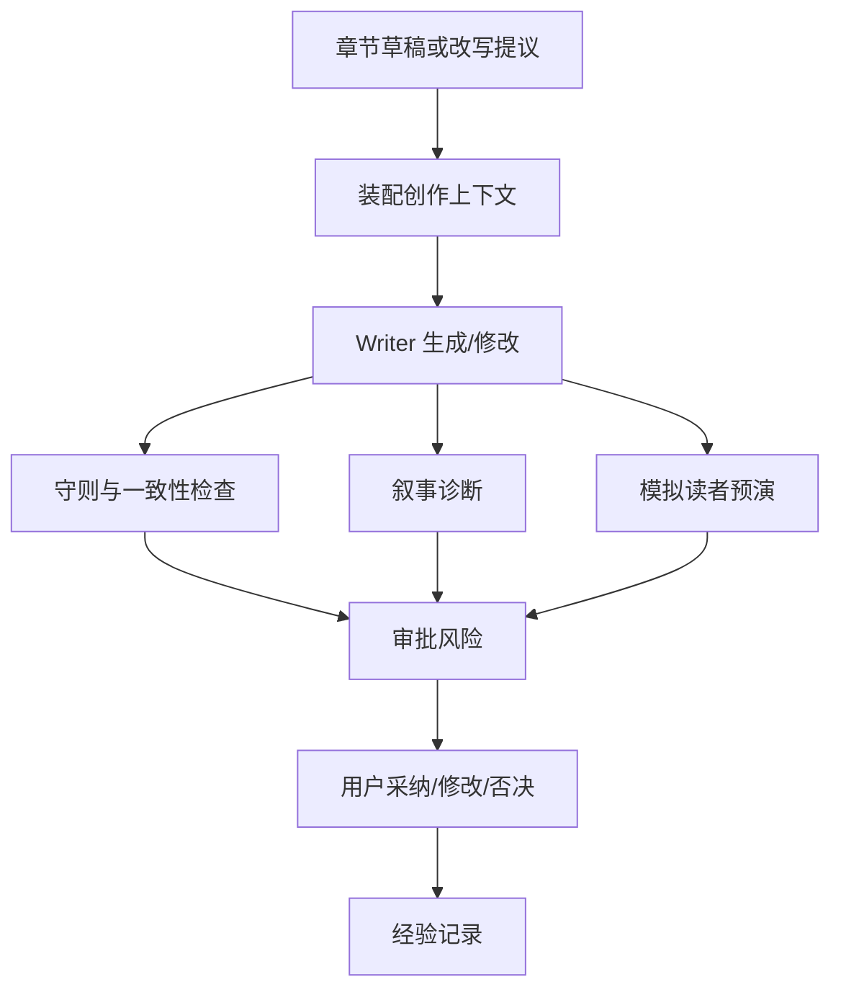

# 08 · Creative Engine

本文档定义五大网文守则、叙事诊断和模拟读者如何进入创作链路。读完本篇应能理解:哪些质量信号会阻断写入,哪些只是建议,报告如何进入审批,以及用户反馈为什么不会让系统暗中自适应改规则。

## 要解决的问题

Open Novel 不只是把字写出来,还要帮作者守住长篇网文的商业叙事要求:黄金三章、人设、节奏、承诺兑现和主角能动性。Creative Engine 把这些要求变成可观察、可解释、可进入审批的技术契约。

它不替作者决策。它负责发现风险、解释风险、把风险带到审批面前。

## 主权对象

Creative Engine 拥有:

- 五大网文守则的机器化检测。
- 章节级叙事指标。
- 跨章偏离信号。
- BeatAnalyzer、ArcTracker、Template Guard 的职责边界。
- ReaderPanel 模拟读者报告。
- 用户对质量报告的反馈记录。

## 五大守则

五大守则是贯穿 Writer、Validator、Context、Approval 和 Settings 的核心契约:

| 守则 | 技术含义 |
|---|---|
| 黄金三章 | 开篇必须交代核心吸引力、冲突和追读理由 |
| 人设不崩 | 角色行为、能力、关系和动机不能违背已建立事实 |
| 节奏不崩盘 | 章节推进、爽点密度和张弛不能失衡 |
| 期待感兑现 | 伏笔、承诺和悬念需要可追踪、可回收 |
| 金手指不依赖 | 主角胜利不能长期只靠外挂替代选择和行动 |

守则不是简单评分。它们影响上下文必装项、Validator 检查、审批风险和 Settings 阈值。高风险或阻断级命中不能被普通写作结果绕过。

## 叙事诊断

叙事诊断分三类:

- BeatAnalyzer:看单章节奏、冲突推进、爽点和钩子。
- ArcTracker:看跨章角色弧光、承诺兑现和长期节奏。
- Template Guard:看番茄网文结构要求是否偏离。

诊断可异步运行,但报告不能伪装成已完成。诊断失败时,写作可以继续到“草稿/待审”状态,但系统不能展示假报告或把缺失报告当通过。

## ReaderPanel

ReaderPanel 模拟不同读者视角,用于发布前预演。它的边界:

- 默认不是硬闸门。
- 不给总分替作者裁决。
- 成功样本不足时标记 inconclusive。
- persona 输入必须防 prompt injection。
- 自定义 persona 只能改变反馈视角,不能改变作品事实和守则。

ReaderPanel 的报告进入审批或侧栏解释,帮助作者判断读者风险。

## 主路径

用户反馈会被记录为经验来源,但不会让守则阈值暗中自适应。守则阈值和开关必须通过 Settings 或明确配置改变。

## 风险进入审批

质量信号进入审批时必须包含:

- 命中的守则或指标。
- 相关文本范围。
- 来源事实或段落。
- 风险级别。
- 建议处理方式。

阻断级风险不能在未解决前落盘;确认级风险需要用户明确接受;提示级风险作为说明展示。

## 与上下文的关系

Writer 和 Validator 必须拿到守则相关上下文,包括角色状态、关系、伏笔、最近章节、世界规则和用户偏好。Context builder 不能为了省 token 裁掉已触发守则所需事实。

## 失败语义

| 失败 | 系统行为 |
|---|---|
| 守则检测失败 | 高风险写入不能伪装成通过 |
| 叙事诊断失败 | 不展示假报告,标记诊断不可用 |
| ReaderPanel 样本不足 | 输出 inconclusive,不做过度判断 |
| persona 注入越权 | 拒绝该 persona 或隔离为不可信内容 |
| 用户指令与守则冲突 | 进入用户确认,不由 Agent 自行裁决 |
| 反馈写入失败 | 不影响本次审批,但 Trace/Settings 标记未学习 |

## 用户可见结果

用户看到的是哪条守则命中、为什么命中、涉及哪段文字、读者可能怎么反应、是否需要确认。系统不把复杂模型评分包装成替作者决策的硬结论。

## Appendix

- [appendix/json-schemas](./appendix/json-schemas.md) 保存守则、叙事和读者报告 schema。
- [appendix/prompt-templates](./appendix/prompt-templates.md) 保存诊断和 persona prompt。
- [appendix/testing-matrix](./appendix/testing-matrix.md) 保存 golden、reader aggregation 和风险分级测试。
