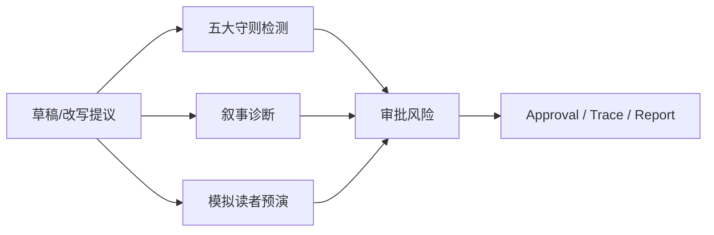
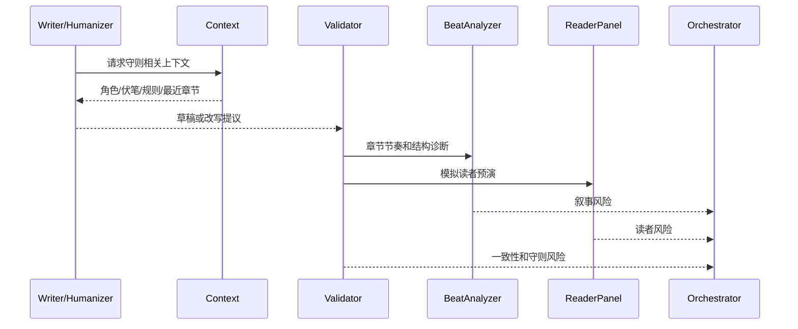
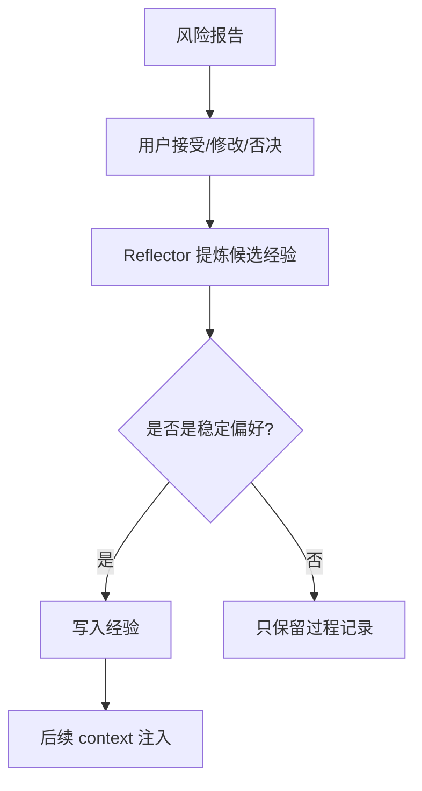

# 08 · Creative Engine

这篇把 Creative Engine 写成一间“质检室”。它不替作者判定小说好坏,也不把模型评分当圣旨。它负责把网文创作中的关键风险变成可观察、可解释、可进入审批的信号。

## 质检室里有三类仪表

三类仪表服务同一个目标:让作者知道风险在哪里、为什么是风险、是否会阻断写入。

## 五大守则不是评分表

| 守则 | 机器要看什么 | 进入审批时怎么说 |
|---|---|---|
| 黄金三章 | 开篇吸引力、冲突、追读理由是否建立 | “这里缺少继续读的钩子/核心矛盾不清” |
| 人设不崩 | 行为、能力、关系、动机是否违背既有事实 | “此处行为与第 X 章状态冲突” |
| 节奏不崩盘 | 推进、爽点密度、张弛是否失衡 | “连续解释过长/冲突推进不足” |
| 期待感兑现 | 伏笔、承诺、悬念是否被追踪和回收 | “此处开启了承诺,尚无回收路径” |
| 金手指不依赖 | 主角是否只靠外挂替代选择和行动 | “胜利缺少主动选择和代价” |

守则信号不是替作者打总分。它影响 Writer 上下文、Validator 检查、审批风险和 Settings 阈值。

## 风险级别如何落地

| 风险 | 系统行为 | 用户动作 |
|---|---|---|
| 提示级 | 展示在报告或审批说明中 | 可忽略 |
| 确认级 | 审批时要求用户明确知道风险 | 接受、修改或拒绝 |
| 阻断级 | 未解决前不能落盘 | 修改、拆分或降低风险来源 |
| 不确定 | 标明证据不足 | 用户决定是否继续 |

风险级别的完整枚举归 appendix;根层定义的是它对审批和落盘的影响。

## 章节质检流程

诊断可以异步,但不能伪装成已完成。报告缺失时,UI 应说明诊断不可用,而不是显示“通过”。

## ReaderPanel 的边界

| 允许 | 不允许 |
|---|---|
| 用多个 persona 提供风险视角 | 给单一总分替作者裁决 |
| 标记弃读点、爽点、疑惑点 | 用读者意见覆盖项目事实 |
| 在样本不足时输出 inconclusive | 把不确定说成明确失败 |
| 使用自定义 persona | 让 persona 指令越权改变系统规则 |

ReaderPanel 是发布前预演,不是硬性审稿委员会。只有它发现的风险进入审批语义时,才会影响写入路径。

ReaderPanel 作为独立用户模块的报告闭环、persona 边界和 design 对接见 [16 · ReaderPanel](./16-reader-panel.md)。本篇只保留它在 Creative Engine 风险体系中的位置。

## 用户反馈如何变成经验

用户反馈不会暗中改守则。它可以变成写作偏好、风格经验或诊断提示,但守则阈值和开关必须通过 Settings 或明确配置改变。

## 质量信号与主路径的关系

| 主路径阶段 | Creative Engine 做什么 |
|---|---|
| 写作前 | 要求 context builder 装入守则相关事实 |
| 生成中 | 可提供结构性约束,但不打断流式输出 |
| 生成后 | 检查草稿、提炼风险、生成报告 |
| 审批前 | 把确认级/阻断级风险带进 ChangeSet |
| 审批后 | 用户反馈可进入经验候选 |

## 事故处理

| 事故 | 收场 |
|---|---|
| 守则检测失败 | 高风险写入不能标记通过 |
| 叙事诊断失败 | 报告标记不可用,不生成假结论 |
| ReaderPanel 样本不足 | 输出 inconclusive |
| persona 注入越权 | 隔离或拒绝 persona |
| 用户指令与守则冲突 | 进入确认/阻断,不由 Agent 自行裁决 |
| 反馈学习失败 | 本次审批照常收尾,标记未学习 |

## FAQ

**Q: Creative Engine 会不会让系统变成打分器?**

A: 不会。它输出风险、来源和建议,不是替作者决定要不要写。

**Q: 阻断级风险能不能关闭?**

A: 普通设置不能让阻断级风险静默落盘。具体阈值可调,但绕过必须有明确用户动作和记录。

**Q: ReaderPanel 的 persona 能否自定义?**

A: 可以,但 persona 是不可信输入,不能越权改变系统规则或项目事实。

**Q: 诊断失败时能不能继续写?**

A: 低风险草稿可以继续到待审/草稿状态;高风险落盘不能伪装成已通过诊断。

**Q: 用户多次忽略某类提示后会自动降级吗?**

A: 不自动改守则。可以形成“用户偏好”供展示或上下文参考,但阈值变化要走 Settings。

## Appendix

- [appendix/json-schemas](./appendix/json-schemas.md) 保存守则、叙事和读者报告 schema。
- [appendix/prompt-templates](./appendix/prompt-templates.md) 保存诊断和 persona prompt。
- [appendix/testing-matrix](./appendix/testing-matrix.md) 保存 golden、reader aggregation 和风险分级测试。
