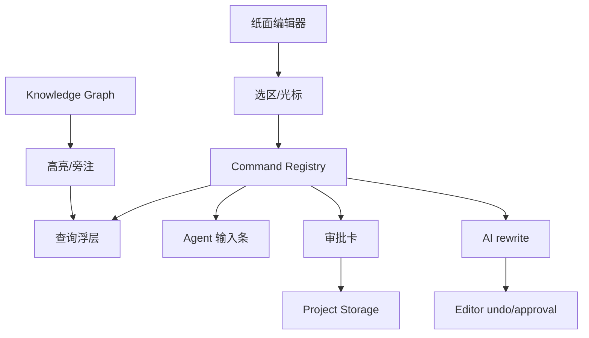
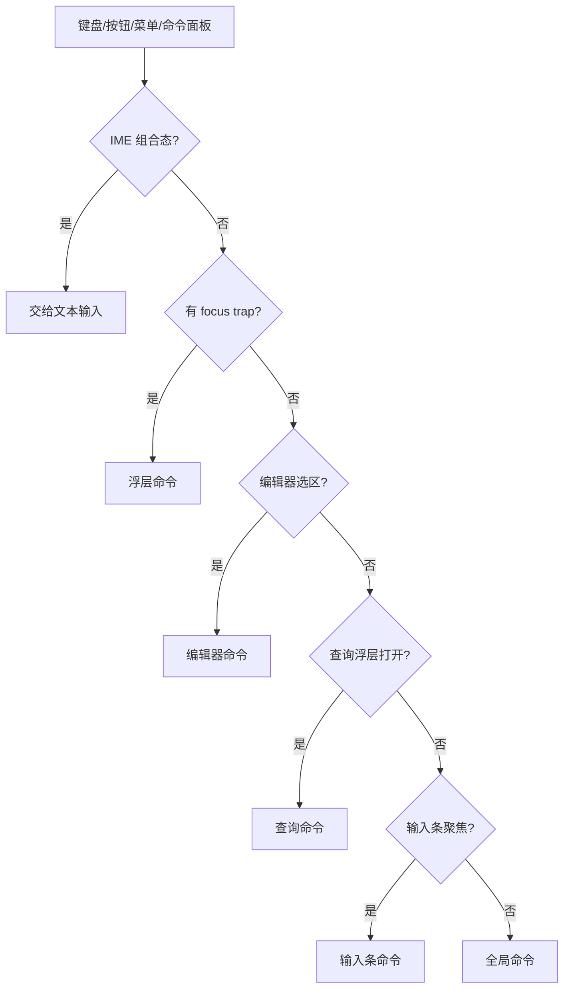
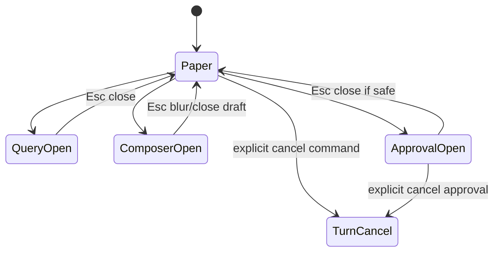

# 10 · Editor And Interaction

这篇把编辑器写成“命令路由面”。正文纸面是主角,高亮、旁注、查询、输入条、审批卡和快捷键都只是围绕纸面工作的入口。它们不能抢焦点,不能制造不可撤销的 AI 替换,也不能把派生提示伪装成正文事实。

## 交互表面的地图

所有入口最终都应该落到命令系统或 turn orchestration,而不是各自直接操作正文。

## 正文事实边界

| 在编辑器里看到的东西 | 是否正文事实 | 说明 |
|---|---|---|
| 用户直接输入的正文 | 是 | 保存后进入项目文件 |
| AI 改写 proposal | 否,直到接受 | 必须可审、可 undo |
| 实体高亮 | 否 | 来自派生索引 |
| 旁注 | 否 | 解释来源或风险 |
| violation marker | 否 | 风险提示 |
| 查询结果 | 否 | 带来源的事实展示 |

编辑器可以展示很多层信息,但只有用户输入和审批后落盘的内容改变作品事实。

## 命令解析顺序

快捷键不是全局暴力监听。当前焦点上下文拥有优先权。

## 命令登记表

每个命令都必须声明:

| 字段 | 为什么需要 |
|---|---|
| 可用上下文 | 防止命令在错误界面触发 |
| 焦点需求 | 防止抢输入 |
| 是否危险 | 触发确认或审批 |
| 是否调用 Agent | 进入 turn 生命周期 |
| 是否修改正文 | 进入 undo 或审批路径 |
| 失败提示 | 用户知道如何恢复 |

完整命令清单归 appendix;根层只定义命令治理规则。

## 查询浮层不是输入条

| 能力 | 查询浮层 | Agent 输入条 |
|---|---|---|
| 目标 | 查项目事实 | 发起讨论/规划/写作 |
| 输入来源 | 选区、高亮、手输查询 | 用户自然语言指令 |
| 输出 | 带来源的结果和跳转 | 回答、报告、proposal |
| 写入能力 | 无 | 可能触发审批路径 |
| pending approval 时 | 可查 | 危险输入需阻止或提示 |

把两者混成一个入口会让用户分不清“我是在查事实”还是“我在让 Agent 做事”。

## Esc 和取消

Esc 先关闭最上层界面,不默认取消正在运行的 turn。取消 turn 需要明确命令,并进入 [04](./04-turn-orchestration.md) 的统一取消语义。

## 外部编辑和 undo

| 场景 | 处理 |
|---|---|
| 外部文件变化 | 提示重载/保留/手动合并,相关审批失效 |
| AI rewrite 替换选区 | 必须进入 undo 栈或审批路径 |
| 审批落盘后撤销 | 走 rollback,不是普通编辑器 undo |
| 高亮索引过期 | 弱化或隐藏 |
| 查询失败 | 保留输入和类型 |

编辑器 undo 解决本地文本操作;审批后落盘属于系统变更,需要 rollback 语义。

## FAQ

**Q: 为什么 Esc 不直接取消 Agent?**

A: 因为 Esc 常用于关闭浮层或退出输入。取消 Agent 是危险动作,要显式触发并进入统一 cancel。

**Q: 高亮不准时怎么办?**

A: 弱化或隐藏,提示索引状态。不能把过期高亮当最新事实。

**Q: AI 改写能不能像普通输入一样进入 undo?**

A: 轻量选区改写可以,但必须可撤销;高风险或跨文件改写应走审批。

**Q: 命令面板和快捷键谁是主入口?**

A: Command Registry 是主入口。快捷键、按钮、菜单、命令面板只是触发方式。

**Q: IME 为什么要特别写进 spec?**

A: 中文写作里 IME 组合态很常见。抢键会直接破坏写作体验,属于核心交互契约。

## Appendix

- [appendix/tool-catalog](./appendix/tool-catalog.md) 保存命令、快捷键和查询工具明细。
- [appendix/event-catalog](./appendix/event-catalog.md) 保存 UI 交互事件。
- [appendix/testing-matrix](./appendix/testing-matrix.md) 保存 IME、focus trap、undo 和冲突测试。
