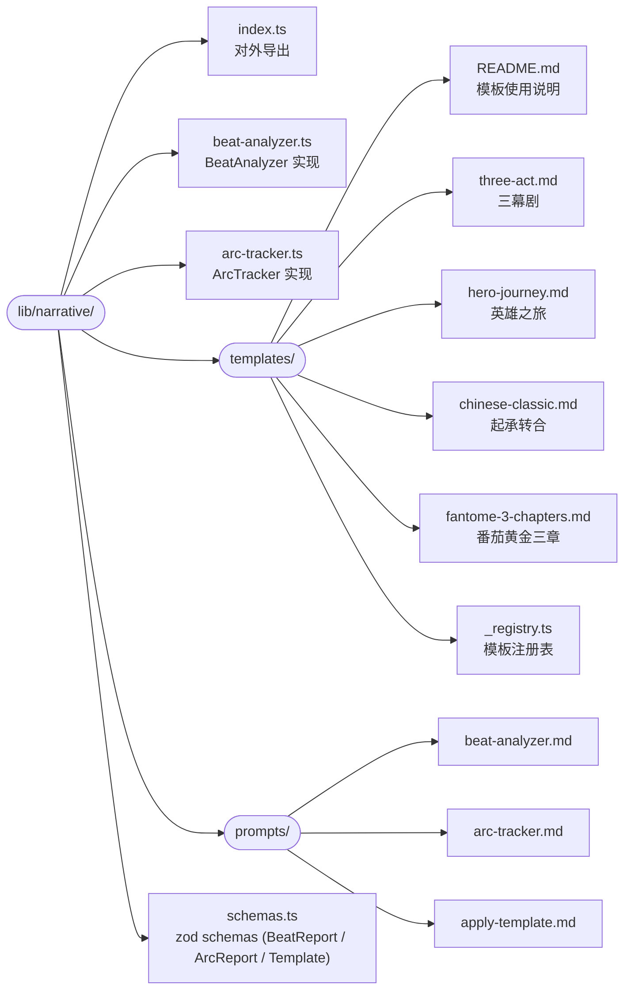

# Spec 10 — 叙事引擎实现

> **[info]** 实现叙事引擎的三个能力模块(产品面见 [plan/10 — 叙事诊断与读者预演](../plan/10-narrative-and-reader.md))。
>
> **Agent 归属**:
>
> - `analyzeNarrative` (BeatAnalyzer) → **Checker** 工具集 (Flash,章内)
> - `trackArc` (ArcTracker) → **Validator** 工具集 (Pro,跨章 + character.md)
> - `applyTemplate` (结构模板库) → **Writer** 工具集 (大纲生成时显式调用)
>
> 拆分理由 (为什么 ArcTracker 不归 Checker) 见 plan/10-narrative-and-reader.md §叙事力学诊断(章内归 Checker、跨章归 Validator)。

## 文件分布

**流程图 · lib/narrative**



## BeatAnalyzer

### Tool 签名

```ts
// lib/narrative/beat-analyzer.ts
import { tool } from 'ai'
import { z } from 'zod'

// 走 JSON mode (spec/24), Flash
const beatReportSchema = z.object({
  emotionCurve: z.array(z.object({
    from: z.number().int().min(0),    // 字符 offset
    to: z.number().int().min(0),
    valence: z.number().min(-1).max(1),     // 情绪正负
    arousal: z.number().min(0).max(1),       // 情绪强度
  })),
  conflictDensity: z.number().min(0),         // events per 1k chars
  conflictTypes: z.object({
    inner: z.number().int().min(0),
    interpersonal: z.number().int().min(0),
    environmental: z.number().int().min(0),
    class: z.number().int().min(0),
    setting: z.number().int().min(0),
  }),
  pacing: z.object({
    avgSentenceLength: z.number(),
    dialogueRatio: z.number().min(0).max(1),
    descriptionRatio: z.number().min(0).max(1),
    transitionDensity: z.number().min(0),
  }),
  hooks: z.array(z.object({
    position: z.number().int().min(0),
    kind: z.enum(['opener', 'cliffhanger', 'mid-spike']),
    strength: z.number().min(0).max(100),
  })),
  rhythmScore: z.number().min(0).max(100),
  hookStrength: z.number().min(0).max(100),                     // 黄金三章 hook 综合分 (T5, spec/25 守则 1)
  // === 五大守则 1/3/5 检测贡献 (T5, spec/25) ===
  cardinalRulesContribution: z.object({
    goldenChapters: z.object({                                  // 守则 1: 仅 1-3 章填
      hookPresent: z.boolean(),
      settingDescriptionRatio: z.number().min(0).max(1),
      namedCharactersCount: z.number().int().min(0),
      issues: z.array(z.string()),
    }).nullable(),
    pacing: z.object({                                          // 守则 3
      pacingScore: z.number().min(0).max(100),
      stallSegments: z.array(z.object({ from: z.number(), to: z.number() })),
      sideLineSegmentsCount: z.number().int().min(0),
    }),
    protagonistAgency: z.object({                               // 守则 5
      activeRatio: z.number().min(0).max(1),
      passiveRatio: z.number().min(0).max(1),
      systemRewardRatio: z.number().min(0).max(1),
      goldenFingerTextDensity: z.number().min(0),               // 匹配字符串数 / 总字数
    }),
  }),
  flagsForAuthor: z.array(z.string()),
})

export const analyzeNarrative = tool({
  description: '分析章节的叙事力学指标 (情绪曲线 / 冲突密度 / 节奏 / 钩子 / 节奏分 / 守则 1+3+5 检测贡献)',
  inputSchema: z.object({
    chapterId: z.string(),
  }),
  outputSchema: beatReportSchema,
  execute: async ({ chapterId }, { projectId }) => {
    const chapter = await readChapterDraft(projectId, chapterId)
    const isGoldenChapter = chapter.chapter_index >= 1 && chapter.chapter_index <= 3
    const cardinalConfig = await readCardinalRulesConfig(projectId)
    // 走 callJsonAgent (spec/24, JSON mode + zod + retry)
    const report = await callJsonAgent({
      label: 'beat-analyzer',
      model: deepseekFlash,
      schema: beatReportSchema,
      maxTokens: 4_000,
      messages: [
        { role: 'system', content: BEAT_ANALYZER_SYSTEM_PROMPT },
        { role: 'user', content: renderPrompt('lib/narrative/prompts/beat-analyzer.md', {
          chapter_content: chapter.content,
          isGoldenChapter,
          cardinalConfig,
        }) },
      ],
    })
    await db.narrative_metrics.upsert(projectId, {
      chapterId, kind: 'beat', report, version: 'v2', generatedAt: now(),
    })
    return report
  },
})
```

### Prompt 大纲 (`lib/narrative/prompts/beat-analyzer.md`)

```
你是 Open Novel 系统的 BeatAnalyzer,任务是把一章网文正文解构为叙事力学指标。

# 输入
{{chapter_content}}

# 输出
严格遵循以下 JSON Schema (见 schemas.ts BeatReport)。

# 分析准则
- 情绪曲线: 把章节按段落切分,对每段评估情绪正负 (valence: -1..+1,负向=压抑/挫败/愤怒,正向=喜悦/释放/胜利) 和情绪强度 (arousal: 0..1)
- 冲突密度: 标记每个独立的"冲突事件" (内心 / 人际 / 环境 / 阶层 / 设定 5 类),除以章节字数 × 1000
- 节奏: 平均句长、对话占比、描写占比、段落间过渡 (有/无明显过渡句)
- 钩子: 找出 opener (开篇钩子) / cliffhanger (章末悬念) / mid-spike (中段高潮),为每个钩子评估强度 (0..100,越高吸引力越强)
- rhythmScore: 综合考虑节奏张弛、爽点频率、钩子强度,给出 0-100 总评
- flagsForAuthor: 1-5 条自然语言提示,e.g. "前 800 字过密集对话,缺场景定位"、"章末钩子较弱,建议增加悬念"

# 严格规则
- 你**不修改正文**
- 你**不评价文笔好坏**(那是 Checker.critique 的职责)
- 仅输出结构化指标 + 简短自然语言提示
```

### 调用方式

触发时机由 SettingsDialog → Section 5 §narrative.beatAnalyzer 控制:

| 设置 | 行为 |
|---|---|
| `runOnSave: true` (默认) | 章节落盘后自动跑 BeatAnalyzer |
| `runOnSave: false` | 仅手动触发 (Editor 顶部 [📊 跑节奏分析] 按钮 / 命令面板) |
| `manualOnly: true` | 完全禁止自动,所有触发必须用户点按钮 |

**实现**: writeChapterProposal approve 后,落盘 → reindex Worker → 检查 `narrative.beatAnalyzer.runOnSave` → 入队 BeatAnalyzer (异步,不阻塞 UI)。结果挂在章节 metadata,UI 显示提示 "已分析 (查看)"。

**结构化输出失败**: 用 `callStructured()` (spec/02 §结构化输出失败的修复路径) 包装,失败时 fallback 到 defaults `{ rhythmScore: 50, flagsForAuthor: ['(分析失败,请重试)'], emotionCurve: [], hooks: [], conflictDensity: 0, ... }`,UI 显示淡灰色 + [重新分析] 按钮。

## ArcTracker

### Tool 签名

```ts
const arcReportSchema = z.object({
  characterId: z.string(),
  expectedArc: z.string(),
  observedShifts: z.array(z.object({
    chapter: z.string(),
    position: z.number().int().min(0),
    kind: z.enum(['belief', 'relationship', 'capability', 'goal']),
    summary: z.string(),
  })),
  deviation: z.object({
    score: z.number().min(0).max(100),
    reason: z.string(),
    examples: z.array(z.object({
      chapter: z.string(),
      snippet: z.string().max(200),
    })),
  }),
  // === 五大守则 2/4/5 检测贡献 (T5, spec/25) ===
  cardinalRulesContribution: z.object({
    characterIntegrity: z.object({                              // 守则 2
      promiseViolations: z.array(z.object({                     // 违反 reader_promises
        chapter: z.string(),
        anchor: z.string(),
        promise: z.string(),
        violatingBehavior: z.string(),
        severity: z.enum(['critical', 'major']),
      })),
      tabooViolations: z.array(z.object({
        chapter: z.string(),
        anchor: z.string(),
        taboo: z.string(),
        violatingBehavior: z.string(),
      })),
      valueAxisDeviations: z.array(z.object({
        chapter: z.string(),
        axis: z.string(),
        baseline: z.number(),
        observed: z.number(),
        deviation: z.number(),
      })),
      fakeStrategyDetected: z.boolean(),                        // 假智谋真降智
      dualStandardDetected: z.boolean(),                         // 双标圣母
    }),
    promiseAccountability: z.object({                            // 守则 4 — Validator 主审, ArcTracker 提供 character 维度信号
      promisesNotRecentlyTouched: z.array(z.string()),           // 应该推进但近期没触及的
    }),
    protagonistAgency: z.object({                                // 守则 5 — character 视角
      passivityScore: z.number().min(0).max(1),                  // 该角色被动接受比例
      systemDependencyScore: z.number().min(0).max(1),
    }).nullable(),                                                // 仅主角填
  }),
})

export const trackArc = tool({
  description: '追踪一个角色的成长轨迹与 expected arc 偏离度 + 守则 2/4/5 检测贡献',
  inputSchema: z.object({
    characterId: z.string(),
    upToChapter: z.string().optional(),    // 截止章节,默认全部
  }),
  outputSchema: arcReportSchema,
  execute: async ({ characterId, upToChapter }, { projectId }) => {
    const character = await readSettingByEntityId(projectId, characterId)
    const expectedArc = character.frontmatter.expected_arc ?? '(未指定 expected_arc)'
    const readerPromises = character.frontmatter.reader_promises ?? []
    const taboos = character.frontmatter.taboos ?? []
    const valueAxes = character.frontmatter.value_axes ?? {}
    const intelligenceAxis = character.frontmatter.intelligence_axis
    const chapters = await listChaptersUpTo(projectId, upToChapter)
    const mentions = await db.entity_refs.findByEntity(projectId, characterId)
    // 走 callJsonAgent (spec/24, JSON mode + zod + retry, Pro 模型)
    const report = await callJsonAgent({
      label: 'arc-tracker',
      model: deepseekPro,
      schema: arcReportSchema,
      maxTokens: 4_000,
      messages: [
        { role: 'system', content: ARC_TRACKER_SYSTEM_PROMPT },
        { role: 'user', content: renderPrompt('lib/narrative/prompts/arc-tracker.md', {
          character, expectedArc, chapters, mentions,
          readerPromises, taboos, valueAxes, intelligenceAxis,
        }) },
      ],
    })
    await db.narrative_metrics.upsert(projectId, {
      characterId, kind: 'arc', report, version: 'v2', generatedAt: now(),
    })
    return report
  },
})
```

### Prompt 大纲 (`lib/narrative/prompts/arc-tracker.md`)

```
你是 Open Novel 系统的 ArcTracker,任务是观测一个角色在已写章节中的言行变化,与作者设定的 expected_arc 比对偏离度。

# 输入
- 角色档案 (含 expected_arc): {{character}}
- 该角色出现的章节及上下文片段: {{mentions}}

# 输出
严格遵循 ArcReport schema。

# 分析准则
- observedShifts: 找出该角色在已写章节中所有"显著的转变" (信念 / 关系 / 能力 / 目标 4 类),每个标记章节 + 字符位置 + 简短描述
- deviation.score: 对照 expected_arc 评估偏离度 (0=完全符合,100=完全偏离)
- deviation.reason: 一句话解释为什么这样评分
- deviation.examples: 取最多 3 个最典型的偏离片段 (前后 200 字以内 snippet)

# 严格规则
- 不要建议修改正文
- 不要评价"是否合理"(可能是合理的成长,也可能是 bug — 由作者判断)
- 仅给出客观观测 + 偏离度
- expected_arc 为空时,deviation.score 设为 0,reason 写"未指定 expected_arc"
```

### Character.md frontmatter 扩展

```yaml
---
id: char_lin_a3f2
type: character
canonical_name: 林川
expected_arc: |
  从 IT 民工到互联网巨头创始人;性格从隐忍内敛到果决霸气;
  关键转折点在第 50 章被合伙人背叛后。
---
```

ArcTracker 读取此字段。

## 结构模板库

### 模板格式 (markdown + YAML frontmatter)

`lib/narrative/templates/three-act.md`:

```markdown
---
id: three-act
name: 三幕剧
genres: [都市, 言情, 悬疑, 全适用]
description: 西方经典三幕结构,适合长度可控的中篇与短篇
---

# 三幕剧 (Three-Act Structure)

## 第一幕: Setup (建立) — 占总长 25%

- **Hook (钩子)**: 第 1 章前 1000 字内必须有冲突或悬念
- **Inciting Incident (诱发事件)**: 触发主角离开舒适区的事件
- **Plot Point 1**: 第一幕末尾,主角被迫接受新世界 / 新任务

## 第二幕: Confrontation (对抗) — 占总长 50%

- **Rising Action**: 不断升级的挑战
- **Midpoint**: 中段一个重大反转或揭露
- **Plot Point 2**: 主角面临最低谷,所有线索汇聚

## 第三幕: Resolution (解决) — 占总长 25%

- **Climax**: 最终对决
- **Falling Action**: 余波平息
- **Resolution**: 新平衡,角色弧光闭环

## 适用提醒

- 长篇网文 (200+ 章) 不适合单一三幕,建议每 100 章一个三幕循环
- 番茄上推荐用于 10-50 章的开局段
```

### 注册表 (`lib/narrative/templates/_registry.ts`)

```ts
import threeAct from './three-act.md?raw'
import heroJourney from './hero-journey.md?raw'
import chineseClassic from './chinese-classic.md?raw'
import fantome from './fantome-3-chapters.md?raw'

export const templates: Record<string, string> = {
  'three-act': threeAct,
  'hero-journey': heroJourney,
  'chinese-classic': chineseClassic,
  'fantome-3-chapters': fantome,
}
```

### Tool 签名

```ts
export const applyTemplate = tool({
  description: '把一个叙事结构模板嵌入大纲生成 prompt 的 context',
  inputSchema: z.object({
    templateId: z.enum(['three-act', 'hero-journey', 'chinese-classic', 'fantome-3-chapters']),
  }),
  execute: async ({ templateId }) => {
    const content = templates[templateId]
    if (!content) throw new Error(`Unknown template: ${templateId}`)
    return { templateId, content }
  },
})
```

Writer 在生成大纲时,如检测到用户 prompt 中含"用 X 结构"或显式调用 applyTemplate,把模板内容塞进 context。

## SQLite Schema (Wave 4 指针)

> **[info]** **Schema 主权 (Wave 4)**: 完整 `CREATE TABLE narrative_metrics` + INDEX 见 [spec/01 §narrative_metrics](01-storage-schema.md#narrative-metrics)。

**字段摘要**: `kind` ('beat' | 'arc') · `target_id` (chapterId 或 characterId) · `report` (JSON) · `version` ('v1' prompt 版本号) · `generated_at` · `UNIQUE(kind, target_id, version)` 保证同 chapter 同 version 唯一。

`UNIQUE` 约束保证同一 chapter 同 version 只有一条记录,prompt 升级时 version 号 bump 后重跑可生成新行。

## UI 集成

ThinkingPanel 同时渲染 Checker 与 Validator 的叙事输出:

- **Checker.beats** (BeatReport): 渲染为 sparkline 情绪曲线 + 节奏热度色块 + flagsForAuthor 列表
- **Validator.arcs** (ArcReport[]): 每个 ArcReport 一个折叠卡,顶部显示 deviation.score (用警告色彩),展开看 examples

两段视觉上同区呈现 (一个"叙事报告"卡),但数据来源是两个 Agent 的独立输出 (`CheckerReport.beats` / `ValidatorReport.arcs`,见 plan/10-narrative-and-reader.md §叙事力学诊断)。

UI 实现在 `components/panels/NarrativeReport.tsx` (W9 落地)。

## ArcTracker 触发频率

> **[info]** ArcTracker 跨章扫描,章节多了成本会上去。

`narrative.arcTracker` 设置:

| 字段 | 默认 | 说明 |
|---|---|---|
| `runOnSave` | false | 章节落盘后**不**自动跑 (跨章扫成本高) |
| `runOnNewChapter` | true | 新建章节时跑一次,作为该章的 baseline |
| `triggerEveryNChapters` | 5 | 每 5 章主动跑一次,生成全局轨迹快照 |

手动触发: 在角色页面 (`characters/X.md` 打开后) 顶部 [追踪角色弧光] 按钮调 `trackArc({ characterId })`。

**性能**: ArcTracker 每次跑 1 个角色 + N 章节;并发限制 = 1 (避免同时多个角色扫导致 SQLite WAL 写锁竞争)。runOnNewChapter 时只跑当前章节涉及的角色,不全扫。

## 用户不接受 BeatReport 的反馈环

UI 在 NarrativeReport 卡片底部加:

```
[👍 准确]  [🤔 部分准确]  [👎 不准]    [我自己来标]
```

点击 [我自己来标] 弹一个简化标注 UI,用户标 "这段才是真正的爽点"、"这段其实没我标的那么紧张"。落到 `narrative_feedback` 表 (spec/01)。**当前**: 仅记录,不实时调整 prompt。**二期**: Reflector 读这些反馈,推断"对该用户来说,什么算冲突点 / 钩子",写回 learnings 表注入 BeatAnalyzer prompt。

不做 prompt 自适应,但**记录**留好,二期接入闭环。

## 不做什么

- **不做实时分析**: 编辑器输入时不调用 BeatAnalyzer。**只在章节完成 + 自动触发或显式触发**时跑
- **不做跨章节因果推理**: 那是因果图谱的事 (已砍)
- **不做"AI 改写"建议**: BeatAnalyzer 报告纯诊断,不主动改稿。改稿仍由 Writer 在用户授权下进行
