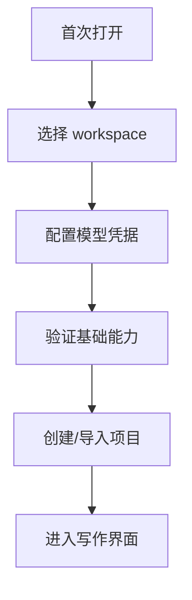

# 11 · Settings And Onboarding

本文档定义首次启动、Settings、经验管理、模型配置、预算展示、项目生命周期和危险操作的实现契约。读完本篇应能理解:哪些设置是用户能理解和控制的产品行为,哪些只是实现参数不该暴露,以及 Reflector、守则阈值和 Debug 面板如何归口。

## 要解决的问题

设置页不能变成内部参数垃圾桶。它只承载用户能理解、能控制、且会改变产品行为的开关。Onboarding 则负责让用户完成最小可用配置,进入第一个项目。

## 主权对象

Settings And Onboarding 拥有:

- workspace 选择。
- API key 与模型能力配置入口。
- Agent 开关和档位。
- Reflector 开关。
- 经验查看、调高、调低、删除。
- 守则阈值和风险提示偏好。
- 预算与用量展示。
- Debug / Developer Mode 的只读诊断入口。
- 项目导入、导出、删除。
- 危险操作确认。
- 首启和渐进式提示。

## Onboarding 主路径

首启只要求最小可用配置。高级设置留在 Settings,不阻塞用户进入产品,除非缺失项会导致核心路径不可用。

## Settings 分类

Settings 应按用户心智分组:

| 分类 | 内容 |
|---|---|
| Workspace | 存储位置、项目列表、导入导出 |
| Model | 凭据、可用模型、基础连通性 |
| Agents | 角色开关、档位、Reflector 是否学习 |
| Style | 风格偏好、范文、Humanizer 相关经验 |
| Rules | 五大守则阈值、风险提示偏好 |
| Memory | 经验查看、权重调整、删除 |
| Usage | 用量、预算、成本提示 |
| Developer | Trace、过程日志、索引健康度、调试只读信息 |

内部包版本、SQL 字段、prompt 片段、retry 常数和 native binding 细节不直接作为普通设置暴露。

## 经验管理

经验管理必须对用户透明:

- 看得到系统学到了什么。
- 看得到经验大致来源。
- 能调高、调低或删除。
- 能关闭继续学习。
- 能区分“停止学习新经验”和“已有经验不再注入”。

Reflector 关闭后不产生新经验;已有经验默认继续生效。用户若希望完全不使用已有经验,需要在 Memory/Style 设置中关闭或删除。

## 守则与风险设置

五大守则是核心产品契约,不能被普通设置完全绕过。Settings 可以调整阈值、提示强度和某些偏好,但不能允许用户在无提示情况下让阻断级风险静默落盘。

阈值变化需要影响后续检测,不应回写已完成历史报告,除非用户主动重新分析。

## Debug / Developer Mode

Developer Mode 展示过程历史、Trace、索引健康度、上下文装配和外部事实审计结果。它是只读诊断入口:

- 不能从 session_history 恢复项目事实。
- 不能绕过审批直接写入。
- 不能把内部事件变成用户可编辑作品内容。

## 项目生命周期

导入、导出、删除和重置都是危险操作或高风险操作:

- 导入冲突必须让用户选择处理方式。
- 导出应说明包含哪些项目文件和派生数据。
- 删除项目必须二次确认。
- 清空历史、清空经验、重置设置必须说明不可逆范围。

## 失败语义

| 失败 | 系统行为 |
|---|---|
| workspace 不可写 | 不能完成首启 |
| 凭据不可用 | 不能标记模型已配置 |
| 设置保存失败 | UI 不显示为已生效 |
| 经验更新失败 | 保留原状态并提示 |
| 阈值保存失败 | 不影响既有守则契约 |
| 导入冲突 | 用户选择,不 silent overwrite |
| Debug 数据缺失 | 展示诊断缺口,不影响事实 |

## 用户可见结果

用户看到清晰的首启流程、可理解的设置分组、可管理的经验、可调但不可绕过的风险规则、明确的危险操作确认和只读调试入口。

## Appendix

- [appendix/schema-tables](./appendix/schema-tables.md) 保存设置、经验和项目生命周期存储明细。
- [appendix/testing-matrix](./appendix/testing-matrix.md) 保存 onboarding、settings、danger action 和 debug 面板验证项。
