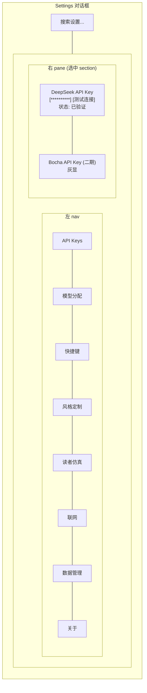
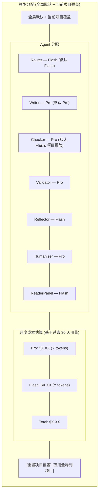
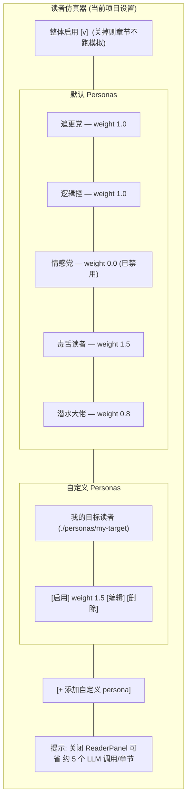
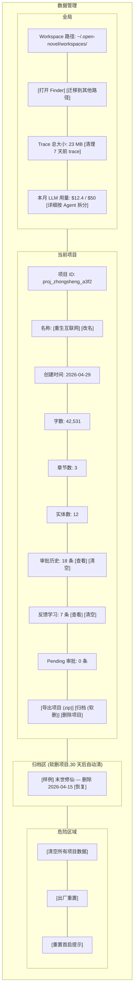
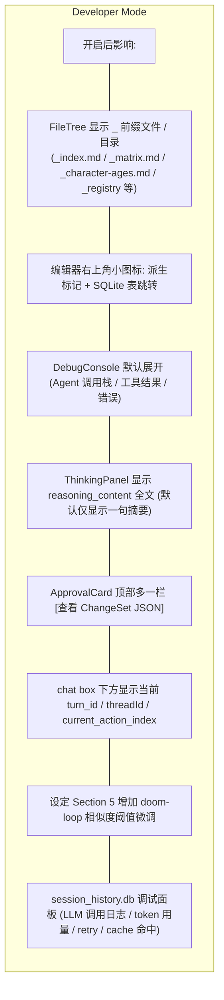
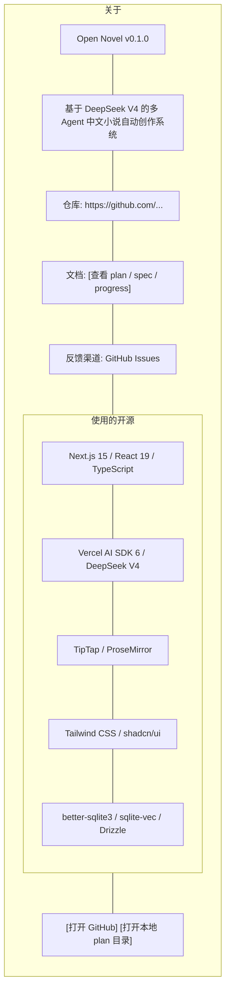
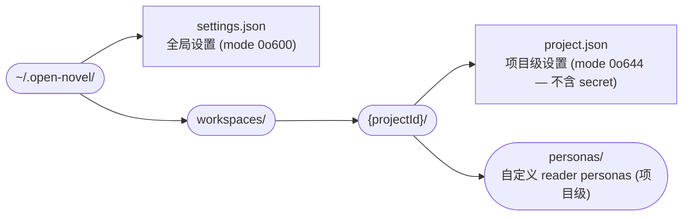
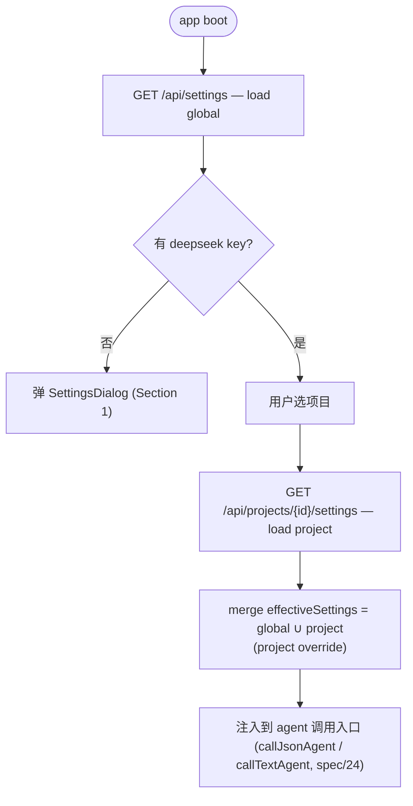

# Spec 13 — SettingsDialog 设计

> **[info]** 替换 plan/07 末尾对 Settings 的草草几行描述。SettingsDialog 是用户与系统全部偏好打交道的唯一入口,本文给出完整设计。

## 设计目标

- **分层清晰**: 全局 (跨项目) vs 项目级 (per project) 严格区分,每个 section 顶部标徽标
- **可发现**: 8 个 section 全部可见,不藏功能;但默认折叠以减少噪声
- **未保存提醒**: 每个 section 独立 dirty state,顶部 banner 提示哪些未保存
- **导入导出**: 设置可整体导出为 json,跨设备迁移友好
- **不破坏数据**: 所有修改都 client → API → fs/db,有错误回滚

## 整体结构

**Settings 配置图**



底部:

- `[取消]` `[应用]` `[导出]` `[导入]`
- 有 dirty section 时 `[应用]` 高亮 + 显示 "X 个 section 未保存"

## 全局 vs 项目级

每个 section 顶部一个明显徽标:

| 徽标 | 含义 | 存储位置 |
|---|---|---|
| 🌐 全局 | 跨所有项目共享 | `~/.open-novel/settings.json` |
| 📂 项目级 | 仅当前项目 | `~/.open-novel/workspaces/{projectId}/project.json` |
| 🔄 混合 | 全局默认 + 项目可覆盖 | 两处都有,项目覆盖全局 |

## Section 1: API Keys + 预算 (🌐 全局)

```yaml
deepseekApiKey: "sk-..."         # 必填
bochaApiKey: ""                   # 可选,二期
tavilyApiKey: ""                  # 可选,二期

# 成本天花板 (硬约束)
budget:
  monthlyUsd: 50                   # 月度预算 (USD)
  warnAtUsd: 40                    # 触发警告阈值
  hardCapBehavior: "block"         # "block" | "warn-only"
  approvalTimeoutHours: 24         # 审批悬挂超时 (与 spec/06 §审批超时联动)
```

UI 字段:

- DeepSeek API Key (必填,masked input,旁有 `测试连接` button)
- Bocha (二期,灰显 + 提示 "Phase 2 enable")
- Tavily (二期,同上)
- **月度预算 (USD)**: 输入框 + 历史用量条形图 (基于 traces 表统计)
- **触顶行为**: radio "阻断 (block,推荐)" / "仅提示 (warn-only)"
- **审批悬挂超时**: 输入框 (小时),默认 24

行为:

- `测试连接`: 服务端调一次低成本 endpoint (`/v1/models`) 验证 key 有效;成功显示 `✓ 已验证 (model: <实查后的 id>)`,失败显示具体错误
- 输入框失焦时自动校验格式 (sk-xxx 长度 ≥ 32)
- 保存写入 `~/.open-novel/settings.json` `mode: 0o600` (见 spec/09)
- **预算实时检查**: 每次发起 LLM 调用前,server 估算 tokens × 单价,累加月内已用 ≥ monthlyUsd 时 `hardCapBehavior` 决定 reject ('BUDGET_CAP_HIT' 错误,见 spec/04 错误表) 还是仅 toast warning

## Section 2: 模型分配 (🔄 混合)

每个 Agent 单独选 Pro / Flash / 自定义模型 ID。

```yaml
# 全局默认
defaults:
  router: flash
  writer: pro
  checker: flash
  validator: pro
  reflector: flash
  humanizer: pro
  readerPanel: flash
  
# 项目级覆盖 (project.json.modelOverrides)
overrides:
  writer: "deepseek/deepseek-v4-pro"     # 显式锁主线
  checker: "deepseek/deepseek-v4-pro"     # 该项目要求 Checker 也用 Pro 提升节奏分析质量
```

UI:

**Agent 协作流程图**



成本估算:从 traces 表统计本项目过去 30 天的 token 消耗,乘以官价。

## Section 3: 快捷键 (🌐 全局)

详见 spec/12。这里的 UI:

**流程图 · 快捷键 设置面板**


操作:

- 单击 `[改]` → input 进入"按键捕获模式" → 按下新组合 → 显示新绑定 → 提交
- 冲突 (同 context + 同 key) → 输入框红色 + 提示 + 阻止提交
- "默认" 列空表示这条用户改过 (默认 = 当前)
- `重置全部` 清空所有 overrides

## Section 4: 风格定制 (📂 项目级)

```yaml
# project.json
genre: "都市重生"
style: |
  幽默轻松,节奏快,短句多。
  对话占比高,内心独白节制。
  避免书面语,口语优先。
agentPersonality: |
  毒舌助理,会主动指出剧情漏洞和懒惰处理。
exampleCorpusFiles:
  - "./settings/范文1.md"
  - "./settings/范文2.md"
```

UI:

- 流派 (下拉: 都市 / 玄幻 / 修仙 / 言情 / 悬疑 / 历史 / 科幻 / 灵异 / 二次元 / 其他)
- 风格 (multi-line textarea,字数提示 ≤500)
- Agent 性格 (textarea,≤300 字)
- 范文 (file picker,可加多个,显示路径列表)

注意: **修改这些会让 Reflector 重置该项目的部分 learnings** — 因为风格变了,旧经验可能不再适用。UI 在保存前提示。

## Section 5: 读者仿真器 + 叙事引擎触发 (📂 项目级)

```yaml
# project.json.readerPanel
enabled: true
runOnSave: true                   # 每次 chapter 落盘后自动跑;关闭后仅手动触发
personas:
  - id: chase-update
    enabled: true
    weight: 1.0
  - id: logic-purist
    enabled: true
    weight: 1.0
  - id: emotion-driven
    enabled: false                # 该作者不在乎情感党反馈
    weight: 0
  - id: cynic
    enabled: true
    weight: 1.5                   # 该作者重视毒舌反馈
  - id: deep-lurker
    enabled: true
    weight: 0.8
custom:
  - file: "./personas/my-target.yaml"
    enabled: true
    weight: 1.5

# 叙事引擎自动/手动触发
narrative:
  beatAnalyzer:
    runOnSave: true               # 章节落盘后自动跑
    manualOnly: false              # true 时仅手动按钮触发
  arcTracker:
    runOnSave: false               # 默认关 (跨章扫描成本高)
    runOnNewChapter: true          # 仅在新建章节时跑一次
    triggerEveryNChapters: 5       # 每 5 章主动跑一次
```

UI:

**流程图 · 读者仿真器 (当前项目设置)**



## Section 6: 联网 (🌐 全局)

```yaml
network:
  enabled: false                  # 强制 false
  defaultProvider: "bocha"        # bocha | tavily | mock
  bochaWeight: 1.0
  tavilyWeight: 0.6
  cacheHours: 24                  # 同 query 缓存
```

UI: 整体灰显,顶部一条横幅 "🚧 二期开放,当前所有联网工具走 mock 实现"。

二期开放后界面: 启用 toggle + provider 选择 + 缓存时长 + 限频。

## Section 7: 数据管理 (🌐 全局 + 📂 项目级)

**流程图 · 数据管理**



### 项目生命周期 UI flow

每个动作的具体行为:

| 动作 | 行为 |
|---|---|
| **改名** | 仅改 project.json.name,**目录名不变** (避免破坏所有引用路径)。UI 显示真实名 + 真实 id |
| **归档 (软删)** | 移到 `~/.open-novel/_archive/{projectId}/`,UI 隐藏 (但归档区可见);保留 30 天后启动 Worker 自动彻底删 |
| **导出 zip** | 打包 `proj_xxx.zip`,**含 .md + project.json + index.db** (含 narrative_metrics / reader_reports / approvals 这些花了 LLM 钱跑的数据);entity_refs / backlinks 这种纯派生表可在导入时重建 |
| **删除 (硬删)** | 二次确认 + 输入项目名字样;先 `closeProjectConnections(projectId)` 关闭 better-sqlite3 connection (见 spec/01 §`lib/storage/db-pool.ts`),再 fs.rm 项目目录;删 session_history.db 中对应 thread / messages |
| **导入 zip** | 解压到 `~/.open-novel/workspaces/{newId}/`;若 projectId 冲突生成新 id;导入后 Worker reindex |
| **恢复归档** | 移回 workspaces/,UI 重新可见 |
| **迁移 Workspace 路径** | 整体 `~/.open-novel/` move,settings.json `workspaceRoot` 字段更新;过程中所有项目 better-sqlite3 connection 必须先 close |

### 危险操作的安全闸

危险操作 (清空 / 重置 / 删除项目): **二次确认 + 输入项目名 (或 `confirm`) 字样才生效**。

- "清空所有项目数据": 输入字样 `delete-all-my-novels`
- "出厂重置": 输入字样 `reset-factory`
- "重置首启提示": 一次确认即可 (只清 onboarding.seenTips,不删数据)

执行前 server 端再校验一次 (防止 client UI 被绕)。

## Section 8: Developer Mode (🌐 全局)

> **[info]** 默认关闭。打开后揭示系统内部基础设施 (派生文件 / 索引 / 调试面板), 普通用户不需要看见。

**审批流程图**



**切换方式**:

- SettingsDialog → Section 8: Developer Mode → toggle `developerMode: boolean`
- 快捷键: `Cmd+Shift+D` (与 spec/12 §快捷键 Registry 对接)
- 状态持久化: 全局 settings.json (跨项目共享)

**不暴露的能力** (即使开 Developer Mode 也不允许):

- 派生文件直接编辑: `_` 前缀文件即使可见仍 read-only (spec/16 §派生文件守卫)
- `cardinal-rules.json` `enabled` 字段: UI 锁死, 只能微调阈值 (plan/04 §cardinal-rules)
- 跳过 cascade 内部递归: 即使 Developer Mode 也不允许 (plan/01 inv L9)

**store 字段**:

```ts
// lib/store/settings.ts
type SettingsState = {
  // ... existing global fields
  developerMode: boolean        // default false
}
```

**FileTree filter 实现**:

```ts
// components/panels/FileTree.tsx
function filterEntries(entries: FileEntry[], developerMode: boolean): FileEntry[] {
  if (developerMode) return entries
  return entries.filter(e => !path.basename(e.path).startsWith('_'))
}
```

## Section 9: 关于 (🌐 全局)

**数据结构图**



## 实现关键

### Zustand store

```ts
// lib/store/settings.ts (扩展现有)
type SettingsState = {
  // global
  deepseekApiKey: string | null
  defaults: ModelDefaults
  keybindings: Record<string, string[]>
  workspaceRoot: string
  // project (active)
  activeProjectId: string | null
  project: ProjectSettings | null
  // dirty tracking
  dirtySections: Set<SectionId>
  // actions
  load(): Promise<void>
  saveSection(id: SectionId): Promise<void>
  saveAll(): Promise<void>
  importJson(json: string): void
  exportJson(): string
}
```

### Routes

- `GET /api/settings` — 全部全局设置 (无敏感字段;key 只回 `hasKey`)
- `POST /api/settings` — 写全局设置 (Zod 校验,mode 0o600)
- `GET /api/projects/{id}/settings` — 项目级设置
- `POST /api/projects/{id}/settings` — 写项目级设置
- `POST /api/keys/test` — 测 DeepSeek key 有效性

所有 routes `runtime = 'nodejs'`。

### 持久化文件

**Settings 配置图**



### 启动流程

**Settings 配置图**



## 学习偏好面板 (MVP 不做)

> **[info]** 原设计含 ActivityBar 💡 入口 + LearningsPanel UI (项目↔全局 promote/demote + 编辑 + 软删 + 本周新增审视), 与 Reflector 简化版决议 **矛盾**。本节已废弃。
>
> 权威决议见 [plan/06 §不做什么](../plan/06-cascade-and-reflection.md#不做什么): "MVP 不做学习偏好面板 — 用户暂时无法手动 +/-/删 / promote / 软删恢复;若 learnings 误学, 只能等 30 天衰减"。
>
> 二期若重启此功能, 需先在 [plan/06](../plan/06-cascade-and-reflection.md) 同步 hit 追踪 + archive 表 + 跨进程 hydrate 等前置依赖 (见 plan/06 §简化版砍掉的)。

## 不做什么

- **不做云同步**: 单设备 localhost,所有设置本地文件即可
- **不做 settings profiles**: 不存"工作模式 / 出版模式"两套预设,简化模型
- **不做 settings audit log**: 改了什么时候改的不重要,可从文件 mtime 看
- **不做 i18n UI 文案**: 仅中文界面;UI 文案集中在 `lib/i18n/zh.ts` 用 key 组织,二期再加其他语言;**不再硬编码到组件**
