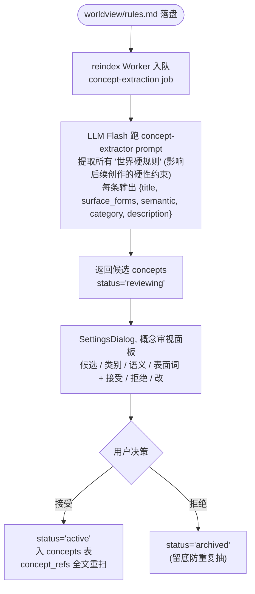
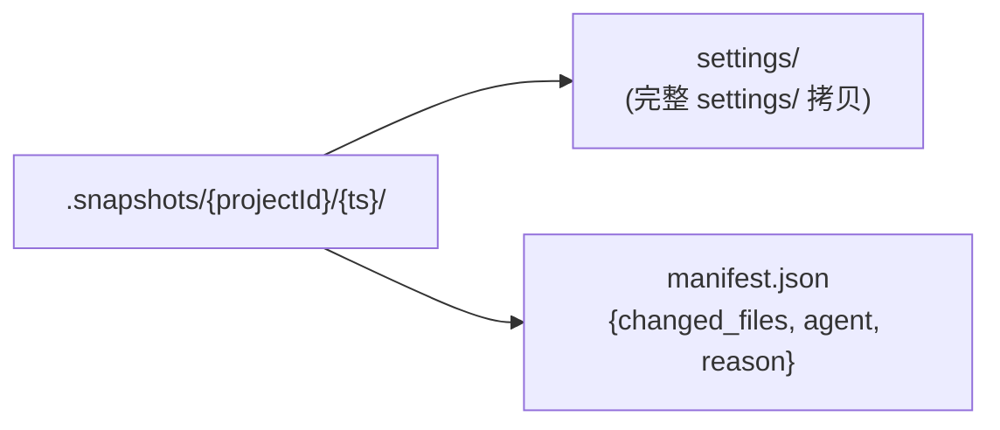

# Spec 16 — 知识图谱 Schema

> **[info]** 实现 plan/11-knowledge-graph.md L1 数据层。本文档定义 4 张新表 + 1 张段锚表 (实现见 spec/17) + 1 张段嵌入表 (实现见 spec/18) + character.md frontmatter 升级 + 概念抽取流程。

## 设计原则

1. **表与 entity 单向 FK** — 所有新表都引用 `entities(id)`,但 entities 表不反向依赖,避免循环
2. **时间字段全部以 chapterId 表达,不用墙钟** — 故事内时间是 chapter 序,与作者写作真实时间无关
3. **frontmatter 是事实源,SQLite 是索引** — 用户改 character.md 后,reindex Worker 重写 entity_relations / entity_timeline 中所有 `source = 'frontmatter'` 的行
4. **派生表 vs 事实表分离** — entity_relations 是派生表 (从 frontmatter + 章节扫描出来),`relationships/notes/*.md` 是用户对关系的注解 (事实)

## 表 1 — entity_relations

> **[info]** **Schema 主权 (Wave 4)**: 完整 `CREATE TABLE entity_relations` + 全部 INDEX 见 [spec/01 §entity_relations](./01-storage-schema.md#entity-relations)。

**字段摘要**: `source_id` / `target_id` (实体 id) · `kind` (17 种内置, 见下方枚举) · `since_chapter` / `until_chapter` (生效区间, nullable) · `strength` (0-100) · `reciprocal_kind` (对偶) · `evidence_file` / `evidence_anchor` / `evidence_quote` (来源追溯) · `source` (frontmatter/narrative/user-edit) · `confidence` (0-100)。

**本节聚焦**: kind 枚举语义 + reciprocal_kind 对照 + 来源等级冲突解决。

### kind 枚举 (开放扩展)

内置 17 种,自由扩展走 `metadata` 字段:

| 类别 | kind 列表 |
|---|---|
| 血缘 | `parent` `child` `sibling` `spouse` `relative` |
| 师承 | `mentor` `disciple` `peer-disciple` |
| 上下级 | `superior` `subordinate` `colleague` |
| 情感 | `lover` `crush` `ex-lover` |
| 对立 | `enemy` `rival` `target` `victim` |
| 同盟 | `ally` `friend` `partner` |

reciprocal_kind 对照:`mentor` ↔ `disciple`、`parent` ↔ `child`、`spouse` ↔ `spouse`、`enemy` ↔ `enemy` 等。reindex 时若发现 source.kind=mentor 但 target 没有对应 disciple 行,自动补一行(strength 同步)。

### 来源等级 (用于冲突解决)

reindex 后同 (source_id, target_id) 可能出现多行(frontmatter 写"林川是张三师父",章节正文又被 LLM 抽出"林川对张三说'师父好'"):

| source 等级 | 信任 |
|---|---|
| `user-edit` | 最高;手动注释,锁,reindex 不覆盖 |
| `frontmatter` | 高;用户在 character.md 显式声明 |
| `narrative` | 中;LLM 从章节正文抽取,confidence < 80 时 UI 黄色警告"待确认" |

冲突时:`user-edit` > `frontmatter` > `narrative`。`narrative` 行 confidence < 60 时 UI 不显示,只在 lint 时提示作者"是否登记"。

## 表 2 — entity_timeline

> **[info]** **Schema 主权 (Wave 4)**: 完整 `CREATE TABLE entity_timeline` + 全部 INDEX 见 [spec/01 §entity_timeline](./01-storage-schema.md#entity-timeline)。

**字段摘要**: `entity_id` · `attribute` (9 类: age/location/mood/power_level/status/affiliation/wealth/social_rank/key_possession, 见下方枚举) · `value` (字符串/JSON) · `valid_from_chapter` / `valid_to_chapter` (生效区间) · `declared_in` / `declared_anchor` / `declared_quote` (来源) · `source` · `confidence`。

**本节聚焦**: attribute 枚举 + 关键查询模式 + 自动推断规则 (frontmatter initial_state → entity_timeline 第一行)。

### attribute 枚举

| attribute | value 类型 | 例 |
|---|---|---|
| `age` | int | `28` |
| `location` | entity_id (place) | `place_beijing_2010` |
| `mood` | string | `depressed` |
| `power_level` | string | `tier-3` |
| `status` | enum | `alive` / `dead` / `missing` / `coma` |
| `affiliation` | entity_id (org/faction) | `org_donghai_a3f2` |
| `wealth` | string (粗粒度) | `poor` / `middle` / `rich` |
| `social_rank` | string | `commoner` / `executive` / `boss` |
| `key_possession` | entity_id (item) JSON list | `["item_pocket_watch_x1y2"]` |

attribute 集合内置以上 9 类,扩展通过 `metadata` JSON 字段(后续可加列)。

### 关键查询模式

```sql
-- 林川 ch_050 时年龄
SELECT value FROM entity_timeline
 WHERE entity_id = 'char_lin_a3f2' AND attribute = 'age'
   AND valid_from_chapter <= 'ch_050'
   AND (valid_to_chapter IS NULL OR valid_to_chapter > 'ch_050')
 ORDER BY confidence DESC, source ASC LIMIT 1;
```

(章节 ID 排序用字典序前 LPad chapter order 序号,详见 spec/17 §章节序与字典序。)

### 自动推断规则

reindex Worker 推断:

1. 若 character.md frontmatter `initial_state.age = 28` + worldview `era = 现代-2010` + 章节 ch_050 内出现"三年后林川生日"→ 自动写入 `(lin, age, 31, ch_050, ch_???, source=narrative, confidence=70)` 一行,UI 标 "待确认"
2. 若 章节 ch_010 § 3 出现"林川走出北京站"→ 推断 `(lin, location, place_beijing, ch_010, ch_???, source=narrative, confidence=75)`

二期可加 LLM 主动扫描 narrative 推断时间轴。当前:作者在 character.md 显式声明 (frontmatter `initial_state` + 用户编辑 timeline 注解) 为主路径,narrative 推断为辅路径。

## 表 3 — concepts

> **[info]** **Schema 主权 (Wave 4)**: 完整 `CREATE TABLE concepts` + 全部 INDEX 见 [spec/01 §concepts](./01-storage-schema.md#concepts)。

**字段摘要**: `id` (concept_X_yyyy) · `category` (tech/magic/taboo/glossary/rule/culture) · `semantic` (absent/present/restricted/mandatory/unique, 见下方语义) · `title` · `surface_forms` (JSON array, AC trie 用) · `description` · `defined_in` / `defined_anchor` · `source` (llm-extracted/user-edit) · `confidence` · `status` (active/reviewing/archived)。

**本节聚焦**: semantic 字段语义 + 概念抽取流程 + concept-extractor prompt。

`semantic` 字段语义:

- `absent` — 此世界**没有**该事物 (e.g. 无手机)
- `present` — **存在**且无特殊限制
- `restricted` — 存在但**受限** (e.g. 武器限平民,法师限考核)
- `mandatory` — 强制要求 (e.g. 全民修炼)
- `unique` — 独一无二 (e.g. 只有主角能用某能力)

### 概念抽取流程

**Settings 配置图**



### concept-extractor prompt (`lib/concepts/prompts/extractor.md`)

```markdown
你是 Open Novel 概念抽取器。任务:从世界观/设定文本中提取**会影响后续章节创作的硬规则**。

# 输入
{{worldview_or_rules_text}}

# 输出
JSON 数组,每条形如:
{
  "title": "此世界没有手机",
  "surface_forms": ["手机", "移动电话", "电话", "mobile"],
  "semantic": "absent",
  "category": "tech",
  "description": "故事设定为蒸汽朋克 1900 年,无现代通讯手段..."
}

# 严格规则
- 只提取**硬规则** (会让某段未来创作变成"违反设定"的)
- 不提取风格 / 偏好 / 一般描述
- surface_forms 至少 2 个 (含同义词、缩写、英文)
- 不确定时不要输出 (宁缺勿滥)
- 输出严格 JSON 数组
```

## 表 4 — concept_refs

与 entity_refs 对称结构,但索引概念表面词。

> **[info]** **Schema 主权 (Wave 4)**: 完整 `CREATE TABLE concept_refs` + 全部 INDEX 见 [spec/01 §concept_refs](./01-storage-schema.md#concept-refs)。

**字段摘要**: `concept_id` (FK concepts) · `source_file` / `source_anchor` · `position_from` / `position_to` (段内 offset) · `matched_text` · `snippet` (前后 30 字) · `is_violation` (0/1, 与 concept.semantic 冲突)。

**本节聚焦**: is_violation 计算规则 (按 concept.semantic 分支)。

### is_violation 计算

reindex 时按 concept.semantic 判:

- `absent` → 任何命中 = violation
- `present` → 0 violation (只是引用)
- `restricted` → 配合上下文 LLM 判 (当前简化为 0,二期接 LLM)
- `mandatory` / `unique` → 上下文 LLM 判 (当前简化为 0)

violation = 1 的行让 Validator cascade 自动捞起来重写。

## 表 5 — dependencies

跨文件 / 跨设定的显式依赖。

> **[info]** **Schema 主权 (Wave 4)**: 完整 `CREATE TABLE dependencies` + 全部 INDEX 见 [spec/01 §dependencies](./01-storage-schema.md#dependencies)。

**字段摘要**: `kind` (foreshadowing/payoff/callback/promise/constraint, 见下方枚举) · `source_file` / `source_anchor` · `target_file` / `target_anchor` (锚点必填) · `status` (pending/fulfilled/broken/cancelled) · `metadata` (JSON: 收割章节/weight/deadline_chapter) · `user_note`。

**本节聚焦**: kind 枚举 + status 枚举 + lint 增强规则 (deadline / weight / promiseAccountabilityCheck 联动 spec/25)。

### kind 枚举

| kind | 语义 | 例 |
|---|---|---|
| `foreshadowing` | 伏笔 | foreshadowing/X.md → ch_010 § 5 (埋点) |
| `payoff` | 收割 | foreshadowing/X.md → ch_080 § 12 (收割点) |
| `callback` | 呼应 | ch_080 → ch_005 (回调早期场景) |
| `setup` | 铺垫 | character/lin.md → ch_001 (设定 → 首次落地) |
| `continuity` | 延续 | ch_010 → ch_011 (上一章末尾接下一章开头) |
| `promise` | 承诺 | reader-promises.md → ch_???? (尚未兑现) |

### status 枚举

| status | 语义 |
|---|---|
| `pending` | 已建立,尚未触达 (foreshadowing 已埋,未收割) |
| `planted` | 埋点已写 (ch_010 § 5 已含怀表描写) |
| `paid-off` | 收割已写 (ch_080 § 12 已揭示怀表是关键) |
| `broken` | 锚点失效 (ch_010 § 5 段被删,需作者处理) |
| `archived` | 用户主动归档 (放弃此伏笔) |

### lint 触发规则

reindex 后扫一遍 dependencies:

- `pending` 但 target_anchor 找不到 → 改 `broken`,UI 红色警告"伏笔锚点失效"
- `pending` 但 metadata.expected_payoff_by < current_chapter → 改 `pending` + UI 黄色警告"伏笔超期未收割"
- `paid-off` 但 source_anchor 找不到 → 改 `broken`(收割点没了埋点)

### metadata 字段 (kind='foreshadowing' / 'promise' 专用,五大守则期待感兑现 spec/25)

```ts
type ForeshadowingMetadata = {
  expected_payoff_by?: string             // 期望收割章节 ID (e.g. 'ch_030')
  // === v3 新增 (spec/25 守则 4: 期待感兑现) ===
  deadline_chapter?: number                // 硬 deadline 章节序号 (>= 0)
  deadline_word_count?: number             // 或者按字数 deadline (alternative)
  weight: 'critical' | 'major' | 'minor'   // critical = 弃书级承诺 (e.g. "三年之约 / 战神归来 / 复仇")
  expected_resolution_pattern?: string     // e.g. "战神回归后 ≤ 5 章必须展现实力"
  recently_touched_in?: string[]           // 最近 N 章触及该承诺的章节 IDs (派生)
}
```

**`weight` 语义** (spec/25 守则 4):

- `critical`: 三年之约 / 战神归来 / 复仇这种核心承诺,违反 = 弃书级,deadline 已过未 resolved → ApprovalCard `blocking` 不让通过
- `major`: 主线相关承诺,deadline 接近无推进 → warn
- `minor`: 一般伏笔,deadline 不强约束

**lint 增强**:

- `kind='foreshadowing'/'promise'` 且 `weight='critical'` 且 `deadline_chapter < current_chapter` 且 `status='pending'` → 写章节时 promiseAccountabilityCheck (spec/25) 标 `blocking=true`
- 距 deadline ≤ 3 章无 `recently_touched_in` 命中 → warn level (`warn` 守则的 majorpromise / `critical` 守则的 critical promise)

## 表 6 — paragraph_anchors (实现详见 spec/17)

> **[info]** **Schema 主权 (Wave 4)**: 完整 `CREATE TABLE paragraph_anchors` + INDEX 见 [spec/01 §paragraph_anchors](./01-storage-schema.md#paragraph-anchors)。原 spec/17:90 重复声明已改为指针。

**字段摘要**: `anchor_id` (PK, 算法见 spec/17 §稳定 ID) · `file_path` · `paragraph_index` (1-based 顺序) · `heading_path` (e.g. '第一章 § 段落 5') · `content_hash` (sha256 + 标点/空格/数字归一化) · `prev_anchor` / `next_anchor` (邻接双链)。

**用途**: 段级稳定 ID, 让 entity_refs / concept_refs / dependencies / paragraph_embeddings 引用一个跨章节稳定的句柄。实现算法 + 邻接对照兜底 详 spec/17 §稳定 ID + §邻接对照。

## 表 7 — paragraph_embeddings (实现详见 spec/18)

> **[info]** **Schema 主权 (Wave 4)**: 完整 `CREATE TABLE paragraph_embeddings` (含 spec/18 确认版的 `norm REAL` 字段) + INDEX 见 [spec/01 §paragraph_embeddings](./01-storage-schema.md#paragraph-embeddings)。原 spec/16 / spec/18:28 重复声明已改为指针。

**字段摘要**: `anchor_id` (PK + FK paragraph_anchors) · `embedding` (BLOB, F32 little-endian) · `model_name` (bge-m3 / deepseek-v1 / text-embedding-3-small) · `model_dim` (1024 / 1536 / 3072) · `content_hash` (增量更新用) · `norm` (预计算 L2, cosine 加速)。

**向量索引**: P0-1 升级路径 = sqlite-vec extension (`db.loadExtension(sqliteVec.getLoadablePath())`), 见 [spec/18 §决议](./18-embeddings.md) + [plan/08 §Drizzle + better-sqlite3 + sqlite-vec](../plan/08-tech-stack.md)。provider 选型 (BGE-M3 本地, fallback DeepSeek/OpenAI) 详 spec/18 §选型对比。

## character.md frontmatter 升级

替换 spec/01 §characterFrontmatter 的 zod schema:

```ts
// lib/storage/frontmatter-schema.ts
export const characterFrontmatter = z.object({
  // === 既有字段 (兼容) ===
  id: z.string().regex(/^char_[a-z0-9-]{1,24}_[a-f0-9]{4}$/),
  type: z.literal('character'),
  canonical_name: z.string().min(1).max(20),
  aliases: z.array(z.string().min(1).max(20)).default([]),
  gender: z.enum(['male', 'female', 'other', 'unknown']).default('unknown'),
  role: z.enum(['protagonist', 'support', 'antagonist', 'extra']).default('extra'),
  appearance: z.string().max(500).optional(),
  personality: z.string().max(500).optional(),
  background: z.string().max(2000).optional(),
  expected_arc: z.string().max(1000).optional(),
  created_at: isoDate,
  updated_at: isoDate,
  source: z.enum(['writer-agent', 'user-edit', 'imported']),

  // === 新增字段 (W7 落地) ===

  // 故事开头的 snapshot (作为 entity_timeline 第一行的来源)
  initial_state: z.object({
    age: z.number().int().min(0).max(200).optional(),
    location: z.string().regex(/^place_/).optional(),       // place entity id
    affiliation: z.string().regex(/^(org|faction)_/).optional(),
    power_level: z.string().max(20).optional(),
    status: z.enum(['alive', 'dead', 'missing', 'coma']).default('alive'),
    wealth: z.enum(['destitute', 'poor', 'middle', 'rich', 'wealthy']).optional(),
    social_rank: z.string().max(20).optional(),
  }).optional(),

  // 关系 (作为 entity_relations frontmatter source 的来源)
  relations: z.array(z.object({
    kind: z.string().max(20),                               // 见 entity_relations §kind 枚举
    target: z.string().regex(/^(char|org|faction|item)_/),
    since: z.string().regex(/^ch_/).optional(),             // 起始章节
    until: z.string().regex(/^ch_/).optional(),             // 结束章节
    strength: z.number().int().min(0).max(100).default(50),
    note: z.string().max(200).optional(),
  })).default([]),

  // 已对读者的承诺 (与 reader-promises.md 双锚)
  reader_promises: z.array(z.string().max(100)).default([]),

  // 角色级禁区 (Validator lint 用)
  taboos: z.array(z.string().max(100)).default([]),

  // === v3 新增 (W7 + spec/25 五大守则人设崩坏检测) ===

  // 行为价值观基线 (守则 2: 角色行为偏离 baseline > 0.4 = critical)
  // 各 axis 0-1 浮点, 0=最负向, 1=最正向; baseline 是平时表现, range 是允许波动
  value_axes: z.record(
    z.string().max(20),                                       // axis name: '对敌' / '对友' / '对女' / '对长辈' 等
    z.object({
      baseline: z.number().min(0).max(1),
      range: z.tuple([z.number().min(0).max(1), z.number().min(0).max(1)]),  // [min, max]
    })
  ).default({}),

  // 智力基线 (守则 2: 假智谋真降智检测; 主角策略成功时对手 IQ 不应低于 baseline*0.7)
  intelligence_axis: z.object({
    baseline: z.number().min(0).max(1),
    iq_range: z.tuple([z.number().min(0).max(1), z.number().min(0).max(1)]),
  }).optional(),

  // 派生标记 (relationships/_matrix.md 等派生文件标 true,UI 锁写)
  derived: z.boolean().default(false),

  _schemaVersion: z.literal(3).default(3),                  // ← bump v3
})
```

`_schemaVersion: 1 → 2 → 3` 触发迁移脚本(详见 spec/16 §迁移)。**v3 迁移**只补 `value_axes: {}` + `intelligence_axis: undefined` 默认值 — 不破坏既有 character.md。用户需要时在 SettingsDialog "角色基线"面板填入,或 Reflector 从历次审批反馈逐步学习填充。

### 其他 frontmatter 也升级

```ts
// 通用 frontmatter (worldview / outline / events / items / locations / ...)
export const baseSettingFrontmatter = z.object({
  id: z.string(),
  type: z.string(),
  title: z.string().min(1).max(60),
  category: z.string().optional(),                          // 'rule' / 'history' / ... 子类
  derived: z.boolean().default(false),                      // 派生文件
  surface_forms: z.array(z.string()).optional(),            // 让该实体被 AC trie 索引的别名 (concepts 用)
  created_at: isoDate,
  updated_at: isoDate,
  source: z.enum(['writer-agent', 'user-edit', 'imported']),
  _schemaVersion: z.number().int().min(1).default(2),
})
```

新类型 (faction / organization / item / event / foreshadowing / story-line / chapter-arc) 在 spec/16 各自分段补 schema(先用 baseSettingFrontmatter + 各自 metadata JSON 字段,二期再升级)。

## 迁移 (_schemaVersion 1 → 2)

`lib/storage/migrations/002-knowledge-graph.ts`:

```ts
export async function migrate002(projectId: string) {
  const db = getDb(projectId)

  // 1. 建表 (CREATE TABLE IF NOT EXISTS)
  await db.exec(/* entity_relations / entity_timeline / concepts / concept_refs / dependencies SQL */)
  await db.exec(/* paragraph_anchors / paragraph_embeddings SQL,见 spec/17/18 */)

  // 2. 扫所有 character.md,从 frontmatter 注入 entity_timeline + entity_relations
  for (const charFile of await listCharacters(projectId)) {
    const fm = await readCharFrontmatter(charFile)
    if (!fm.initial_state) continue
    // initial_state → entity_timeline (valid_from = ch_001 默认)
    for (const [attr, value] of Object.entries(fm.initial_state)) {
      await db.execute(/* INSERT entity_timeline */)
    }
    // relations → entity_relations
    for (const rel of fm.relations ?? []) {
      await db.execute(/* INSERT entity_relations + reciprocal */)
    }
  }

  // 3. 概念抽取 — 入队 worldview/rules.md 跑 LLM,落 concepts (status='reviewing')
  // (用户后续在概念审视面板逐一接受)
  await enqueueConceptExtraction(projectId)

  // 4. 段级 anchor + embedding 全量 reindex (Worker 异步,不阻塞)
  await enqueueParagraphReindex(projectId)

  // 5. PRAGMA user_version = 2
  await db.exec('PRAGMA user_version = 2')
}
```

迁移**只向前**,与 spec/01 §数据迁移既有约定一致。

## L4 治理 — Setting Lint

每次 plan 模式保存触发 `lib/storage/lint.ts`:

| 检查项 | 严重度 | 触发条件 |
|---|---|---|
| 角色无 expected_arc | warning | character.md frontmatter 缺该字段 |
| 角色无 initial_state | warning | 缺 initial_state.age 或 initial_state.location |
| 孤儿 entity | warning | entity 在 entities 表中存在,但 entity_refs 零行,且无 relations 上下游 |
| 循环 relation | error | A → mentor → B 同时 B → mentor → A |
| 失效锚点 | error | dependencies.target_anchor 在 paragraph_anchors 中找不到 |
| 关系 strength 超界 | error | 不在 [0, 100] |
| 时间线冲突 | error | 同 (entity, attribute) 两行 valid 区间重叠且 source 同级别 (无法仲裁) |
| 概念审视待处理 | info | concepts.status = 'reviewing' 累计 ≥ 1 |
| 伏笔超期未收割 | warning | dependencies.status = 'pending' AND metadata.expected_payoff_by < current_chapter |
| reader_promise 数量过多 | info | character.reader_promises.length > 5 (容易写崩) |

UI: SettingsDialog → 设定健康度面板,显示问题列表 + 跳转 + [一键修复] (后者仅简单项,如补默认 status)。

## L4 治理 — Plan Inconsistency Lock

```ts
// lib/storage/inconsistency-lock.ts
export async function checkPlanLock(projectId: string): Promise<LockState> {
  const pending = await db.approvals.findPending(projectId, { source: 'cascade' })
  const broken = await db.dependencies.where({ status: 'broken' }).count()
  if (pending.length === 0 && broken === 0) return { locked: false }
  return {
    locked: true,
    reasons: [
      ...(pending.length > 0 ? [`${pending.length} 条 cascade 提议未决`] : []),
      ...(broken > 0 ? [`${broken} 条伏笔锚点失效`] : []),
    ],
  }
}
```

write 模式启动前调用;locked = true 时弹 dialog "请先处理设定不一致项 [跳转 cascade 队列] / [跳转 lint 报告]",不允许 mode = write。

绕过:用户可点 "强制写作"(高级选项,后台仍记录 audit log;不推荐但保留逃生口)。

## L4 治理 — Snapshot

每次 writeSetting 落盘后,若改动文件属于 (P0 类目: worldview/* / outline/master.md / characters/*),自动 snapshot。

> **[info]** **Schema 主权 (Wave 4)**: 完整 `CREATE TABLE setting_snapshots` + INDEX 见 [spec/01 §setting_snapshots](./01-storage-schema.md#setting-snapshots)。

**字段摘要**: `project_id` · `triggered_by_approval_id` · `snapshot_dir` (`~/.open-novel/.snapshots/{projectId}/{ts}/`) · `size_bytes` · `description` (一句话变更摘要) · `expires_at` (默认 30 天后清理)。

snapshot_dir 内容:

**Settings 配置图**



UI: SettingsDialog → 历史快照面板,显示时间轴 + 每条 [还原] 按钮(走 ApprovalCard 让用户审一次完整 diff 再覆盖)。

清理: 每周后台 Worker 删 expires_at < now 的 snapshot;手动 promote = expires_at += 90 days。

## L4 治理 — 派生文件守卫

派生文件具备**两个正交标记**, 同时使用:

- **文件名 `_` 前缀** — FileTree 组件默认隐藏 ([§设定目录契约](#设定目录契约)), 用户感知不到这些文件存在; Developer Mode 切换可见 (spec/13)
- **frontmatter `derived: true`** — writeSetting / resolve 落盘路径拒写

命名规范: 派生文件必须 `_` 前缀 (e.g. `relationships/_matrix.md` / `./timeline/_character-ages.md`), 强制让"不可见 + 不可写"绑定。

```ts
// lib/storage/derived-guard.ts
export async function assertNotDerived(filePath: string) {
  const basename = path.basename(filePath)
  // 双重校验: _ 前缀 OR frontmatter derived: true
  if (basename.startsWith('_')) {
    throw new ToolValidationError('DERIVED_FILE_READONLY', `${filePath} 是 _ 前缀派生/索引文件, 不可经 writeSetting 修改`)
  }
  const fm = await readFrontmatter(filePath)
  if (fm.derived === true) {
    throw new ToolValidationError('DERIVED_FILE_READONLY', `${filePath} 标记 derived: true (派生文件), 改动 SQLite 表即可`)
  }
}
```

调用点:

- `writeSetting` tool execute 第一行
- spec/06 `POST /api/approvals/:id/resolve` 落盘前每个 accepted_item 再校验一次 (防 cascade proposal 改派生文件被审批通过)
- spec/06 `rollbackApproval` 写 fs 前 (防回退覆盖派生文件)

读取派生文件正常 (供 LLM / Writer 取用, 走 readSetting tool)。Developer Mode 打开时 UI 显示派生文件 → 编辑器 read-only + 顶部 banner "派生视图, 改动 SQLite 表后会自动重生成"。

## 设定目录契约

> **[info]** 本节定义设定目录的实现侧契约 (`_` 前缀文件约定 / `_index.md` 生成格式 / 空目录处理 / 子目录全集), 自存储模型设计迁入; spec 侧以本节为准。

**`_` 前缀文件约定**: 文件名或目录名以 `_` 开头 (e.g. `_index.md` / `_matrix.md` / `_character-ages.md` / `_registry`) = 系统索引 / 派生文件, FileTree 组件默认隐藏, 用户感知不到这些文件存在; Developer Mode 切换可见 (spec/13)。派生文件必须 `_` 前缀; 全部 `_` 前缀文件经 §派生文件守卫 拒写 writeSetting。

**settings/ 子目录全集**(项目创建时全部建立, 流派用不到的目录按 §空目录处理 占位):

```
settings/
├── worldview/          # _index + geography + history + politics + economy
│                       #   + technology + culture + religion + rules
├── outline/            # _index + master + volumes/ + chapter-outlines/_registry
├── beats.md            # 节拍设计
├── characters/         # _index + {id}.md
├── factions/           # 阵营: _index + {id}.md
├── organizations/      # 公司/门派/公会/政府: _index + {id}.md
├── locations/          # _index + regions/ + cities/ + buildings/ + landmarks/
├── items/              # 重要物品/法宝/信物: _index + {id}.md
├── events/             # 历史事件 + 关键事件: _index + {id}.md
├── timeline/           # _index + era + story-clock + _character-ages (派生)
├── relationships/      # _index + _matrix (派生) + notes/{id}
├── story-lines/        # _index + main + subplots/{id}
├── foreshadowing/      # 预埋伏笔: _index + {id}.md
├── chapter-arcs/       # 按弧划分: _index + {id}.md
├── power-system/       # 玄幻/修仙/系统流: _index + overview + tiers
│                       #   + techniques + artifacts
├── glossary/           # 术语/黑话: _index 单文件
├── taboos.md           # 绝对不能写
├── themes.md           # 主题/核心矛盾/价值观
└── reader-promises.md  # 已对读者立的旗
```

### 目录索引文件契约

每个设定目录 (settings/ 的 18 个子目录) 都有一个 `_index.md` — 给 LLM 快速读"这个目录里有什么 + 一句话摘要", 不必扫整个目录。frontmatter 固定 `id` / `type: index` / `for_directory` 三字段, 正文格式 = 子文件清单 + 每个 200 字摘要:

```yaml
---
id: index_worldview_a3f2
type: index
for_directory: worldview
---
# 世界观索引

## 子文件 (8 个)
- geography.md — 地理总论 (200 字摘要)
- history.md — 历史脉络 (200 字摘要)
- ...
```

**维护责任**: `_index.md` 不是 SQLite 投影 (不标 `derived: true`), 但 `_` 前缀使它同样被 §派生文件守卫 拒写 — 用户与 Agent 都不直接编辑。它由 reindex Worker 作为写盘副作用维护: writeSetting / writeChapter 落盘触发异步 reindex (spec/01 §索引刷新流程; 差量流程见 [spec/17](./17-paragraph-anchors.md) §差量 reindex 流程), 该文件 reindex 完成后 Worker 重写其所在目录的 `_index.md` (重算子文件清单 + 摘要)。消费侧 = assembleContext 把各非空子目录的 `_index.md` 全量注入 prompt ([spec/20](./20-context-assembly.md) §Step 7)。

### 空目录处理

若用户项目流派用不到某个设定目录 (e.g. 都市流不需要 power-system/), 目录仍创建, 其 `_index.md` 写一行"此目录适用于玄幻 / 修仙 / 系统流, 本项目暂未使用"。空目录不影响 reindex, 也不影响 token — assembleContext 装配设定索引时跳过空目录, 不会把空目录塞进 prompt ([spec/20](./20-context-assembly.md) §Step 7)。

## 测试 (与 spec/14 对接)

| 测试名 | 类型 | 覆盖 |
|---|---|---|
| `entity-relations.test.ts` | 单元 | reciprocal 自动补、source 优先级、UNIQUE 约束 |
| `entity-timeline.test.ts` | 单元 | 时间区间查询、attribute 枚举、来源仲裁 |
| `concepts-extractor.test.ts` | golden | 给 5 段 worldview 文本,验证 concept 抽取结果稳定 |
| `dependencies-lint.test.ts` | 单元 | 失效锚点检测、超期收割提示、循环 setup-payoff |
| `frontmatter-migration.test.ts` | 集成 | 老 character.md 走 migrate002 后 timeline / relations 表正确灌入 |
| `derived-guard.test.ts` | 单元 | writeSetting 派生文件被拒、读取正常 |
| `plan-inconsistency-lock.test.ts` | 集成 | 有未决 cascade 时 mode=write 切换被拦 |
