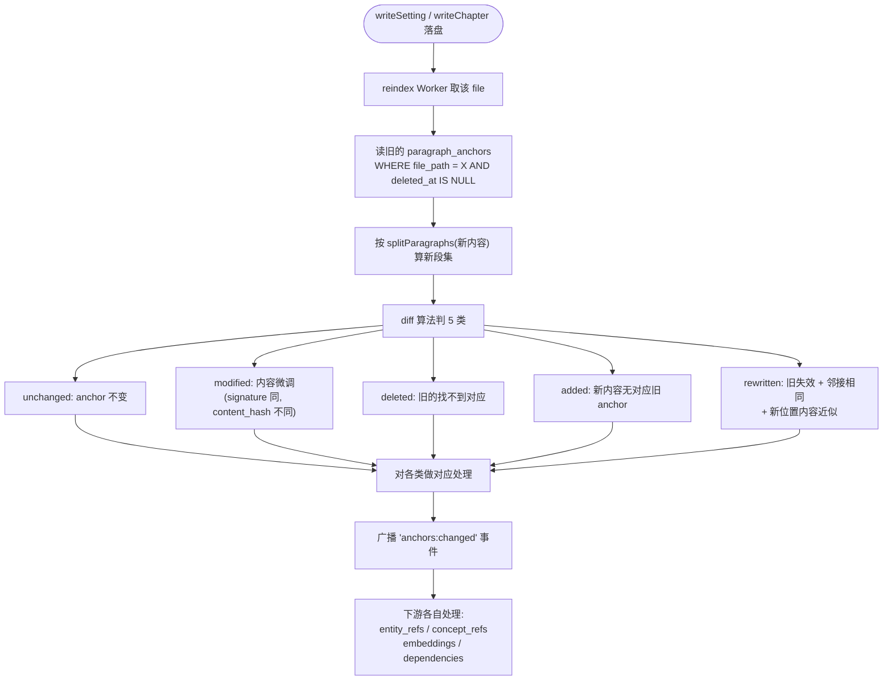

# Spec 17 — 段级稳定 ID 与差量 reindex

> **[info]** 实现知识图谱 L2 算法层第一项(产品面见 [plan/08 — 故事世界与一致性](../plan/08-story-world.md))。本文档定义段锚点 (paragraph anchor) 的稳定 ID 算法、`paragraph_anchors` 表使用、差量 reindex 流程、段移动 / 重命名 / 拆分 / 合并的稳定性追踪策略,以及外部编辑器修改的同步策略。

## 为什么要段级 ID

当前 reindex 颗粒度是**文件级**(spec/01 §索引刷新流程: 解析 frontmatter → 全文重扫 entity_refs)。这在长篇场景下三个致命缺陷:

1. **dependencies 锚不住** — `foreshadowing/X.md` 要锚定"ch_010 § 5"段落;若 ID 不稳定 (比如用段索引序号),作者插入一段后,ch_010 § 5 变成 § 6,锚点全乱。
2. **embedding 重算昂贵** — 改一个字,全文重新算 embedding 是浪费。差量需要"哪些段变了"的精确判定。
3. **影响半径不准** — Validator 想知道"改 `lin.gender` 后 ch_005 哪几段需要改",必须有段级 ID 而非"整个文件"。

## 切分规则

把 markdown 文件按以下规则切成段:

```ts
// lib/storage/paragraph-split.ts
export type Paragraph = {
  index: number                         // 从 1 起
  headingPath: string                   // '第一章 / § 段落 5' 或 '林川 / 性格'
  text: string                          // 段内容 (不含 heading)
  startOffset: number                   // 在原文件中的字符 offset
  endOffset: number
}

export function splitParagraphs(content: string): Paragraph[] {
  // 1. 剥 frontmatter (--- 开 / 闭包之间)
  // 2. 按 \n\n+ 切块
  // 3. heading (# / ## / ###...) 单独成段,heading 跟随的 text 段落继承 headingPath
  // 4. 代码块 (``` / ~~~) 整个保留为一段,不内部切
  // 5. 列表项 (- / 1.) 每行各自为一段
  // 6. 表格 (|...|) 整张表为一段
  // 7. ATX 风格的"# 第一章" + 段落内容,headingPath 累加; '###' 不重置上层
  // 8. 空段 (text.trim() === '') 跳过
}
```

切完每段都带 `headingPath` (用于稳定 ID + UI 显示)。

## 稳定 ID 算法

```ts
// lib/storage/anchor.ts
import { createHash } from 'node:crypto'

export function computeAnchor(p: Paragraph, fileId: string): string {
  // 三个组件:文件 ID + heading 路径 + 内容指纹
  const headingDigest = sha1(p.headingPath).slice(0, 8)
  const contentDigest = computeContentSignature(p.text).slice(0, 12)
  return `anc_${fileId.slice(-6)}_${headingDigest}_${contentDigest}`
}

// 内容指纹: 不只是 hash,要"温和"以容忍小改
function computeContentSignature(text: string): string {
  // 1. 归一化: 删 whitespace + 标点 + 数字
  const normalized = text
    .replace(/\s+/g, '')
    .replace(/[，。!?:;""''《》【】、,.!?:;()[\]{}]/g, '')
    .replace(/\d+/g, '#')
  // 2. 取 sha256 前 24 hex
  return sha256(normalized).slice(0, 24)
}
```

### 关键设计:为什么 anchor 既含 heading 又含 content

- **只用 paragraph_index**:作者插入一段后所有后续段 ID 偏移 → 锚全失效。**禁用**。
- **只用 content hash**:作者改一个字,ID 变,foreshadowing 锚断。也不行。
- **只用 heading + index**:作者重命名 heading 或重排序段落 → ID 变。也不行。
- **三段组合 + content 用归一化指纹**:对小修改容忍,对大段重写不容忍。这是经过权衡的最佳折中。

### 权衡承认

`computeContentSignature` 删去标点 + 空格 + 数字 后做 hash。后果:

- ✅ 改个错别字不影响 anchor (内容指纹相同)
- ✅ 加 / 删标点不影响
- ❌ 删一句话(明显内容变化)anchor 变 (符合预期)
- ❌ 把"林川走了"改成"林川离开了" — 同一意思不同字,anchor 会变

最后这个 corner case 由"邻接段对照"(下方)兜底:reindex 时若旧 anchor X 找不到了,但邻接段 (X-1, X+1 的 anchor) 仍在,且 X 位置有新段 Y 内容相似度高 → 把 X 视为"重写为 Y",dependencies 锚点迁移到 Y。

## paragraph_anchors 表 (schema 指针 + 语义补全)

> **[info]** **Schema 主权 (Wave 4)**: 完整 `CREATE TABLE paragraph_anchors` + 全部 INDEX 见 [spec/01 §paragraph_anchors](./01-storage-schema.md#paragraph-anchors)。本 spec 仅补全 anchor_id 生成算法 + 邻接对照兜底 + reindex Worker 语义。

*(原此处的完整 `CREATE TABLE paragraph_anchors` + 4 INDEX 已迁至 [spec/01 §paragraph_anchors](./01-storage-schema.md#paragraph-anchors) — Wave 4 schema 主权迁移。)*

**字段摘要**: `anchor_id` (PK, 算法本 spec §稳定 ID) · `file_path` · `paragraph_index` · `heading_path` · `content_hash` (完整 sha256, diff 用) · `content_signature` (归一化指纹, anchor_id 用) · `prev_anchor` / `next_anchor` (双链) · `start_offset` / `end_offset` (file 内字符 offset) · `deleted_at` (软删除, 30 天清理)。

4 个 INDEX: file (active only) / hash / signature / double-link。

## 差量 reindex 流程

### 触发时机

**流程图 · 读旧的 paragraph_anchors / WHER**



### diff 算法

```ts
// lib/storage/anchor-diff.ts
type DiffResult = {
  unchanged: { old: AnchorRow; new: Paragraph }[]
  modified: { old: AnchorRow; new: Paragraph; changed: 'content' | 'position' }[]
  deleted: AnchorRow[]
  added: Paragraph[]
  rewritten: { old: AnchorRow; new: Paragraph; similarity: number }[]
}

export function diffAnchors(oldRows: AnchorRow[], newParagraphs: Paragraph[]): DiffResult {
  // 1. 第一遍: 按 (heading_path, content_signature) 二元组配对 — 命中 = unchanged 或 modified
  const oldByKey = new Map<string, AnchorRow>()
  for (const r of oldRows) oldByKey.set(`${r.heading_path}::${r.content_signature}`, r)

  const unchanged: any[] = []
  const modified: any[] = []
  const matched = new Set<string>()

  for (const p of newParagraphs) {
    const newKey = `${p.headingPath}::${computeContentSignature(p.text)}`
    const oldRow = oldByKey.get(newKey)
    if (oldRow) {
      matched.add(oldRow.anchor_id)
      const newHash = sha256(p.text)
      if (newHash === oldRow.content_hash) unchanged.push({ old: oldRow, new: p })
      else modified.push({ old: oldRow, new: p, changed: 'content' })
    }
  }

  // 2. 剩余: 旧未匹配 = 待定 deleted; 新未匹配 = 待定 added
  const oldRest = oldRows.filter(r => !matched.has(r.anchor_id))
  const newRest = newParagraphs.filter(p => {
    const k = `${p.headingPath}::${computeContentSignature(p.text)}`
    return !oldByKey.has(k) || matched.has(oldByKey.get(k)!.anchor_id) === false
  })

  // 3. 第二遍: 邻接段对照 — 旧 anchor X 失效,但 prev/next 仍在,新内容相似度 ≥ 0.7 → rewritten
  const rewritten: any[] = []
  for (const oldRow of oldRest) {
    const candidate = newRest.find(p => isAdjacent(oldRow, p, oldRows, newParagraphs)
      && textSimilarity(oldRow.content_hash_text /* 需要存原文 */, p.text) >= 0.7)
    if (candidate) {
      rewritten.push({ old: oldRow, new: candidate, similarity: textSimilarity(...) })
      newRest.splice(newRest.indexOf(candidate), 1)
    }
  }

  // 4. 余下的: 旧 = deleted, 新 = added
  return {
    unchanged, modified, rewritten,
    deleted: oldRest.filter(r => !rewritten.some(rw => rw.old.anchor_id === r.anchor_id)),
    added: newRest,
  }
}
```

`textSimilarity`:

- 简化的 Jaccard 字符 trigram 集合 (中文 + 英文都 OK,无依赖)
- 二期可上 cosine + embedding (但 embedding 本身就是要 reindex 出来的,鸡生蛋 → 当前不上)

`isAdjacent` 比对 prev_anchor/next_anchor 的 heading_path 是否在新段的前后。

### 各类型的处理

```ts
async function applyAnchorDiff(filePath: string, diff: DiffResult) {
  // unchanged: 不动
  // modified: 更新 content_hash + start/end_offset,保留 anchor_id 不变
  for (const m of diff.modified) {
    await db.execute(`UPDATE paragraph_anchors SET content_hash = ?, start_offset = ?, end_offset = ?, updated_at = ?
                      WHERE anchor_id = ?`, ...)
    // 触发下游: embedding 重算 + entity_refs/concept_refs 该段重扫
    await enqueueParagraphRescan(m.old.anchor_id, m.new.text)
  }

  // rewritten: 软删旧 anchor + 新 anchor + dependencies 迁移
  for (const r of diff.rewritten) {
    await db.execute(`UPDATE paragraph_anchors SET deleted_at = ? WHERE anchor_id = ?`, now(), r.old.anchor_id)
    const newAnchorId = computeAnchor(r.new, fileId(filePath))
    await db.execute(`INSERT INTO paragraph_anchors (...) VALUES (...)`, newAnchorId, ...)
    // 关键: dependencies 锚点迁移
    await db.execute(`UPDATE dependencies SET target_anchor = ?, updated_at = ?
                      WHERE target_anchor = ?`, newAnchorId, now(), r.old.anchor_id)
    await db.execute(`UPDATE dependencies SET source_anchor = ?, updated_at = ?
                      WHERE source_anchor = ?`, newAnchorId, now(), r.old.anchor_id)
    // entity_relations / entity_timeline 的 evidence_anchor / declared_anchor 同迁
    await migrateAnchorRefs(r.old.anchor_id, newAnchorId)
    await enqueueParagraphRescan(newAnchorId, r.new.text)
  }

  // deleted: 软删 + dependencies 标 broken
  for (const d of diff.deleted) {
    await db.execute(`UPDATE paragraph_anchors SET deleted_at = ? WHERE anchor_id = ?`, now(), d.anchor_id)
    await db.execute(`UPDATE dependencies SET status = 'broken', updated_at = ? WHERE target_anchor = ? OR source_anchor = ?`,
                     now(), d.anchor_id, d.anchor_id)
    // 不删 entity_relations / entity_timeline 行 — 仅 evidence 失效,事实仍保留
  }

  // added: 新建 anchor + 全套下游
  for (const a of diff.added) {
    const newAnchorId = computeAnchor(a, fileId(filePath))
    await db.execute(`INSERT INTO paragraph_anchors (...) VALUES (...)`, newAnchorId, ...)
    await enqueueParagraphRescan(newAnchorId, a.text)
  }

  // 重新编织 prev_anchor/next_anchor 双链
  await rebuildDoubleLinks(filePath)
}
```

### 邻接段双链的作用

`prev_anchor` / `next_anchor` 不是必需(可由 paragraph_index 推),但用作:

1. **rewritten 探测的快速判断** — 不必扫整个 file 找邻接,直接读双链
2. **段移动检测** — 段从 ch_005 移到 ch_007:旧 anchor (file=ch_005, prev=A, next=B) 失效;新 anchor (file=ch_007) 内容相同 → 可触发跨文件 anchor 迁移(当前不做,二期补)
3. **UI 段间导航** — Editor "下一段" / "上一段"操作直接走双链

## 章节序与字典序 (anchor 排序)

`paragraph_anchors` 内部用 `(file_path, paragraph_index)` 排序;但跨章节查询(影响半径)需要按章节 + 段联合排序。

章节 ID 字典序兼容:`spec/01` 已规定 `chapters/{NNN-{slug}}/draft.md`,NNN 是 3 位 0 padding,即 `001`, `010`, `100`。字典序 == 章节顺序。

跨章节查询示例:

```sql
-- 取 ch_005 § X 锚点之前的所有 ch_001-005 段落
SELECT * FROM paragraph_anchors
 WHERE file_path GLOB 'chapters/0??-*/draft.md'
   AND (file_path < 'chapters/005' OR
        (file_path GLOB 'chapters/005-*' AND paragraph_index < 23))
   AND deleted_at IS NULL
 ORDER BY file_path, paragraph_index;
```

## entity_refs / concept_refs 改造

之前 (spec/01) `entity_refs.position_from / position_to` 是文件级字符 offset。改造为段锚点 + 段内 offset:

```sql
ALTER TABLE entity_refs ADD COLUMN anchor_id TEXT REFERENCES paragraph_anchors(anchor_id);
ALTER TABLE entity_refs ADD COLUMN intra_paragraph_offset INTEGER;       -- 段内字符 offset

CREATE INDEX idx_refs_anchor ON entity_refs(anchor_id);
```

(concept_refs 同等改造,见 spec/16 §表 4 已含 source_anchor。)

迁移脚本 (`004-paragraph-anchors.ts`) 重扫所有现有 entity_refs,按 file_path + position_from 反查所属 anchor,populate 新两列。

reindex 时:

- 段 unchanged → entity_refs 不动
- 段 modified / rewritten → 删该 anchor 下所有 entity_refs,重扫该段重新 INSERT
- 段 deleted → 级联删 entity_refs (FK ON DELETE CASCADE 不开,因为我们软删 anchor;手动 cascade 删 entity_refs)
- 段 added → 全新扫描,INSERT entity_refs

## reindex Worker 升级 (spec/01 §SQLite WAL Mode + 并发写)

### 工作单元变化

| 旧 | 新 |
|---|---|
| 单位 = 文件 | 单位 = (文件, anchor diff) |
| 操作 = DELETE + INSERT 全部 entity_refs | 操作 = 按 anchor 增量 |
| 同 source_file 1s 内 dedupe | 同 anchor 1s 内 dedupe |

### 并发模型

- Worker 单例不变 (避免 SQLite 写锁竞争)
- Worker 内部按"文件粒度"串行,但同文件的多 anchor 操作在一个 transaction 内提交
- 一次 reindex 任务结构: `{ file, oldAnchors, newParagraphs }`

### 失败回滚

```ts
async function reindexOneFile(projectId: string, filePath: string) {
  const tx = await db.beginTransaction()
  try {
    const newPars = splitParagraphs(content)
    const oldRows = await db.fetchAnchors(filePath)
    const diff = diffAnchors(oldRows, newPars)
    await applyAnchorDiff(filePath, diff, tx)
    await rescanAllInFile(filePath, tx)        // entity_refs / concept_refs
    await tx.commit()
    broadcast('anchors:changed', { filePath, diff })
  } catch (e) {
    await tx.rollback()
    logger.error('reindex failed', { filePath, error: e })
    // 不抛 — Worker 继续处理下一个;失败任务进 reindex_failures 表
    await db.reindex_failures.add({ filePath, error: String(e), at: now() })
  }
}
```

`reindex_failures` 表:

> **[info]** **Schema 主权 (Wave 4)**: 完整 `CREATE TABLE reindex_failures` 见 [spec/01 §reindex_failures](./01-storage-schema.md#reindex-failures)。

**字段摘要**: `file_path` · `error` · `retry_count` (default 0) · `created_at` · `resolved_at` (nullable, 重试成功时填)。

UI 在 SettingsDialog → "索引健康"显示"N 条 reindex 待重试",点开手动重试或忽略。

## 性能目标

参考目标 (W7-W8 用 vitest bench 实测填充):

| 章节大小 | 段数 | 全量 reindex 耗时 | 差量 reindex (改 1 段) | 差量 reindex (改 5 段) |
|---|---|---|---|---|
| 5K 字 | ~30 | < 50ms | < 10ms | < 20ms |
| 20K 字 | ~120 | < 200ms | < 12ms | < 30ms |
| 50K 字 | ~300 | < 500ms | < 15ms | < 40ms |

embedding 计算时间不计入此表(那是 spec/18)。

## 边界情况

| 情况 | 处理 |
|---|---|
| 文件被外部编辑器整文件覆盖 (chokidar 触发, 见 §外部编辑器同步) | 按 writeChapter 路径走差量 reindex,无差异 |
| 文件大量段重写 (e.g. AI 全章重写) | diff 大概率退化为 deleted + added,锚点迁移失败,dependencies 大批 broken — UI 红色警告"该章节锚点大变,请检查相关伏笔" |
| 段被切成 2 段 (用户加了 \n\n) | 第一段 unchanged 或 modified,第二段 added (signature 与原段不同) — dependencies 留在第一段,符合预期 (锚定在前半部分) |
| 两段被合并 | 两个旧 anchor 中一个 deleted (signature 不再匹配),另一个 modified (现在多了内容);dependencies 落在 modified 那段 |
| heading 改名 (`# 性格` → `# 性格特征`) | headingPath 变 → anchor_id 变,但 content_signature 同 → diff 标 rewritten,dependencies 自动迁移 |
| frontmatter 改 (e.g. `age: 28` → `30`) | frontmatter 不进段切分,reindex 走 entities/entity_timeline 而非 anchor 系统 (二者并行,互不干扰) |

## 外部编辑器同步 (chokidar watcher + SSE)

> **[info]** 用户在 VSCode / iA Writer 直接改了 `characters/lin.md` — 应用不知道;TipTap 仍显示旧内容,pending 审批的 before-state 错位 → diff 出错。

策略:**chokidar 文件 watcher**(Node 端,在 `/api/watch` Route Handler 内挂)+ SSE push 到前端。

```ts
// app/api/watch/route.ts (long-lived SSE)
export const runtime = 'nodejs'

export async function GET(req: Request) {
  const projectId = new URL(req.url).searchParams.get('projectId')!
  const watcher = chokidar.watch(getProjectDir(projectId) + '/**/*.md', {
    ignoreInitial: true, atomic: true,
  })
  const stream = new ReadableStream({
    start(controller) {
      watcher.on('change', (path) => {
        controller.enqueue(`event: fs:changed\ndata: ${JSON.stringify({ path })}\n\n`)
      })
    },
  })
  req.signal.addEventListener('abort', () => watcher.close())
  return new Response(stream, { headers: { 'content-type': 'text/event-stream' } })
}
```

前端收到 `fs:changed` 后:

- 该文件在某个 Tab 打开 + 用户没有未保存编辑 → **静默 reload**
- 用户有未保存编辑 → 弹**冲突 dialog**:"[文件名] 被外部修改。要 [使用磁盘版本] / [保留我的修改] / [手动 merge]"
- 该文件在某个 pending 审批的 before-state 中 → 该审批 **invalidate(`status='stale'`)**,提示用户重做(approvals 表 status 枚举见 [spec/01](./01-storage-schema.md) §approvals;审批流见 [spec/06](./06-approval-flow.md))

后端侧:chokidar 触发的整文件覆盖按 writeChapter 路径走差量 reindex(见 §边界情况),与应用内写盘无差异。

### 设计取舍 (ADR)

| 编号 | 决策 | 选项 | 选择 | 理由 |
|---|---|---|---|---|
| ADR-03 | 外部编辑器冲突处理 | Web Locks / **chokidar watcher + 冲突 dialog** / 忽略 | **chokidar + 冲突 dialog** | 单 tab 假设下不需要 Web Locks(见 [spec/01](./01-storage-schema.md) §SQLite WAL Mode + 并发写);chokidar 在 Node 生态成熟;冲突 dialog 把决策交给用户,避免 silent overwrite |

存储层 ADR-01 / ADR-02 见 [spec/01](./01-storage-schema.md) §设计取舍。

## L4 治理 — 锚点失效 lint

每次 reindex 后跑 `lib/lint/anchor-health.ts`:

| 检查 | 严重度 | 触发 |
|---|---|---|
| broken dependencies | error | dependencies.status = 'broken' 累计 ≥ 1 |
| 大批 anchor 失效 (单次 reindex deleted ≥ 30%) | warning | UI 提示"是否本次 AI 全章重写正确?可在快照恢复" |
| 软删 anchor 超 30 天 | info | 后台清理任务硬删 |

## 测试

| 测试 | 类型 | 覆盖 |
|---|---|---|
| `paragraph-split.test.ts` | 单元 | heading 嵌套、列表、代码块、表格、空段 |
| `anchor-id.test.ts` | 单元 | 同内容不同位置 anchor 不同;改字 anchor 变;改空格 anchor 不变 |
| `anchor-diff.test.ts` | 单元 | unchanged / modified / deleted / added / rewritten 5 种 diff 都准确 |
| `anchor-rewrite-migration.test.ts` | 集成 | 段重写后 dependencies / entity_relations / entity_timeline 锚点正确迁移 |
| `paragraph-anchor-bench.bench.ts` | bench | 5K/20K/50K 字三档差量耗时;W7-W8 填表 |
| `reindex-failure-recovery.test.ts` | 集成 | 中途 throw 后事务回滚 + reindex_failures 落记录 + 手动重试通 |

详细 fixture 见 spec/14。
