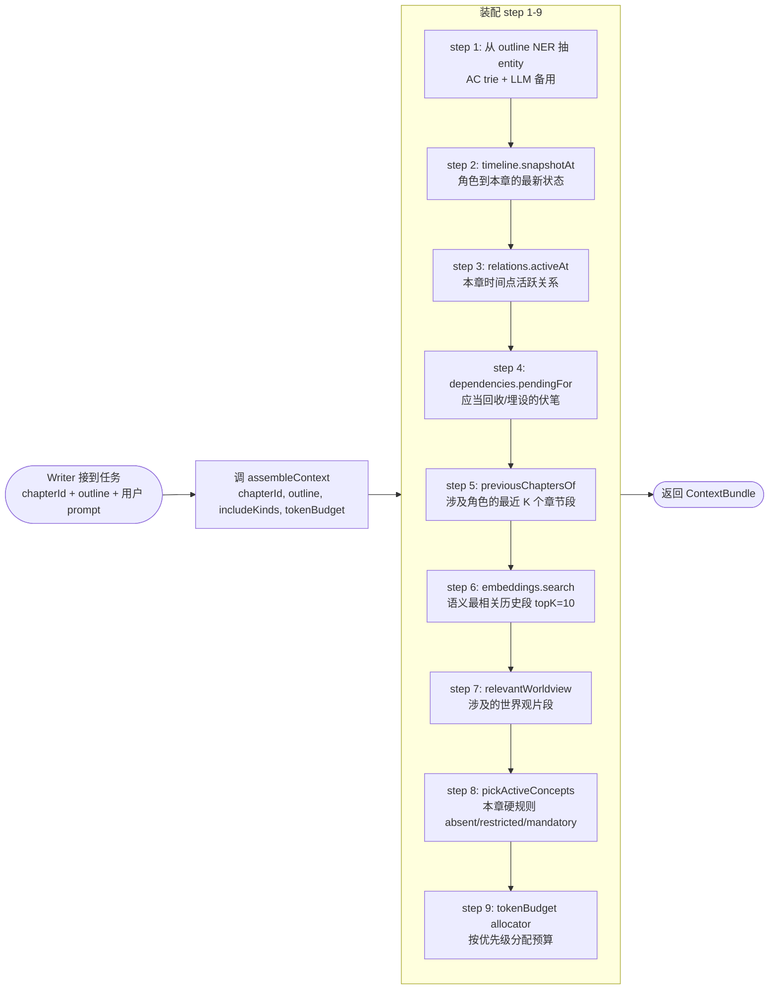

# Spec 20 — 上下文装配工具 (assembleContext)

> **[info]** 实现知识图谱 L3 工具层第二项(产品面见 [plan/05 — 故事世界与一致性](../plan/05-story-world.md) §写前自动备料)。本文档定义 `assembleContext` 工具签名、retrieve 链路、token 预算控制。Writer 写章节 / 章节大纲前必调此工具,获取自动 retrieve 的相关上下文。

## 设计原则

1. **Writer 不再"半瞎"** — 写 ch_050 第 3 段时,系统主动把"涉及角色到本章为止的最新状态 + 活跃关系 + 待回收伏笔 + 语义相关历史段"打包注入 prompt
2. **一致性优先, budget 为软警报** — DeepSeek V4 ctx 实查 **1M tokens** (spec/00 §C),普通章节场景远不到上限,该装的必装、不省。`tokenBudget` 默认 200K / 上限 800K 仅作软阈值,超阈记入 `truncated` 字段引导用户分卷,不允许 silent 砍 retrieve (per-agent 上下文契约见 spec/23)
3. **可解释** — 装配结果含 `sourcePath` 字段标注每段来自哪里,Writer 引用时心里有数;UI 在 ThinkingPanel 可展开看
4. **不替决策** — 装配工具只 retrieve,不评判"应该怎么写"。Writer 看到 context 后自己判

## 工作链路

**流程图 · 调 assembleContext / chapterI**



## 工具签名

```ts
// lib/agents/tools/assemble-context.ts
import { tool } from 'ai'
import { z } from 'zod'

export const assembleContext = tool({
  description: '为 Writer 装配章节生成所需的相关上下文 (角色状态 / 关系 / 伏笔 / 历史段 / 世界观 / 概念约束)',
  inputSchema: z.object({
    chapterId: z.string(),
    outline: z.string(),                           // 本章大纲
    includeKinds: z.array(z.enum([
      'entity-states',
      'relations',
      'dependencies',
      'recent-chapters',
      'semantic-relevant',
      'worldview',
      'concepts',
      // === 五大守则相关 (spec/25) ===
      'cardinal-rules-config',                  // 项目级 cardinal-rules.json 配置
      'active-critical-promises',               // 当前 active 的 critical promise (deadline 接近警报)
      'character-value-axes',                   // 涉及角色的 value_axes / intelligence_axis
      'milestone-cadence',                       // 距上次 milestone 章数 + 滚动窗口数据
      'rolling-pacing-metrics',                  // 滚动 main/side / POV 比例
    ])).default([
      'entity-states', 'relations', 'dependencies',
      'recent-chapters', 'semantic-relevant', 'worldview', 'concepts',
      'cardinal-rules-config', 'active-critical-promises', 'character-value-axes',
      'milestone-cadence', 'rolling-pacing-metrics',
    ]),
    // tokenBudget 字段保留, 但 1M ctx 下不主动裁剪 — 见 spec/23 §per-agent 上下文契约
    tokenBudget: z.number().int().min(2000).max(800_000).default(200_000),
  }),
  outputSchema: contextBundleSchema,
  execute: async (input, { projectId }) => {
    return await buildContextBundle(projectId, input)
  },
})

const contextBundleSchema = z.object({
  entities: z.array(z.object({
    entityId: z.string(),
    canonicalName: z.string(),
    snapshotAt: z.string(),                        // 该 entity 在本章前最新的快照,markdown 格式
    sourcePath: z.string(),                        // 'characters/lin.md (frontmatter + entity_timeline)'
  })),
  relations: z.array(z.object({
    sourceId: z.string(),
    targetId: z.string(),
    kind: z.string(),
    summary: z.string(),                           // '林川是张三的师父 (since ch_005, strength 80)'
    sourcePath: z.string(),
  })),
  dependencies: z.array(z.object({
    kind: z.string(),                              // 'foreshadowing' / 'payoff' / ...
    summary: z.string(),                           // '伏笔 #001: 怀表 — 应在本章或之前回收'
    sourcePath: z.string(),
    targetAnchor: z.string().optional(),
  })),
  recentChapters: z.array(z.object({
    chapterId: z.string(),
    excerpt: z.string(),                           // 关键段摘录
    sourcePath: z.string(),
  })),
  semanticRelevant: z.array(z.object({
    anchorId: z.string(),
    snippet: z.string(),
    similarity: z.number(),
    sourcePath: z.string(),
  })),
  worldview: z.array(z.object({
    title: z.string(),
    excerpt: z.string(),
    sourcePath: z.string(),
  })),
  activeConcepts: z.array(z.object({
    title: z.string(),
    semantic: z.string(),
    surfaceForms: z.array(z.string()),
    description: z.string(),
    sourcePath: z.string(),
  })),
  // === 五大守则相关 (spec/25) ===
  cardinalRulesConfig: z.object({                  // 项目级配置 (cardinal-rules.json 内容)
    goldenChapters: z.unknown(),
    characterIntegrity: z.unknown(),
    pacing: z.unknown(),
    promiseAccountability: z.unknown(),
    protagonistAgency: z.unknown(),
  }).optional(),
  activeCriticalPromises: z.array(z.object({
    promiseId: z.string(),
    text: z.string(),
    weight: z.enum(['critical', 'major', 'minor']),
    deadlineChapter: z.number().nullable(),
    chaptersUntilDeadline: z.number(),
    recentlyTouched: z.boolean(),
    expectedResolutionPattern: z.string().optional(),
  })).optional(),
  characterValueAxes: z.array(z.object({
    characterId: z.string(),
    canonicalName: z.string(),
    valueAxes: z.record(z.string(), z.object({
      baseline: z.number(),
      range: z.tuple([z.number(), z.number()]),
    })),
    intelligenceAxis: z.object({
      baseline: z.number(),
      iqRange: z.tuple([z.number(), z.number()]),
    }).optional(),
    readerPromises: z.array(z.string()),
    taboos: z.array(z.string()),
  })).optional(),
  milestoneCadence: z.object({
    chaptersSinceLastMilestone: z.number(),
    lastMilestoneChapter: z.number().nullable(),
    lastMilestoneType: z.string().nullable(),
    expectedMaxGap: z.number(),                    // 来自 cardinalRulesConfig.pacing.maxChaptersBetweenMilestones
  }).optional(),
  rollingPacingMetrics: z.object({
    window: z.number(),                            // 通常 10
    protagonistPOVRatio: z.number(),
    mainLineRatio: z.number(),
    consecutiveAbsence: z.number(),
    rollingSystemRewardRatio: z.number(),          // 守则 5
  }).optional(),
  isGoldenChapter: z.boolean(),                    // chapter_index 1-3
  // ===
  tokensUsed: z.number(),
  truncated: z.array(z.string()),                  // 1M ctx 下应总为空; 若非空说明项目数据真超大, 警报让用户分卷
})
```

工具分配 (附录 spec/02):**Writer**。Router 在 plan/write 模式下委派 Writer 时,Writer 自动调一次。

## Step 1 — 从 outline 抽 entity

```ts
async function extractEntitiesFromOutline(projectId: string, outline: string): Promise<Entity[]> {
  // 1. AC trie 命中 (复用 entity-highlight)
  const allEntities = await db.entities.list(projectId)
  const { ac, index } = buildAC(allEntities)
  const matches = postProcess(outline, ac.search(outline), index)
  const directHits = unique(matches.map(m => index.get(m.matchedText)!.id))

  // 2. 若大纲明确提"涉及角色 X / 地点 Y / 道具 Z" — 优先这些
  const explicit = parseExplicitEntities(outline)  // 简单规则: 找 "涉及:" / "登场:" 等关键词后的列表

  // 3. 不调 LLM 做 NER (AC trie + 规则已够);二期可加 LLM fallback
  const ids = unique([...directHits, ...explicit])
  return Promise.all(ids.map(id => db.entities.get(projectId, id)))
}
```

## Step 2 — Entity 状态快照

```ts
async function entitySnapshotAt(projectId: string, entityId: string, chapterId: string): Promise<EntitySnapshot> {
  // 1. frontmatter 静态部分 (canonical_name / aliases / role / appearance / personality / background)
  const entity = await db.entities.get(projectId, entityId)
  const fm = await readFrontmatter(entity.file_path)

  // 2. 动态部分: timeline 取该 entity 各 attribute 在 chapterId 时刻的值
  const attrs: Record<string, string> = {}
  for (const attr of ['age', 'location', 'mood', 'power_level', 'status', 'affiliation', 'wealth', 'social_rank']) {
    const row = await db.execute(`
      SELECT value, source, confidence FROM entity_timeline
      WHERE entity_id = ? AND attribute = ?
        AND valid_from_chapter <= ?
        AND (valid_to_chapter IS NULL OR valid_to_chapter > ?)
      ORDER BY confidence DESC, source ASC LIMIT 1
    `, entityId, attr, chapterId, chapterId)
    if (row[0]) attrs[attr] = row[0].value
  }

  // 3. 拼成 markdown 格式 (节省 token,LLM 友好)
  const md = `## ${fm.canonical_name} (${entity.id})

**角色:** ${fm.role} | **别名:** ${fm.aliases.join('、')}
**到 ${chapterId} 时:**
${Object.entries(attrs).map(([k, v]) => `- ${k}: ${v}`).join('\n')}

**外貌:** ${fm.appearance ?? '(未设定)'}
**性格:** ${fm.personality ?? '(未设定)'}
**背景:** ${fm.background ?? '(未设定)'}
${fm.expected_arc ? `\n**预期弧光:** ${fm.expected_arc}` : ''}
`
  return { entityId, canonicalName: fm.canonical_name, snapshotAt: md, sourcePath: `${entity.file_path} + entity_timeline` }
}
```

## Step 3 — 活跃关系

```ts
async function relationsActiveAt(projectId: string, entityIds: string[], chapterId: string): Promise<Relation[]> {
  if (entityIds.length === 0) return []
  const placeholders = entityIds.map(() => '?').join(',')
  const rows = await db.execute(`
    SELECT er.*, e1.canonical_name AS source_name, e2.canonical_name AS target_name
    FROM entity_relations er
    JOIN entities e1 ON er.source_id = e1.id
    JOIN entities e2 ON er.target_id = e2.id
    WHERE (er.source_id IN (${placeholders}) OR er.target_id IN (${placeholders}))
      AND (er.since_chapter IS NULL OR er.since_chapter <= ?)
      AND (er.until_chapter IS NULL OR er.until_chapter > ?)
    ORDER BY er.confidence DESC, er.strength DESC
  `, ...entityIds, ...entityIds, chapterId, chapterId)

  return rows.map(r => ({
    sourceId: r.source_id,
    targetId: r.target_id,
    kind: r.kind,
    summary: `${r.source_name} 是 ${r.target_name} 的 ${r.kind}` +
             (r.since_chapter ? ` (起 ${r.since_chapter})` : '') +
             (r.strength ? `,关系强度 ${r.strength}` : ''),
    sourcePath: r.evidence_file,
  }))
}
```

## Step 4 — 待处理伏笔

```ts
async function dependenciesFor(projectId: string, chapterId: string): Promise<Dep[]> {
  // 1. 待埋点 (foreshadowing 已 pending,目标章节 ≤ 当前章节,未 planted)
  const pendingPlant = await db.execute(`
    SELECT * FROM dependencies
    WHERE kind = 'foreshadowing' AND status = 'pending'
      AND (json_extract(metadata, '$.expected_plant_by') IS NULL
           OR json_extract(metadata, '$.expected_plant_by') >= ?)
      AND target_file = ?
    LIMIT 10
  `, chapterId, `chapters/${chapterId}/draft.md`)

  // 2. 待收割 (foreshadowing 已 planted,但 expected_payoff_by 在本章或后)
  const pendingPayoff = await db.execute(`
    SELECT * FROM dependencies
    WHERE kind = 'foreshadowing' AND status = 'planted'
      AND (json_extract(metadata, '$.expected_payoff_by') = ?
           OR (json_extract(metadata, '$.expected_payoff_by') IS NULL
               AND chapter_within_range(target_file, since_chapter, ?)))
    LIMIT 10
  `, chapterId, chapterId)

  // 3. 已超期 (alarm,本章必须回收)
  const overdue = await db.execute(`
    SELECT * FROM dependencies
    WHERE kind = 'foreshadowing' AND status = 'pending'
      AND json_extract(metadata, '$.expected_payoff_by') < ?
    LIMIT 5
  `, chapterId)

  return [...pendingPlant, ...pendingPayoff, ...overdue].map(toDepSummary)
}
```

每条返回:

- `kind` (foreshadowing / payoff / setup / continuity / promise / callback)
- `summary` (一句话: e.g. "伏笔 #001: 怀表是关键道具 — 在 ch_010 § 5 已埋,本章可回收")
- `sourcePath`
- `targetAnchor` (锚点,Writer 要回到那段段落)

## Step 5 — 最近章节摘录

```ts
async function recentChaptersExcerpts(
  projectId: string,
  entityIds: string[],
  chapterId: string,
  k: number = 3,
): Promise<ChapterExcerpt[]> {
  // 涉及任一 entity 的最近 K 个章节
  const placeholders = entityIds.map(() => '?').join(',')
  const rows = await db.execute(`
    SELECT DISTINCT pa.file_path
    FROM entity_refs er
    JOIN paragraph_anchors pa ON er.anchor_id = pa.anchor_id
    WHERE er.entity_id IN (${placeholders})
      AND pa.deleted_at IS NULL
      AND pa.file_path GLOB 'chapters/*'
      AND pa.file_path < ?
    ORDER BY pa.file_path DESC
    LIMIT ?
  `, ...entityIds, `chapters/${chapterId}`, k)

  return Promise.all(rows.map(async r => {
    // 从 chapter 中抽 entity 高密度段 (≥ 2 ref) 作为 excerpt
    const excerpt = await pickHighDensityExcerpt(projectId, r.file_path, entityIds, 800)
    return { chapterId: extractChapterId(r.file_path), excerpt, sourcePath: r.file_path }
  }))
}
```

`pickHighDensityExcerpt`:在指定文件中,找连续 800 字内含有最多 entity_refs 的窗口,返回该窗口内容。

## Step 6 — 语义检索

```ts
async function semanticRelevantSegs(
  projectId: string,
  outline: string,
  topK: number = 10,
): Promise<SemanticSeg[]> {
  const results = await semanticSearch(projectId, outline, {
    topK,
    filterFile: 'chapters/*',
  })
  return results.filter(r => r.similarity >= 0.7).map(r => ({
    anchorId: r.anchorId,
    snippet: r.snippet,
    similarity: r.similarity,
    sourcePath: ...,
  }))
}
```

## Step 7 — 相关设定索引 (全 18 子目录 _index.md + 顶层 scalar)

> **[info]** 取所有 settings/ 子目录的 `_index.md` 给 Agent 一目了然 — 这些是 Agent 面向的索引文件 (`_` 前缀对用户默认隐藏, 见 [spec/16 §设定目录契约](./16-knowledge-schema.md#设定目录契约)), Writer 写章节前看到整个项目设定地形, 需细节时显式调 `readSetting` 工具取具体子文件。

```ts
async function relevantSettingsIndexes(projectId: string): Promise<WorldviewSection[]> {
  // 取 settings/**/_index.md 全部 + 顶层 scalar 散文件 (taboos.md / themes.md / reader-promises.md)
  // 1M ctx 下不裁: 18 个 _index.md 约 5-10K token, 顶层 scalar 约 1-3K token, 合计 < 15K (一致性优先, 见 spec/23)
  const settingsDir = `${projectDir(projectId)}/settings`
  const indexPaths = await glob(`${settingsDir}/**/_index.md`)         // 18 个子目录索引
  const topLevelScalars = ['taboos.md', 'themes.md', 'reader-promises.md']    // 项目级硬约束散文件

  const sections: WorldviewSection[] = []
  for (const p of indexPaths) {
    const content = await readFile(p)
    const rel = path.relative(projectDir(projectId), p)                       // settings/worldview/_index.md
    const dirName = path.basename(path.dirname(p))                            // worldview / characters / factions / ...
    sections.push({ title: `${dirName} 索引`, excerpt: content, sourcePath: rel })
  }
  for (const fname of topLevelScalars) {
    const fp = `${settingsDir}/${fname}`
    if (!(await exists(fp))) continue
    const content = await readFile(fp)
    sections.push({ title: fname.replace(/\.md$/, ''), excerpt: content, sourcePath: `settings/${fname}` })
  }

  // 额外: worldview/rules.md 是硬规则, 与 _index.md 同等重要, 单独加 (即使 worldview/_index.md 已含摘要)
  const rulesPath = `${settingsDir}/worldview/rules.md`
  if (await exists(rulesPath)) {
    const rules = await readFile(rulesPath)
    sections.push({ title: '世界硬规则', excerpt: rules, sourcePath: 'settings/worldview/rules.md' })
  }
  return sections
  // 二期: 若 _index.md 摘要太粗, 按命中 entity 反查具体子文件再叠加 (entity-location 映射在 entity_refs)
}
```

**为什么全量而非按 entity 反查子文件**:

- plan/03-guardrails.md 红线 R9 "一致性所需的全部数据必装, 1M ctx 给的就是奢侈装齐的本钱"
- `_index.md` 每份 200-500 字, 18 份合计 5-10K token (远低于 1M)
- "按 entity 反查"会引入"选错文件 = 漏看关键设定"的错误源 — 选错索引 = Writer 不知道有 power-system 这种东西
- 真细节由 Writer 调 `readSetting` 工具显式取 — context 装索引, 内容按需取

## Step 8 — 活跃概念约束

```ts
async function pickActiveConcepts(projectId: string, chapterId: string): Promise<ConceptItem[]> {
  // 取所有 'active' 概念,语义在 absent / restricted / mandatory / unique 内
  // 这些是 LLM 写章节时必须注意的硬规则
  const rows = await db.execute(`
    SELECT * FROM concepts
    WHERE status = 'active'
      AND semantic IN ('absent', 'restricted', 'mandatory', 'unique')
    ORDER BY confidence DESC
  `)
  return rows.map(r => ({
    title: r.title,
    semantic: r.semantic,
    surfaceForms: JSON.parse(r.surface_forms),
    description: r.description,
    sourcePath: r.defined_in,
  }))
}
```

## Step 9 — Token 预算分配

```ts
// lib/context/budget.ts
const PRIORITY_ORDER: { kind: string; ratio: number; minTokens: number }[] = [
  { kind: 'concepts',         ratio: 0.05, minTokens: 500 },   // 硬规则必带
  { kind: 'entity-states',    ratio: 0.30, minTokens: 2000 },  // 角色状态最重要
  { kind: 'relations',        ratio: 0.10, minTokens: 500 },
  { kind: 'dependencies',     ratio: 0.10, minTokens: 500 },   // 伏笔
  { kind: 'recent-chapters',  ratio: 0.20, minTokens: 1000 },  // 最近章节摘录
  { kind: 'semantic-relevant',ratio: 0.15, minTokens: 800 },
  { kind: 'worldview',        ratio: 0.10, minTokens: 500 },
]

export function allocateBudget(totalBudget: number): Record<string, number> {
  const allocations: Record<string, number> = {}
  let remaining = totalBudget
  for (const item of PRIORITY_ORDER) {
    const target = Math.max(Math.floor(totalBudget * item.ratio), item.minTokens)
    const actual = Math.min(target, remaining)
    allocations[item.kind] = actual
    remaining -= actual
  }
  return allocations
}
```

每个 kind 装填后用 `tiktoken-style` 计数(`@dqbd/tiktoken` 或简化 `text.length / 1.5` 中文近似)截断:

```ts
async function buildContextBundle(projectId: string, input: AssembleInput): Promise<ContextBundle> {
  const { chapterId, outline, includeKinds, tokenBudget } = input
  const budgets = allocateBudget(tokenBudget)
  const truncated: string[] = []
  const result: any = { tokensUsed: 0, truncated: [] }

  // entity-states
  if (includeKinds.includes('entity-states')) {
    const entities = await extractEntitiesFromOutline(projectId, outline)
    const snapshots = await Promise.all(entities.map(e => entitySnapshotAt(projectId, e.id, chapterId)))
    const allowed = budgets['entity-states']
    const trimmed = trimByTokens(snapshots, allowed, s => s.snapshotAt)
    result.entities = trimmed.items
    result.tokensUsed += trimmed.tokens
    if (trimmed.dropped > 0) truncated.push(`entity-states: 丢弃 ${trimmed.dropped} 个`)
  }

  // ... 其他 kind 类似

  result.truncated = truncated
  return result
}

function trimByTokens<T>(items: T[], budget: number, getText: (t: T) => string): { items: T[]; tokens: number; dropped: number } {
  let used = 0
  const out: T[] = []
  let dropped = 0
  for (const i of items) {
    const t = countTokens(getText(i))
    if (used + t > budget) { dropped++; continue }
    used += t; out.push(i)
  }
  return { items: out, tokens: used, dropped }
}
```

## Writer prompt 集成

Writer 收到工具结果后,把它拼进 system prompt:

```
# 章节上下文 (assembleContext 装配)

## 涉及角色
{{#entities}}
{{snapshotAt}}
{{/entities}}

## 活跃关系
{{#relations}}
- {{summary}}
{{/relations}}

## 待处理伏笔 / 依赖
{{#dependencies}}
- [{{kind}}] {{summary}} (锚点: {{targetAnchor}})
{{/dependencies}}

## 最近章节摘录
{{#recentChapters}}
### {{chapterId}}
{{excerpt}}
{{/recentChapters}}

## 语义相关历史段
{{#semanticRelevant}}
- ({{similarity | round 2}}) {{snippet}} ({{sourcePath}})
{{/semanticRelevant}}

## 世界观参考
{{#worldview}}
### {{title}}
{{excerpt}}
{{/worldview}}

## 必须遵守的世界硬规则
{{#activeConcepts}}
- **{{title}}** ({{semantic}}): {{description}}
  表面词: {{surfaceForms | join '/'}}
{{/activeConcepts}}
```

Writer 在生成正文时:

- 引用历史段时尽量保持同文本特征 (用户连续性体验)
- 命中 active concepts 的表面词时,根据 semantic 处理 (absent → 改写避免出现; restricted → 上下文加约束)
- 待回收伏笔在本章内必须埋设或回收

## 失败 / 降级行为

| 失败 | 降级 |
|---|---|
| `extractEntitiesFromOutline` 抽不到 entity | 跳过 entity-states / relations,其他 kind 照常 |
| `embeddings.search` 不可用 | semantic-relevant 返回空,truncated += ['semantic-relevant: 索引离线'] |
| `recentChaptersExcerpts` 没找到 | 返回空,truncated += ['recent-chapters: 无相关章节'] |
| 全部失败 | 返回 ContextBundle 各字段全空 + tokensUsed=0,Writer 收到提示自行降级 |

## 性能目标

| 章节大小 outline | 抽 entity | 装 timeline / relation | 装 recent | 装 semantic | 总耗时目标 |
|---|---|---|---|---|---|
| 200 字 outline,5 entity | < 5ms | < 30ms | < 50ms | < 100ms (embedding) | < 200ms |
| 500 字 outline,10 entity | < 8ms | < 60ms | < 100ms | < 150ms | < 350ms |
| 1000 字 outline,20 entity | < 12ms | < 100ms | < 150ms | < 200ms | < 500ms |

(W9 末尾用 vitest bench 实测填表。)

## 测试

| 测试 | 类型 | 覆盖 |
|---|---|---|
| `extract-entities-from-outline.test.ts` | 单元 | AC trie 命中 + explicit 解析 |
| `entity-snapshot-at.test.ts` | 集成 | 多 valid 区间 / 多 source 仲裁 |
| `relations-active-at.test.ts` | 集成 | 时间窗口 / strength 排序 |
| `dependencies-for.test.ts` | 集成 | pending plant / pending payoff / overdue |
| `budget-allocation.test.ts` | 单元 | minTokens 不可压缩 / 截断按优先级 |
| `assemble-context-fallback.test.ts` | 集成 | 各种降级场景 |
| `assemble-context-bench.bench.ts` | bench | 三档规模性能,W9 末填表 |

## 已决策项

✅ **token 计数策略**: 简化估算 (text.length / 1.5, 误差 10-15%)。理由 = DeepSeek V4 1M ctx 下 budget 精度容忍度高 (一致性优先, 不做 token budget 控制); `@dqbd/tiktoken` 二进制 ~3MB 且 DeepSeek tokenizer 真实精度未知, 装了也不一定准。若 prune / volume_summary 触发频次明显与估算偏离, 切 tiktoken。

✅ **设定索引 retrieve 策略**: 全 18 个子目录 `_index.md` + 顶层 scalar (taboos / themes / reader-promises) + `worldview/rules.md`。理由 = 1M ctx 下 18 份 _index.md 合计 5-10K token 远不挤压上下文; `_` 前缀的索引文件是 Agent 面向 (对用户默认隐藏, 见 [spec/16 §设定目录契约](./16-knowledge-schema.md#设定目录契约)), 全量注入符合 inv L14 "一致性所需的全部数据必装"; "智能选择子目录" 会引入"选错索引 = Writer 不知道有 power-system" 的错误源。若单 _index.md 真扩到 > 200K (极少数巨型奇幻项目), 再做反查 — 触发条件是规模而非性能。
