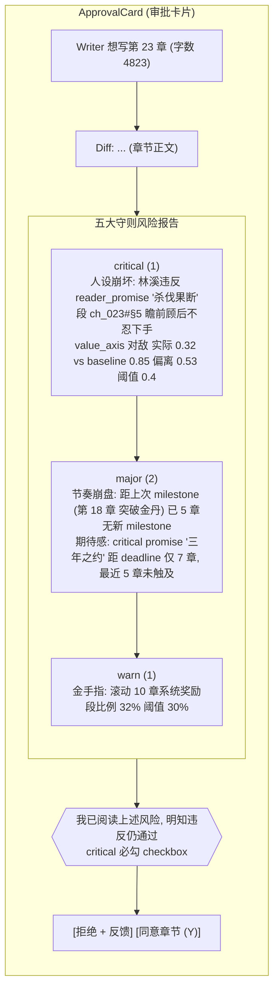

# Spec 25 — 五大网文守则 (Cardinal Rules)

> **[info]** 网文创作不能踩的五大坑,用户总结。本 spec 把 5 条守则**可机器化**:每条拆成可观察指标 + zod schema + 默认阈值 + 检测器伪码 + 风险报告输出格式。Validator / ReaderPanel / ArcTracker / BeatAnalyzer 各取自己擅长的维度并行扫,结果汇成 `risk_report` 进 ApprovalCard。

## 设计原则

| 原则 | 说明 |
|---|---|
| **可观察化** | 每条守则必拆成可计算的信号(字数 / POV 比例 / milestone 间距 / 角色行为对比)。光靠 prompt 嘱咐不够 — LLM 会忘 |
| **多防线** | Prompt 层(Writer 软约束)→ Retrieve 层(assembleContext 必装)→ 检测层(并行扫)→ 审批层(风险报告)→ 学习层(Reflector 入 learnings) |
| **不可绕过** | 违反必进 ApprovalCard 红色警告;`critical` 级用户**必须勾选 "明知违反仍通过"** 才能 approve;不允许 silent commit |
| **不可关闭** | 守则本身不可关 — `cardinal-rules.json` 配置可微调阈值,但开关锁定 |
| **黄金三章特殊待遇** | 第 1-3 章用更严的阈值变体,见 §黄金三章特规 |

## 项目级配置 `cardinal-rules.json`

```jsonc
// ~/.open-novel/workspaces/{projectId}/cardinal-rules.json
{
  "version": 1,
  "goldenChapters": {
    "enabled": true,                              // 不可关
    "indexRange": [1, 3],                         // 默认前 3 章
    "minProtagonistPOVRatio": 0.6,                // 主角 POV 段比例 ≥ 60%
    "maxSettingDescriptionRatio": 0.25,           // 设定/环境描写 ≤ 25%
    "protagonistFirstAppearByWordCount": 1000,    // 第 1 章前 1000 字必须出场
    "maxNamedCharactersInFirst3Chapters": 5,      // 防"开局开会"
    "requireHookTypes": ["悬念", "冲突", "爽点", "钩子", "谜团"]  // 必有其一
  },
  "characterIntegrity": {
    "enabled": true,
    "promiseViolationThreshold": "any",           // 任何违反 reader_promises 即 critical
    "tabooViolationThreshold": "any",
    "valueAxisDeviationMax": 0.4,                 // 与 baseline 差 > 0.4 = critical
    "minOpponentIntelligenceRatio": 0.7           // "假智谋真降智": 对手 IQ baseline 70% 以下 = warn
  },
  "pacing": {
    "enabled": true,
    "maxChaptersBetweenMilestones": 5,            // 突破/夺宝/打脸间隔 ≤ 5 章
    "minProtagonistPOVRatio": 0.7,                // 全书主角 POV ≥ 70%
    "maxSideLineRatio": 0.3,                      // 支线比例 ≤ 30%
    "maxConsecutiveAbsenceChapters": 2,           // 主角连续缺席 ≤ 2 章
    "rollingWindow": 10                           // 滚动检测窗口 = 10 章
  },
  "promiseAccountability": {
    "enabled": true,
    "warnBeforeDeadlineChapters": 3,              // 距 deadline 3 章前 warn
    "blockOnOverdueCritical": true                // 已过 deadline 的 critical promise 阻断 approve
  },
  "protagonistAgency": {
    "enabled": true,
    "systemDependencyAxis": 0.3,                  // 系统/金手指依赖度 (0=不依赖, 1=完全工具人)
    "minActiveDecisionRatio": 0.3,                // 主角"主动决策"段 ≥ 30%
    "maxSystemRewardRatio": 0.3                   // 系统奖励段 ≤ 30%
  }
}
```

**zod schema** 在 spec/13-settings.md 加入(用户可在 SettingsDialog 微调阈值,但 `enabled: false` UI 锁死)。

## 守则 1: 黄金三章 (Golden Chapters)

### 用户原文

> **[info]** 在黄金三章里反复横跳。开篇前三章基本决定了作品的生死。

> **[info]** 症状:开篇不写主角,大量笔墨描写天气、街景、世界观宏大设定;或主角出场就窝囊废柴好几万字;"开局开会"群角色聊阴谋读者一脸懵。

### 可观察化指标

| 指标 | 度量 | 默认阈值 | 违反等级 |
|---|---|---|---|
| 主角 1 章前 1000 字出场 | bool | true | 违反 = critical |
| 1-3 章主角 POV 段占比 | ratio | ≥ 0.6 | < 0.6 = critical;< 0.7 = major |
| 1-3 章设定/环境描写占比 | ratio | ≤ 0.25 | > 0.25 = major;> 0.4 = critical |
| 1-3 章命名角色出场数 | int | ≤ 5 | > 5 = major (可能"开局开会") |
| 1-3 章存在 hook 类型 | enum | ∈ {悬念,冲突,爽点,钩子,谜团} | 无任何 = critical |

### 涉及 frontmatter 字段 (chapter.md v2)

```yaml
---
chapter_index: 1                          # 派生 (从文件名)
pov: ['林溪']                             # POV 角色 list
pov_breakdown:                            # 派生 (Validator 扫段后填)
  '林溪': 0.78
  '王伟': 0.22
hook_type: '冲突'                         # 1-3 章必填,枚举值
named_characters: ['林溪', '王伟', '老板']  # 派生
setting_description_ratio: 0.18           # 派生
---
```

### 检测器 `goldenChaptersCheck` (在 ArcTracker)

```ts
async function goldenChaptersCheck(chapter: Chapter, config: GoldenChaptersConfig) {
  if (!config.enabled || chapter.chapter_index > config.indexRange[1]) return null

  const violations: Violation[] = []

  // 1. 主角第 1 章前 1000 字出场
  if (chapter.chapter_index === 1) {
    const first1000 = chapter.content.slice(0, 1000)
    const protagonistName = await db.characters.findProtagonist(projectId)
    if (!first1000.includes(protagonistName)) {
      violations.push({ type: 'no_protagonist_in_first_1000', severity: 'critical' })
    }
  }

  // 2. POV 比例
  if (chapter.pov_breakdown[protagonistName] < config.minProtagonistPOVRatio) {
    violations.push({ type: 'low_protagonist_pov', severity: 'critical', actual: chapter.pov_breakdown[protagonistName] })
  }

  // 3. 设定描写比例
  if (chapter.setting_description_ratio > config.maxSettingDescriptionRatio) {
    violations.push({ type: 'too_much_setting', severity: 'major', actual: chapter.setting_description_ratio })
  }

  // 4. 命名角色数
  if (chapter.named_characters.length > config.maxNamedCharactersInFirst3Chapters) {
    violations.push({ type: 'opening_meeting', severity: 'major', actual: chapter.named_characters.length })
  }

  // 5. hook 类型 (LLM 辅助判断)
  if (!chapter.hook_type || !config.requireHookTypes.includes(chapter.hook_type)) {
    violations.push({ type: 'no_hook', severity: 'critical' })
  }

  return violations
}
```

### Writer 1-3 章特殊 prompt 增强 (在 spec/03)

```
本章节是黄金三章 (chapter_index = {N},第 {N} 章)。读者前 3 章决定弃书与否。

**绝对守则** (违反立刻进 ApprovalCard 红色警告):
- 主角 (是 {protagonistName}) 必须在第 1 章前 1000 字之内出场
- 主角 POV 段必须 ≥ 60%
- 设定/环境描写必须 ≤ 25%(放在主角的视角和动作里给,不要静态铺设)
- 不要"开局开会":出场命名角色 ≤ 5 个
- 必须有 hook (悬念/冲突/爽点/钩子/谜团 至少一个)

反例 (绝对不要这样写):
- "天气阴沉,街上行人匆匆。城市的钢铁森林..." (设定铺垫开局)
- "林溪是个软弱的人..."(主角出场就窝囊)
- "李、王、张、刘四人聚在一起..."(开局开会)
```

## 守则 2: 人设写崩 (Character Integrity)

### 用户原文

> **[info]** 假智谋真降智 / 双标圣母 / 行为逻辑断裂

### 可观察化指标

| 指标 | 度量 | 度量方式 | 违反等级 |
|---|---|---|---|
| 违反 reader_promises | bool | 角色行为与 promises 矛盾 | critical |
| 违反 taboos | bool | 角色做了 taboo 列出的事 | critical |
| value_axes 偏离 | float | 与 baseline 差 ≤ 0.4 | > 0.4 = critical |
| 对手 IQ 合理性 | float | 主角策略成功时对手智力下限 ≥ 70% baseline | < 0.7 = warn |
| 双标圣母检测 | bool | 相同情境对友/敌 reaction 显著反向 | critical |
| 行为逻辑断裂 | bool | 当前章节行为与历史 timeline 矛盾 | critical |

### 涉及 frontmatter 字段 (character.md v3)

```yaml
---
name: 林溪
gender: female
reader_promises:                          # 已有 (spec/16)
  - "杀伐果断,不会对队友下手"
  - "重情义,会为队友报仇"
taboos:                                   # 已有 (spec/16)
  - "不会对老人下手"
  - "不会出卖兄弟"
value_axes:                               # 价值-轴量化 (本规约新增)
  对敌:                                   # 0=最仁慈, 1=最狠辣
    baseline: 0.85
    range: [0.7, 1.0]                     # 允许波动
  对友:                                   # 0=最绝情, 1=最重情
    baseline: 0.90
    range: [0.75, 1.0]
  对女:                                   # 性别相关
    baseline: 0.6
    range: [0.4, 0.8]
intelligence_axis:                        # 新增
  baseline: 0.85                          # 0=笨, 1=极聪明
  iq_range: [0.7, 1.0]
arc:                                      # 已有
  start: 软弱
  end: 杀伐果断
  trajectory: ['受辱', '觉醒', '复仇', '掌权']
---
```

### 检测器 `characterIntegrityCheck` (Validator 主导, ReaderPanel 二审)

```ts
async function characterIntegrityCheck(chapter: Chapter, config: CharacterIntegrityConfig) {
  const violations: Violation[] = []
  const characters = await getInvolvedCharacters(chapter)

  for (const char of characters) {
    // 1. promises 检测 — LLM 比对每段对该角色的行为描述与 promises
    const promiseViolations = await llmCheckPromises(chapter, char)
    promiseViolations.forEach(v => violations.push({ ...v, severity: 'critical', type: 'character_promise' }))

    // 2. taboos 检测
    const tabooViolations = await llmCheckTaboos(chapter, char)
    tabooViolations.forEach(v => violations.push({ ...v, severity: 'critical', type: 'character_taboo' }))

    // 3. value_axes 偏离
    const axisDeviation = await llmEvaluateValueAxes(chapter, char)  // 返回 { 对敌: 0.4, 对友: 0.92, ... }
    for (const [axis, value] of Object.entries(axisDeviation)) {
      const baseline = char.value_axes[axis].baseline
      const deviation = Math.abs(value - baseline)
      if (deviation > config.valueAxisDeviationMax) {
        violations.push({ type: 'character_value_axis', axis, expected: baseline, actual: value, severity: 'critical' })
      }
    }
  }

  // 4. 双标圣母 (跨段比对)
  const dualStandardViolations = await detectDualStandard(chapter)
  violations.push(...dualStandardViolations)

  // 5. 假智谋真降智 (主角策略成功 + 对手 IQ 异常低)
  if (chapter.has_protagonist_strategy_success) {
    const opponentIQRatio = await llmEvaluateOpponentIQ(chapter)
    if (opponentIQRatio < config.minOpponentIntelligenceRatio) {
      violations.push({ type: 'fake_strategy', actual: opponentIQRatio, severity: 'warn' })
    }
  }

  return violations
}
```

`llmCheckPromises` / `llmCheckTaboos` / `llmEvaluateValueAxes` 都走 JSON mode (spec/24),输出严格 schema。

### Writer prompt 强约束

```
本章涉及角色:
- 林溪: reader_promises=[杀伐果断, 重情义], taboos=[不出卖兄弟], value_axes={对敌:0.85, 对友:0.9}

**绝对守则**:
- 林溪在本章中行为必须与 promises 一致;她**不会**变成"瞻前顾后的老好人"
- 林溪不会出卖兄弟 (taboo)
- 对敌时狠辣度 ≥ 0.7;对友时重情义度 ≥ 0.75

反例 (绝对不要):
- "林溪举起刀,看了看跪在地上求饶的敌人,叹了口气放下了" (对敌轴 0.85 → 0.3, 严重违反)
- "林溪冷冷地看着兄弟说'你死你的,我走我的'" (对友 0.9 → 0.1, 严重违反)
```

## 守则 3: 节奏崩盘 (Pacing)

### 用户原文

> **[info]** 永远在路上的"升级" / 支线开得比主线还茂密 / 主角长时间缺席

### 可观察化指标

| 指标 | 度量 | 默认阈值 | 违反等级 |
|---|---|---|---|
| 距上次 milestone 章数 | int | ≤ 5 | > 5 = warn;> 8 = critical |
| 滚动 10 章主角 POV 占比 | ratio | ≥ 0.7 | < 0.7 = warn;< 0.5 = critical |
| 滚动 10 章 main_line 章数 | int | ≥ 7 (= 10 - maxSideLineRatio*10) | < 7 = warn |
| 主角连续缺席章数 | int | ≤ 2 | > 2 = critical |

### 涉及 frontmatter 字段 (chapter.md)

```yaml
---
chapter_index: 23
main_line: true                           # 主线 / 支线
progress_milestone: '突破筑基'             # null 或 enum: 突破/夺宝/打脸/复仇/升级/觉醒/解谜
pov: ['林溪']
pov_protagonist_ratio: 1.0                # 派生
---
```

### 检测器 `pacingCheck` (BeatAnalyzer + ArcTracker 协同)

```ts
async function pacingCheck(chapter: Chapter, projectChapters: Chapter[], config: PacingConfig) {
  const violations: Violation[] = []
  const recentN = projectChapters.slice(-config.rollingWindow)
  const protagonistName = await db.characters.findProtagonist(projectId)

  // 1. milestone 间距
  const lastMilestoneIdx = recentN.findLastIndex(c => c.progress_milestone)
  const sinceLastMilestone = lastMilestoneIdx === -1 ? recentN.length : recentN.length - 1 - lastMilestoneIdx
  if (sinceLastMilestone > config.maxChaptersBetweenMilestones * 1.6) {
    violations.push({ type: 'pacing_stall', actual: sinceLastMilestone, severity: 'critical' })
  } else if (sinceLastMilestone > config.maxChaptersBetweenMilestones) {
    violations.push({ type: 'pacing_stall', actual: sinceLastMilestone, severity: 'warn' })
  }

  // 2. 滚动主角 POV 比例
  const rollingPOVRatio = recentN.reduce((sum, c) => sum + (c.pov_protagonist_ratio ?? 0), 0) / recentN.length
  if (rollingPOVRatio < config.minProtagonistPOVRatio * 0.7) {
    violations.push({ type: 'protagonist_absent_rolling', actual: rollingPOVRatio, severity: 'critical' })
  } else if (rollingPOVRatio < config.minProtagonistPOVRatio) {
    violations.push({ type: 'protagonist_absent_rolling', actual: rollingPOVRatio, severity: 'warn' })
  }

  // 3. 主线/支线比例
  const mainLineCount = recentN.filter(c => c.main_line).length
  const minMainLine = recentN.length * (1 - config.maxSideLineRatio)
  if (mainLineCount < minMainLine) {
    violations.push({ type: 'side_line_dominant', actual: mainLineCount / recentN.length, severity: 'warn' })
  }

  // 4. 主角连续缺席
  let consecutiveAbsence = 0
  for (let i = recentN.length - 1; i >= 0; i--) {
    if ((recentN[i].pov_protagonist_ratio ?? 0) === 0) consecutiveAbsence++
    else break
  }
  if (consecutiveAbsence > config.maxConsecutiveAbsenceChapters) {
    violations.push({ type: 'consecutive_absence', actual: consecutiveAbsence, severity: 'critical' })
  }

  return violations
}
```

## 守则 4: 期待感兑现 (Promise Accountability)

### 用户原文

> **[info]** 给了读者一个无法兑现的承诺。"战神归来发现女儿住狗窝"是经典反面教材。

### 可观察化指标

| 指标 | 度量 | 违反等级 |
|---|---|---|
| 接近 deadline 的 critical promise 推进 | bool | 距 deadline ≤ 3 章无推进 = warn;deadline 已过未 resolved = critical |
| 已过 deadline 的 critical promise 仍 unresolved | bool | block (不让审批通过) |
| ReaderPanel 检测"承诺荒诞化" | dropoffRisk + flag | flag = critical |

### Foreshadowing Promise Metadata (dependencies kind=foreshadowing)

伏笔不是独立物理表。守则 4 读取 `dependencies WHERE kind='foreshadowing'`;deadline / weight 等字段先放在 `dependencies.metadata` JSON。若 W3 spike 证明需要索引,再在 `dependencies` 上升级正式列。

```sql
-- 可选物理列升级;目标表是 dependencies,不是 foreshadowings
ALTER TABLE dependencies ADD COLUMN deadline_chapter INTEGER;
ALTER TABLE dependencies ADD COLUMN deadline_word_count INTEGER;
ALTER TABLE dependencies ADD COLUMN weight TEXT NOT NULL DEFAULT 'minor'  -- 'critical' | 'major' | 'minor'
  CHECK (weight IN ('critical', 'major', 'minor'));
ALTER TABLE dependencies ADD COLUMN expected_resolution_pattern TEXT;
```

**weight 语义**:

- `critical` — "三年之约 / 战神归来 / 复仇" 这种核心承诺,违反 = 弃书级
- `major` — 主线相关承诺
- `minor` — 一般伏笔

### 检测器 `promiseAccountabilityCheck` (Validator)

```ts
async function promiseAccountabilityCheck(currentChapter: Chapter, config: PromiseConfig) {
  const violations: Violation[] = []
  const activePromises = await db.dependencies.findActiveForeshadowings(projectId)  // kind='foreshadowing', status='planted'

  for (const promise of activePromises) {
    const chaptersUntilDeadline = (promise.deadline_chapter ?? Infinity) - currentChapter.chapter_index
    const isOverdue = chaptersUntilDeadline < 0

    // 1. 已过 deadline 的 critical promise → block approve
    if (isOverdue && promise.weight === 'critical' && config.blockOnOverdueCritical) {
      violations.push({
        type: 'overdue_critical_promise',
        promise: promise.text,
        severity: 'critical',
        blocking: true,                     // ApprovalCard 阻断 approve
      })
    }

    // 2. 接近 deadline 无推进 → warn
    if (
      chaptersUntilDeadline <= config.warnBeforeDeadlineChapters &&
      chaptersUntilDeadline >= 0 &&
      promise.weight !== 'minor'
    ) {
      const recentTouched = await db.dependencies.foreshadowingTouchedInChapters(promise.id, [
        currentChapter.chapter_index - 5,
        currentChapter.chapter_index,
      ])
      if (!recentTouched) {
        violations.push({
          type: 'deadline_approaching_promise',
          promise: promise.text,
          deadline: promise.deadline_chapter,
          severity: promise.weight === 'critical' ? 'critical' : 'warn',
        })
      }
    }
  }

  return violations
}
```

### Writer prompt 强约束

```
当前章节序号: 第 {N} 章

active critical promises (必须按时兑现):
- "三年之约: 主角承诺 3 年后回来对林家复仇" (deadline: 第 30 章)
- "战神实力展示: 主角说自己是战神, 必须在 5 章内展现实力" (deadline: 第 8 章)

**绝对守则**:
- 距 critical promise deadline 越近,本章必须有所推进或显著铺垫
- 不要让承诺显得"荒诞" — 例:战神回来发现保护不了自己老婆,这种情绪闷棍直接弃书
- 如果当前章是 deadline 章,必须**兑现**该承诺
```

## 守则 5: 金手指过度依赖 (Protagonist Agency)

### 用户原文

> **[info]** 主角变成只会点击"领取奖励"的工具人。好的故事永远是人的故事。

### 可观察化指标

| 指标 | 度量 | 默认阈值 | 违反等级 |
|---|---|---|---|
| 主动决策段比例 | ratio | ≥ 0.3 | < 0.3 = critical |
| 系统奖励段比例 | ratio | ≤ 0.3 | > 0.3 = warn;> 0.5 = critical |
| 金手指文本密度 | int (匹配字符串数 / 总字数) | < 0.001 | ≥ 0.005 = warn |

### 涉及 frontmatter 字段 (chapter.md)

```yaml
---
agency_breakdown:                         # 派生
  active_decision: 0.45                   # 主动决策
  passive_receive: 0.20                   # 被动接收
  system_reward: 0.10                     # 系统奖励
  wisdom_choice: 0.15                     # 智慧抉择
  struggle: 0.10                          # 挣扎抗争
---
```

### 检测器 `protagonistAgencyCheck` (BeatAnalyzer + ArcTracker)

```ts
async function protagonistAgencyCheck(chapter: Chapter, recentChapters: Chapter[], config: AgencyConfig) {
  const violations: Violation[] = []

  // 1. 主动决策段比例
  if (chapter.agency_breakdown.active_decision < config.minActiveDecisionRatio) {
    violations.push({
      type: 'low_agency',
      actual: chapter.agency_breakdown.active_decision,
      severity: 'critical',
    })
  }

  // 2. 系统奖励段比例
  if (chapter.agency_breakdown.system_reward > config.maxSystemRewardRatio * 1.5) {
    violations.push({
      type: 'system_overdose',
      actual: chapter.agency_breakdown.system_reward,
      severity: 'critical',
    })
  } else if (chapter.agency_breakdown.system_reward > config.maxSystemRewardRatio) {
    violations.push({ type: 'system_overdose', actual: chapter.agency_breakdown.system_reward, severity: 'warn' })
  }

  // 3. 金手指文本密度 (滚动检测,避免单章误判)
  const rollingDensity = await calculateGoldenFingerDensity(recentChapters)
  if (rollingDensity > 0.005) {
    violations.push({ type: 'golden_finger_text_overflow', actual: rollingDensity, severity: 'warn' })
  }

  return violations
}

async function calculateGoldenFingerDensity(chapters: Chapter[]) {
  const patterns = ['叮!恭喜宿主', '系统提示', '获得奖励', '完成任务,奖励']
  let matches = 0, totalWords = 0
  for (const ch of chapters) {
    for (const p of patterns) {
      matches += (ch.content.match(new RegExp(p, 'g')) ?? []).length
    }
    totalWords += ch.content.length
  }
  return matches / totalWords
}
```

## 风险报告输出 (`CardinalRulesReport`)

每次章节生成或 setting 修改后,Validator + ReaderPanel + ArcTracker + BeatAnalyzer 各自跑相关检测,汇总成:

```ts
export const CardinalRulesReportSchema = z.object({
  goldenChapters: z.object({
    violated: z.boolean(),
    severity: z.enum(['critical', 'major', 'warn', 'none']),
    details: z.array(z.object({
      type: z.string(),
      message: z.string(),
      severity: z.enum(['critical', 'major', 'warn']),
      anchor: z.string().optional(),
    })),
  }),
  characterIntegrity: /* same shape */ z.object({/* ... */}),
  pacing: /* same shape */ z.object({/* ... */}),
  promiseAccountability: z.object({
    violated: z.boolean(),
    severity: z.enum(['critical', 'major', 'warn', 'none']),
    blocking: z.boolean(),                       // 已过 deadline 的 critical promise → 阻断 approve
    details: z.array(z.object({/* ... */})),
  }),
  protagonistAgency: /* same shape */ z.object({/* ... */}),
  overallSeverity: z.enum(['critical', 'major', 'warn', 'none']),
  blockingViolations: z.array(z.string()),       // 必须解决才能 approve
})
```

## ApprovalCard 集成

**审批流程图**



**关键 UI 约束**:

- `critical` 数 ≥ 1 时,"同意"按钮**强制要求勾"明知违反仍通过"** checkbox(防 silent commit)
- `blockingViolations` 数 ≥ 1 时(已过 deadline critical promise),"同意"按钮**禁用**,只能拒绝;必须先把 promise 推进或调整 deadline
- 风险报告每条可点击,跳到对应段(spec/05 entity-highlight 同款锚点跳转)

详细见 spec/06 §ApprovalCard。

## 与 Writer / 各 Agent 的协同

| 阶段 | 谁做 | 怎么用守则 |
|---|---|---|
| 生成前 | Writer | system prompt 注入 5 条守则 + 反例(spec/03 模板);assembleContext 必装 cardinal-rules.json + active critical promises + 涉及角色 value_axes + 距上次 milestone(spec/20) |
| 生成中 | Writer 自检 | (无 — 不在生成中实时打断) |
| 生成后 | Validator + ReaderPanel + ArcTracker + BeatAnalyzer | 并行扫,各自的检测器汇总成 CardinalRulesReport |
| 审批 | 用户 | 风险报告进 ApprovalCard;critical 必勾 / blocking 禁用 approve |
| 闭环 | Reflector | 用户拒绝时,scope='cardinal_rule' 的 learnings 入库;后续 Writer 注入 |

## Reflector 学习 cardinal_rule scope

```ts
// Reflector 输出 schema (spec/24)
{
  insight: '用户多次拒绝 "金手指文本密度过高" — 后续避免 "叮! 恭喜宿主" 模板',
  evidence: '本批 3 次审批,2 次因 system_overdose 被拒',
  scope: 'cardinal_rule',
  applicableAgents: ['writer'],
  suggestedWeight: 1.5,                       // 重要 → 高 weight
}
```

learnings.scope='cardinal_rule' 的项**永远 top-1 不被砍**(spec/23 §装配),用户最强偏好 = 不能丢。

## 阈值微调 UI (SettingsDialog)

详见 [spec/13-settings.md](./13-settings.md) §五大守则阈值面板:

- 项目级 5 个守则各自 expandable card
- 每个数值阈值滑块 + 默认值标记 + 重置按钮
- `enabled` toggle UI 锁死(显示但不可关 — 文档化"为什么不让关")
- 修改阈值即时生效,但**已生成的章节风险报告不重算** (除非用户点"重新评估当前章节")

## 测试 (与 spec/14 对齐)

```ts
describe('cardinal rules', () => {
  it('黄金三章: 第 1 章主角 1000 字内未出场 → critical', () => { /* ... */ })
  it('黄金三章: 1-3 章 POV < 60% → critical', () => { /* ... */ })
  it('人设: value_axis 偏离 baseline > 0.4 → critical', () => { /* ... */ })
  it('节奏: 滚动 10 章主角 POV < 50% → critical', () => { /* ... */ })
  it('期待感: 已过 deadline critical promise → blocking', () => { /* ... */ })
  it('金手指: 系统奖励段 > 50% → critical', () => { /* ... */ })
  it('CardinalRulesReport overallSeverity 取最严级', () => { /* ... */ })
  it('ApprovalCard critical 不勾 checkbox 同意按钮 disabled', () => { /* ... */ })
  it('ApprovalCard blocking 时同意按钮 disabled (无视 checkbox)', () => { /* ... */ })
})
```

## 不解决的问题 / 待办

- **守则之间的优先级**: 同章 5 条都违反,UI 怎么排序展示? 当前按 critical > major > warn,同级再按守则索引
- **跨语言扩展**: 守则现在为中文网文调优,英文/其他语种网文规则不同,不做
- **学习反向 weight**: 用户多次"明知违反仍通过"的话,Reflector 是否应该降阈值? 当前不允许 — 阈值是项目级硬约束,只能用户在 SettingsDialog 显式调,不能 LLM 学习降低
