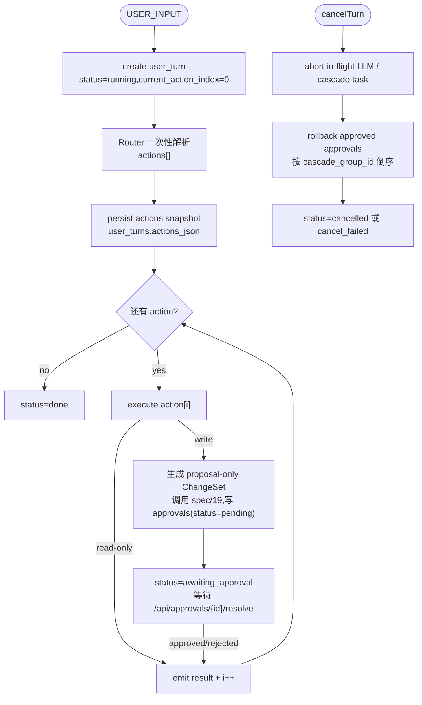

# Spec 26 — Cascade Controller

> **[info]** 本文档收敛一个长期漂移点: Router、状态机、审批流、影响分析都提到 cascade controller,但此前没有主权文档。结论: **cascade controller 是 user_turn actions 的唯一编排者**,不拥有 UI 状态、不拥有 schema、不拥有影响半径算法。

## 职责边界

| 模块 | 拥有内容 | 不拥有内容 |
|---|---|---|
| **Router** | 单次意图解析,输出有序 `actions[]` | 不执行 action,不决定取消回滚细节 |
| **Cascade Controller** | 创建 / 恢复 / 取消 `user_turn`,串行执行 actions,把 write action 转成 proposal,等待审批结果后推进队列 | 不直接写用户文件;不做 SQL 影响候选;不保存 UI widget state |
| **spec/06 Approval Flow** | `approvals` resolve / rollback endpoint,ApprovalCard payload,transaction 写盘 | 不调 Router,不决定下一 action |
| **spec/07 Mode Machine** | UI 可交互状态: idle / busy / awaitingApproval / errored | 不保存 pending approval 的事实来源 |
| **spec/19 analyzeImpact** | 影响候选、LLM 二次过滤、最多 3 轮递归 ChangeSet | 不推进 user_turn action index |

## Turn Lifecycle

**审批流程图**



## 数据契约

`user_turns` 归 [spec/01](./01-storage-schema.md) 管理,但本文件定义运行时字段语义:

| 字段 | 语义 | 写入者 |
|---|---|---|
| `actions_json` | Router 输出的不可变 actions snapshot。重启恢复时不重新问 Router。 | cascade controller |
| `current_action_index` | 下一条待执行 action 的下标。每条 action 完成后递增。 | cascade controller |
| `status` | `running` / `awaiting_approval` / `reverting` / `done` / `cancelled` / `cancel_failed` | cascade controller |
| `active_approval_id` | 当前等待用户决议的 ChangeSet approval。事实来源仍是 `approvals` 表。 | cascade controller |
| `cancel_reason` | 用户取消、Router cancel action、页面恢复后取消等来源。 | cascade controller |

## 取消统一入口

所有取消路径必须收敛到 `cancelTurn(turnId)`:

- ChatBox 顶部 **[取消本次对话]**
- Router 解析出 `cancelTurn` action
- awaitingApproval 状态按 `Esc`
- 恢复 banner 中用户选择“取消本次对话”

`cancelTurn` 是幂等 endpoint。若 turn 已是 `done` / `cancelled`,返回 409;若处于 `reverting`,返回当前进度,不重复回滚。

## 回滚与 Reindex 失败语义

此前 P0-4 未定义“整 turn 回退后反向 reindex 失败”如何处理。本轮定稿如下:

1. **回滚 transaction 成功即视为用户产物已恢复**。文件内容和 `history` 反向记录是强一致边界。
2. **reindex 是派生视图修复**,失败不反向推翻回滚。失败文件写入 `reindex_failures`,项目进入 `needs_reindex_repair` banner。
3. **cancel_failed 只表示回滚 transaction 失败**,例如文件写入失败或 history 缺 before 基准。此时 UI 禁止继续写入,只允许重试回滚或导出诊断。
4. **派生文件不手写回滚**。`derived: true` 文件由 reindex worker 重建,rollback 只回滚源文件。

## 恢复算法

```ts
export async function recoverActiveTurn(projectId: string) {
  const turns = await db.userTurns.findActive(projectId)
  for (const turn of turns) {
    const pending = await db.approvals.findByTurn(turn.id, { status: 'pending' })
    if (pending.length > 0) {
      return {
        mode: turn.mode,
        state: 'awaitingApproval',
        currentTurnId: turn.id,
        activeApprovalId: pending[0].id,
        approvalQueue: pending.slice(1).map(a => a.id),
      }
    }
    return {
      mode: turn.mode,
      state: 'running',
      currentTurnId: turn.id,
      nextActionIndex: turn.current_action_index,
    }
  }
  return { mode: 'discuss', state: 'idle' }
}
```

恢复时不信任 `runtime/session.json` 的 pending approvals;它最多缓存 UI 上次 mode。`approvals` + `user_turns` 才是事实来源。

## Session History Events

cascade controller 的调试事件写入 [spec/27](./27-session-history.md) 的 `cascade_events`,包括:

- `turn_created`
- `router_actions_persisted`
- `action_started` / `action_finished`
- `approval_wait_started` / `approval_resolved`
- `cancel_requested` / `rollback_started` / `rollback_finished` / `rollback_failed`

这些事件是调试日志,不能作为恢复事实来源。

## 关键不变性

1. Router 每个 user_turn 只运行一次;恢复时重放 `actions_json`,不重新解析用户输入。
2. 同一 project 同一时间最多一个 active turn;新 USER_INPUT 在 active turn 存在时被拒绝或显式排队,不隐式并发。
3. 写 action 必须先得到完整 ChangeSet 和 pending approval;用户 approve 前不得写用户文件。
4. 每次 action 完成后才递增 `current_action_index`;中途崩溃恢复后不会跳过 action。
5. 取消是 turn 级操作,不能只取消当前 ApprovalCard 而保留已落盘前序 action。

## 验证

- `cascade-controller.test.ts`: Router 只调一次,恢复时使用 actions snapshot。
- `turn-cancel.test.ts`: action[1] 执行中取消,倒序回滚 action[0],未执行 action[2] 被丢弃。
- `reindex-failure.test.ts`: rollback 成功但 reindex 失败时进入 `needs_reindex_repair`,不标 `cancel_failed`。
- `active-turn-lock.test.ts`: active turn 存在时第二条 USER_INPUT 被拒绝,除非显式 queue。

## 关联文档

- [plan/02](../plan/02-multi-agent.md) Router actions 输出
- [spec/06](./06-approval-flow.md) Approval resolve / rollback endpoint
- [spec/07](./07-mode-state-machine.md) UI 状态机
- [spec/19](./19-impact-analysis.md) analyzeImpact
- [spec/27](./27-session-history.md) 过程日志

## ADR · 设计决策

| 编号 | 决策 | 选项 | 选择 | 理由 |
|---|---|---|---|---|
| ADR-01 | 编排主权 | 状态机拥有 / 审批 endpoint 拥有 / **独立 cascade controller 拥有** | **独立 controller** | 状态机是 UI 可交互状态,审批 endpoint 是单个决议处理;turn actions 需要可恢复、可取消、可测试的服务端编排边界。 |
| ADR-02 | 恢复策略 | 重跑 Router / **重放 actions_json** | **重放 actions_json** | Router 是 LLM 调用,恢复时重跑可能得到不同 actions,破坏审批与 history 的可追溯性。 |
| ADR-03 | reindex 失败处理 | 回滚整体失败 / **产物回滚成功 + 派生修复待处理** | **派生修复待处理** | reindex 是派生视图,不能让派生失败反向污染用户源文件状态。 |
