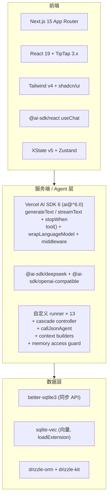

# Spec 28 — 技术栈锁定

> **[info]** 本文档是技术栈锁定主权文档,后续代码 commit 以本文档为依据。版本号实查清单见 [spec/00](./00-version-audit.md);版本审计跑完前,本文版本表视为占位,audit 产出后回写本文。

## 技术决策总览

| 维度 | 选择 | 理由 |
|---|---|---|
| 应用架构 | Next.js 15 单应用 | 起步快,SSE 一等公民,App Router 与 AI SDK 6 集成最佳 |
| LLM 调用层 | Vercel AI SDK 6 (`generateText` / `streamText` + `stopWhen`) | 显式控制工具循环终止条件,不依赖框架隐式 Agent loop;`stopWhen` callback 是框架级一等字段,可精确控制"看到 proposal marker 立刻停"等业务终止 |
| Agent 编排 | 自定义 runner (13 个函数式) + cascade controller | 业务编排用普通 TS 函数显式编排,可见可测;详见设计取舍 ADR-A |
| LLM | DeepSeek V4 Pro/Flash | ctx **1M tokens**, max output **384K**, 原生 JSON mode (`response_format: { type: 'json_object' }`)。Pro 用于核心创作 (writer / validator / humanizer),Flash 用于辅助 (router / checker / reflector / reader-panel / 工具内 LLM 短调用) |
| 编辑器 | TipTap 3.x + 自定义装饰器 + AC trie | TipTap 中文排版舒服;不用 `Mention` 节点 (atomic 破坏纯文本流) |
| 存储 | Markdown (产物) + SQLite (索引 + 过程) | Markdown 人类可读 + Git 友好;SQLite 处理引用图 / 历史 / 学习 / 段锚 / 嵌入向量 |
| SQLite driver | `better-sqlite3` | 同步 API + prebuild 成熟,Drizzle / sqlite-vec 配合最稳;详见设计取舍 ADR-B |
| ORM | Drizzle ORM + drizzle-kit | TS schema 单一事实源 + 自动 migration;详见设计取舍 ADR-D |
| 向量能力 | `sqlite-vec`(loadExtension) | 与 SQLite 同库,可直接 SQL JOIN;详见设计取舍 ADR-C |
| 联网 | 接口预留 + Mock | 二期接 Bocha (中文) + Tavily (英文),用 MCP sidecar |
| 三模式 | XState 状态机 | discuss 不写,plan 改设定,write 改章节,严格闸门 |

## 栈分层总览

**栈分层图**



## 锁定的库版本

| Package | 版本 | 锁定策略 | 关键说明 |
|---|---|---|---|
| `next` | `15.5.x` | 锁主线 | v15 LTS 覆盖整个项目周期 |
| `react` / `react-dom` | `19.2.x` | 锁主线 | Next 15.5 + TipTap 3 + AI SDK 6 共同要求 |
| `typescript` | `^5.9` | caret | XState v5 / AI SDK 6 ergonomics 在 5.6+ 最佳 |
| `tailwindcss` | `4.2.x` | 锁主线 | Oxide 重写后 GA,与 v3 不兼容 |
| `@tailwindcss/postcss` | `4.2.x` | 锁主线 | v4 拆分出的独立 PostCSS plugin |
| `@tiptap/{react,pm,starter-kit}` | `3.16.x` | 锁主线 | SSR 需 `immediatelyRender: false` |
| `ai` (Vercel AI SDK) | `^6.0` | caret | v6 已稳;**用 `generateText` / `streamText` + `stopWhen` 自定义终止**,不依赖任何 Agent 框架 |
| `@ai-sdk/react` | `^6.0` | caret | `useChat` / `onToolCall`;审批决议走独立 endpoint |
| `@ai-sdk/deepseek` | `2.0.x` | 锁主线 | model ID `deepseek-v4-pro` / `deepseek-v4-flash`;ctx 1M,max output 384K,原生 JSON mode(实查见 [spec/00 §C](./00-version-audit.md)) |
| `@ai-sdk/openai-compatible` | latest | caret | DeepSeek 通过此 provider 接入;支持 `wrapLanguageModel + middleware` |
| `better-sqlite3` | `^11.0` | caret | SQLite driver(同步 API);prebuild 跨平台稳;Drizzle 头等公民 |
| `drizzle-orm` | `^0.40` | caret | SQL → TS schema 类型化;type-safe query builder |
| `drizzle-kit` | `^0.30` | caret | migration CLI:`pnpm drizzle-kit generate` |
| `sqlite-vec` | latest | caret | 向量扩展,`db.loadExtension(sqliteVec.path)` 加载;`vec0` virtual table + `MATCH` 操作符 |
| `xstate` / `@xstate/react` | `^5.0` | caret | 三模式状态机 |
| `zustand` | `^5.0` | caret | 客户端 store |
| `react-resizable-panels` | `4.10.x` | 锁主线 | 五区可拖拽布局 |
| `ahocorasick` | `^1.0` | caret | 10KB JS,实体高亮的字符串多模匹配 |
| `gray-matter` / `unified` / `remark-*` | latest | caret | Markdown frontmatter + AST 处理 |
| `lucide-react` | latest | caret | shadcn 默认图标库 |
| `cva` / `clsx` / `tailwind-merge` | latest | caret | shadcn 三件套 |
| `sonner` | `^2.0` | caret | shadcn 推荐的 toast 库 |
| `tw-animate-css` | latest | caret | Tailwind v4 era 的 shadcn 动画 |

## 锁定策略原则

- **锁主线(无 caret)**:0.x 包、快速演进的 1.x 包、直接决定渲染输出 / native binding 的包 — 任何 minor 漂移都可能引起破坏性变更
- **caret (`^`)**:类型包、稳定版 v5/v6 主流框架包、生态边缘工具
- `pnpm-lock.yaml` 入库,作为 single-source-of-truth — 任何团队成员安装得到一致的依赖树

## 集成关键点

### Next.js + better-sqlite3

- **`next.config.ts`** 必须包含 `serverExternalPackages: ['better-sqlite3']` — 否则 bundler 会试图打包 native binding,失败
- **所有触 db 的 Route Handler 必须** `export const runtime = 'nodejs'`(Edge runtime 不支持 fs / native bindings)
- **globalThis 缓存模式**:dev hot-reload 会反复实例化 db connection,泄漏 fd。在 `lib/db/index.ts` 用 `globalThis.__openNovelDb` 缓存,模仿 Prisma 的 Next.js dev 范式
- **WAL mode**:`db.pragma('journal_mode = WAL')` 启动时设;多 reader 一个 writer,避免 SQLite 写锁竞争

完整 `next.config.ts`(含 `sqlite-vec` 外置)与 Route Handler 不变性详见 [spec/09](./09-build-and-tooling.md)。

### Next.js + TipTap (v3)

- **`'use client'` 边界**:TipTap 的 `useEditor`、`@tiptap/pm`、`@tiptap/starter-kit` 间接 touch `window`,host 组件 + adapter 实现都必须 `'use client'`
- **`immediatelyRender: false`** 是 TipTap 3 在 SSR 下的默认要求,不加会出 hydration warning
- **不用 `next/dynamic({ ssr: false })`**:单 `'use client'` 已足够,dynamic import 仅在 FCP 出现压力时再考虑

### Tailwind v4 vs v3 行为变化

- **配置位置**:不再有 `tailwind.config.ts`;主题、CSS 变量、颜色都在 `app/globals.css` 的 `@theme inline { ... }` 块中
- **PostCSS plugin**:从 `tailwindcss` 主包拆出 — 必须额外装 `@tailwindcss/postcss`
- **指令变化**:`@tailwind base/components/utilities` → 单一 `@import 'tailwindcss';`
- **`@custom-variant dark`**:dark mode variant 通过 `@custom-variant dark (&:is(.dark *))` 显式声明
- **回退方案**:若 v4 在某场景阻塞(> 1h),可降到 3.4.x — 改动量约 30 分钟

`globals.css` 配置形态与 PostCSS 接线详见 [spec/09 §Tailwind v4 配置](./09-build-and-tooling.md)。

### shadcn/ui v4 era

- 跑 `pnpm dlx shadcn@latest init` 自动识别 Tailwind v4(但**注意**:因企业 SSL 拦截 ui.shadcn.com,我们手工写组件,不依赖 CLI fetch — 详见 [spec/09 §安装陷阱](./09-build-and-tooling.md))
- 锁定的初始化参数:Style=new-york / RSC=true / TSX=true / baseColor=slate / cssVariables=true / iconLibrary=lucide
- **`components.json`** 仍要写,作为 shadcn `add` 命令未来可用的元数据
- 初始最小集:`button card dialog input label resizable scroll-area separator tabs textarea`

### Drizzle + better-sqlite3 + sqlite-vec 集成

```ts
// lib/db/index.ts
import Database from 'better-sqlite3'
import * as sqliteVec from 'sqlite-vec'
import { drizzle } from 'drizzle-orm/better-sqlite3'
import * as schema from './schema'
import path from 'node:path'
import os from 'node:os'

const cached = globalThis as unknown as { __openNovelDb?: ReturnType<typeof createDb> }

function createDb(projectId: string) {
  const dbPath = path.join(os.homedir(), '.open-novel', 'workspaces', projectId, 'index.db')
  const sqlite = new Database(dbPath)
  sqlite.pragma('journal_mode = WAL')
  sqliteVec.load(sqlite)                                // 加载向量扩展
  return drizzle(sqlite, { schema })
}

export function getDb(projectId: string) {
  if (!cached.__openNovelDb) cached.__openNovelDb = createDb(projectId)
  return cached.__openNovelDb
}
```

**跨项目连接管理**:每个项目独立 `index.db` 文件;LRU(3) 缓存 3 个项目的 connection,切换项目时 evict 最旧的。详见 [spec/01 §better-sqlite3 连接池](./01-storage-schema.md)。

### DeepSeek V4 配置

| 模型 | ID | ctx | max output | 用途 |
|---|---|---|---|---|
| Pro | `deepseek-v4-pro` | 1M | 384K | Writer / Validator / Humanizer(核心创作 + 一致性审 + 改写) |
| Flash | `deepseek-v4-flash` | 1M | 384K | Router / Checker / Reflector / ReaderPanel / 工具内 LLM 短调用 |

**1M ctx 的设计含义**:普通章节场景下不需要 token 预算控制,把"一致性所需的全部上下文"装齐是头等优先级 — 见 [spec/23 §per-agent 上下文契约](./23-context-contracts.md)(一致性优先装配)。

**调用形态**(详见 [spec/24](./24-json-output.md)):

```ts
import { wrapLanguageModel, generateText } from 'ai'
import { createOpenAICompatible } from '@ai-sdk/openai-compatible'
import { deepseekMiddleware } from '@/lib/agents/deepseek-middleware'

const deepseek = createOpenAICompatible({
  name: 'deepseek',
  apiKey: process.env.DEEPSEEK_API_KEY!,
  baseURL: 'https://api.deepseek.com/v1',
})

export const deepseekPro = wrapLanguageModel({
  model: deepseek.languageModel('deepseek-v4-pro'),
  middleware: [deepseekMiddleware],                     // 见 spec/22 §DeepSeek 适配
})

// JSON 模式调用(Router / Validator / Checker / ...)
const result = await generateText({
  model: deepseek.languageModel('deepseek-v4-flash'),
  messages,
  providerOptions: { deepseek: { response_format: { type: 'json_object' } } },
  maxOutputTokens: 512,                                 // 必须基于 zod schema 估算
})
```

**Agent loop 控制**(Writer / Validator 等带工具的 agent):

```ts
import { generateText } from 'ai'

const result = await generateText({
  model: deepseekPro,
  messages: ctx.messages,
  tools: ctx.tools,
  stopWhen: ({ steps }) => {
    // 看到 proposal marker 立刻停 — 不依赖 LLM 看 prompt 自觉停
    const last = steps[steps.length - 1]
    if (last?.toolResults?.some(r => r.result?.kind === 'proposal')) return true
    if (steps.length >= 10) return true
    return false
  },
  onStepFinish: async ({ toolResults }) => {
    await recordTrace(ctx, toolResults)
  },
})
```

**JSON mode 关键约束**:

- system 或 user prompt 必须含 "json" 字样 + 提供示例
- DeepSeek 不强制 schema → 应用层 zod 校验 + 失败 retry 1 次,2 次仍败 escalate
- `max_tokens` 必须基于 schema 估算(防 JSON 中途截断 — 大坑)
- 偶尔返回空 content → retry + 加 "请确保返回非空 JSON" 后缀
- streaming 时拼完整 chunks 再 parse,中间 chunks 不展示给用户

### 应用层 Memory 模块

不用任何 Agent 框架的 Memory 抽象,自己写薄薄一层 thread / resource CRUD + 一致性校验(thread/resource guard);messages 落全局 `~/.open-novel/runtime.db`,**不进 per-project `index.db`**。接口与 guard 的 canonical 实现以 [spec/22 §应用层 memory 模块](./22-memory-and-history.md) 为准,本文不重复代码。

## 版本升级流程

- 单一 minor bump(e.g. `next 15.5.4 → 15.5.7`):测试 + lockfile 更新 + commit `chore(deps): bump next 15.5.7`,无需 doc 更新
- 主版本切换(e.g. `next 15 → 16`):必须先 PR 更新本文档 + plan/spec 受影响章节 + 跑全套验收,然后再 code commit
- 从 caret 收紧到锁主线(生产准备时):整体走一遍 doc commit `docs(spec/28): tighten version locks for production`

## 不在本期范围

- 私有包注册表 / npm proxy 配置(localhost 直连 npmjs)
- 多 lockfile 共存(Yarn / npm)— 强制 pnpm
- 跨平台兼容(只测 macOS;Windows / Linux 留待二期)
- 云同步 / 多设备(LibSQL embedded replicas 等能力被砍 — 单机本地 SQLite 已够)
- Mastra Agent / Memory / Workflow 等高层抽象(被 P0-1 决策砍掉,详见 [ADR-A](#设计取舍))

## 关联文档

- **实查清单**:[spec/00](./00-version-audit.md) 版本审计闸门 — 本文版本表在 audit 前视为占位
- **存储细节**:[spec/01](./01-storage-schema.md) SQLite schema 与连接池
- **构建配置**:[spec/09](./09-build-and-tooling.md) 构建与工具链(`serverExternalPackages` / PostCSS / pnpm 等)
- **DeepSeek 适配**:[spec/22](./22-memory-and-history.md) §DeepSeek middleware
- **JSON 输出**:[spec/24](./24-json-output.md) JSON 结构化输出统一规约

## 设计取舍

| 编号 | 决策 | 选项 | 选择 | 理由 |
|---|---|---|---|---|
| ADR-A | Agent 框架 | Mastra Agent / LangGraph / OpenAI Agents SDK / Inngest / **裸 AI SDK 6 + stopWhen** | **裸 AI SDK 6 + stopWhen + 自定义 runner** | Mastra Agent loop 的隐式行为(工具返回后自动喂回 LLM)与本项目"工具内部跑 15-45s cascade + 跨 HTTP 请求审批" 强冲突;`stopWhen` 是 AI SDK 6 一等字段,可显式控制"看到 proposal marker 立刻停",彻底消除"用 prompt 嘱咐 LLM 自觉 stop" 的 anti-pattern。LangGraph 控制力够但要换整套生态;Inngest 杀鸡用牛刀 |
| ADR-B | 数据库 | LibSQL / **SQLite (better-sqlite3)** / node:sqlite | **better-sqlite3** | LibSQL 是 Mastra 推荐而非主动选择;LibSQL 独有的 HTTP API / embedded replicas / sync 本项目都用不上;SQLite 是 30 年公共标准,生态最大,Drizzle 头等公民;同步 API 简化代码;better-sqlite3 prebuild 在企业 SSL 下表现成熟 |
| ADR-C | 向量能力 | LibSQL native vector / **sqlite-vec** / sqlite-vss / hnswlib-node / Vectra | **sqlite-vec** | 与 SQLite 同库,可 SQL JOIN([spec/20](./20-context-assembly.md) / [spec/21](./21-fact-query.md) 范式契合);transaction 一致性免费;hnswlib-node / Vectra 都要"两次查询"+ JS merge,与现有 spec 范式不符 |
| ADR-D | ORM | 裸 SQL 字符串 / **Drizzle ORM** / Kysely / Prisma | **Drizzle ORM** | 本项目 12+ 张表 + 持续 schema 演进,需要 schema 单一事实源;TS 类型从 schema 自动推导,"加字段不漏改";Prisma 不支持 SQLite/LibSQL fork;Kysely 无 migration 工具 |
| ADR-E | Worker / Job queue | **进程内 in-memory queue** / bullmq + Redis / Inngest | **进程内 in-memory queue (MVP)** | 单机本地工具,无多进程协作需求;bullmq 需要 Redis 部署,过重;未来真有扩展需求再迁 bullmq,接口 `queue.add(job)` 不变 |
