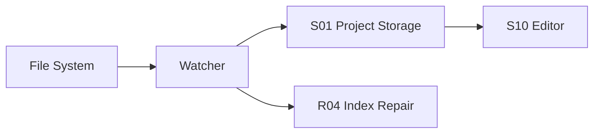

# I03 · Filesystem And Watcher

Filesystem And Watcher 定义本地文件、外部编辑器和 Open Novel 存储层之间的集成边界。

## 需要解决的问题

| 场景 | 风险 |
|---|---|
| 外部编辑 Markdown | UI 状态过期 |
| 文件被移动/删除 | 最近项和索引失效 |
| 写盘中断 | 半文件或假成功 |
| watcher 漏事件 | 索引健康度错误 |

## 集成流

## 失败收场

| 失败 | 用户看到 | 系统不能做 |
|---|---|---|
| 外部冲突 | 重载/保留/合并选择 | silent overwrite |
| watcher 失效 | 索引健康 warning | 继续声称索引完整 |
| 原子写失败 | 写入失败和恢复建议 | 标记成功 |
| 路径越权 | 阻断 | 读写 workspace 外文件 |

## FAQ

**Q: watcher 漏事件时是否意味着项目不能编辑?**

A: 不一定。正文编辑仍可继续,但派生索引必须标记 degraded,高风险查询和生成要降级或阻断。

**Q: 外部编辑冲突由谁裁决?**

A: 用户裁决。系统可以展示差异和建议,不能默认覆盖外部改动。
