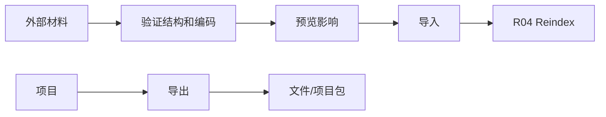

# I04 · Import Export Contract

Import Export Contract 定义项目如何进入和离开 Open Novel。导入导出是数据边界,不是创作能力。

## 入口和出口

| 操作 | 目标 |
|---|---|
| Import Markdown | 把旧稿转成项目结构 |
| Import Project Package | 恢复完整项目 |
| Export Manuscript | 导出成稿 |
| Export Project Package | 带走项目和元数据 |

## 合同

## 失败收场

| 失败 | 用户看到 | 系统不能做 |
|---|---|---|
| 编码/结构不识别 | 停止并说明 | 乱猜章节结构 |
| 文件冲突 | 选择另存/覆盖/取消 | 默认覆盖 |
| 导出失败 | 保留项目状态 | 生成残缺包并称成功 |
| reindex 失败 | 导入成功但索引过期 | 假装导入全量可查 |

## FAQ

**Q: 导入是否一定要一次完成索引?**

A: 不一定。导入的文件事实可以成功,索引可以标记过期并进入 R04 修复;不能把索引失败伪装成全量可查。

**Q: 导出包能不能作为备份格式?**

A: 可以,但必须满足 R02 的校验和恢复预览要求;普通成稿导出不能冒充完整项目备份。
