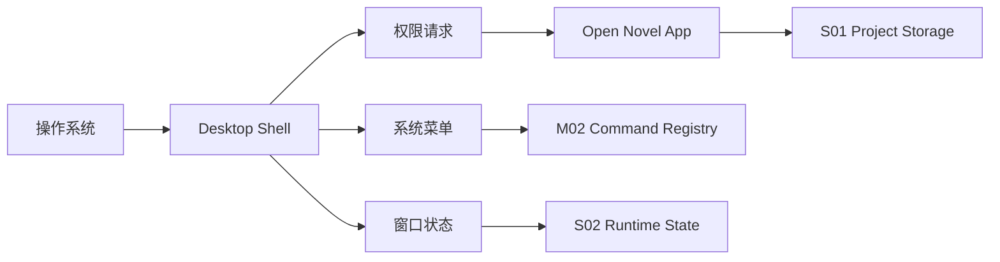

# I05 · Desktop Shell Contract

Desktop Shell Contract 预留本地桌面壳集成边界。当前仓库仍是单应用路线;若未来引入桌面壳,必须按本契约处理本地权限、窗口、菜单和系统快捷键。

## 集成点

| 集成 | 约束 |
|---|---|
| 文件权限 | 用户明确选择 workspace |
| 系统快捷键 | 不抢 IME 和编辑器焦点 |
| 窗口状态 | 恢复不能改变业务事实 |
| 菜单命令 | 进入 Command Registry |
| 自动更新 | 进入 [R03](./R03-migration-and-upgrade.md) |

## 边界图

桌面壳只能承接系统能力和窗口外壳,不能拥有作品事实。任何菜单命令最终都要回到应用内 command registry。

## 失败收场

| 失败 | 处理 |
|---|---|
| 权限被拒 | 明确提示并停在安全状态 |
| 系统快捷键冲突 | 禁用或提示重绑 |
| 更新失败 | 保持旧版本可用 |
| 窗口恢复失败 | 不影响项目事实 |

## FAQ

**Q: 当前没有桌面壳,为什么还需要 I05?**

A: 因为文件权限、系统快捷键、菜单和更新一旦接入,会影响作品主权和失败收场。提前定义边界能避免以后把壳层写成事实层。

**Q: 桌面壳能不能直接读写 workspace?**

A: 不能绕过应用存储层。壳层可以请求权限和传递路径,实际读写仍由 S01/I03 处理。
