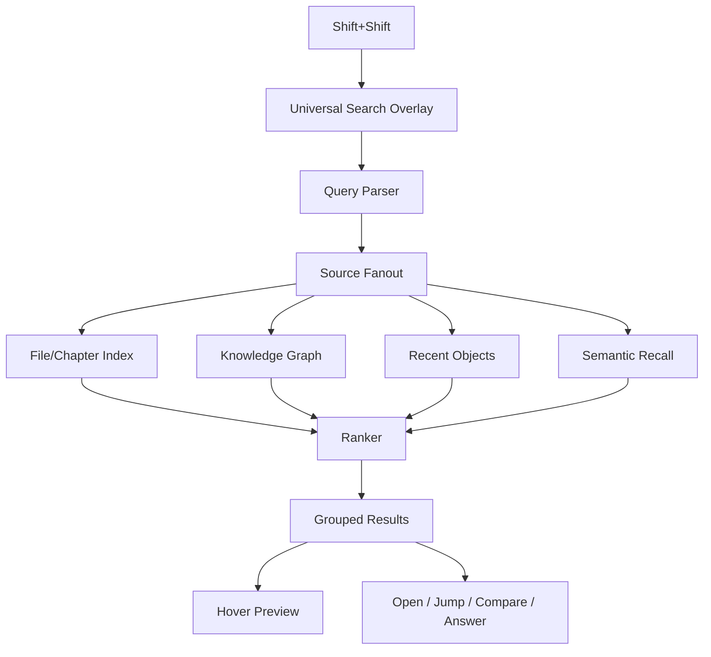
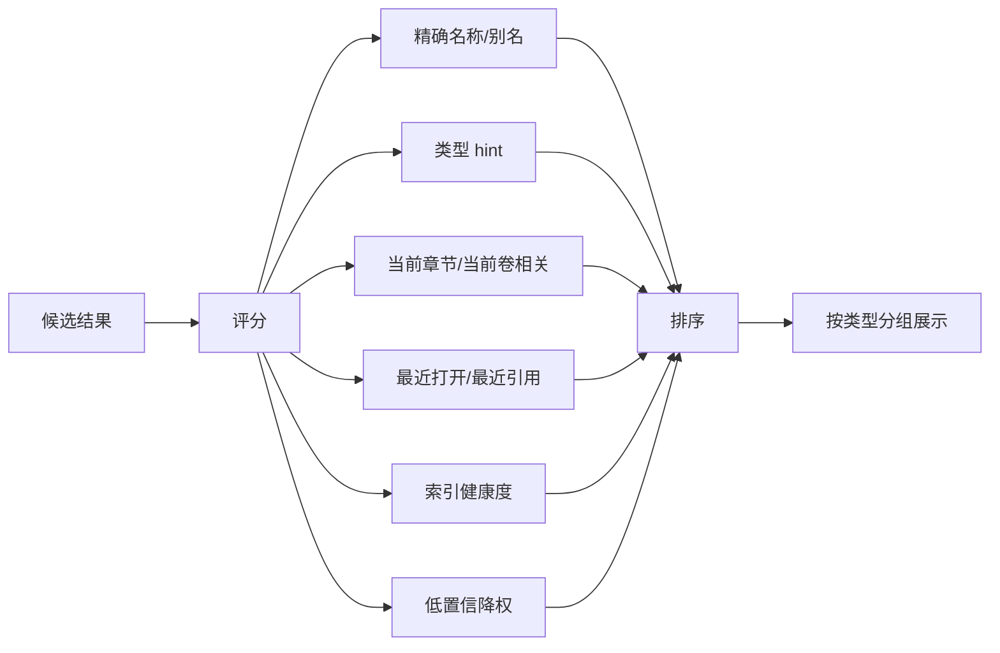
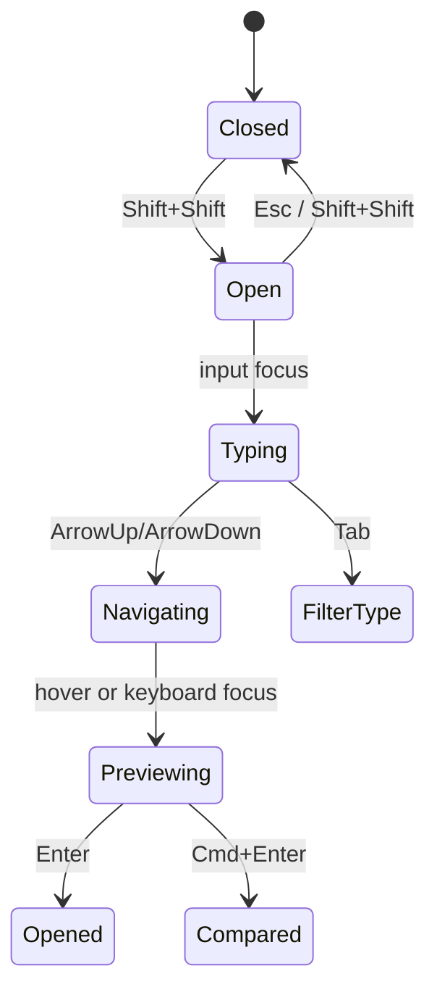

# M01 · Universal Search

Universal Search 是作者在任何时刻用 `Shift+Shift` 唤出的唯一顶层搜索入口。它不是命令面板,不是高级打开,也不是某个独立事实问答快捷键;它是“我记得一个名字、阵营、伏笔、章节片段,帮我把相关东西找出来并解释”的统一入口。

## 一秒钟场景

作者正在写第 37 章,突然想确认“青岚”到底是角色、阵营还是剑诀。她不想切库面板,也不想决定先查哪类事实。她连按两下 `Shift`,屏幕上方出现 Universal Search,输入 `青岚`,结果按类型聚合:

- 角色:青岚,主角阵营,当前状态和最近出现章节。
- 阵营:青岚宗,立场、成员、敌对关系。
- 概念:青岚剑诀,能力规则、代价和违反风险。
- 章节:第 18 章《青岚初战》,命中片段和跳转。

她 hover 某条结果,右侧预览卡展示来源、关系和可执行动作;按 `Enter` 打开最佳结果,`Cmd+Enter` 对照打开,`Tab` 在类型间切换。

## 与相邻入口的区别

| 入口 | 快捷键 | 用户意图 | 数据范围 | 结果动作 |
|---|---|---|---|---|
| 统一搜索(Universal Search) | `Shift+Shift` | 搜任何项目对象、名字、阵营、概念、章节片段,并查看事实答案与来源 | 项目文件 + 图谱 + 精确/语义索引 + 最近对象 + QueryFacts | 打开、跳转、预览、对照、继续查询、查看答案 |
| 高级打开(Quick Open) | `Cmd+P` | 已知道要打开的文件、章节、设定或最近项 | 文件、项目对象 id 和最近打开项 | 打开或预览,不做内容搜索 |
| 命令面板(Command Palette) | `Cmd+Shift+P` / `F1` | 执行命令 | CommandRegistry | 执行动作 |
| 选区查询 | 选区浮动条「查询」 | 用选中文字进入统一搜索 | QueryFacts + 选区上下文 | 在统一搜索内展示答案和来源 |

事实答案和来源查看是 Universal Search 内的能力,由 [M03](./M03-fact-query.md) 定义。它没有 `Cmd+E` 独立作者入口,也不能成为第二个顶层搜索浮层。

## 技术闭环

Universal Search 不直接写作品。它读取项目事实和派生索引,输出可点击结果和可追溯来源。任何会触发写入的后续动作必须转入对应 turn/approval 语义。

## Recap 与 activity 边界

Search 的本地路径不生成 recap。打开浮层、输入关键词、hover preview、展开分组、打开结果、跳转段落和对照打开,都只改变当前视图或最近访问排序;它们不能写入项目 Activity 时间线,也不能被包装成“本轮完成了搜索”。

Search 内的事实答案由 [M03 Fact Query](./M03-fact-query.md) 定义:默认只写轻量 activity,不生成 recap。只有当用户从 Search 选择“转 Discuss”、请求 Agent 解释、运行 ReaderPanel、生成 proposal 或触发任何写入/审批动作时,该动作才离开 Search,进入 [M17](./M17-turn-recap-and-continuation.md) 的 turn recap 触发矩阵。

## 查询理解

| 输入 | 识别 | 首选结果 |
|---|---|---|
| `青岚` | 名称/别名 | entity、organization、concept 混排 |
| `阵营 青岚` | 类型 hint + 名称 | organization 优先 |
| `第18章` | 章节定位 | chapter |
| `主角父亲` | 关系查询 | entity + relation preview |
| `失明代价` | 语义/概念 | concept、rule、mentions |
| `@青岚` | mention 形态 | 对应项目对象 |

解析只负责生成候选意图,不能编造事实。没有高置信类型时,结果按混合排序展示,不强行决定用户要什么。

## 数据源和主权

| 数据源 | 提供什么 | 主权文档 |
|---|---|---|
| 文件/章节索引 | 文件名、章节名、路径、最近打开 | [Project Storage](./S14-project-storage.md) |
| 知识图谱 | entity、alias、concept、relation、anchor | [Knowledge Graph](./S05-knowledge-graph.md) |
| Context Management | fact query、semantic recall、来源解释 | [S06 · Context Management](./S06-context-management.md) |
| Runtime State | 最近访问、当前 turn、history hint | [Runtime State](./S01-runtime-state.md) |
| Editor | 当前选区、当前文件、打开/对照动作 | [Editor And Interaction](./S13-editor-and-interaction.md) |

Search 结果必须带来源或来源状态。语义召回命中不能单独成为事实;它只能进入“可能相关”组,并回到原文段落解释。

Runtime recent objects 必须按 project 隔离。全局壳可以展示最近项目,但项目内 Universal Search 只能读取当前 project id 的最近访问、查询历史和 preview cache;跨项目命中必须先切项目,不能混入当前项目排序。

## 排序和分组

展示分组建议:

| 组 | 包含 | 行内容 |
|---|---|---|
| 最佳结果 | 最高置信结果 | 名称、类型、摘要、来源状态 |
| 角色 | 角色和别名 | 阵营、当前状态、最近出现 |
| 阵营 | 阵营/组织 | 立场、成员、敌对/盟友 |
| 概念 | 能力、规则、禁忌、伏笔 | 规则摘要、风险、来源 |
| 章节 | 章节和正文片段 | 标题、命中片段、位置 |
| 可能相关 | 低置信语义召回 | 原文片段、置信提示 |

低置信结果必须视觉降权,不能和精确命中同等展示。

每条结果都必须带 freshness:

| freshness | 展示 |
|---|---|
| fresh | 正常展示,来源与索引水位一致。 |
| stale | 标记“索引可能过期”,保留来源跳转但降低排序。 |
| pending | 只作为待审/未生效提示,不进入事实分组。 |
| low-confidence | 放入“可能相关”或弱提示,不能作为事实摘要。 |

Pending approval 中尚未生效的事实不能进入“角色 / 阵营 / 概念”等派生事实展示。Search 可以在单独的“待审变更”提示里说明某审批卡可能影响当前查询,并提供打开审批卡入口。

## Hover Preview

Hover preview 是 Universal Search 的关键体验,不是普通 tooltip。它帮助作者在不离开当前纸面的情况下判断“这是不是我要找的东西”。

| 类型 | 预览内容 | 主动作 |
|---|---|---|
| 角色 | 别名、阵营、当前状态、关系、最近章节 | 打开角色卡 / 查看引用 |
| 阵营 | 立场、成员、敌对/盟友、首次出现 | 打开设定 / 查看关系 |
| 概念 | 定义、规则、代价、违反风险、来源 | 打开设定 / 查询 mentions |
| 章节 | 标题、摘要、命中片段、上下章 | 打开章节 / 对照打开 |
| 正文片段 | 前后文、所属章节、段落锚点健康度 | 跳转段落 |

Preview 只能展示已有事实或明确标记的低置信召回。不得把模型推测包装成对象摘要。

## 键盘与焦点

规则:

- `Shift+Shift` 只在没有更高优先级 focus trap、IME composition、文本选择拖拽时触发。
- `Esc` 关闭 search,不取消 turn。
- `Enter` 打开当前高亮结果;`Cmd+Enter` 对照打开。
- `Tab` 在结果类型 filter 间循环;输入中文 IME composition 时不抢 `Tab`。
- 当前有 pending approval 时,Search 仍可查和打开,但不能触发危险写入动作。

## UI 契约

design 负责视觉和精确尺寸,本 spec 只定义行为。当前设计入口:

- [design/01 主界面](../design/01-main-layout.md): Search 属于召唤层,不常驻,不能遮挡正文长期存在。
- [design/06 命令面板与快捷交互](../design/06-command-palette.md): Search 与 Command Palette / Quick Open 共用轻浮层视觉,但入口和结果源不同。

建议交互形态:

| 区域 | 要求 |
|---|---|
| 位置 | 屏幕上方 1/4 居中,不推开纸面 |
| 宽度 | 支持结果 + preview 双栏,事实答案以右栏卡片或结果详情承载 |
| 输入 | 单行搜索框,placeholder 说明可搜角色/阵营/章节/设定 |
| 左栏 | 分组结果,支持键盘选择 |
| 右栏 | hover/focus preview |
| 关闭 | `Esc` / 再按 `Shift+Shift` / 点击外部 |

## 失败和降级

| 失败 | 用户看到 | 系统不能做 |
|---|---|---|
| 索引过期 | 结果顶部提示“索引可能不完整”,低置信结果降权 | 假装全项目已覆盖 |
| 图谱不可用 | 文件/章节搜索可用,实体/关系组不可用 | 编造实体摘要 |
| semantic recall 不可用 | 隐藏 Maybe Related 或提示语义召回不可用 | 用语义空结果覆盖精确结果 |
| 查询无结果 | 空态建议:检查拼写 / 搜章节 / 打开命令面板 | 自动让 Agent 猜一个答案 |
| 权限/路径异常 | 提示项目索引不可读 | 读取当前项目目录外文件 |
| Preview 来源缺失 | 只显示基础行,标记“来源缺失” | 展示无来源详情 |

## 测试清单

| 类型 | 场景 |
|---|---|
| 键盘 | `Shift+Shift` 打开/关闭,IME 中不触发,`Esc` 不取消 turn |
| 排序 | 精确角色名高于语义命中,当前章节相关性提升 |
| 分组 | 同词命中角色、阵营、概念、章节时按组展示 |
| 预览 | hover/focus 切换 preview,无来源内容不展示详情 |
| 降级 | index stale、KG fail、semantic fail 都有不同提示 |
| 互斥 | pending approval 时只读 search 可用,危险动作禁用 |
| design | 与 design/01 和 design/06 的浮层视觉/焦点一致 |

## FAQ

**Q: Universal Search 是否替代独立事实查询入口?**

A: 是。作者侧只有 Universal Search 一个顶层搜索入口。事实答案、来源查看和选区查询都在 Search 内完成;M03 只定义这类答案能力,不再定义 `Cmd+E` 独立入口。

**Q: 为什么快捷键是 `Shift+Shift`?**

A: 它接近 JetBrains Search Everywhere 的肌肉记忆,且不占用常见写作快捷键。中文 IME composition 中必须禁用触发。

**Q: Search 能不能直接发起全项目改名?**

A: Search 可以展示“全项目改名”动作入口,但执行必须进入 [Approval Cascade](./M08-approval-cascade.md) 和 turn/approval 语义。

**Q: 搜不到时能不能问 Agent?**

A: 可以提供“用讨论模式问问”入口,但回答必须标记为非项目事实,不能变成 Search 结果。

**Q: design 和 spec 冲突时怎么办?**

A: 行为主权以本 spec 和根层 spec 为准;视觉/布局以 design 为准。冲突需要同步更新两边并记 CHANGELOG。
