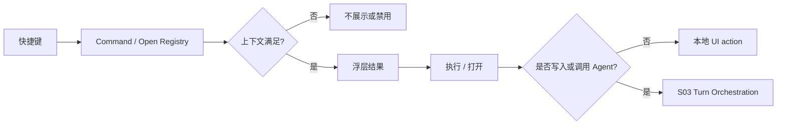

# M02 · Command Palette And Quick Open

Command Palette 和 Quick Open 是工作台的命令与高级打开入口。前者执行命令,后者在作者已经知道目标时打开对象;它们共享浮层视觉,但都不是第二个作者搜索入口。

## 两个入口

| 入口 | 快捷键 | 用户意图 | 结果 |
|---|---|---|---|
| 命令面板(Command Palette) | `Cmd+Shift+P` / `F1` | “我要做一个动作” | 执行命令或打开对应面板 |
| 高级打开(Quick Open) | `Cmd+P` | “我知道要打开哪个文件、章节、设定或最近项” | 按 id、路径、最近项或精确标题打开 |

`>` 前缀可以从 Quick Open 切到 Command Palette。反过来,命令面板不把文件搜索结果混入命令列表。Quick Open 只做高级打开和键盘路由,不做事实答案、语义召回或跨类型作者搜索;这些统一归 [M01 Universal Search](./M01-universal-search.md)。

## 路由关系

命令必须声明上下文、危险等级和是否进入 turn。Quick Open 只能打开或预览,不能偷偷触发写入,也不能把模糊搜索结果包装成对象搜索。

审批命令只能打开待审审批卡、跳到指定 cascade 项,或展示不可执行原因。Command Palette 不提供直接「全部同意」写入入口;任何批量接受都必须先让作者看到完整审批卡,并按 [M08 Approval Cascade](./M08-approval-cascade.md) 的风险语义完成确认。

ReaderPanel 有两个全局命令:「运行 ReaderPanel」在当前章节、选区或命令参数满足时进入 turn;「打开最近 ReaderPanel 报告」只打开已有报告。运行失败、无当前章节或最近报告不存在时,命令只展示可恢复提示,不能生成空报告或静默写盘。

## 快捷键与冲突收场

Command Palette 和 Quick Open 可以有全局入口,但不是全局抢键。快捷键命中后先经过 [S13](./S13-editor-and-interaction.md) 的焦点矩阵,再进入本篇的命令路由。

| 入口 | 冲突时优先级 | 收场 |
|---|---|---|
| `Cmd+Shift+P` / `F1` Command Palette | IME、modal、编辑器文本命令优先 | 不打开或延后打开,提示当前上下文占用 |
| `Cmd+P` Quick Open | 输入框、IME、modal 优先 | 不抢走正在输入的文本;只进入高级打开 |
| `Shift+Shift` Universal Search | IME 组合态和审批 focus trap 优先 | 只读上下文可打开;写入动作仍禁用 |
| 审批跳转快捷键 | pending approval 卡片优先 | 只打开/定位审批卡,不直接接受 |
| 危险命令快捷键 | 确认/审批优先 | 必须进入确认或审批卡,不能直接执行 |

快捷键登记失败、系统占用或用户重绑冲突时,命令仍应能从面板、菜单或按钮访问。冲突提示需要说明“入口不可用”还是“命令当前不可执行”;前者是触发方式问题,后者是上下文/权限问题。

## 与相邻能力

| 能力 | 分工 |
|---|---|
| [M01 Universal Search](./M01-universal-search.md) | 作者侧唯一顶层搜索入口,承载对象搜索、事实答案和语义相关结果 |
| [M03 Fact Query](./M03-fact-query.md) | 定义 Universal Search 内的结构化事实答案和来源查看能力 |
| [M04 Discuss Mode](./M04-discuss-mode.md) | 自然语言讨论和解释 |
| [S13 Editor And Interaction](./S13-editor-and-interaction.md) | 焦点、快捷键优先级和编辑器命令治理 |

## 失败收场

| 失败 | 用户看到 | 系统不能做 |
|---|---|---|
| 命令上下文不满足 | 命令隐藏或展示禁用原因 | 执行半有效动作 |
| 快捷键冲突 | 当前焦点优先,必要时提示冲突 | 抢 IME 或输入框 |
| 快捷键登记失败 | 显示可重绑和替代入口 | 隐藏命令能力 |
| 命令执行失败 | toast + Trace step | 假装命令已生效 |
| 危险命令 | 二次确认或进入审批 | 直接写盘 |
| 审批命令越权 | 打开审批卡或禁用并说明 | 绕过可见审批卡批量同意 |
| ReaderPanel 无上下文 | 空态 + 运行入口或选择章节提示 | 伪造最近报告 |

## Design

视觉和键盘细节见 [design/06](../design/06-command-palette.md)。本篇定义命令与打开入口的行为边界。

## 测试清单

| 类型 | 场景 |
|---|---|
| 快捷键 | `Cmd+Shift+P`、`F1`、`Cmd+P`、`>` 前缀切换 |
| 上下文 | pending approval、输入框聚焦、IME composition |
| 命令 | 危险命令必须确认或审批 |
| 审批 | 从命令面板打开待审审批卡(无快捷键),不直接同意 |
| ReaderPanel | 可运行当前章节,也可打开最近报告;无报告时空态 |
| 打开 | 最近项、路径、章节、设定、角色卡可预览和打开;模糊事实搜索不会出现在 Quick Open |

## FAQ

**Q: Command Palette 能不能替代 Universal Search?**

A: 不能。Command Palette 找动作,Universal Search 找对象、事实和语义结果;混在一起会让“执行命令”和“查看信息”的风险等级失真。

**Q: Quick Open 能不能触发写作或改设定?**

A: 不能。Quick Open 只打开或预览对象;任何写入、Agent 调用或危险操作都必须经命令路由进入 turn 或审批。

**Q: `Cmd+P` 保留后会不会变成第二个搜索入口?**

A: 不会。`Cmd+P` 是高级打开和键盘路由,只处理明确目标、最近项、路径或对象 id。作者想搜人物、事实、概念、伏笔或语义片段时只有 Universal Search。
