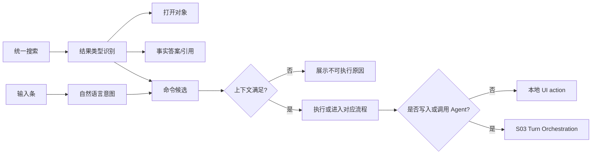

# M02 · Command Routing Inside Search And Input

M02 定义作者如何触发命令,但不再提供独立命令面板或 `Cmd+P` 快速打开入口。作者侧只有一个顶层搜索入口:[M01 Universal Search](./M01-universal-search.md)。命令、打开对象和历史动作都作为统一搜索的结果类型出现;自然语言命令也可以从输入条发起。

## 一个入口

| 入口 | 触发 | 承载内容 | 结果 |
|---|---|---|---|
| 统一搜索 | `Shift+Shift` 或顶部放大镜 | 章节、角色、设定、事实答案、引用、可执行命令、最近动作 | 打开、对照、查看来源、执行安全命令或进入对应审批/确认 |
| 输入条 | 右下状态点或 `Cmd+L` | 自然语言意图、`@` 引用角色或章节 | Discuss/Planning/Writing 路由 |

不再登记 `Cmd+P` 快速打开、`Cmd+Shift+P` 命令面板或 `F1` 命令面板作为作者入口。它们不能在真实用户包里出现,也不能作为“另一个搜索框”被原型保留。

## 路由关系

命令必须声明上下文、危险等级和是否进入 turn。统一搜索里的命令结果不能偷偷写盘;任何写入、Agent 调用、ReaderPanel 运行、proposal 生成、审批或 cancel plan 都必须进入对应 turn/approval 语义。

打开章节、角色卡、设定卡、最近对象和对照视图不生成 recap,也不写项目 Activity;最多更新最近访问。只有用户选择 Agent 执行、ReaderPanel、proposal、写入、审批或 cancel plan 时,才进入 [M17](./M17-turn-recap-and-continuation.md) 的 turn recap 触发矩阵。

审批命令只能打开当前待审审批卡、跳到指定连带修改项,或展示不可执行原因。统一搜索和输入条都不提供直接「全部同意」写入入口;任何批量接受都必须先让作者看到完整审批卡,并按 [M08 Approval Cascade](./M08-approval-cascade.md) 的风险语义完成确认。

pending approval 期间,统一搜索和输入条只保留只读能力:搜索、打开、跳转、查看过程、打开当前审批卡和进入只读讨论。会生成新 proposal、创建 ChangeSet、接受跨文档改写、切换到可写模式或改变当前审批前置条件的命令必须禁用并说明“先处理待审审批”。

ReaderPanel 相关命令作为统一搜索结果或输入条意图出现:「运行读者预演」要求当前有可读章节或选区,执行后进入 turn 并显示运行态;「打开最近读者报告」只打开已有报告。运行失败、无当前章节或最近报告不存在时,只展示可恢复提示,不能生成空报告或静默写盘。

## 快捷键与冲突收场

| 入口 | 冲突时优先级 | 收场 |
|---|---|---|
| `Shift+Shift` 统一搜索 | IME 组合态、modal、审批 focus trap 优先 | 不打开或延后打开;只读上下文可打开,写入动作仍禁用 |
| `Cmd+L` 输入条 | 输入框、IME、modal 优先 | 不抢走正在输入的文本;当前上下文不允许写入时显示只读讨论 |
| 审批跳转快捷键 | pending approval 卡片优先 | 只打开/定位审批卡,不直接接受 |
| 危险命令快捷键 | 确认/审批优先 | 必须进入确认或审批卡,不能直接执行 |

快捷键登记失败、系统占用或用户重绑冲突时,命令仍应能从统一搜索、输入条自然语言或明确按钮访问。冲突提示需要说明“入口不可用”还是“命令当前不可执行”;前者是触发方式问题,后者是上下文/权限问题。

## 与相邻能力

| 能力 | 分工 |
|---|---|
| [M01 Universal Search](./M01-universal-search.md) | 作者侧唯一顶层搜索入口,承载对象搜索、事实答案、语义相关结果和命令候选 |
| [M03 Fact Query](./M03-fact-query.md) | 定义 Universal Search 内的结构化事实答案和来源查看能力 |
| [M04 Discuss Mode](./M04-discuss-mode.md) | 自然语言讨论和解释 |
| [S13 Editor And Interaction](./S13-editor-and-interaction.md) | 焦点、快捷键优先级和编辑器命令治理 |

## 失败收场

| 失败 | 用户看到 | 系统不能做 |
|---|---|---|
| 命令上下文不满足 | 结果隐藏或展示禁用原因 | 执行半有效动作 |
| 快捷键冲突 | 当前焦点优先,必要时提示冲突 | 抢 IME 或输入框 |
| 快捷键登记失败 | 显示可重绑和替代入口 | 隐藏命令能力 |
| 命令执行失败 | toast + 过程记录 | 假装命令已生效 |
| 危险命令 | 二次确认或进入审批 | 直接写盘 |
| 审批命令越权 | 打开审批卡或禁用并说明 | 绕过可见审批卡批量同意 |
| pending 期间新 proposal | 命令禁用并提示先处理待审审批 | 在后台排出新的可写提案 |
| ReaderPanel 无上下文 | 空态 + 运行入口或选择章节提示 | 伪造最近报告 |

## Design

视觉和键盘细节见 [design/06](../design/06-command-palette.md)。本篇定义命令路由和打开入口的行为边界。

## 测试清单

| 类型 | 场景 |
|---|---|
| 入口唯一 | 真实用户包不显示独立命令面板、`Cmd+P` 快速打开或 `F1` 命令面板 |
| 快捷键 | `Shift+Shift` 打开统一搜索;`Cmd+L` 打开输入条;IME composition 中不抢键 |
| 上下文 | pending approval、输入框聚焦、IME composition |
| 命令 | 危险命令必须确认或审批 |
| 审批 | 从统一搜索打开待审审批卡,不直接同意 |
| pending 锁 | 待审期间只读打开/搜索/过程可用,新 proposal 命令禁用 |
| ReaderPanel | 运行当前章节进入 turn 并生成 recap;打开最近报告只读打开,无报告时空态 |
| 打开 | 最近项、章节、设定、角色卡可预览和打开,不生成 recap;事实搜索仍在 Universal Search 内完成 |

## FAQ

**Q: 为什么不保留独立 Command Palette?**

A: 作者只需要一个顶层搜索入口。把命令候选并入统一搜索,可以避免“搜对象”和“找命令”两个浮层抢入口;高风险命令仍通过上下文、确认和审批治理。

**Q: 为什么不保留 `Cmd+P`?**

A: 作品内容打开本质也是搜索。章节、角色、设定和最近项都进入 Universal Search,`Cmd+Enter` 仍可对照打开,但不再用第二个快捷键和第二个面板制造产品心智分裂。

**Q: 输入条能不能执行命令?**

A: 可以。输入条负责自然语言意图,例如“打开最近读者报告”或“切到规划姿态”;系统先解析为命令候选,再按上下文、风险和审批规则执行。
