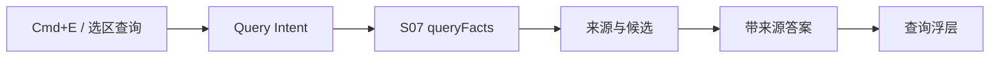

# M03 · Fact Query

Fact Query 是作者用 `Cmd+E` 或选区“查询”发起的结构化事实问答。它回答“项目里有没有这个事实、来源在哪”,不是让 Agent 自由讨论。

## 查询闭环

查询结果必须带来源或明确说明未找到。语义召回只能辅助找候选,不能单独成为项目事实。

## 查询类型

| 类型 | 示例 | 输出 |
|---|---|---|
| entity-at | “青岚现在在哪” | 状态、章节、来源 |
| relations-of | “青岚宗和玄门关系” | 关系边、来源 |
| mentions-of | “失明代价出现过几次” | 引用列表 |
| identity-of | “这里的青岚是不是岚儿” | entity 候选、别名状态、歧义来源 |
| semantic-search | “类似背叛伏笔的段落” | 可能相关片段 |

查询有时点语义。默认情况下,Fact Query 以当前阅读/编辑目标章节作为 `as-of chapter`:改写第 12 章时,“青岚现在在哪”应回答第 12 章可见状态,不能泄露第 40 章才发生的事实。查询浮层必须允许用户切换到“全书最新”或指定章节,并把时点显示在答案旁。

## 与 Search / Discuss 的边界

| 入口 | 重点 |
|---|---|
| [M01 Universal Search](./M01-universal-search.md) | 找对象并导航 |
| Fact Query | 回答事实问题 |
| [M04 Discuss Mode](./M04-discuss-mode.md) | 解释、取舍、建议和澄清 |

Fact Query 找不到答案时可以提供“转 Discuss”入口,但不能把 Discuss 的推测回写成事实答案。

## 失败收场

| 失败 | 用户看到 | 系统不能做 |
|---|---|---|
| 无来源 | “未在项目事实中找到” | 编造答案 |
| 索引过期 | 提示结果可能不完整 | 当作全项目已覆盖 |
| 时点缺失 | 要求选择目标章节或使用当前章节 | 默认用全书最新误导前文改写 |
| 实体歧义 | 展示候选和确认入口 | 自动合并同名对象 |
| 语义召回失败 | 精确查询仍可用 | 用空语义结果覆盖精确结果 |
| 查询过宽 | 要求缩小范围 | 静默截断关键来源 |

## Design

查询浮层形态见 [design/01](../design/01-main-layout.md) 与 [design/06](../design/06-command-palette.md)。完整工具参数归 [A04](./appendix/A04-tool-catalog.md)。

## 测试清单

| 类型 | 场景 |
|---|---|
| 来源 | 每个确定答案可跳来源 |
| 时点 | as-of chapter 与全书最新返回不同状态时明确标注 |
| 身份 | 同名实体查询展示候选,不自动合并 |
| 降级 | KG / semantic / stale index 分别提示 |
| 选区 | 框选查询预填文本且不污染正文 |
| 转 Discuss | 推测答案被标记为非项目事实 |

## FAQ

**Q: 找不到来源时能不能让模型补一个答案?**

A: 不能把模型推测展示成项目事实。可以转到 Discuss,但界面必须标明这是讨论推测,不是事实查询结果。

**Q: Fact Query 和 Universal Search 的最大区别是什么?**

A: Search 帮用户找到对象和来源;Fact Query 直接回答一个事实问题,所以它对来源和索引健康的要求更高。
