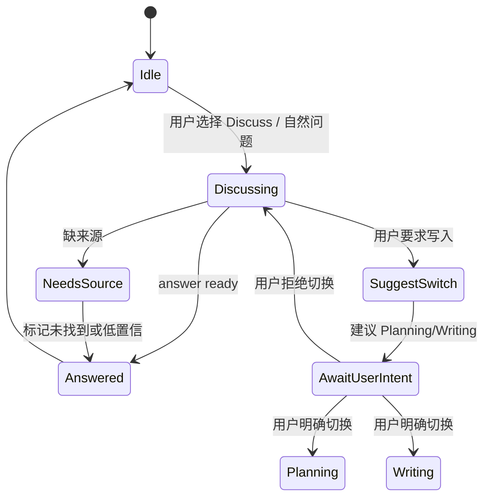

# M04 · Discuss Mode

Discuss Mode 是“只聊不写”的协作姿态。它允许作者和 Agent 讨论设定、剧情、风险、灵感和取舍,但不产生可落盘修改,也不悄悄改变项目事实。

## 什么时候进入 Discuss

Discuss 是作者不确定下一步时的默认安全区。它服务三类问题:

| 问题 | 用户期望 | 输出形态 |
|---|---|---|
| 解释事实 | “青岚宗上次出现在哪?” | 带来源的回答 |
| 讨论方案 | “主角要不要在这里暴露身份?” | 多方案、代价和风险 |
| 复盘过程 | “刚才为什么要改这个伏笔?” | Trace 摘要和决策解释 |

Discuss 的核心承诺是:作者可以自由试探想法,系统不会因为一句闲聊就写盘、改设定或创建审批卡。

## 能力边界

| 能做 | 不能做 |
|---|---|
| 回答问题、解释事实、提出建议 | 修改章节或设定文件 |
| 引用项目事实并给来源 | 把无来源推测当项目事实 |
| 生成候选思路 | 直接创建 ChangeSet |
| 建议切换到规划/写作 | 自动切换模式并执行 |

Discuss Mode 的输出是 answer 或 report,不是 proposal。

## 运行路径:只读问答链

Router 只能把 Discuss 标记为只读 action。即使用户在问题里写“顺手改掉”,也必须先回答需要切换到可写模式,不能在 Discuss 链路内补建 ChangeSet。

## 模式状态机

状态机的重点不是 UI 动画,而是写入门槛:只有用户明确切换到 Planning/Writing 或触发 cascade,系统才可以进入 proposal 路径。
如果用户拒绝升级或拒绝审批卡建议并选择“回讨论”,系统必须回到 Discussing,保留来源和拒绝理由作为本轮讨论材料,但不能把它写成项目事实或新 ChangeSet。

## Context 规则

| 材料 | 是否可用 | 约束 |
|---|---|---|
| 当前章节/选区 | 可用 | 只读引用 |
| 项目事实 | 可用 | 必须带来源 |
| 最近会话 | 可用 | 不能覆盖当前指令 |
| 用户经验 | 可用 | 只影响表达和建议风格 |
| 过程日志 | 按需 | 只用于解释“刚才发生什么” |

Discuss 的上下文包由 [S06 · Context Management](./S06-context-management.md) 提供。上下文不足时,Discuss 不能靠模型常识补成项目事实;它只能提出假设、追问或建议用户打开相关来源。

## 输出类型

| 输出 | 适用场景 | 必须包含 |
|---|---|---|
| Answer | 事实解释、定位问题 | 来源或未找到声明 |
| Options | 剧情/设定取舍 | 2-3 个可选方向和影响 |
| Risk Note | 守则或一致性风险 | 风险级别、触发原因、下一步 |
| Process Explanation | 解释刚才的 Agent 行为 | 对应 trace step 或 turn 事件 |
| Switch Suggestion | 用户要求写入 | 建议切换的模式和原因 |

Discuss 不输出 hidden prompt、工具参数或 JSON 细节;这些只在 Developer Mode trace 中可见。

## 升级路径:从聊到改

Discuss 可以建议进入其他模式,但必须由用户明确触发:

| 用户意图 | 下一步 |
|---|---|
| “把这个方案写进大纲” | 切 Planning Mode,生成 proposal |
| “按这个写一章” | 切 Writing Mode,生成草稿 proposal |
| “全书同步这个改动” | 进入 cascade / Approval Cascade |
| “只是聊聊” | 留在 Discuss |

升级时不能丢失上下文。系统应把本轮讨论摘要作为新 turn 的参考材料,但摘要不能自动成为项目事实。

pending approval 期间,Discuss 仍可作为只读讨论入口使用。作者可以追问“这批改动为什么影响第 18 章”“如果我拒绝第三项会怎样”或要求解释风险;系统只能回答、引用来源、打开相关位置,不能创建新 ChangeSet、修改当前审批卡、切换到可写模式或把讨论摘要写成项目事实。若用户在 Discuss 中说“那就顺手改掉”,Router 必须提示先处理当前审批或在审批结束后重新发起可写动作。

## 失败和可见结果

| 失败 | 用户看到 | 系统不能做 |
|---|---|---|
| 事实查询无来源 | “未在项目事实中找到来源” | 编造答案 |
| 用户要求直接写入 | “需要切换到规划/写作并由你审定” | 在 Discuss 中创建 ChangeSet |
| 上下文不足 | 澄清问题或标记为推测 | 把推测写入记忆 |
| 与项目事实冲突 | 冲突来源并列展示 | 替用户裁决哪个是真相 |
| 用户追问过程 | Trace 摘要可用则展示 | 用过程日志恢复业务状态 |
| 输出过长 | 先给结论和选项,可展开 | 静默丢掉关键风险 |

## Design

Discuss Mode 使用 [design/01 主界面](../design/01-main-layout.md) 的输入条;模式切换 UI 以 design 为视觉契约,行为边界以本篇和 [Turn Orchestration](./S03-turn-orchestration.md) 为准。

## 测试清单

| 类型 | 场景 |
|---|---|
| 只读边界 | Discuss 中的“帮我改掉”不会创建 ChangeSet |
| 来源 | 有来源回答展示引用;无来源回答明确未找到 |
| 升级 | 用户确认切换后,讨论摘要进入下一 turn 参考材料 |
| 回边 | 用户拒绝切换或审批建议后可回 Discuss,理由只作讨论材料 |
| 冲突 | 两个来源冲突时并列呈现,不自动裁决 |
| Trace | 过程解释能定位到 trace step,但不把 trace 当事实源 |
| 待审期间讨论 | 只解释和引用当前待审状态,不创建 ChangeSet |
| 焦点 | 输入条模式切换不破坏 IME 和 Esc 关闭层级 |

## FAQ

**Q: Discuss 里生成的一段设定能不能直接保存?**

A: 不能。它可以成为候选文本,但保存前必须切到规划/写作路径并由作者审定。

**Q: Discuss 是否需要 Trace?**

A: 需要轻量 Trace,至少解释用了哪些项目事实和是否有来源缺口。

**Q: Discuss 会不会学习我的随口偏好?**

A: 不会自动学习。只有 Reflector 在 turn 结束后明确沉淀的经验才进入记忆,且用户可见、可调、可删。

**Q: Search 里的“问问 Agent”会进入 Discuss 吗?**

A: 会。Universal Search 找不到项目对象时可以把问题带到 Discuss,但 Discuss 的回答必须标记来源状态,不能回灌成搜索结果。
