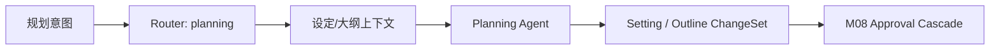

# M05 · Planning Mode

Planning Mode 是“只动设定和大纲,不动正文”的协作姿态。它让作者规划世界观、角色、卷纲、伏笔和章节路线,所有结果仍然以 proposal 形式进入审批。

## 模式承诺

| 可以 | 不可以 |
|---|---|
| 创建或修改设定 proposal | 直接改正文 |
| 生成大纲、角色卡、伏笔清单 | 静默落盘 |
| 触发影响分析 | 自动切到写作 |
| 解释规划取舍 | 把讨论推测写入事实 |

## 运行路径

Planning 的输出只影响设定、大纲和项目事实。若发现必须改正文,它生成影响说明并交给审批链路,不直接进入写作。

## 与其他模式

| 模式 | 边界 |
|---|---|
| [M04 Discuss](./M04-discuss-mode.md) | 只聊不写,可以升级到 Planning |
| Planning | 可生成设定/大纲 proposal |
| [M06 Writing](./M06-writing-mode.md) | 产出章节正文 proposal |

模式切换必须由用户显式触发,遵守 [S04](./S04-turn-orchestration.md) 的 turn 和 pending approval 语义。

## 失败收场

| 失败 | 用户看到 | 系统不能做 |
|---|---|---|
| 缺少设定来源 | 要求补材料或标记推测 | 生成确定事实 |
| 规划影响正文 | 展示影响范围 | 直接改正文 |
| pending approval | 模式锁定提示 | 开新可写 turn |
| 输出冲突 | 并列冲突来源 | 替用户裁决 |

## 测试清单

| 类型 | 场景 |
|---|---|
| 模式边界 | Planning 不写章节正文 |
| 审批 | 设定/大纲变更进入 ChangeSet |
| 升级 | Discuss 到 Planning 需要用户确认 |
| 冲突 | 冲突设定不静默覆盖 |

## FAQ

**Q: Planning 为什么可以改设定,但不能顺手改正文?**

A: 规划产物是设定、大纲和结构 proposal。正文属于 Writing 的输出面,跨过去会让模式边界和审批解释都失效。

**Q: Planning 生成的大纲能不能自动接受?**

A: 不能。它可以批量生成 proposal,但是否成为项目事实仍由作者审定。
