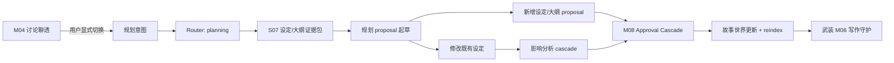

# M05 · Planning Mode

Planning Mode 是"只动设定和大纲,不创作正文"的协作姿态。本篇用"开新卷前的规划日"作为阅读骨架,讲清规划如何把一次世界级改动变成可审定的设定 proposal、改既有设定时连带影响怎么一次看全,以及规划产物如何反过来武装写作模式的守护能力。模式闸门与切换规则归 [S03](./S03-turn-orchestration.md),审批形态归 [M08](./M08-approval-cascade.md),本篇定义规划这条路径的能力闭环。

## 开新卷前的规划日

第三卷写完了,作者准备开第四卷:主角要进京、师门要分裂、还有两条卷初埋的伏笔要在新卷收掉。一次典型的规划日:

1. **先在讨论里聊透。** 拿不准的走向在 [M04 Discuss](./M04-discuss-mode.md) 先聊——全程零写入。聊出结论后作者显式切到 Planning;切换是用户动作,AI 只能建议(plan/07 R3)。
2. **结构先行。** 作者套一个结构模板(如三幕剧)生成第四卷大纲骨架,或用回照模板检查自己已有的卷纲哪里有节奏空洞(见下文"结构模板库")。
3. **设定与大纲 proposal。** 写手起草新卷的设定增量:新地点、新势力、师门分裂后的关系变化、两条伏笔的回收窗口。每一项都是 proposal,落不落由作者审定。
4. **改既有设定牵出 cascade。** "师门分裂"改的是已存在的关系网——一致性守护者按 [S06](./S06-context-management.md) 影响分析把波及的设定与章节一次找全,凑成带分组的 ChangeSet:主修改、机械一致性正文项、结构化事实、风险说明、低置信候选([M08](./M08-approval-cascade.md) 分组规则)。
5. **审批。** 作者整体通过、逐项取舍或改后通过。必须一起生效的一致性项不能拆开;搁置的低置信项变成 residual obligation,触碰 R4 时阻断后续写作。
6. **回执。** turn 终态生成 recap:"第四卷大纲已建立,师门关系已更新 12 处设定,2 条伏笔声明了回收窗口"([M17](./M17-turn-recap-and-continuation.md))。世界改一致了,作者切到 Writing 开写。

## 运行路径

Planning 的输出只影响设定、大纲、项目事实和同批机械一致性正文项。若发现必须做创作性正文修复,它生成影响说明和 Writing 前置项,不直接进入写作。

## 模式承诺

| 可以 | 不可以 |
|---|---|
| 创建或修改设定 proposal | 创作章节正文 |
| 生成大纲、角色卡、伏笔清单 | 静默落盘 |
| 触发影响分析 | 自动切到写作 |
| 解释规划取舍 | 把讨论推测写入事实 |
| 随设定审批处理称谓、旧名、直接引用、事实性短替换 | 重写场面、对白走向、情绪铺垫或读者感受 |

## 规划产物清单

规划日产出的每类东西都有明确的归宿和审批形态:

| 产物 | 落到哪里 | 审批形态 |
|---|---|---|
| 世界观 / 世界规则 | 设定文件,派生为 S06 concept | 设定 proposal,改既有规则触发 cascade |
| 角色卡 | 资料卡:弧光起止、读者承诺、禁忌、价值观与智力基线(plan/05) | 新建轻量审定;改既有角色牵出关系/章节影响 |
| 章节卡 | 资料卡:钩子类型、主线支线、里程碑、视角角色 | 轻量审定,可随写作修订 |
| 伏笔卡 | 资料卡:埋设位置、预计回收窗口、最晚安全点、状态 | 轻量审定;窗口声明进入 S06 dependency |
| 卷纲 / 大纲 | 大纲文件,卷边界进入 S01 项目结构 | 大纲 proposal;模板应用结果同此 |
| 故事线 / 关系声明 | 派生为 S06 relation / timeline | 显式声明才进守护范围(plan/05 约束 2) |

## 结构模板库

结构模板库是只读参照,不是守则。三幕剧、英雄之旅、起承转合、番茄黄金三章等模板可以帮助作者生成大纲、检查节奏空洞和回看章节承诺,但不能被系统当成"必须照做"的质量裁判。

| 用法 | 系统行为 |
|---|---|
| 应用模板 | 把模板节点映射成可编辑大纲 proposal |
| 回照模板 | 标记当前大纲和模板之间的缺口、重叠和偏离 |
| 混合模板 | 展示冲突和取舍,不自动拼接成唯一答案 |
| 放弃模板 | 保留作者大纲,不生成负面守则风险 |

模板应用结果进入 Approval Cascade。模板回照只生成报告或建议,除非用户明确要求把某个节点写入大纲 proposal。Writer 使用模板时只能把它作为结构参考,不能用模板覆盖项目事实、人物动机或用户当前指令。

## 改既有设定:影响一次看全

新建设定通常是轻量审定;修改既有设定才是规划模式的重头戏。"林川的师父从张三改成李四"这类改动,影响分析必须在审批前完成并收敛成一个批次([S03](./S03-turn-orchestration.md) cascade 语义):

- 命中范围来自 S06 图谱候选 + LLM 复核,每条连带项带来源锚点和命中理由;无来源的模型扩展只能作为低置信建议。
- 跨章节大范围 cascade 先过 preflight:预计范围、是否分批、等待区间、取消停在哪里,作者确认后才启动。
- 牵动正文的机械一致性项作为同一批 ChangeSet 的正文项进入审批,范围限于称谓、旧名、直接引用、事实性短替换这类可由既有事实直接推出的改动——**审定动作发生在审批卡里,不需要也不允许切到写作模式去"改正文"**;这正是"全项目改名整批走审批"的产品承诺(plan/05)。
- 若命中正文后需要重写场面、补情绪、改对白走向、调整叙事节奏或重塑读者感受,Planning 只能生成只读影响说明和 Writing 前置项,不能生成创作性正文 proposal。

## 规划产物如何武装写作

规划不是归档作业,它直接决定写作模式的守护精度:

| 规划产物 | 喂给谁 | 写作时的效果 |
|---|---|---|
| 伏笔卡的回收窗口 | [S05](./S05-knowledge-graph.md) dependency 的 expected_window / latest_safe_point | [S11](./S11-creative-engine.md) 守则四"期待感兑现"据此判 due/overdue;没有窗口只提示"未声明回收计划",不会误阻断 |
| 角色卡的弧光与禁忌 | 守则检测与弧光追踪 | "人设不崩"检查有了基线;行为偏离禁忌/价值观时带来源报风险 |
| 章节卡的钩子类型 | 审稿人叙事诊断 | 章末钩子立没立住有了对照标准 |
| 卷纲与卷边界 | [S06](./S06-context-management.md) long-form partition | 写作备料按卷切片,跨卷必装事实有了权威结构 |
| 审定后的关系/规则 | 故事世界(R8 唯一事实源) | 所有 AI 角色对齐同一份事实写作 |

填得越准,守护越准——这是 plan/05 资料卡承诺在技术路径上的兑现。

## "规划不创作正文"的具体体验

规划过程中发现正文本身需要创作性修复(不是称谓、旧名、直接引用、事实性短替换,而是"第 12 章这场戏得重写才能支撑新设定")时:

- 系统生成只读影响说明:哪些章节、为什么、改动方向建议,不生成正文 proposal。
- 说明可以转成 residual obligation 留在项目状态里;作者切到 Writing 后,该 obligation 出现在写作上下文和风险解释中。
- 反过来,写作模式发现设定要先改时进入 blocked-by-planning([S03](./S03-turn-orchestration.md) 跨模式前置),正文 proposal 停等规划前置审定。两个方向共同保证:设定与正文永远不混成一批偷偷落笔。

## 与其他模式

| 模式 | 边界 |
|---|---|
| [M04 Discuss](./M04-discuss-mode.md) | 只聊不写,可以升级到 Planning |
| Planning | 可生成设定/大纲 proposal,只同批审批机械一致性正文项 |
| [M06 Writing](./M06-writing-mode.md) | 产出章节正文 proposal,不碰设定 |

模式切换必须由用户显式触发,遵守 [S03](./S03-turn-orchestration.md) 的 turn 和 pending approval 语义:有待审事项时模式锁定,先审完再切。

## 失败收场

| 失败 | 用户看到 | 系统不能做 |
|---|---|---|
| 缺少设定来源 | 要求补材料或标记推测 | 生成确定事实 |
| 规划影响正文 | 只读影响说明和方向建议 | 直接改正文或生成正文 proposal |
| 影响分析低置信 / 漏召回风险 | 低置信项显式降权,可打开来源判断 | 把未验证范围说成"已全书检查" |
| cascade 不收敛 | 建议拆分或人工确认,展示已发现范围 | 边发现边落盘、无限递归 |
| pending approval | 模式锁定提示 | 开新可写 turn 或静默切换 |
| 输出冲突 | 并列冲突来源,等作者裁决 | 替用户裁决或静默覆盖 |
| 审批落盘失败 | "接受未生效",按 S04 收场 | 留下设定半改的中间态不解释 |

## 用户可见结果

一次规划 turn 结束后,作者能看到:

- 审批卡:主修改、连带分组、来源锚点、风险分级(提示级/确认级/阻断级)。
- 更新后的故事世界:资料卡、大纲、关系网,随点随查。
- recap:改了哪些设定、波及多少处、哪些项被搁置([M17](./M17-turn-recap-and-continuation.md))。
- 搁置项作为 residual obligation 持续可见;触碰 R4 的未决项会阻断写作,直到解决或明确拒绝。

## 测试清单

| 类型 | 场景 |
|---|---|
| 模式边界 | Planning 不写章节正文;发现正文需改时只产出只读说明 |
| 审批 | 设定/大纲变更进入 ChangeSet;连带正文称谓在同批审定,不要求切模式 |
| 模板 | 应用模板生成大纲 proposal;回照模板不写盘、不进入守则阻断 |
| 产物联动 | 审定后的伏笔窗口能触发 S12 due/overdue;角色卡禁忌进入人设检查 |
| 升级 | Discuss 到 Planning 需要用户确认 |
| 冲突 | 冲突设定不静默覆盖 |
| 收场 | cascade 不收敛时升级人工确认;搁置 R4 项进入 writing-blocked |

## FAQ

**Q: Planning 为什么可以改设定,但不能顺手改正文?**

A: 规划产物是设定、大纲和结构 proposal。正文属于 Writing 的输出面,跨过去会让模式边界和审批解释都失效。唯一例外是改设定牵出的正文连带项(如称谓替换):它们在同一张审批卡里被审定,但那是审批动作,不是规划模式在写正文。

**Q: Planning 生成的大纲能不能自动接受?**

A: 不能。它可以批量生成 proposal,但是否成为项目事实仍由作者审定。

**Q: 不声明伏笔回收窗口会被惩罚吗?**

A: 不会。没有窗口的伏笔只会收到"未声明回收计划"的提示级提醒;只有作者明确给了窗口,系统才会在接近或越过窗口时按确认级/阻断级守护([S11](./S11-creative-engine.md))。

**Q: 规划时能不能引用讨论里聊出的结论?**

A: 可以作为起草材料,但讨论推测不是项目事实。只有进入 proposal 并经作者审定的内容才写入故事世界(R8)。
