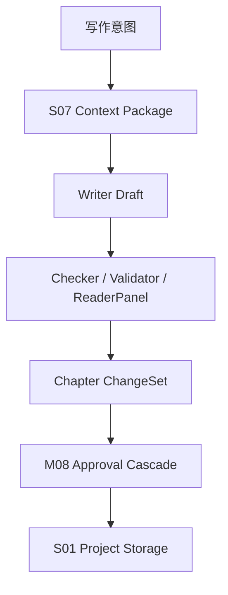

# M06 · Writing Mode

Writing Mode 是正文生产姿态。它负责章节概要、章节正文、续写和审稿流水线,但最终仍然只产生可审批 proposal。

## 写作流水线

Writing 必须装齐一致性材料。装不齐时显式失败或要求分卷,不能为了继续生成而静默裁剪关键上下文。

## 输出类型

| 输出 | 说明 | 是否写盘 |
|---|---|---|
| Chapter Outline | 章节概要 proposal | 审批后 |
| Chapter Draft | 正文 proposal | 审批后 |
| Continuation | 当前章节续写 proposal | 审批后 |
| Review Report | 审稿/守则/读者风险 | 否,作为审批说明 |

## 失败收场

| 失败 | 用户看到 | 系统不能做 |
|---|---|---|
| Context overflow | 提示需要分卷或缩小范围 | 静默省略一致性材料 |
| Writer 输出重复 | doom-loop 升级 | 无限重试 |
| 守则 blocking | 审批卡阻断说明 | 直接落盘 |
| ReaderPanel 失败 | 报告 unavailable / inconclusive | 生成假报告 |

## Design

写作入口位于 [design/01](../design/01-main-layout.md) 的输入条。审批聚合见 [design/02](../design/02-approval-cascade.md)。

## 测试清单

| 类型 | 场景 |
|---|---|
| 上下文 | 必装材料缺失时失败可见 |
| 审稿 | 三路报告聚合到一次审批 |
| 收场 | 审批后失败按 S04 收场 |
| 模式 | Writing 不改设定文件 |

## FAQ

**Q: Writing Mode 会不会直接把正文写进章节文件?**

A: 不会。它先生成章节 proposal 和审稿说明,作者接受后才进入落盘。

**Q: ReaderPanel 失败是否阻断正文生成?**

A: 不伪造报告。系统可以把 ReaderPanel 标为 unavailable / inconclusive,但如果缺失会影响守则判断,审批卡必须明确说明。
