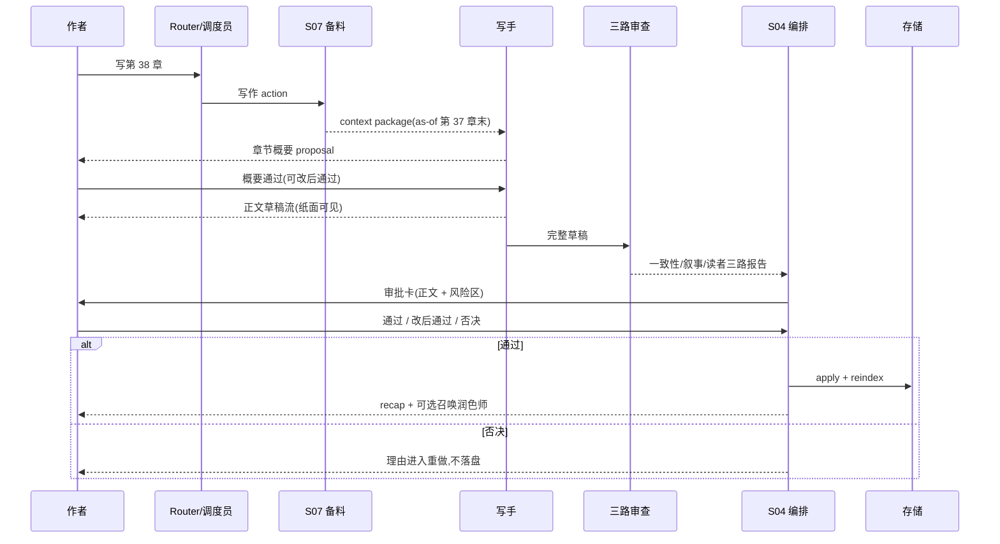

# M06 · Writing Mode

Writing Mode 是正文生产姿态,也是 plan/01 的招牌路径:"章节概要 → 正文 → 去 AI 化,一条流水线"。本篇用"写一章的一天"作为阅读骨架,讲清这条流水线每一步停在哪里、谁在干活、作者看见什么、失败怎么收场。它产出的一切仍然只是可审批 proposal:turn 生命周期归 [S03](./S03-turn-orchestration.md),审批 UI 归 [M08](./M08-approval-cascade.md),本篇定义的是写作这条主路径如何把它们串成作者可感知的体验。

## 写第 38 章的一天

作者在输入条里说:"按大纲写第 38 章,林川和王小芳在码头摊牌。"接下来发生的事:

1. **调度员拆动作。** Router 把这句话路由成结构化写作 action([S03](./S03-turn-orchestration.md))。如果同一句话还带了"顺便看看第 37 章节奏",会被拆成两个动作排队,队列语义见 plan/07。
2. **写前备料。** S07 按"第 38 章"装配证据包:本章目标、第 37 章结尾状态、林川和王小芳的关系与 as-of 第 37 章末的状态、到了回收窗口的伏笔、世界规则和已触发守则。材料装不齐时显式失败或建议缩小范围,绝不静默裁剪([S06](./S06-context-management.md) 优先级阶梯与 overflow 决策)。
3. **概要先行。** 写手先产出章节概要 proposal:本章节拍、冲突推进、章末钩子。概要是轻量审定——作者通过、改后通过或否决,否决理由进入重做。
4. **正文起草。** 概要审定后写手起草正文。草稿以流式文本落在纸面上,作者看着字一行行长出来——但这是草稿流,不是作品事实([S04](./S04-streaming-ui-protocol.md) 流式红线,见下文)。
5. **三路审查并行。** 草稿完成后,一致性守护者(Validator)查事实矛盾、审稿人(Checker)做叙事诊断、读者评审团(ReaderPanel)预演弃读风险。三路汇入同一张审批卡的风险区([S11](./S11-creative-engine.md) 质检汇合)。
6. **审批。** 作者在审批卡上看到正文 diff、三路报告和风险分级,整体通过、改后通过或否决。
7. **落盘与回执。** 通过后进入 Applying,落盘并局部 reindex,turn 终态生成 recap:"第 38 章已写入,3200 字,1 条伏笔接近回收窗口"([M17](./M17-turn-recap-and-continuation.md))。
8. **可选去 AI 化。** 作者召唤润色师把成稿去 AI 味,逐处前后对照,走 inline review 或升级审批([M07](./M07-inline-rewrite-and-humanizer.md)、[S12](./S12-style-and-humanizer.md))。

## 端到端泳道

## 概要与正文的关系

概要不是内部草稿,而是第一个可审定 proposal。它的存在让作者在最便宜的时刻纠偏:否决一段概要的成本远低于否决三千字正文。

| 场景 | 系统行为 |
|---|---|
| 概要通过后写正文 | 概要成为本章写作的直接依据,与章节卡(plan/05)一起进入 Writer 证据包。 |
| 作者修订概要后通过 | 以作者修订版为准起草正文;修订版若引入事实变化,按 EditedAccepted 轻量重检([S03](./S03-turn-orchestration.md))。 |
| 正文审批时偏离已审概要 | 偏离点作为风险说明出现在审批卡,作者裁决以哪个为准;系统不静默改回概要。 |
| 跳过概要直接写正文 | 允许。作者明确要求"直接写"时不强制概要步骤,但正文 proposal 仍要走完整三路审查和审批,省的只是一次轻量审定,不是审查。 |
| 事后修订概要 | 已落盘正文不自动跟着改;修订概要生成新 proposal,若影响既有正文则提示差异。 |

## 草稿落在纸面:流式可见但不是事实

正文起草时作者看到的是草稿流:文字逐段出现在纸面上,可随时取消。这层体验受 [S04](./S04-streaming-ui-protocol.md) 红线约束:

- 草稿流是运行中的输出片段,完整结果通过校验后才成为待审 proposal;半截输出永远不会被当作"已写好"。
- 刷新、断线不会丢任务:UI 从持久 turn 状态恢复,不会重跑写手。
- 取消时机决定收场:还在生成则丢弃未完成输出、生成 stopped recap;已形成 pending ChangeSet 则进入 S04 cancel plan。取消前已完成的只读结果(如已出的两份读者反应)保留可看。

## 三路审查与质量汇合

审查不是后台附加报告,而是审批卡打开的前置条件。[S03](./S03-turn-orchestration.md) 的质量汇合点规定:Validator 一致性复核、Checker 叙事诊断和 ReaderPanel 风险要么完成并带证据汇入同一张卡,要么以 `unavailable` / `inconclusive` / `needs data` 显式标记进入卡片;阻断级风险未解决时正文不能进入可接受状态,系统不能先开卡再后台补阻断级结论。

| 审查路 | 看什么 | 风险如何呈现 |
|---|---|---|
| 一致性守护者 | 草稿与故事世界的事实矛盾、未关闭 obligation | 冲突点带来源章节锚点,阻断级未解决不可落盘 |
| 审稿人 | 节奏、爽点密度、章末钩子、承诺推进 | 标到稿面具体位置,提示级/确认级为主 |
| 读者评审团 | 多 persona 弃读点、疑惑点 | 风险视角,样本不足输出 inconclusive,不给总分 |

风险分级的落地语义(提示级可忽略、确认级须知情、阻断级不落盘)归 [S11](./S11-creative-engine.md),本篇不重复定义。

## 写到一半发现设定要改

写第 38 章时发现"摊牌要成立,林川和王小芳的初遇章节得先改"——这是写作模式最常见的越界诱惑。按 [S03](./S03-turn-orchestration.md) 跨模式前置规则,Writing 不能把设定修改塞进写作 ChangeSet:

- 正文 proposal 被标记 **blocked-by-planning**,停在待处理状态,不进入 Applying。
- 作者看到一条只读说明:"这章成立需要先改 X 设定",附规划前置入口;切到 Planning 审定设定改动后,正文 proposal 才能继续。
- 必须同批原子的情况拆成"规划前置审批 → 写作审批"两步;前一步未生效时正文只能保留草稿/预览。
- 作者拒绝规划前置时,对应正文 proposal invalidated 或降级为只读建议。

用户体验上这不是报错,而是产品立场:不把创作和补救搅在同一批里(plan/07 "一界管一事")。

## 接收 Planning 的正文前置项

Planning 改设定时可以随批处理机械一致性正文项,但不会创作正文。若规划审批留下"这场戏需要重写才支撑新设定"这类前置项,Writing 接手的是已审定事实和只读影响说明,不是半成品正文:

| 来源 | Writing 行为 |
|---|---|
| 称谓、旧名、直接引用、事实性短替换已随 Planning 审批生效 | 按最新事实继续写作,不重复生成同类机械 proposal |
| Planning 留下创作性正文前置项 | 起草新的正文 proposal,经三路审查和审批 |
| Planning 只给方向建议 | 方向建议作为 context,不能自动成为作品事实 |
| 作者拒绝规划前置 | 对应正文任务保持 blocked 或降级为只读建议 |

## 与续写、重写、框选改写的分工

| 作者意图 | 走哪条路 | 为什么 |
|---|---|---|
| 续写当前章 / 写新章 | Writing 流水线 | 需要完整备料、三路审查和审批 |
| 整章或大段重写 | Writing 流水线 | 同上;重写本质是新正文 proposal |
| 框选一句话改表达 | [M07](./M07-inline-rewrite-and-humanizer.md) inline review | 只改表达层,近文批注接受即生效,不必开审批卡 |
| 框选改写但牵动剧情/事实 | 升级进 Writing 流水线 | 改变读者理解到的事实就不再是润色([S12](./S12-style-and-humanizer.md) 越权判定) |
| 成稿后整章去 AI 化 | 润色师,逐处对照 | 表达层批量改写,按范围走 inline review / 段落批阅 / cascade |

经验法则:只动"怎么说"用 M07 的轻路径;动"发生了什么"进本篇流水线。

## 输出类型

| 输出 | 说明 | 是否写盘 |
|---|---|---|
| Chapter Outline | 章节概要 proposal,轻量审定 | 审批后 |
| Chapter Draft | 正文 proposal,经三路审查 | 审批后 |
| Continuation | 当前章节续写 proposal | 审批后 |
| Review Report | 审稿/守则/读者风险 | 否,作为审批说明 |

## 失败收场

| 失败 | 用户看到 | 系统不能做 |
|---|---|---|
| Context overflow | 提示需要分卷或缩小范围,说明保留了哪些必装事实 | 静默省略一致性材料 |
| 写手输出重复(doom-loop) | 系统停止自动重做并升级,摆出分歧由作者裁定 | 无限重试 |
| 守则阻断级风险 | 审批卡阻断说明,带来源和检查范围 | 未解决直接落盘 |
| ReaderPanel 失败 | 报告标记 unavailable / inconclusive | 生成假报告或显示"通过" |
| 正文依赖设定先改 | blocked-by-planning 说明和规划入口 | 把设定改动混进写作 ChangeSet |
| 审批后落盘失败 | "接受未生效,可重试/取消",按 S04 收场 | 留下半批修改不解释 |
| 生成中取消 | 丢弃未完成输出,保留已完成只读结果,stopped recap | 把取消计入失败或丢掉已出的报告 |

## 用户可见结果

一轮写作结束后,作者能看到的全部结果:

- 纸面上的正文(仅在审批通过后才是作品事实)。
- 审批卡及三路报告(含每条风险的来源位置)。
- recap:本章写了什么、改了什么、哪些风险被搁置、下一步入口([M17](./M17-turn-recap-and-continuation.md))。
- 被搁置的低置信项作为 residual obligation 持续可见,触碰 R4 时阻断继续写作。

## Design

写作入口位于 [design/01](../design/01-main-layout.md) 的输入条;草稿流落在纸面;审批聚合见 [design/02](../design/02-approval-cascade.md)。

## 测试清单

| 类型 | 场景 |
|---|---|
| 上下文 | 必装材料缺失时失败可见;as-of 章节时点正确 |
| 概要 | 概要 proposal 轻量审定;跳过概要不跳过审查;修订概要不静默改正文 |
| 草稿流 | 流式草稿不被当作事实;断线恢复不重跑写手 |
| 审稿 | 三路报告聚合到一次审批;缺失报告显式标记不可用 |
| 跨模式 | 正文依赖设定时进入 blocked-by-planning,不混批落盘 |
| 轻量重检 | 修改后接受会重新检查被改 item 和阻断级风险 |
| 收场 | 审批后失败按 S04 收场;取消保留已完成只读结果 |
| 模式 | Writing 不改设定文件 |

## FAQ

**Q: Writing Mode 会不会直接把正文写进章节文件?**

A: 不会。它先生成章节 proposal 和审稿说明,作者接受后才进入落盘。纸面上流动的草稿只是运行中输出,不是作品事实。

**Q: 概要是不是必经步骤?**

A: 不是强制。作者可以要求直接写正文,但三路审查和审批一步都不会少;概要的价值是让纠偏发生在最便宜的时刻。

**Q: ReaderPanel 失败是否阻断正文生成?**

A: 不伪造报告。系统可以把 ReaderPanel 标为 unavailable / inconclusive,但如果缺失会影响守则判断,审批卡必须明确说明。

**Q: 框选改一句话为什么不开审批卡?**

A: 只改表达层的小选区走 [M07](./M07-inline-rewrite-and-humanizer.md) 近文批注,接受动作仍然存在,只是交互更轻;一旦牵动事实或跨文档,就回到整批审批。

**Q: 写作时发现伏笔到期了会怎样?**

A: 备料阶段就会把到窗口的伏笔装进证据包;overdue 的伏笔按 [S11](./S11-creative-engine.md) 兑现窗口规则默认阻断级,继续写作前必须回收、改窗口、拆分承诺或明确 dismiss。
