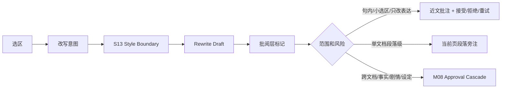

# M07 · Inline Rewrite And Humanizer

Inline Rewrite 和 Humanizer 是表达层改写能力。用户框选文字或主动请求“去 AI 味”时,系统可以改表达,但不能借润色改变剧情事实。

## 两种入口

| 入口 | 快捷键/位置 | 目标 |
|---|---|---|
| Inline Rewrite | `Cmd+K` 框选改写 | 局部语句重写 |
| Humanizer | 输入条或 ReaderPanel 风险入口 | 去套话、降 AI 味、贴近作者风格 |

入口受当前模式闸门约束:Discuss 只能解释和预览,不能接受替换;Planning 只能对设定/大纲文本提出可审定建议,不能改正文;Writing 允许正文 inline review 和 Humanizer。存在 pending approval、writing-blocked obligation、文件版本需要重新校验或项目记录处于 S16 保护状态时,接受动作禁用,只读查看和复制仍可用。

## Inline Review 是默认路径

Inline Rewrite 的默认体验不是审批卡,而是正文批阅层。系统在原文附近用克制的修订痕迹、近文小注和极轻操作解释“建议改哪里、为什么、是否安全”。作者接受后才 `replaceRange`,并进入编辑器 undo 栈。

改写只能改变表达层。角色关系、事件顺序、设定事实、伏笔含义发生变化时,必须升级为剧情/设定 proposal,不能继续叫润色。

## 三层批阅范围

| 范围 | 当前正文显示 | 决策位置 | 典型动作 |
|---|---|---|---|
| 句内 / 小选区 | 细下划线、轻底色、删除线/新增线、近文小注 | 文字附近 | 接受、拒绝、重试 |
| 单文档段落级 | 段落轻标记;必要时使用当前页旁注 | 当前文档内 | 展开段落建议、接受安全项 |
| 跨文档 / 跨章节 | 当前命中位置只显示轻量锚点和 cascade 编号 | [M08 Approval Cascade](./M08-approval-cascade.md) | 查看整批、逐项审定 |

跨文档变更不能在当前页旁注里解释或裁决。当前页只负责告诉作者“这里是整批变更命中的一处”,点击后跳到 Approval Cascade 的对应项。

批阅层未决标记有独立生命周期,不能只靠 DOM 状态存在。句内/段落建议在用户接受、拒绝、重试、升级为 cascade、来源失效或选区被外部编辑覆盖前都保持 pending;刷新、切换章节或重启项目后,仍应能恢复到“建议仍待处理”“需要重新校验”或“来源已失效”。接受前的版本校验、重基准和失效规则以 [S16](./S16-file-version-and-edit-safety.md) 为准。接受后的标记进入 editor undo bridge;拒绝后保留最小记录供 Trace/Recap 解释,但不再作为待办提醒。

## 失败收场

| 失败 | 用户看到 | 系统不能做 |
|---|---|---|
| 选区过大 | 要求缩小范围或转 Writing | 静默截断 |
| 改写越权 | 标记剧情/事实变化 | 当作润色通过 |
| 跨文档影响 | 当前命中处标记 cascade 锚点 | 在当前页旁注里裁决 |
| 风格来源不足 | 使用默认轻润色并说明 | 伪造作者风格 |
| diff 生成失败 | 保留原文和请求 | 直接替换 |
| 文件已外部修改 | 显示需要重新校验或重新生成 | 把旧 diff 强行套到新选区 |
| 未决标记恢复失败 | 显示建议不可恢复并保留原文 | 悄悄清掉待处理项 |

## Design

框选改写见 [design/06](../design/06-command-palette.md)。风格设置入口见 [design/04](../design/04-settings.md)。

## 测试清单

| 类型 | 场景 |
|---|---|
| diff | 原文和改写可对照 |
| 越权 | 剧情变化被拦截 |
| inline review | 句内表达改写在近文小注接受后才 replaceRange,并可 editor undo |
| 未决标记 | 刷新/切章/重启后 pending、accepted、rejected、invalidated 状态可解释 |
| 文件版本 | 选区被外部编辑覆盖后 suggestion 失效;可重定位时先重新校验再允许接受 |
| cascade | 跨文档命中只显示锚点,决策进入 Approval Cascade |
| 风格 | 经验关闭后不注入对应偏好 |

## FAQ

**Q: 选区改写是不是可以比章节写作更快地落盘?**

A: 可以更快,但不能绕过接受动作。大多数局部润色走 inline review:用户在文字附近看到修订痕迹和说明,明确接受后才替换选区。

**Q: 去 AI 味能不能顺手补剧情逻辑?**

A: 不能。补剧情逻辑已经改变事实或事件因果,必须升级为写作或规划 proposal。
