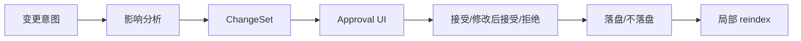
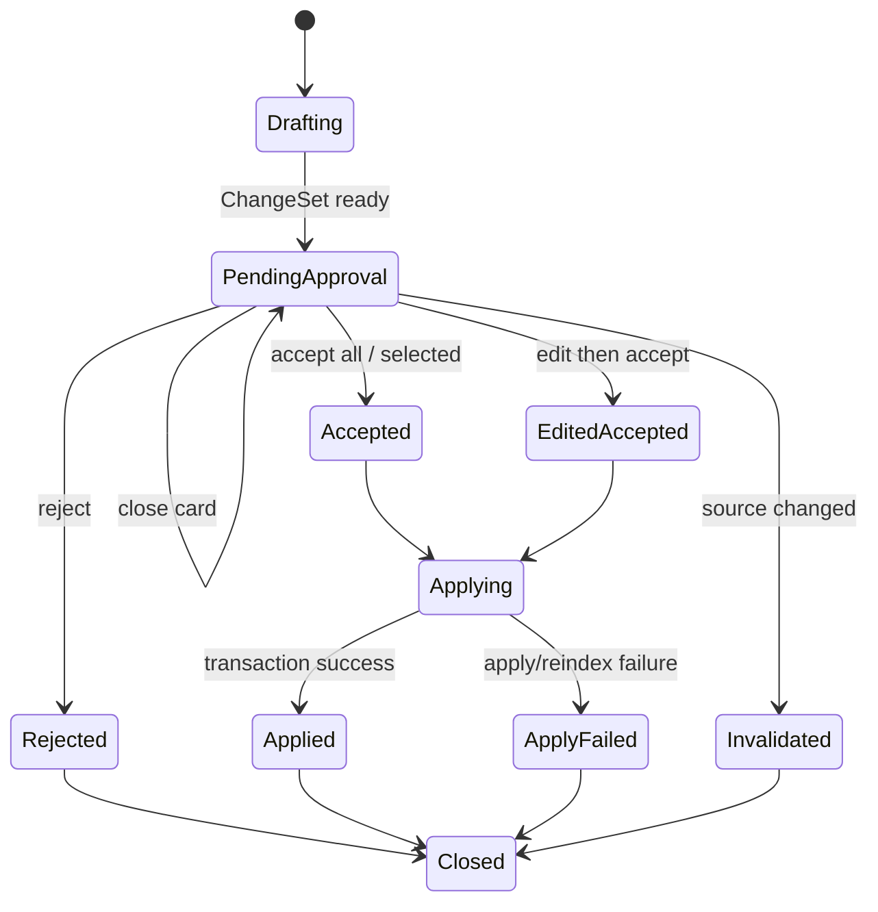

# M08 · Approval Cascade

Approval Cascade 是“改一处,连带影响一次看全审完”的能力。根层 [Turn Orchestration](./S03-turn-orchestration.md) 定义 ChangeSet 和生命周期;本篇定义用户如何审、系统如何解释一批修改。

## 用户问题

作者真正关心的不是“系统能不能批量改”,而是:

| 问题 | Approval Cascade 的回答 |
|---|---|
| 这个改动还会牵连哪里 | 在审批前完成影响分析并分组 |
| 为什么牵连这些地方 | 每条连带修改带来源、锚点和命中理由 |
| 我能不能只接收一部分 | 可以逐项裁决,但必须一起生效的改动不能拆开 |
| 出错后怎么办 | 展示最终状态和可修正路径 |

## 审批闭环:先看全,再落盘

所有会写入项目的 cascade 都必须先形成 ChangeSet。影响分析可以递归,但递归结果必须收敛成一个可审批批次,不能一边落盘一边继续发现新影响。

## 审批状态

关闭审批卡不是拒绝。Pending 状态保留,直到用户明确接受、修改后接受、拒绝或取消 turn。
内部事务可以做恢复处理,但用户侧只看到“未生效”“已生效但需要修正”或“需要人工处理”。

用户侧状态只做投影,不重新发明 S04 的 turn 终态词汇。`ApplyFailed` 对作者意味着“本批没有形成完整可靠结果,需要恢复或人工处理”,不能被 UI 简化成普通 `Closed`;`Invalidated` 表示审批依据已经过期,例如来源段落、文件版本、dependency group 或阻断级风险证据在待审期间被改变。Invalidated 卡片只能查看、复制理由、重新分析或放弃,不能继续接受。

`EditedAccepted` 不是绕过质检的快捷键。用户在卡内修改后接受时,系统必须对被改 item 和受影响 group 执行轻量重检:检查锚点仍指向同一语义位置、dependency group 没有被拆散、阻断级风险是否仍存在、用户修改是否引入新的事实/剧情/设定变化。轻量重检通过后才能进入 Applying;若阻断级风险已经被用户修改解决,审批卡必须把风险标记为“已解决并附证据”,而不是仅记录“用户确认”。轻量重检失败时,卡片回到 PendingApproval 或 Invalidated,并说明需要重新生成 proposal。

## 审批卡必须解释什么

| 内容 | 为什么 |
|---|---|
| 主修改 | 用户知道本批次核心意图 |
| cascade 分组 | 用户知道哪些是连带影响 |
| 来源和锚点 | 用户能追溯为什么命中 |
| 守则风险 | 高风险必须显性确认 |
| 可选项 | 用户能逐条接受/拒绝 |
| 修正范围 | 出错后知道哪些内容未生效、哪些内容需要反向修改或人工处理 |

## 分组规则

| 分组 | 例子 | 审批重点 |
|---|---|---|
| Primary Change | “青岚宗改名为玄岚宗” | 是否接受主意图 |
| Direct Mentions | 章节正文出现的旧名 | 是否替换文字 |
| Structured Facts | entity alias、relation、timeline | 是否更新项目事实 |
| Risk Notes | 守则冲突、设定冲突 | 是否需要人工改写 |
| Low Confidence | 锚点不稳、语义召回命中 | 默认不自动选中 |

低置信项不能混在普通连带修改里自动通过。它们必须显式降权,并允许用户打开来源判断。

## 部分通过与待处理项

Approval Cascade 支持部分通过,但只支持在独立 dependency group 之间部分通过。系统必须把每个 group 的生效边界展示清楚:哪些 item 是主修改的必需一致性项,哪些只是可搁置的低置信建议。

| 用户动作 | 系统状态 |
|---|---|
| 接受 group | group 内 item 一起落盘,不能只落主修改。 |
| 不勾选独立低置信项 | 该项变成 residual obligation,进入 Recap、Trace 和后续 Validator。 |
| 不勾选必需一致性项 | 当前 group 不能通过;若触碰 R4,进入 writing-blocked。 |
| 拒绝 item 并给理由 | obligation 关闭或转为重做输入,理由保留。 |
| 修改后接受 | 用户编辑内容成为本次落盘版本,仍按 group 边界校验。 |

Residual obligation 必须让作者看得见:它说明被搁置的内容、为什么仍需处理、是否阻断继续写作、下次在哪里重新出现。系统不能把“低置信未勾选”悄悄当成已经解决。

Residual obligation 的用户侧生命周期是 `open` -> `snoozed` / `resolved` / `dismissed` / `invalidated`。同一来源、同一风险类型、同一目标锚点和同一 dependency group 的 obligation 必须去重为一条活跃项,再次命中时只追加证据和最近出现位置。`resolved` 需要新的审批结果、直接编辑后的复核或用户明确标记;`dismissed` 需要理由;`invalidated` 只表示来源已不存在,不是风险已解决。M10 提供全局清单入口,M17 在 recap 和 Activity 时间线中展示本轮新增、解决和失效的 obligation。

## 动作队列与重做回路

Pending approval 可以有多张卡排队,但同一时刻只有一张获得可写决策焦点。队列至少区分三类动作:

| 队列动作 | 语义 |
|---|---|
| enqueue | 新 proposal 进入待审队列,不抢正在审的卡。 |
| jump-to | 用户点名查看某张卡,只改变焦点,不改变队列顺序。 |
| cancel-card | 用户放弃某张 pending 卡,按 S04 cancel plan 收场,不能影响其他卡。 |

当用户拒绝并给出理由时,理由可以成为下一轮重做输入,但重做不是无限重试。系统必须记录 rejection reason、redo attempt、相似度/重复度证据和升级收场:连续未收敛时停止自动重做,展示“需要人工改写、缩小范围或回到 Discuss”的选项。重做生成的新 ChangeSet 必须有新 id,并反链上一张被拒卡,不能覆盖原审批历史。

## 与其他能力的关系

| 来源 | 进入 Approval Cascade 的方式 |
|---|---|
| Universal Search | Search 只提供动作入口,写入动作转成 ChangeSet |
| Discuss Mode | Discuss 只能建议切换,用户确认后再生成 proposal |
| Inline Review | 跨文档、跨章节、事实/剧情/设定变化或阻断级风险升级为 ChangeSet |
| Writing / Planning | 生成草稿或设定 proposal 后进入审批 |
| ReaderPanel | 高风险报告可作为审批说明,不直接裁决 |
| Trace | 解释影响分析和落盘过程 |
| Knowledge Surface | 实体合并、拆分、确认别名等治理动作生成可审批的派生修正 |

## 失败和收场

| 失败 | 用户看到 | 系统不能做 |
|---|---|---|
| 影响分析不收敛 | 升级为人工确认,展示已发现范围 | 无限递归或静默截断 |
| 锚点失效 | 标记为需要人工处理 | 对错位置强行改写 |
| 部分 apply 失败 | 展示未生效项;已生效项进入修正提案或人工处理 | 留下半批修改且不解释 |
| reindex 失败 | 写入状态与索引状态分开说明 | 假装索引已更新 |
| 用户关闭卡片 | pending 保留 | 当作拒绝或通过 |
| 用户取消 turn | 按 cancel plan 展示停止、放弃或修正影响 | 只取消 UI 不撤状态 |

## Design

[design/02 Approval Cascade](../design/02-approval-cascade.md) 是审批 UI 的视觉和交互契约。行为主权以本篇、[Turn Orchestration](./S03-turn-orchestration.md) 和 [Project Storage](./S14-project-storage.md) 为准。

## 测试清单

| 类型 | 场景 |
|---|---|
| 批次 | 主修改和连带修改合成一个 ChangeSet |
| 关闭 | 关闭审批卡后 pending 状态仍在 |
| 逐项 | 选择性接受不破坏事务边界 |
| 待处理项 | 低置信搁置进入 Recap/Trace/Validator,R4 项进入 writing-blocked |
| EditedAccepted | 卡内修改后执行轻量重检,阻断级风险必须有“已解决”证据 |
| 失效 | 来源版本变化后卡片进入 Invalidated,不可继续接受 |
| 队列 | 多张 pending 卡可排队、点名查看、单卡取消,互不串状态 |
| 重做 | 拒绝理由进入新 ChangeSet,连续未收敛后升级人工处理 |
| 修正/收场 | apply 或 reindex 失败后用户能看清最终状态和下一步 |
| Search 联动 | Search 发起改名不会绕过审批 |
| Inline Review 联动 | 跨文档命中在当前页只显示锚点,决策跳到整批审批 |
| Trace 联动 | 影响分析和落盘 step 可追踪 |

## FAQ

**Q: Search 结果里的“全项目改名”走这里吗?**

A: 是。Search 只能发起入口,真正改名必须生成 ChangeSet 并进入 Approval Cascade。

**Q: 用户关闭审批卡是否等于拒绝?**

A: 不等于。关闭只是暂不处理,pending 状态仍保留。

**Q: 系统能不能先改确定项,再让用户审不确定项?**

A: 只有独立 group 可以这样做。属于同一个主修改一致性边界的 item 必须一起裁决,否则会产生“主修改已生效、世界还没改一致”的中间态。

**Q: 低风险修改是否可以自动通过?**

A: 只有明确属于用户已批准的批次,才可以随批落盘。系统不能把“看起来低风险”当作跳过审批的理由。
