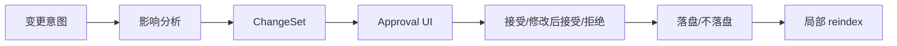
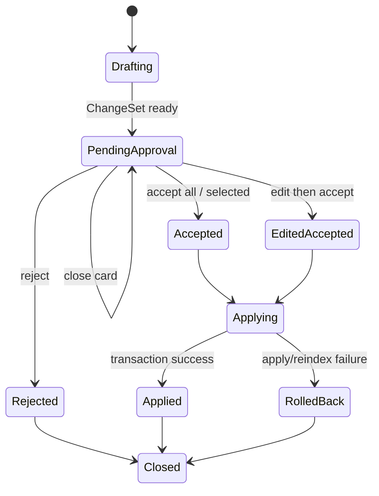

# M08 · Approval Cascade

Approval Cascade 是“改一处,连带影响一次看全审完”的能力。根层 [Turn Orchestration](./S04-turn-orchestration.md) 定义 ChangeSet 和生命周期;本篇定义用户如何审、系统如何解释一批修改。

## 用户问题

作者真正关心的不是“系统能不能批量改”,而是:

| 问题 | Approval Cascade 的回答 |
|---|---|
| 这个改动还会牵连哪里 | 在审批前完成影响分析并分组 |
| 为什么牵连这些地方 | 每条连带修改带来源、锚点和命中理由 |
| 我能不能只接收一部分 | 可以逐项裁决,但事务边界必须清楚 |
| 出错后怎么办 | 展示 rollback 范围和最终状态 |

## 审批闭环:先看全,再落盘

所有会写入项目的 cascade 都必须先形成 ChangeSet。影响分析可以递归,但递归结果必须收敛成一个可审批批次,不能一边落盘一边继续发现新影响。

## 审批状态

关闭审批卡不是拒绝。Pending 状态保留,直到用户明确接受、修改后接受、拒绝或取消 turn。

## 审批卡必须解释什么

| 内容 | 为什么 |
|---|---|
| 主修改 | 用户知道本批次核心意图 |
| cascade 分组 | 用户知道哪些是连带影响 |
| 来源和锚点 | 用户能追溯为什么命中 |
| 守则风险 | 高风险必须显性确认 |
| 可选项 | 用户能逐条接受/拒绝 |
| rollback 范围 | 出错后知道能否撤销 |

## 分组规则

| 分组 | 例子 | 审批重点 |
|---|---|---|
| Primary Change | “青岚宗改名为玄岚宗” | 是否接受主意图 |
| Direct Mentions | 章节正文出现的旧名 | 是否替换文字 |
| Structured Facts | entity alias、relation、timeline | 是否更新项目事实 |
| Risk Notes | 守则冲突、设定冲突 | 是否需要人工改写 |
| Low Confidence | 锚点不稳、语义召回命中 | 默认不自动选中 |

低置信项不能混在普通连带修改里自动通过。它们必须显式降权,并允许用户打开来源判断。

## 与其他能力的关系

| 来源 | 进入 Approval Cascade 的方式 |
|---|---|
| Universal Search | Search 只提供动作入口,写入动作转成 ChangeSet |
| Discuss Mode | Discuss 只能建议切换,用户确认后再生成 proposal |
| Inline Review | 跨文档、跨章节、事实/剧情/设定变化或阻断级风险升级为 ChangeSet |
| Writing / Planning | 生成草稿或设定 proposal 后进入审批 |
| ReaderPanel | 高风险报告可作为审批说明,不直接裁决 |
| Trace | 解释影响分析和落盘过程 |

## 失败和收场

| 失败 | 用户看到 | 系统不能做 |
|---|---|---|
| 影响分析不收敛 | 升级为人工确认,展示已发现范围 | 无限递归或静默截断 |
| 锚点失效 | 标记为需要人工处理 | 对错位置强行改写 |
| 部分 apply 失败 | transaction rollback,展示未落盘 | 留下半批修改 |
| reindex 失败 | 写入状态与索引状态分开说明 | 假装索引已更新 |
| 用户关闭卡片 | pending 保留 | 当作拒绝或通过 |
| 用户取消 turn | 按 turn rollback 语义处理 | 只取消 UI 不撤状态 |

## Design

[design/02 Approval Cascade](../design/02-approval-cascade.md) 是审批 UI 的视觉和交互契约。行为主权以本篇、[Turn Orchestration](./S04-turn-orchestration.md) 和 [Project Storage](./S01-project-storage.md) 为准。

## 测试清单

| 类型 | 场景 |
|---|---|
| 批次 | 主修改和连带修改合成一个 ChangeSet |
| 关闭 | 关闭审批卡后 pending 状态仍在 |
| 逐项 | 选择性接受不破坏事务边界 |
| rollback | apply 或 reindex 失败后用户能看清最终状态 |
| Search 联动 | Search 发起改名不会绕过审批 |
| Inline Review 联动 | 跨文档命中在当前页只显示锚点,决策跳到整批审批 |
| Trace 联动 | 影响分析和落盘 step 可追踪 |

## FAQ

**Q: Search 结果里的“全项目改名”走这里吗?**

A: 是。Search 只能发起入口,真正改名必须生成 ChangeSet 并进入 Approval Cascade。

**Q: 用户关闭审批卡是否等于拒绝?**

A: 不等于。关闭只是暂不处理,pending 状态仍保留。

**Q: 系统能不能先改确定项,再让用户审不确定项?**

A: 不能在同一批里这样做。确定项和不确定项必须在同一个审批语境中解释,否则作者无法判断连带影响。

**Q: 低风险修改是否可以自动通过?**

A: 只有明确属于用户已批准的批次,才可以随批落盘。系统不能把“看起来低风险”当作跳过审批的理由。
