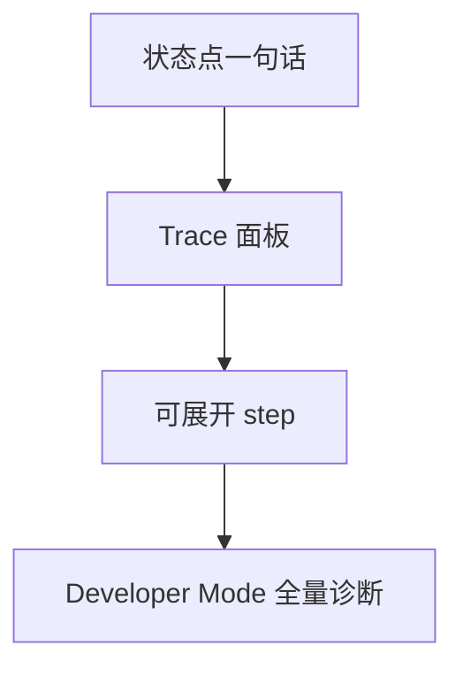
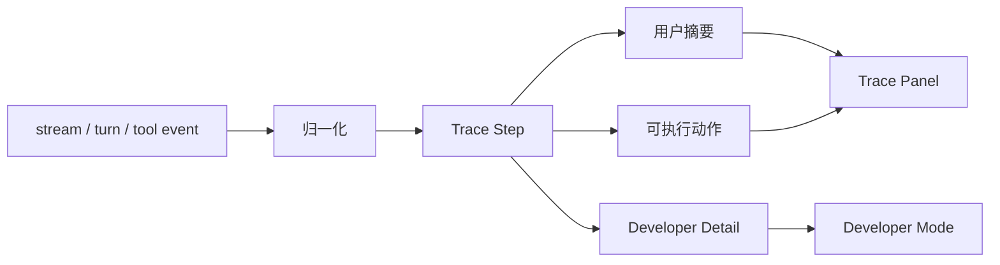

# M09 · Trace Observability

Trace Observability 解释作者如何看见 Agent 过程。根层 [Streaming UI Protocol](./S05-streaming-ui-protocol.md) 定义事件和状态恢复;本篇定义 Trace 作为用户可读产品能力的闭环。

## Trace 的产品目标

Trace 回答五个问题:

| 问题 | 示例 |
|---|---|
| 系统现在在做什么 | Writer 正在生成第 3 步 |
| 为什么拿这些上下文 | 使用了角色状态、伏笔、最近 2 章 |
| 为什么这些地方受影响 | 命中别名、锚点和依赖 |
| 为什么失败 | JSON 校验失败、索引过期、模型超时 |
| 哪些能力降级 | 语义召回不可用,只用精确查询 |

Trace 的目标不是把内部日志倒给作者,而是让作者理解“系统为什么这么做,我现在能怎么处理”。

## 可见层级:从一句话到诊断

普通作者默认看到状态点和摘要。Developer Mode 才展示工具参数、JSON、成本明细等内部材料。

## 事件到用户解释

Trace step 是事件的用户语义投影,不是事件本身。事件字段、去重键、断线恢复规则归 appendix;Trace 只保留用户可理解的阶段、证据、结果和下一步。

## Trace 条目结构

| 字段 | 用户价值 |
|---|---|
| step name | 知道系统阶段 |
| actor | 哪个 Agent/工具 |
| evidence | 用了哪些来源 |
| result | 成功、失败、降级 |
| user action | 可重试、查看审批、打开设置 |

完整事件字段在 appendix;本篇只规定可读结构。

## Trace 类型

| 类型 | 例子 | 默认可见性 |
|---|---|---|
| Progress | “正在分析第 37 章伏笔” | 状态点 + Trace |
| Evidence | “使用了角色状态、青岚宗设定、第 18 章片段” | Trace |
| Decision | “改名会影响 4 个章节和 2 条关系” | Trace + Approval |
| Degraded | “语义召回不可用,已退回精确索引” | 状态点 + Trace |
| Error | “结构化输出校验失败,已停止本轮写入” | 状态点 + Trace |
| Dev Diagnostic | 原始工具参数、JSON、成本 | Developer Mode |

普通 Trace 不展示 prompt 全文、API key、原始 provider payload 或用户未授权的隐藏上下文。

## 失败和降级

| 失败 | 用户看到 | 系统不能做 |
|---|---|---|
| stream 断线 | Trace 标记连接中断并尝试恢复 | 把缺失事件当成功完成 |
| session_history 写入失败 | 当前结果不受影响,Trace 标记过程日志缺失 | 用过程日志恢复业务事实 |
| tool event 缺字段 | 展示阶段未知或来源缺失 | 编造 step 名称和证据 |
| Developer detail 不可用 | 普通摘要仍可见 | 泄露内部占位或空 JSON |
| turn rollback | Trace 标明已回滚和回滚范围 | 继续展示已落盘成功 |

Trace 的失败不能改变 turn 结果。业务状态以 storage、approval 和 turn state 为准。

## Design

- [design/01](../design/01-main-layout.md): 状态点和 Trace 面板的召唤形态。
- [design/04](../design/04-settings.md): Developer Mode 和 trace 清理入口。

## 测试清单

| 类型 | 场景 |
|---|---|
| 可见层级 | 状态点、Trace、Developer Mode 三层内容不串层 |
| 断线恢复 | 重连后 step 不重复、不误报成功 |
| 降级 | semantic/tool/provider 降级能在 Trace 中解释 |
| 审批联动 | ChangeSet 的影响分析 step 能跳到审批卡 |
| 隐私 | 普通 Trace 不出现 API key、prompt 全文和 raw payload |
| 事实边界 | session_history 缺失不影响项目事实恢复 |

## FAQ

**Q: Trace 是事实源吗?**

A: 不是。Trace 解释过程,业务结果以 turn/storage 状态为准。

**Q: Trace 是否应该一直常驻?**

A: 不应该。它是召唤式面板,避免压过写作纸面。

**Q: 为什么不直接展示完整日志?**

A: 完整日志对调试有用,但会压过写作任务。普通 Trace 只展示用户能行动的信息;完整诊断进 Developer Mode。

**Q: Trace 失败时是否要阻断写作?**

A: 通常不阻断。只有 Trace 失败暴露出业务状态不确定,例如 rollback 状态无法确认,才升级为 turn 错误。
