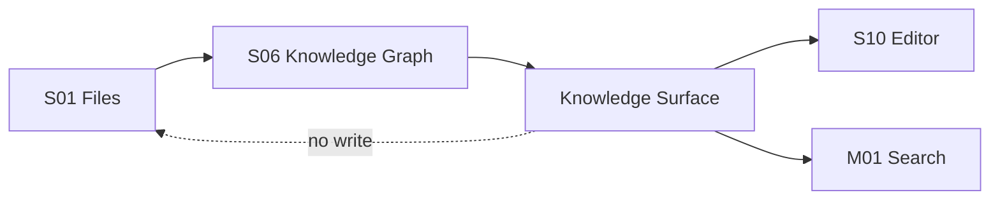

# M10 · Knowledge Surface

Knowledge Surface 是作者在纸面上看见知识图谱的方式:实体高亮、右缘旁注、引用跳转、backlinks 和 Goto Definition。

## 表面能力

| 能力 | 用户动作 | 结果 |
|---|---|---|
| Entity Highlight | 阅读正文 | 看见角色/地点/物品标记 |
| Side Note | hover / focus | 看见来源、关系、风险 |
| Goto Definition | 点击实体 | 打开角色卡或设定 |
| Backlinks | 查看引用 | 列出章节和段落锚点 |
| Violation Marker | 风险出现 | 显示守则或一致性提示 |

## 主权边界

Knowledge Surface 是派生层展示,不是正文事实。高亮错了要标记索引问题,不能改正文来迁就高亮。

## 失败收场

| 失败 | 用户看到 | 系统不能做 |
|---|---|---|
| 索引过期 | 高亮弱化或隐藏 | 展示为确定事实 |
| 锚点失效 | 引用项标记失效 | 跳错段落 |
| 同名歧义 | 显示候选和来源 | 自动认定实体 |
| KG 不可用 | 正文仍可编辑 | 阻断写作纸面 |

## Design

主界面旁注和高亮见 [design/01](../design/01-main-layout.md)。图谱管线见 [S06](./S06-knowledge-graph.md)。

## 测试清单

| 类型 | 场景 |
|---|---|
| 高亮 | 同名实体、中文边界、长章节性能 |
| 跳转 | 定义和引用定位正确 |
| 降级 | stale / missing anchor 有清晰视觉 |
| 编辑 | 高亮层不污染正文保存 |

## FAQ

**Q: 高亮出现就代表系统确认了事实吗?**

A: 不代表。高亮是派生索引的展示,事实主权仍在作者文件和审批后项目事实。

**Q: 用户能不能直接在 Knowledge Surface 修正事实?**

A: 可以提供跳转或生成修正 proposal,但不能让派生面板直接改写作品事实。
