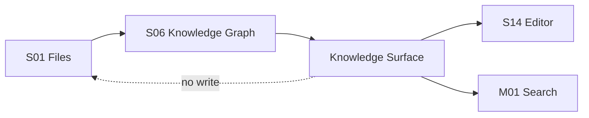

# M10 · Knowledge Surface

Knowledge Surface 是作者在纸面上看见知识图谱的方式:实体高亮、右缘旁注、引用跳转、backlinks 和 Goto Definition。

## 表面能力

| 能力 | 用户动作 | 结果 |
|---|---|---|
| Entity Highlight | 阅读正文 | 看见角色/地点/物品标记 |
| Side Note | hover / focus | 看见来源、关系、风险 |
| Goto Definition | 点击实体 | 打开角色卡或设定 |
| Backlinks | 查看引用 | 列出章节和段落锚点 |
| Violation Marker | 风险出现 | 显示守则或一致性提示 |
| Identity Governance | 用户确认别名、合并、拆分实体 | 生成可审批治理 proposal |
| Obligation List | 查看被搁置的低置信/风险项 | 打开来源、解决、搁置或生成修正 |

## 主权边界

Knowledge Surface 是派生层展示,不是正文事实。高亮错了要标记索引问题,不能改正文来迁就高亮。

实体治理入口只管理图谱身份,不直接改正文。用户在高亮、旁注或角色卡中确认别名、合并实体、拆分实体时,系统必须展示受影响 mention、relation、timeline 和来源锚点,然后生成可审批的派生修正。若治理动作会触发正文称谓替换,正文部分必须进入 [M08 Approval Cascade](./M08-approval-cascade.md)。

全局 obligation 清单也归 Knowledge Surface 展示。它聚合低置信搁置项、未解决风险、失效来源和后续 Validator 需要重逢的事项。清单中的每条 obligation 必须显示状态、去重来源、最近命中位置、是否阻断写作和可执行动作;不能只藏在单次审批卡里。

## 失败收场

| 失败 | 用户看到 | 系统不能做 |
|---|---|---|
| 索引过期 | 高亮弱化或隐藏 | 展示为确定事实 |
| 锚点失效 | 引用项标记失效 | 跳错段落 |
| 同名歧义 | 显示候选和来源 | 自动认定实体 |
| 治理 proposal 失败 | 保持派生展示并提示未生效 | 直接改 entity 身份 |
| obligation 来源失效 | 标记 invalidated 并保留历史 | 当作已解决 |
| KG 不可用 | 正文仍可编辑 | 阻断写作纸面 |

## Design

主界面旁注和高亮见 [design/01](../design/01-main-layout.md)。图谱管线见 [S06](./S06-knowledge-graph.md)。

## 测试清单

| 类型 | 场景 |
|---|---|
| 高亮 | 同名实体、中文边界、长章节性能 |
| 跳转 | 定义和引用定位正确 |
| 降级 | stale / missing anchor 有清晰视觉 |
| 编辑 | 高亮层不污染正文保存 |
| 实体治理 | 别名确认、合并、拆分生成审批 proposal |
| obligation | 全局清单展示 open/snoozed/resolved/dismissed/invalidated |

## FAQ

**Q: 高亮出现就代表系统确认了事实吗?**

A: 不代表。高亮是派生索引的展示,事实主权仍在作者文件和审批后项目事实。

**Q: 用户能不能直接在 Knowledge Surface 修正事实?**

A: 可以提供跳转或生成修正 proposal,但不能让派生面板直接改写作品事实。
