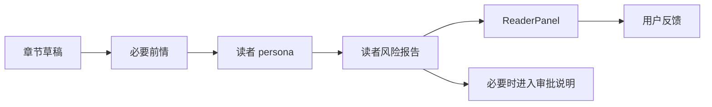
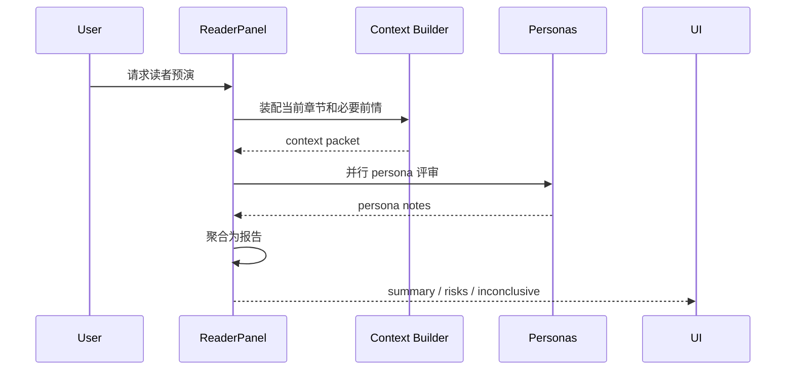
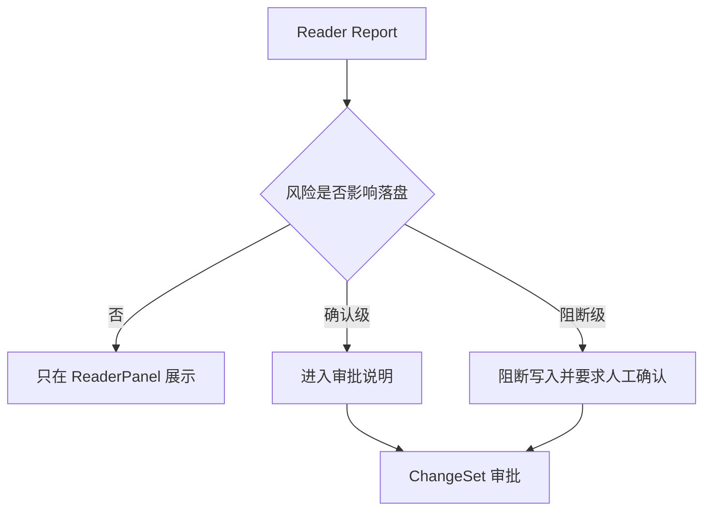

# M11 · ReaderPanel

ReaderPanel 是发布前读者预演能力。根层 [Creative Engine](./S12-creative-engine.md) 定义质量信号和守则;本篇定义读者报告如何生成、展示和进入审批解释。

## 读者预演要回答什么

ReaderPanel 不是评分器,而是帮作者提前看见读者反应:

| 问题 | 输出 |
|---|---|
| 读者会在哪一段疑惑 | 疑惑点、原因、引用片段 |
| 爽点是否兑现 | 期待建立、兑现位置、断点 |
| 人设是否崩 | persona 视角下的违和说明 |
| 是否有弃读风险 | 风险等级、触发段落、修正建议 |
| 样本是否足够 | inconclusive 或补充上下文要求 |

它不替作者决定“该不该发”,也不输出聚合发布建议。它给出读者视角、弃读风险信号、证据位置和可选处理方向,最终裁决仍归作者。

## 报告闭环:生成后只解释,不写盘

ReaderPanel 的报告可以进入审批说明,但报告本身不修改章节、不修改设定、不更新角色事实。

## 入口

| 入口 | 前置条件 | 结果 |
|---|---|---|
| 命令面板 · 运行 ReaderPanel | 当前章节、选区或指定章节可读 | 进入 turn,生成新的读者风险报告 |
| 命令面板 · 打开最近 ReaderPanel 报告 | 项目内存在最近报告 | 打开报告面板,不重新运行 |
| 审批卡风险区 | 当前 ChangeSet 附带读者风险说明 | 作为审批说明展示,不新增写入 |

无当前章节、章节过短、上下文缺失或没有最近报告时,入口只展示空态和可恢复动作,不能生成空报告、复用过期报告或静默写盘。

## 执行序列

persona 可以并行执行,但聚合阶段必须保留每个结论的来源 persona 和引用片段。样本不足时输出 inconclusive,不能凑结论。

## 报告结构

| 区块 | 内容 | 用户动作 |
|---|---|---|
| Overall Pulse | 整体读感、节奏、主要风险 | 快速判断是否继续 |
| Confusion Points | 疑惑段落、缺失信息、来源 | 跳到段落 |
| Payoff Check | 期待和兑现的对应关系 | 打开相关伏笔 |
| Character Consistency | 人设/关系违和 | 对照角色卡 |
| Narrative Diagnostics | 章内结构、节奏、爽点和承诺推进 | 查看趋势或重跑单维度诊断 |
| Revision Suggestions | 可选修改方向 | 进入 Discuss 或 proposal |
| Inconclusive | 样本不足或上下文缺失 | 补上下文或重跑 |

### 风险信号枚举

报告头部的分类风险摘要只允许输出四类用户可见信号,枚举与语义以本篇为主权定义:

| 信号 | 语义 |
|---|---|
| 风险低 | 多数 persona 未标记显著风险,证据充分 |
| 需留意 | 存在被标记的风险,但未形成多人共识或 severity 偏低 |
| 风险集中 | ≥3 个 persona 在同类风险上形成共识,或存在 high severity 风险 |
| 证据不足 | 成功样本不足或上下文缺失,等价 inconclusive,不输出分类建议 |

约束:不打 0-100 总分,不输出“可发布/应重写”等发布结论;信号必须按多人共识与证据呈现,每个信号旁列出最主要的风险类别与来源 persona。design 层只定义这四类信号的视觉表达,不得增删枚举。

建议必须是可选择的,不能伪装成系统命令。进入写入路径时必须转入 [Approval Cascade](./M08-approval-cascade.md)。

叙事诊断报告由 Creative Engine 生成,ReaderPanel 负责展示和行动入口。报告至少覆盖章内四维体检、证据片段、风险级别、历史趋势位置、是否可比和重跑入口。用户可以重跑旧章、只重跑某一维度或打开全书趋势地形图;这些动作只更新诊断报告和 Trace,不直接改正文。

诊断存档归项目活动/报告历史,不能覆盖原始章节事实。旧章重跑得到的新结论必须标注运行时间、上下文版本和模型/模板版本;若与旧报告不同,展示差异而不是静默替换。

## Persona 边界

| 允许 | 不允许 |
|---|---|
| 追更党、逻辑控、情感党等视角 | 替作者裁决是否发布或输出“可发布/应重写”结论 |
| 标记弃读点和疑惑点 | 改写项目事实 |
| 输出 inconclusive | 把样本不足伪装成确定结论 |
| 用户自定义 persona | persona 注入越权 |

## 风险进入审批的方式

ReaderPanel 不直接阻断发布。只有报告中的风险被 Validator/守则链路提升为确认级或阻断级,才影响落盘。

## 失败和降级

| 失败 | 用户看到 | 系统不能做 |
|---|---|---|
| persona 执行失败 | 对应 persona 标记失败,报告降级 | 用其他 persona 假冒它 |
| 成功样本不足 | inconclusive | 凑总分或强行排名 |
| 上下文缺失 | 明确缺哪些前情 | 把猜测当读者结论 |
| 最近报告不存在 | 报告空态和运行入口 | 伪造上一份报告 |
| 自定义 persona 越权 | 拒绝越权指令并说明 | 泄露隐藏上下文或执行写入 |
| 聚合失败 | 展示原始 persona notes 或失败态 | 输出无来源总结 |

## Design

[design/03 ReaderPanel](../design/03-reader-panel.md) 定义报告布局和可视化。行为主权以本篇和 [Creative Engine](./S12-creative-engine.md) 为准。

## 测试清单

| 类型 | 场景 |
|---|---|
| 并行 | 多 persona 成功/失败混合时聚合正确 |
| inconclusive | 样本不足不输出确定结论 |
| 边界 | ReaderPanel 不写盘、不改项目事实 |
| 入口 | 命令面板运行 / 打开最近报告 / 审批卡内嵌三条路径互不串语义 |
| 注入防御 | 自定义 persona 不能越权读取或执行写入 |
| 审批联动 | 高风险能进入审批说明,但不绕过 ChangeSet |
| 叙事诊断 | 旧章重跑、单维度重跑和趋势入口不写盘且带版本 |
| UI | 报告区块能跳转到来源段落或相关设定 |

## FAQ

**Q: ReaderPanel 是否阻断发布?**

A: 默认不阻断。只有它发现的风险被提升为确认级/阻断级时,才通过审批语义影响落盘。

**Q: ReaderPanel 失败是否影响写作?**

A: 不应生成假报告。草稿可保留,报告显示不可用或 inconclusive。

**Q: ReaderPanel 的分数能不能作为质量 KPI?**

A: 不建议。它是预演和诊断工具,重点是具体疑惑点、弃读风险和可行动建议,不是统一打分。

**Q: 用户反馈会不会改变 persona?**

A: 反馈可以影响后续评审偏好,但必须通过可见经验管理沉淀,不能在本次报告里静默改 persona。
