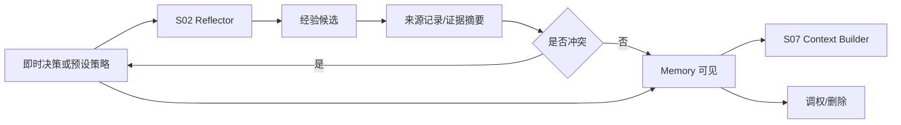

# M12 · Memory Learning Management

Memory Learning Management 是“越用越懂你”的可见控制面。它让作者看见、调权和删除系统沉淀的经验;已确认经验默认参与后续上下文选择,但不能覆盖项目事实或当前显式指令。

## 用户能控制什么

| 动作 | 含义 |
|---|---|
| 查看经验 | 看见经验文本、来源记录/证据摘要、影响范围 |
| 调高/调低 | 在 0-5 五档内改变后续 context 选用权重 |
| 删除经验 | 从长期经验中移除 |
| 处理冲突 | 冲突发生时即时选择,或使用预设策略处理 |
| 暂停学习 | 暂停生成新经验候选,不影响已确认经验的默认选用 |

经验没有逐条“是否注入”开关。用户通过权重表达偏好强弱,通过删除移除不应再使用的经验。

## 权重五档

| 权重 | 用户语义 | Context Builder 语义 |
|---|---|---|
| 0 | 仅留档 | 默认不主动选用;用户点名或诊断查看时可显示 |
| 1 | 很弱 | 只在高度匹配且无更强经验时作为轻提示 |
| 2 | 偏弱 | 可参与同类任务,低于普通经验 |
| 3 | 普通 | 已确认经验的默认档位 |
| 4 | 偏强 | 同类任务优先选用,但仍让位于事实和当前指令 |
| 5 | 强偏好 | 高优先级写作手感,冲突时必须解释取舍 |

## 生命周期

经验不能由普通 Agent 私自写入。Reflector 是唯一学习入口,且学习结果必须可见、可调、可删。来源可以是一轮普通记录,也可以是跨多轮证据摘要;不强制每条经验只有单一来源 turn。

Discuss 默认不是学习入口。用户在讨论里试探想法、比较方案、追问过程或表达临时偏好时,系统不得自动生成经验候选。只有用户显式说“记住这个”“以后都这样”“把这条当规则”这类记忆意图,Reflector 才可以把本轮讨论摘要变成候选;候选仍要展示来源、适用范围和冲突状态,不能直接确认为长期经验。

冲突不在 Settings 常驻队列里长期排队。发生冲突时,系统应在当前学习回执、相关 recap 或下一次受影响任务前即时提示用户裁决;如果用户设置了预设策略,按策略保留旧经验、采用新经验或降低冲突经验权重。未裁决的冲突候选不得进入上下文。

## 失败收场

| 失败 | 用户看到 | 系统不能做 |
|---|---|---|
| 学习失败 | 本轮未沉淀经验 | 写入模糊经验 |
| Discuss 普通闲聊 | 不生成新经验候选 | 从临时偏好自动学习 |
| 显式记住 | 生成可见候选并走冲突处理 | 直接写入已确认经验 |
| 经验冲突 | 即时展示新旧经验、来源摘要和可选处理 | 自动覆盖旧经验、静默丢弃新经验或塞进常驻队列 |
| 调权失败 | 保留原权重 | 显示已保存 |
| 删除失败 | 显示残留范围 | 继续注入却隐藏 |
| 学习暂停 | 不学新经验 | 删除旧经验或停止使用已确认经验 |

## Design

管理入口见 [design/04](../design/04-settings.md)。底层状态见 [S01](./S01-runtime-state.md) 和 [M14](./M14-settings.md)。

## 测试清单

| 类型 | 场景 |
|---|---|
| 可见性 | 每条经验有来源记录或证据摘要,来源可来自一轮或多轮 |
| 默认选用 | 已确认经验默认可被 context builder 选用 |
| 权重 | 0-5 五档语义一致,无逐条注入开关 |
| 冲突 | 待确认候选不进入 context;用户选择后状态更新 |
| 删除 | 删除后不再出现和注入 |
| Discuss 学习边界 | 普通 Discuss 不产生候选;显式“记住/以后都这样”才产生候选 |
| Reflector | 暂停学习后不学新经验,但已确认经验仍按权重参与 |

## FAQ

**Q: 删除一条经验会改掉历史章节或历史回答吗?**

A: 不会。删除只影响未来 context 注入和学习面展示;历史作品事实仍由项目文件和审批记录决定。

**Q: 关闭 Reflector 是否等于删除已有经验?**

A: 不等于。暂停学习只停止学习新经验;已有确认经验仍按 0-5 权重参与后续上下文选择,除非用户删除或调到 0。
