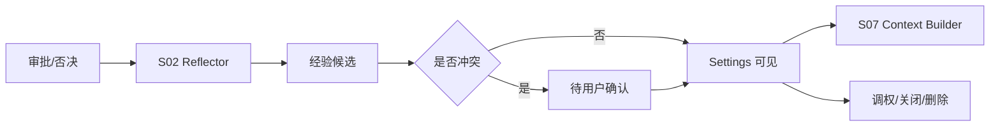

# M12 · Memory Learning Management

Memory Learning Management 是“越用越懂你”的可见控制面。它让作者看见、调整、关闭和删除系统沉淀的经验。

## 用户能控制什么

| 动作 | 含义 |
|---|---|
| 查看经验 | 看见经验文本、来源 turn、影响范围 |
| 调高/调低 | 改变后续 context 注入权重 |
| 关闭经验 | 保留记录但不再注入 |
| 删除经验 | 从长期经验中移除 |
| 确认冲突候选 | 在新旧经验冲突时选择采用新经验、保留旧经验或两条都不用 |
| 关闭 Reflector | 不再学习新经验 |

## 生命周期

经验不能由普通 Agent 私自写入。Reflector 是唯一学习入口,且学习结果必须可见、可调、可删。冲突候选在用户确认前只是待处理项,不注入 context。

## 失败收场

| 失败 | 用户看到 | 系统不能做 |
|---|---|---|
| 学习失败 | 本轮未沉淀经验 | 写入模糊经验 |
| 经验冲突 | 展示新旧经验、来源和三种选择 | 自动覆盖旧经验或静默丢弃新经验 |
| 调权失败 | 保留原权重 | 显示已保存 |
| 删除失败 | 显示残留范围 | 继续注入却隐藏 |
| Reflector 关闭 | 不学新经验 | 删除旧经验 |

## Design

管理入口见 [design/04](../design/04-settings.md)。底层状态见 [S02](./S02-runtime-state.md) 和 [S15](./S15-settings-and-onboarding.md)。

## 测试清单

| 类型 | 场景 |
|---|---|
| 可见性 | 每条经验有来源和状态 |
| 注入 | 关闭经验不进入 context |
| 冲突 | 待确认候选不进入 context;用户选择后状态更新 |
| 删除 | 删除后不再出现和注入 |
| Reflector | 关闭后不学新经验 |

## FAQ

**Q: 删除一条经验会改掉历史章节或历史回答吗?**

A: 不会。删除只影响未来 context 注入和学习面展示;历史作品事实仍由项目文件和审批记录决定。

**Q: 关闭 Reflector 是否等于删除已有经验?**

A: 不等于。关闭 Reflector 只停止学习新经验;已有经验是否注入,由经验管理开关和单条状态决定。
