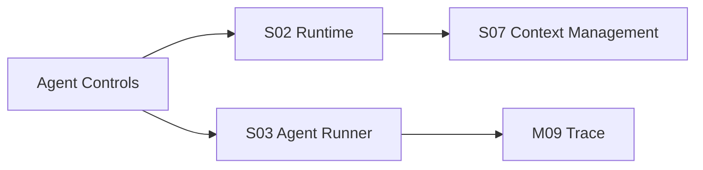

# M13 · Agent Team Controls

Agent Team Controls 定义作者如何理解和调配七个 AI 角色。它不是模型参数页,而是编辑部的可见控制面。

## Canonical role id

以下 id 是持久化、事件、Trace、成本归因和 prompt 名称的唯一角色标识。中文名是用户可见展示,可以本地化;id 不能随文案变化。

| canonical id | 中文展示名 | 用户可见职责 |
|---|---|---|
| `router` | 调度员 | 理解意图、选择模式和动作入口。 |
| `writer` | 写手 | 生成章节草稿、段落扩写和写作 proposal。 |
| `checker` | 审稿人 | 发现节奏、爽点、守则和表达风险。 |
| `validator` | 一致性守护者 | 复核事实、依赖、连带影响和阻断级一致性。 |
| `reader_panel` | 读者评审团 | 用多类读者视角给出风险和反应。 |
| `humanizer` | 润色师 | 做表达层改写和去 AI 味。 |
| `reflector` | 反思学习者 | 从作者审定和明确反馈中沉淀经验。 |

Design token、prompt template、cost row、trace badge、schema enum 和 settings 开关都必须派生自这组 id。不得在不同文档里另起 `ReaderPanel` / `Validator` / `Checker` 等混合命名作为持久化值。

## 控制对象

| 角色 | 用户能做 |
|---|---|
| 调度员 | 查看调度结果,不能关闭主入口 |
| 写手 | 调整档位和写作强度 |
| 审稿人 | 调整诊断灵敏度 |
| 一致性守护者 | 查看一致性守护,阻断级不可关闭 |
| 读者评审团 | 调整 persona 和深度 |
| 润色师 | 按需调用和调风格 |
| 反思学习者 | 整体关闭学习或管理经验 |

## 控制边界

角色开关只能影响未来 turn。正在运行的 turn 按 [S04](./S04-turn-orchestration.md) 取消或完成,不能被设置页静默改写。

## 失败收场

| 失败 | 用户看到 | 系统不能做 |
|---|---|---|
| 关闭不可关角色 | 解释红线原因 | 绕过守则 |
| 设置保存失败 | 保留原设置 | 显示已生效 |
| turn 运行中改设置 | 提示下轮生效或要求取消 | 半路替换 Agent |
| 模型不可用 | 降级/阻断说明 | 静默换旧模型 |

## Design

可关矩阵的产品承诺见 [plan/06](../plan/06-agent-team.md),控制面 UI 见 [design/04](../design/04-settings.md)。

## 测试清单

| 类型 | 场景 |
|---|---|
| 开关 | 可关/不可关角色符合红线 |
| 生效 | 设置变更只影响后续 turn |
| Trace | 每条建议可归因到角色 |
| 成本 | 用量按角色可见 |
| ID | schema、event、prompt、design token 使用同一 canonical id |

## FAQ

**Q: 为什么有些角色不能完全关闭?**

A: 因为它们承载产品红线或审批解释。可关矩阵可以降低干预频率,但不能让系统绕过守则。

**Q: 运行中的 turn 能不能因为设置变化立刻换 Agent?**

A: 不能。设置变化默认影响下一轮;当前 turn 要么完成,要么按 S04 取消后重新开始。
