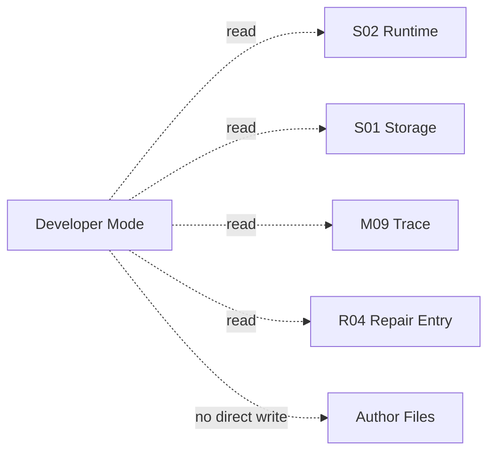

# M14 · Settings And Developer Mode

Settings 是用户控制产品行为的地方。Developer Mode 是只读诊断层,用于解释系统状态,不能绕过审批或直接修数据库。

## 分区

| 分区 | 用户问题 |
|---|---|
| Workspace | 项目在哪里,如何导入导出 |
| Model | 模型凭据和可用性 |
| Agents | 角色开关和档位 |
| Style | 文风和范文 |
| Rules | 风险提示体验 |
| Memory | 经验管理 |
| Usage | 用量和预算 |
| Developer | Trace、索引、审计、日志 |

## Developer Mode 边界

修复类动作如果存在,必须进入 [R04](./platform/R04-index-health-and-repair.md) 或危险操作确认,不能藏在 debug 面板里直接执行。

## 失败收场

| 失败 | 用户看到 | 系统不能做 |
|---|---|---|
| 设置保存失败 | 未生效提示 | 展示新值已保存 |
| 凭据验证失败 | 模型不可用 | 标记 ready |
| Developer 数据缺失 | 诊断不完整 | 影响作品事实 |
| 危险操作冲突 | 要求先处理 turn/approval | 抢写入主权 |

## Design

Settings UI 见 [design/04](../design/04-settings.md)。底层控制面见 [S15](./S15-settings-and-onboarding.md)。

## 测试清单

| 类型 | 场景 |
|---|---|
| 保存 | dirty、失败、回滚展示 |
| Developer | 只读诊断不改变事实 |
| 危险操作 | pending approval 时被阻止 |
| 凭据 | 验证失败不进入 ready |

## FAQ

**Q: Developer Mode 能不能提供一键修复数据?**

A: 不能把修复藏在 debug 面板里。修复动作必须进入 R04 或危险操作确认,并有可见的失败收场。

**Q: Settings 里的值输入后是否立刻生效?**

A: 只有通过验证并持久化后才算生效。失败时 UI 必须保留原值或明确显示未保存状态。
