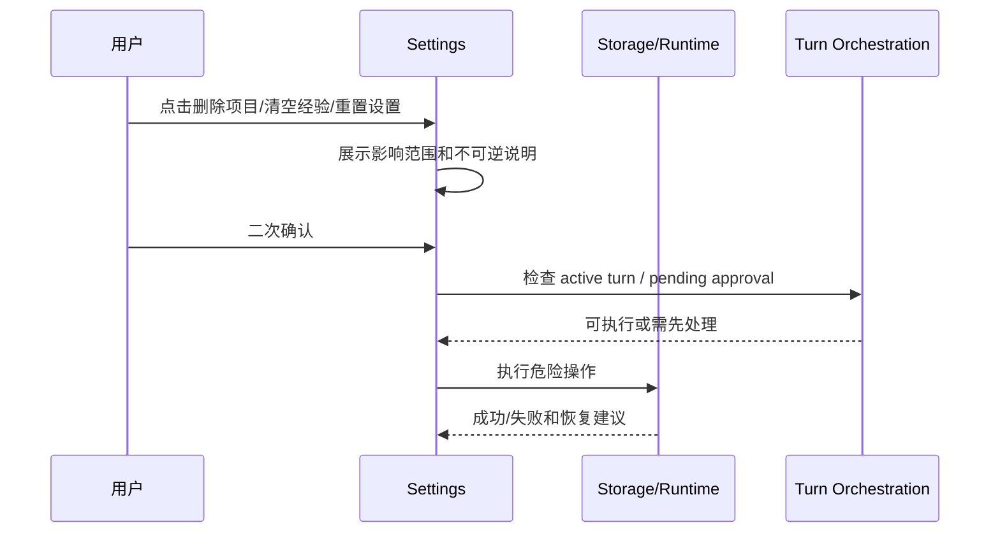

# M14 · Settings

> Developer Mode 已拆分为独立能力,见 [M18 · Developer Mode](./M18-developer-mode.md)。本篇只承载 Settings 控制面板的主权。

Settings 是用户控制产品行为的地方,不是内部参数仓库。它只放用户能理解、能控制、且会改变产品行为的东西;内部 retry 常数、SQL 字段、prompt 片段、包版本和 native binding 细节不作为普通设置暴露。本篇用「控制面板分区 → 各区主权边界 → 危险操作 → 失败收场」组织:先回答每个分区归谁管,再回答设置能改什么、绝对不能改什么。

## 分区地图

| 分区 | 用户问题 | 放什么 |
|---|---|---|
| Workspace | 我的项目放在哪里 | 路径、项目列表 |
| Model | AI 能不能用 | 凭据、连通性、可用模型 |
| Agents | 哪些角色参与、强度如何 | 角色开关、档位、Reflector 学习 |
| Assistant Persona | 助手怎么说话和协作 | 语气、详略、主动性、提醒强度 |
| Style | 文字像不像我 | 风格偏好、范文、Humanizer 相关经验 |
| Rules | 风险提示多严格 | 五大守则阈值、提示偏好 |
| Memory | 系统学到了什么 | 经验查看、权重、关闭、删除 |
| Usage | 用了多少 | token 消耗、prompt cache 命中、context 用量等技术指标 |
| Developer | 出问题怎么查 | 入口指向 [M18 · Developer Mode](./M18-developer-mode.md),本篇不重复其边界 |

Settings 的修改作用于 Runtime State、Project Storage、Creative Engine、Agent Runner 和编辑器交互;每个分区只调节体验和参与度,不改变审批主路径和事实主权。

## Assistant Persona 边界

Assistant Persona 只改变助手表达和协作方式,不改变系统规则、项目事实、审批边界或守则阈值。它可以影响回答是简短还是展开、是否主动列选项、提醒频率和称呼风格;不能让 Discuss 写盘、让 Humanizer 改剧情、让 Validator 降低阻断级风险,也不能覆盖用户当前显式指令。

## 模型凭据的用户语义

Settings 只展示和管理 provider 可用性,不拥有 secret。API key、token 和 provider secret 的主权在桌面壳安全凭据库,完整契约见 [I05 · Desktop Shell Contract](./platform/I05-desktop-shell-contract.md);本篇只定义用户在 Settings 里能做什么、看到什么。

| 用户动作 | Settings 承诺 |
|---|---|
| 新增 / 更新 provider 凭据 | 写入成功后显示 provider 可用或待验证;写入失败时不保存假配置 |
| 验证 provider | 展示连通性、模型可用性和最近失败原因 |
| 删除凭据 | provider 立即变为未配置,相关 Agent 能力禁用;历史项目事实、recap、审批记录不被删除 |
| provider 失效 | 显示「需要重新配置 / 重新授权」;不把失败解释成模型输出为空,不自动切换到另一个 secret |

provider 失效只影响后续需要该 provider 的能力:已有正文、项目事实、审批历史和 Recap 不回滚;运行中尚未产生 durable change 的 turn 失败并生成 recap;已经进入 pending approval 的 ChangeSet 继续可查看,但不能用失效 provider 继续扩写或重做。

## 经验管理的用户语义

经验的完整生命周期主权在 [M12 · Memory Learning Management](./M12-memory-learning-management.md);Settings Memory 区是其管理入口,用户动作语义如下:

| 用户动作 | 系统含义 |
|---|---|
| 开启 Reflector | turn 完成后可学习新经验 |
| 关闭 Reflector | 不再学习新经验 |
| 关闭某条经验 | 后续不注入该经验 |
| 调高 / 调低经验 | 改变 context builder 选用权重 |
| 删除经验 | 从长期经验中移除 |
| 清空经验 | 危险操作,需要确认范围 |

「关闭学习」不等于「忘掉已经学会的东西」。这点必须在 UI 文案和实现上都清楚。

## 危险操作工作流

危险操作不能和 active writable turn 抢主权。存在 pending approval 时,用户应先处理审批或明确放弃。

## 守则设置的边界

| 设置 | 可以 | 不可以 |
|---|---|---|
| 提示强度 | 调整提示频率和展示方式 | 让阻断级风险静默落盘 |
| 阈值 | 影响后续检测 | 自动改历史报告 |
| 自定义偏好 | 改变诊断解释口径 | 覆盖项目事实 |
| Agent 档位 | 调整分析深度 | 绕过审批主路径 |
| Assistant Persona | 调整协作语气和主动程度 | 改变写入权限或事实优先级 |

守则是产品契约,不是纯偏好。Settings 可以调节体验,不能让系统变成无提示的静默改稿器。

## 设置失败收场

| 失败 | 用户可见 | 系统状态 |
|---|---|---|
| workspace 不可写 | 路径不被保存 | 不创建假项目 |
| 凭据不可用 | 模型未配置 | 不标记 ready |
| 凭据写入失败 | provider 保持未配置 | 不保存 secret 到项目或 settings 文件 |
| 凭据删除失败 | provider 标记需要处理 | 不继续使用残留 secret |
| provider 认证失效 | 需要重新配置 / 重新授权 | 不自动换 provider 写盘 |
| 设置保存失败 | 保存失败并保留原值 | 不显示为已生效 |
| 经验更新失败 | 经验未改变 | context 继续用旧状态 |
| 删除失败 | 显示残留范围 | 不从列表假删除 |

## Design 与明细

- Settings UI 交互见 [design/04](../design/04-settings.md)。
- 凭据存储与桌面壳权限契约见 [I05](./platform/I05-desktop-shell-contract.md)。
- 设置与经验存储明细见 [appendix/A01](./appendix/A01-schema-tables.md)。
- 验证项见 [appendix/V01](./appendix/V01-test-matrix.md)。

## 测试清单

| 类型 | 场景 |
|---|---|
| 保存 | dirty、失败、回滚展示 |
| 凭据 | 验证失败不进入 ready;删除后能力禁用但历史不回滚 |
| 危险操作 | pending approval 时被阻止;二次确认范围正确 |
| 守则 | 阻断级提示不可被静默关闭 |
| Persona | 不改变写盘权限和守则阈值 |

## FAQ

**Q: 用户能不能完全不用经验?**

A: 可以关闭或删除经验注入;但关闭 Reflector 只是不学新经验,不是自动停用旧经验。

**Q: 删除项目是否也删除运行时历史?**

A: UI 必须说明删除范围。项目文件、派生索引、运行时历史和经验是否删除要分别确认或按明确规则执行。

**Q: 模型凭据验证失败时能否进入离线模式?**

A: 可以进入不依赖模型的只读/编辑能力,但不能把 Agent 能力显示为可用。

**Q: Settings 里的值输入后是否立刻生效?**

A: 只有通过验证并持久化后才算生效。失败时 UI 必须保留原值或明确显示未保存状态。
