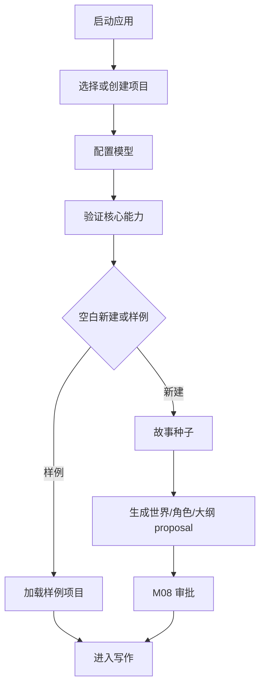

# M15 · Onboarding And New Book

Onboarding 把新作者带到第一个可写项目。New Book Journey 把故事种子变成可审阅的初始世界,但不把所有高级设置塞进首启。

## 旅程

每次启动都先选择或创建项目;没有项目上下文时不进入写作主界面。首启只验证核心路径:能创建/打开项目、能调用模型、能进入写作界面。高级 Agent 档位、外观、风格细节和 dev build 才可见的 Developer Mode 全部留给 Settings([M14](./M14-settings.md)),首启不做参数考试。

首启之后的一次性引导提示(气泡)逐个出现、看过即记录,不重复打扰。Settings 不提供数据管理区;引导状态若需重置,必须由专门的引导入口或项目级流程承载,不能藏在 Settings。

项目选择页承接 [M16](./M16-project-library-and-navigation.md) 的单窗口切换契约。首启、重启和左上项目入口都必须先完成当前项目的 active turn、pending approval、未保存编辑和外部冲突 preflight,再进入目标项目。没有 active project context 时,首启可以展示 recent projects,但不能展示任何项目内 recent objects、query history 或 pending approval 详情。

## 开书产物

| 产物 | 说明 |
|---|---|
| 世界观草案 | 只作为 proposal |
| 主角/关键角色 | 可逐项审阅 |
| 卷纲/章节方向 | 可编辑后接受 |
| 样例项目 | 用于快速体验,不污染真实项目 |

## 样例与真实项目

样例项目用于体验产品能力,不是模板项目的隐式数据源。样例进入主界面后也拥有自己的 project id、runtime bucket、session history、pending approval 和 recent objects;所有写入、审批、Search 历史和经验候选都留在样例项目内。

用户选择用样例开始真实创作时,系统必须创建一个新的真实项目,只复制作者明确选择的世界观、角色、大纲或章节内容。以下内容不得从样例复制到真实项目:active turn、pending approval、未保存编辑、query history、preview cache、recent objects、session history、诊断历史和经验候选。

## 失败收场

| 失败 | 用户看到 | 系统不能做 |
|---|---|---|
| 项目不可创建或不可打开 | 停在项目选择/创建页并说明原因 | 创建假项目 |
| 模型不可用 | 允许稍后配置或重试 | 标记 AI ready |
| 种子不足 | 追问或提供样例 | 编造不可追溯设定 |
| 切换前当前项目未收口 | 回到当前项目处理 turn、审批或未保存编辑 | 直接挂载目标项目 |
| 样例复制失败 | 真实项目创建回滚或停在可解释错误 | 生成半样例半真实的混合项目 |

## Design

首启视觉见 [design/05](../design/05-onboarding.md)。产品承诺应同步到 plan 能力章。

## 测试清单

| 类型 | 场景 |
|---|---|
| 首启 | project/model/new book 三步可恢复 |
| 新书 | 产物进入审批而非直接落盘 |
| 样例 | 样例与用户项目隔离;复制成真实项目时不带 runtime/history/pending |
| 切换 | 首启和左上项目入口遵守 M16 preflight,未收口状态不能切走 |

## FAQ

**Q: 为什么首启不让用户配置所有 Agent?**

A: 首启目标是进入可用项目。高级控制放在 Settings,避免首启变成参数考试。

**Q: 首启时能不能跳过模型配置?**

A: 可以进入有限模式,但 AI 能力必须显示为 unavailable,不能让用户误以为模型已经可用。

**Q: 样例项目会不会污染真实项目的记忆或经验?**

A: 不能。样例项目必须隔离存储和经验学习,除非用户明确复制内容到自己的项目。
