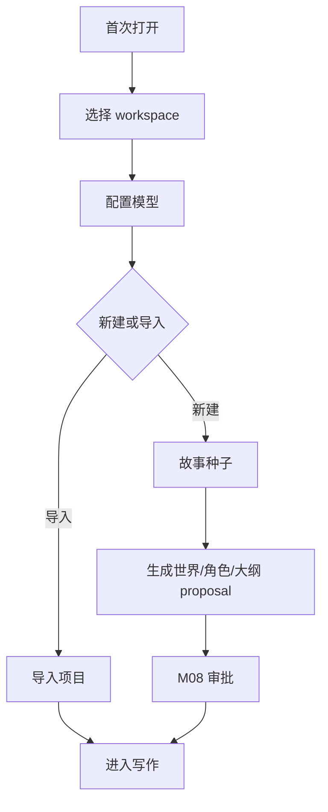

# M15 · Onboarding And New Book

Onboarding 把新作者带到第一个可写项目。New Book Journey 把故事种子变成可审阅的初始世界,但不把所有高级设置塞进首启。

## 旅程

首启只验证核心路径:保存项目、模型可用、能进入写作。高级控制交给 Settings。

## 开书产物

| 产物 | 说明 |
|---|---|
| 世界观草案 | 只作为 proposal |
| 主角/关键角色 | 可逐项审阅 |
| 卷纲/章节方向 | 可编辑后接受 |
| 样例项目 | 用于快速体验,不污染真实项目 |

## 失败收场

| 失败 | 用户看到 | 系统不能做 |
|---|---|---|
| workspace 不可写 | 首启停在路径选择 | 创建假项目 |
| 模型不可用 | 允许稍后配置或重试 | 标记 AI ready |
| 种子不足 | 追问或提供样例 | 编造不可追溯设定 |
| 导入冲突 | 选择合并/另存/取消 | 覆盖文件 |

## Design

首启视觉见 [design/05](../design/05-onboarding.md)。产品承诺应同步到 plan 能力章。

## 测试清单

| 类型 | 场景 |
|---|---|
| 首启 | workspace/model/project 三步可恢复 |
| 新书 | 产物进入审批而非直接落盘 |
| 导入 | 冲突不覆盖 |
| 样例 | 样例与用户项目隔离 |

## FAQ

**Q: 首启时能不能跳过模型配置?**

A: 可以进入有限模式,但 AI 能力必须显示为 unavailable,不能让用户误以为模型已经可用。

**Q: 样例项目会不会污染真实项目的记忆或经验?**

A: 不能。样例项目必须隔离存储和经验学习,除非用户明确复制内容到自己的项目。
