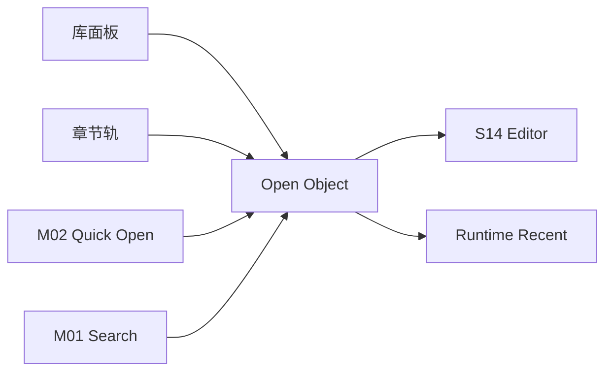

# M16 · Project Library And Navigation

Project Library And Navigation 定义作者如何选择项目并定位作品材料:项目选择页、主界面左上项目入口、章节轨、库面板、最近打开、多章对照。

## 导航对象

| 对象 | 用户动作 |
|---|---|
| Project | 启动时选择/创建,主界面左上返回项目选择,归档或删除走项目生命周期 |
| Chapter | 章节轨切换、最近打开、对照打开 |
| Setting | 库面板打开角色/世界观/大纲 |
| Recent | 快速回到最近材料 |
| Compare View | 并排查看章节或设定 |

## 路由

导航不改变作品事实。删除、归档等危险操作进入 [R01](./platform/R01-project-lifecycle.md),不进入 Settings。

Open Novel 是单实例单窗口应用。二次启动只聚焦既有窗口,可以把打开路径交给既有窗口处理,但不能创建第二窗口。切换项目发生在同一个窗口内:如果当前项目有 active turn、pending approval 或未保存编辑,必须先给出处理选择,不能在后台保留另一个可写/只读项目窗口。

## 失败收场

| 失败 | 用户看到 | 系统不能做 |
|---|---|---|
| 文件缺失 | 显示缺失和修复入口 | 创建空文件假装存在 |
| 外部改动 | 要求重载/保留/合并 | 覆盖用户改动 |
| 最近项失效 | 标记失效并可移除 | 跳错对象 |
| 对照打开失败 | 保留当前纸面 | 关闭当前章节 |
| 二次启动 | 聚焦既有窗口并进入项目选择或打开请求处理 | 创建第二窗口 |
| 切换项目前有待审 | 要求处理 pending 或明确放弃 | 后台保留旧项目窗口 |

## Design

章节轨、库面板和对照心智见 [design/01](../design/01-main-layout.md)。

## 测试清单

| 类型 | 场景 |
|---|---|
| 打开 | 章节/设定/最近项/搜索结果 |
| 对照 | `Cmd+Enter` 不覆盖当前纸面 |
| 缺失 | 文件缺失清晰提示 |
| 外部改动 | 不覆盖未保存内容 |
| 单窗口 | 二次启动聚焦既有窗口;项目切换不创建第二窗口 |

## FAQ

**Q: Project Library 和 Universal Search 的区别是什么?**

A: Project Library 是结构化导航,强调“我知道要打开什么”;Universal Search 是全局召唤入口,强调“我想找相关结果”。

**Q: 最近项指向的文件不存在时怎么办?**

A: 标记失效并提供移除或定位修复入口;不能创建空文件来假装最近项仍然有效。
