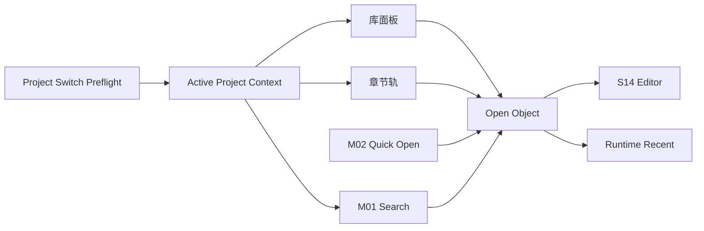

# M16 · Project Library And Navigation

Project Library And Navigation 定义作者如何选择项目并定位作品材料:项目选择页、主界面左上项目入口、章节轨、库面板、最近打开、多章对照。

本篇也是多项目隔离的能力级主权位置:同一个窗口里同一时刻只能有一个 active project context。切换项目不是打开第二个工作台,而是先把当前项目安全收口,再挂载目标项目。

## 导航对象

| 对象 | 用户动作 |
|---|---|
| Project | 启动时选择/创建,主界面左上返回项目选择,归档或删除走项目生命周期 |
| Chapter | 章节轨切换、最近打开、对照打开 |
| Setting | 库面板打开角色/世界观/大纲 |
| Recent | 快速回到最近材料 |
| Compare View | 并排查看章节或设定 |

## 路由

导航不改变作品事实。删除、归档等危险操作进入 [R01](./platform/R01-project-lifecycle.md),不进入 Settings。

Open Novel 是单实例单窗口应用。二次启动只聚焦既有窗口,可以把打开路径交给既有窗口处理,但不能创建第二窗口。切换项目发生在同一个窗口内,不得在后台保留另一个可写或只读项目窗口。

## 单窗口切换契约

项目切换必须按以下顺序完成:

1. 对当前项目做 preflight:检查 active turn、applying、pending approval、未保存编辑、外部编辑冲突和索引健康状态。
2. 关闭当前项目的 UI 订阅、Search overlay、preview cache、编辑器打开对象和 watcher view;未收口的事项只以当前 project id 写回对应项目账本或 runtime bucket。
3. 挂载目标项目:加载目标 project id 的文件、runtime recent、query history、session history、pending/recovery 状态和上次打开位置。
4. 目标项目进入可操作状态后,全局 recent projects 记录本次打开;项目内 recent objects 只写入目标项目分桶。

切换前的阻断和选择:

| 当前项目状态 | 切换前必须处理 | 切换后恢复 |
|---|---|---|
| active turn 尚在运行 | 等待完成,或执行 stop/cancel path;已产生 durable change 的运行必须进入 S03 终态或 cancel plan,不能静默丢弃。 | 回到源项目时只显示 terminal recap、可重试点或待处理 cancel plan;不自动重放危险动作。 |
| applying / 写入中 | 阻断切换直到写入成功、失败或进入明确恢复流程。 | 若失败,源项目显示 apply/recovery 状态;目标项目不继承该状态。 |
| pending approval | 允许显式选择“留待稍后”并冻结在源项目,也可先处理、拒绝或取消;未接受的卡不能跨项目应用。 | 回到源项目时恢复 pending 卡和来源状态;若离开期间文件被外部改动命中,卡片按 S14 失效/重审。 |
| 未保存编辑 | 必须保存到源项目、丢弃或留在当前项目;不能把草稿带到目标项目,也不能后台保留编辑器。 | 保存失败则停在源项目;丢弃后不生成事实变更。 |
| 外部编辑冲突 | 必须按 S14/R04 选择重载、保留或进入冲突处理;不能切换后再覆盖。 | 冲突只属于源项目,目标项目不显示源项目冲突。 |

active turn、pending approval 和未保存编辑都是 project-scoped。它们不会迁移到目标项目,也不会在旧项目后台继续推进。目标项目只能看到自己的 pending/recovery/runtime 状态;如果目标项目也有 pending approval,进入后按目标项目自己的锁定规则展示。

## Runtime 与历史分桶

全局 `runtime.db` 可以记录 recent projects、窗口大小、最后打开 project id 这类桌面壳级状态;项目内运行数据必须按 project id 分桶。

| 状态 | 分桶规则 |
|---|---|
| recent objects | 每个项目独立排序和失效标记;项目 A 的最近章节不能进入项目 B 的库面板或 Search 排序。 |
| query history | Universal Search 历史、选区查询历史和 fact answer cache 只在当前项目分桶读取。 |
| preview cache | hover preview、章节摘要和对象摘要带 project id;切换项目时清空内存缓存,只能从目标分桶重建。 |
| runtime history hint | 当前 turn、recap hint、activity hint 和继续入口只引用当前项目 session history。 |
| 编辑器状态 | 打开对象、光标、滚动位置、对照视图和未保存草稿只属于源项目;目标项目从自己的状态恢复。 |

任何跨项目 recent 只允许出现在项目选择页或全局 recent projects 区域,显示为“打开项目”动作。它不能作为当前项目内对象命中、事实来源或排序加权。

## 样例项目隔离

样例项目是带 `sample` 标记的独立项目上下文。它可以帮助作者体验完整工作台,但不能成为真实项目的数据来源。

规则:

- 样例项目有独立 project id、runtime bucket、query history、pending approval、session history 和 recent objects。
- 样例项目可出现在 recent projects,但必须标记为“样例”;真实项目的 Search、库面板、经验学习和 ReaderPanel 不读取样例分桶。
- 样例里的作者操作默认只影响样例副本。用户选择“用样例开新书”时,系统创建新的真实项目 id,只复制用户明确选择的作品内容,不复制样例的 pending approval、runtime history、query history、经验候选或诊断历史。
- 删除、重置或升级样例项目不能触碰真实项目目录。

## 恢复入口

项目切换中断时,恢复规则以“不能误挂载目标项目、不能丢失源项目收口状态”为准。

| 中断点 | 重启后用户看到 | 系统不能做 |
|---|---|---|
| preflight 前崩溃 | 回到最后 active project 或项目选择页 | 假装切换已经开始 |
| 当前项目已冻结、目标未挂载 | 项目选择页显示源项目有待恢复状态 | 自动把目标项目设为 active |
| 目标挂载失败 | 停留在源项目或项目选择页,说明目标不可打开 | 清空源项目 pending / recent / 编辑状态 |
| runtime bucket 损坏 | 当前项目仍可从项目文件打开,损坏的 recent/history 标记不可用 | 用其他项目 bucket 补齐历史 |

## 失败收场

| 失败 | 用户看到 | 系统不能做 |
|---|---|---|
| 文件缺失 | 显示缺失和修复入口 | 创建空文件假装存在 |
| 外部改动 | 要求重载/保留/合并 | 覆盖用户改动 |
| 最近项失效 | 标记失效并可移除 | 跳错对象 |
| 对照打开失败 | 保留当前纸面 | 关闭当前章节 |
| 二次启动 | 聚焦既有窗口并进入项目选择或打开请求处理 | 创建第二窗口 |
| 切换项目前有 active turn | 等待、停止、取消或进入恢复说明 | 让旧项目运行在后台 |
| 切换项目前有 pending approval | 留待稍后、处理、拒绝或取消 | 把待审卡应用到目标项目 |
| 切换项目前有未保存编辑 | 保存、丢弃或留在当前项目 | 把未保存草稿带到目标项目 |
| 目标项目打开失败 | 保留源项目或回到项目选择页 | 清空源项目状态 |

## Design

章节轨、库面板和对照心智见 [design/01](../design/01-main-layout.md)。

## 测试清单

| 类型 | 场景 |
|---|---|
| 打开 | 章节/设定/最近项/搜索结果 |
| 对照 | `Cmd+Enter` 不覆盖当前纸面 |
| 缺失 | 文件缺失清晰提示 |
| 外部改动 | 不覆盖未保存内容 |
| 单窗口 | 二次启动聚焦既有窗口;项目切换不创建第二窗口 |
| 切换隔离 | active turn、pending approval、未保存编辑和 runtime history 按项目收口/恢复 |
| 样例隔离 | 样例项目不污染真实项目 Search、recent、经验和审批历史 |

## FAQ

**Q: Project Library 和 Universal Search 的区别是什么?**

A: Project Library 是结构化导航,强调“我知道要打开什么”;Universal Search 是全局召唤入口,强调“我想找相关结果”。

**Q: 最近项指向的文件不存在时怎么办?**

A: 标记失效并提供移除或定位修复入口;不能创建空文件来假装最近项仍然有效。
