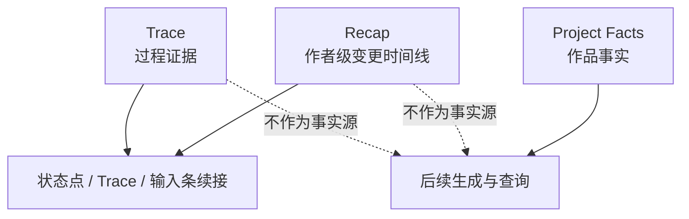
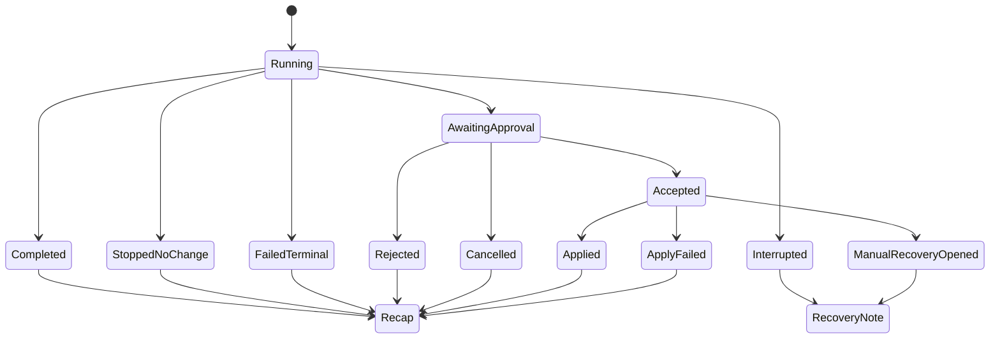

# M17 · Turn Recap And Continuation

Turn Recap And Continuation 是作者看得懂的项目变更时间线。它回答的不是“系统内部怎么跑”,而是“这一轮结束后,项目发生了什么,哪些结果还能用,下一步可以怎么继续”。

## 为什么它是独立能力

作者不应该理解 Git、commit、reset 或 force push。Open Novel 的项目历史只向前追加:系统可以撤销一次修改、恢复到历史内容、重新运行或继续剩余步骤,但这些都表现为新的审定动作和新的 recap,不会改写历史。

Recap 因此承担普通用户的 changelog:

| 用户问题 | Recap 回答 |
|---|---|
| 刚才到底完成了什么 | 本轮状态、完成事项、可用结果 |
| 作品有没有被改 | 是否写入正文/设定、影响范围 |
| 哪些没做完 | 未完成步骤、失败或停止原因 |
| 下一步能做什么 | 查看详情、继续、重新运行、生成恢复提案 |
| 以后怎么追溯 | 时间线、筛选、跳转来源、作者备注 |

Recap 是用户回执,不是作品事实。后续生成仍以项目文件、审批记录和 story world 为准。

## 三层记录

| 层 | 面向谁 | 作用 | 是否可改写 |
|---|---|---|---|
| Recap | 作者 | 今天做了什么、改了什么、停了什么、为什么 | 原始记录只读,只能追加备注或更正 |
| Trace | 调试 / 审计 | Agent、工具、上下文、失败点 | 过程日志不可作为业务事实修改 |
| Project Facts | 创作系统 | 作品世界里什么是真的 | 只能经作者审定或直接编辑改变 |

## 每个 terminal turn 都有 recap

M17 不定义 turn 终态,只消费 [S03 · Canonical turn terminal enum](./S03-turn-orchestration.md#canonical-turn-terminal-enum)。Recap 不只出现在失败或取消后:凡是已经进入 S03 turn 的动作,只要达到 `Completed`、`StoppedNoChange`、`Cancelled`、`Rejected`、`Applied`、`ApplyFailed` 或 `FailedTerminal`,都生成一条项目级记录。`Interrupted` 与 `ManualRecoveryOpened` 先生成 recovery note,待用户恢复、取消或人工处理后再由新的 canonical terminal result 生成 recap。

`AwaitingApproval` 不是终态。它可以生成 pending activity item,显示待审范围和恢复入口,但不能生成“已完成/已放弃”的 recap。本地打开、搜索、预览和跳转是否进入 activity/recap,由 TODO-P1-52 的触发矩阵收口。

## Recap 的内容

| 区块 | 示例 | 必须性 |
|---|---|---|
| 状态 | S03 canonical terminal result 的用户语言:已完成 / 已停止 / 已取消 / 已拒绝 / 已生效 / 生效失败 / 已失败 / 需恢复 | 必须 |
| 作品影响 | 没有修改正文或设定 / 已同步 8 处称谓 | 必须 |
| 可用结果 | 读者评审 2/5、节奏诊断初稿 | 有则显示 |
| 未完成 | 一致性复核、最终建议 | 有则显示 |
| 用户决定 | 通过、拒绝理由、放弃原因 | 有则显示 |
| 下一步 | 查看详情、继续剩余步骤、重新运行、生成恢复提案 | 有则显示 |
| 来源跳转 | 审批卡、章节段落、Trace step | 有则显示 |
| 作者备注 | “这次改名是临时尝试” | 用户追加 |

Recap 用用户语言,不暴露表名、工具参数、provider payload 或内部 prompt。

## 展示层级

| 层级 | 位置 | 内容 |
|---|---|---|
| 状态点旁 | 一句话 | “已停止 · 没有修改 · 查看 recap” |
| Trace 面板 | 完整 recap | 状态、影响、可用结果、未完成、下一步 |
| 输入条上方 | 续接提示 | 只在用户可能继续时出现,如“继续剩余步骤 / 重新运行” |
| Activity 时间线 | 历史列表 | 按时间查看、筛选、搜索、跳来源 |

状态点不常驻堆历史。它只提示最近一条需要注意的 recap;完整历史在 Activity 时间线和 Trace 中查看。

## Forward-only correction

用户侧不暴露 Git 式回退。所有“撤销”和“恢复”都向前追加:

| 用户意图 | 产品动作 | 结果 |
|---|---|---|
| 撤销这次修改 | 生成反向修改提案 | 审定后追加新 recap |
| 恢复为昨天这里的内容 | 基于历史 recap / 快照生成恢复提案 | 审定后追加新 recap |
| 说明这次为什么这么改 | 给 recap 添加作者备注 | 追加备注,不改原记录 |
| 系统 recap 写错 | 追加更正说明或 correction recap | 原记录保留 |
| 不想看某类历史 | 筛选 / 归档 | 不删除、不改写原记录 |

反向修改和恢复提案本质上都会改变正文或设定,必须进入审批。Recap 只能发起这些动作,不能绕过审批直接改文件。

## 停止运行中任务

运行中且没有 durable change 时,用户点停止不需要二次确认。系统立即终止剩余工作,生成 stopped recap:

> 已停止本次任务。没有修改正文或设定。  
> 已完成:读者评审 2/5、节奏诊断初稿。  
> 未完成:一致性复核、最终建议。  
> 可继续:查看 recap / 继续剩余步骤 / 重新运行。

如果已经生成 pending ChangeSet、开始落盘或存在不可自动恢复风险,取消入口必须交给 [S03](./S03-turn-orchestration.md) 的 cancel plan,由用户确认具体影响。

## 和学习系统的边界

Recap 本身不等于经验。Reflector 只能从作者审定、明确反馈和完成的交互中学习。用户主动停止、放弃或拒绝的 turn 可以有 recap,但不能因为 recap 存在就进入经验学习。

| Recap 状态 | 是否可学习 | 原因 |
|---|---|---|
| `Applied` 且有作者审定 | 可以 | 用户作出了明确决定 |
| `StoppedNoChange` | 不可以 | 用户只是中止,不是偏好 |
| `Cancelled` / `Rejected` | 只可记录取消/拒绝理由,不自动学成偏好 | 需要明确反馈才可学习 |
| forward-only correction 后的新 `Applied` | 可从最终审定结果学习 | 修正动作本身经作者确认 |
| `Interrupted` / `ManualRecoveryOpened` | 不可以 | 结果尚未安全收场 |

## 失败收场

| 失败 | 用户看到 | 系统不能做 |
|---|---|---|
| recap 生成失败 | turn 结果仍可见,历史标记 recap 缺失 | 阻断已审批落盘 |
| activity 写入失败 | 告知历史记录未保存 | 假装已进入 changelog |
| 来源跳转失效 | 标记来源不可达,保留文字记录 | 跳到错误章节 |
| correction recap 失败 | 原 recap 保留,提示更正未保存 | 覆盖原记录 |
| Trace 缺失 | recap 保留用户级结果,标明过程证据不完整 | 用 recap 伪造 Trace |

## FAQ

**Q: Recap 可以作为后续生成上下文吗?**

A: 默认不能当事实源。用户明确要求“根据上次 recap 继续”时,它可以作为参考材料,但与项目事实冲突时必须让位。

**Q: 用户能不能删除一条 recap?**

A: 原始 recap 不删除、不改写。可以归档、筛选或隐藏某类记录,但历史账本保持 append-only。

**Q: 为什么撤销也要审批?**

A: 因为撤销会产生新的正文或设定变更。它不是时间倒流,而是向前追加一条反向修改。

**Q: Recap 和 CHANGELOG.md 是一回事吗?**

A: 不是。仓库的 CHANGELOG 是文档维护流水线;M17 的 Recap 是产品内作者可见的项目活动时间线。

**Q: 正常完成也需要 recap 吗?**

A: 需要。否则用户只有异常时才看到历史,无法把 recap 当日常项目 changelog。

## Appendix

- [appendix/json-schemas](./appendix/A02-json-schemas.md) 保存 recap payload、activity item 和作者备注 schema。
- [appendix/event-catalog](./appendix/A03-event-catalog.md) 保存 recap created、note added、correction requested 和 continuation action 事件。
- [appendix/testing-matrix](./appendix/V01-test-matrix.md) 保存 append-only、续接、恢复、停止和审批联动测试。
