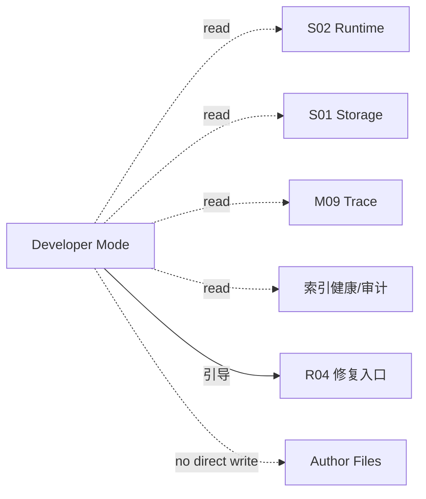

# M18 · Developer Mode

Developer Mode 是只读诊断层:它回答「系统刚才到底做了什么、为什么这么做」,不是修复入口,也不是第二事实源。本篇用「事故剧本」组织:从一次出问题的 turn 出发,讲清开发者视角能看到什么、不能动什么、修复动作往哪走。

## 一次事故的诊断路径

作者发现某个 turn 输出异常。打开 Developer Mode 后,他能看到该 turn 的全量 Trace 层级、派生文件、索引健康度和审计结果——全部只读。如果诊断指向索引损坏,Developer Mode 不提供「一键修复」按钮,而是把用户引导到 [R04 · Index Health And Repair](./platform/R04-index-health-and-repair.md) 的修复入口;修复属于危险操作,必须有独立确认和可见的失败收场。诊断包的生成与排障流程归 [R05 · Diagnostics And Debug Mode](./platform/R05-diagnostics-and-debug-mode.md)。

## 边界铁律

| 边界 | 含义 |
|---|---|
| 只读 | 不能写作者文件、项目事实、经验或设置 |
| 不绕审批 | 看到 ChangeSet JSON 不等于能让它落盘;一切写入仍走 [M08 审批](./M08-approval-cascade.md) |
| 不当事实源 | 过程日志、Trace 和派生文件不能被用来"恢复"作品事实;事实主权在项目存储 |
| 修复走 R04 | 任何修复类动作进入 [R04](./platform/R04-index-health-and-repair.md) 或危险操作确认,不能藏在 debug 面板里直接执行 |
| secret 遮蔽 | 诊断视图不暴露凭据明文,遵守 [I05](./platform/I05-desktop-shell-contract.md) 凭据主权 |

## 可见内容分层

Developer Mode 与 [M09 · Trace Observability](./M09-trace-observability.md) 的分工:M09 定义所有用户默认可见的可读过程证据;Developer Mode 在其之上解锁开发者层。

| 层 | 默认可见 | Developer Mode 可见 |
|---|---|---|
| 用户可读 Trace | 是 | 是 |
| Trace 全量层级(原始事件、工具调用明细) | 否 | 是,只读 |
| `_` 前缀派生文件 | 否(文件列表隐藏) | 是,标「派生」且 read-only |
| ChangeSet JSON | 否 | 是,只读入口 |
| 索引健康度 / 审计结果 | 否 | 是,修复跳转 R04 |
| Debug 面板 | 折叠 | 默认展开 |

入口在 Settings 的 Developer 区(见 [M14 · Settings](./M14-settings.md)):单 toggle,开启后全局生效,不改变任何写入语义。

## 失败收场

| 失败 | 用户看到 | 系统不能做 |
|---|---|---|
| Developer 数据缺失 | 诊断不完整提示 | 影响作品事实或编造缺失环节 |
| Trace 层级损坏 | 该层标记不可读 | 静默隐藏或回填 |
| 索引审计失败 | 健康度显示未知 + R04 入口 | 自动触发修复 |
| 派生文件读取失败 | 该文件显示读取错误 | 把派生内容当事实回写 |

## 测试清单

| 类型 | 场景 |
|---|---|
| 只读 | Developer Mode 全程不产生任何 durable change |
| 审批 | ChangeSet JSON 视图无落盘路径 |
| 分层 | 关闭时派生文件和全量 Trace 不可见 |
| 修复 | 修复动作必经 R04 / 危险操作确认 |
| 遮蔽 | 诊断视图无 secret 明文 |

## FAQ

**Q: Developer Mode 能不能修数据库?**

A: 不能。它是只读诊断入口;修复工具必须走 R04 并有独立危险操作确认。

**Q: Developer Mode 和 M09 Trace 是什么关系?**

A: M09 是所有用户的可读过程证据;Developer Mode 只是解锁更深的只读层级,不改变 Trace 的事实地位。

**Q: 能不能从过程日志恢复被误删的正文?**

A: 不能把日志当事实源。恢复路径归项目存储与 [R04](./platform/R04-index-health-and-repair.md) / [R05](./platform/R05-diagnostics-and-debug-mode.md) 的恢复契约。
