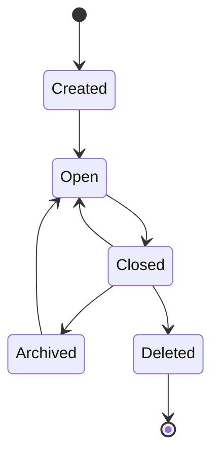

# R01 · Project Lifecycle

Project Lifecycle 定义项目如何创建、打开、关闭、归档和删除。它是可靠性流程,不是日常写作能力。

## 生命周期

## 操作边界

| 操作 | 必须检查 |
|---|---|
| 创建 | workspace 可写、模板完整 |
| 打开 | 文件存在、schema 兼容、索引健康 |
| 关闭 | active turn、pending approval、未保存内容 |
| 归档 | 不影响可恢复数据 |
| 删除 | 二次确认和备份提示 |

## 失败收场

| 失败 | 用户看到 | 系统不能做 |
|---|---|---|
| 打开失败 | 原因和修复建议 | 创建假项目 |
| 关闭冲突 | 先处理 turn/approval | 丢 pending |
| 删除失败 | 残留范围 | 列表假删除 |
| 异常退出 | 下次恢复到持久状态 | 用 UI 内存恢复事实 |

## FAQ

**Q: 关闭项目是否会自动取消正在运行的 turn?**

A: 不会静默取消。系统必须要求用户先完成、取消或保存恢复点,否则关闭动作会破坏事务边界。

**Q: 归档和删除的区别是什么?**

A: 归档是从日常列表移走但保持可恢复;删除是破坏性动作,必须有二次确认和备份提示。
