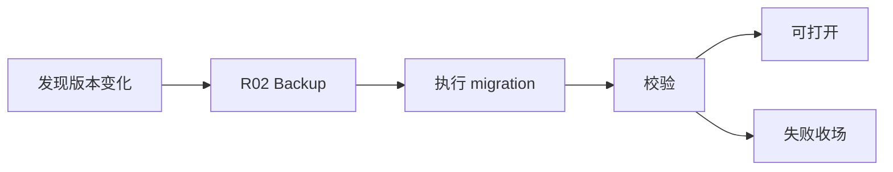

# R03 · Migration And Upgrade

Migration And Upgrade 定义本地数据结构和应用版本升级的可靠性流程。

## 原则

| 原则 | 含义 |
|---|---|
| 先备份 | 升级前有恢复点 |
| 单向明确 | migration 不伪装可逆 |
| 可见进度 | 长迁移展示阶段 |
| 失败可解释 | 用户知道数据处于什么状态 |

## 流程

## 失败收场

| 失败 | 用户看到 | 系统不能做 |
|---|---|---|
| migration 中断 | 当前阶段和恢复点 | 继续打开不兼容项目 |
| schema 不兼容 | 升级要求 | 静默忽略字段 |
| native binding 变化 | 需要重试/换路线 | 假装索引可用 |

## FAQ

**Q: migration 能不能在用户不知情时后台跑完?**

A: 小型无风险校验可以自动完成;会改变数据结构、耗时明显或可能失败的迁移必须可见并有恢复点。

**Q: 旧版本项目打开失败是否应该自动创建新项目?**

A: 不能。打开失败要解释兼容性和迁移路径,不能用新项目掩盖旧数据不可读。
