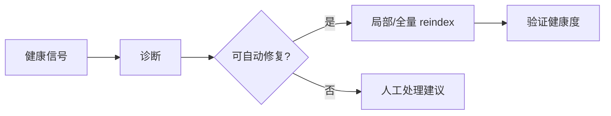

# R04 · Index Health And Repair

Index Health And Repair 定义派生索引的健康检查、重建和修复。索引坏了不等于作品坏了,但必须可见。

## 健康信号

| 信号 | 说明 |
|---|---|
| stale | 文件新于索引 |
| missing anchor | 段落锚点失效 |
| embedding missing | 语义召回不完整 |
| KG conflict | 图谱事实冲突 |
| watcher degraded | 外部改动监听不可靠 |

## 修复流

## 失败收场

| 失败 | 用户看到 | 系统不能做 |
|---|---|---|
| reindex 失败 | 索引仍过期 | 隐藏 warning |
| anchor 修复失败 | 标记需人工处理 | 跳错来源 |
| embedding 失败 | 语义召回降级 | 影响精确查询 |
| KG 冲突 | 展示冲突来源 | 自动裁决 |

## FAQ

**Q: 索引坏了是否会影响正文事实?**

A: 不影响正文事实。它影响搜索、查询、影响分析和上下文装配,因此这些能力必须降级或提示。

**Q: 自动修复失败后能不能继续写作?**

A: 可以继续纯编辑,但依赖索引的高风险 Agent 能力必须被标记 degraded 或阻断。
