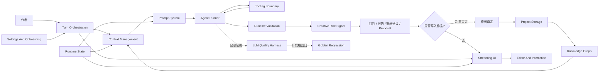
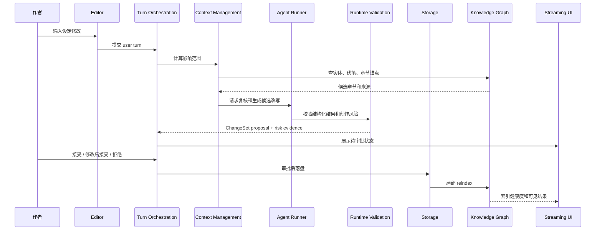
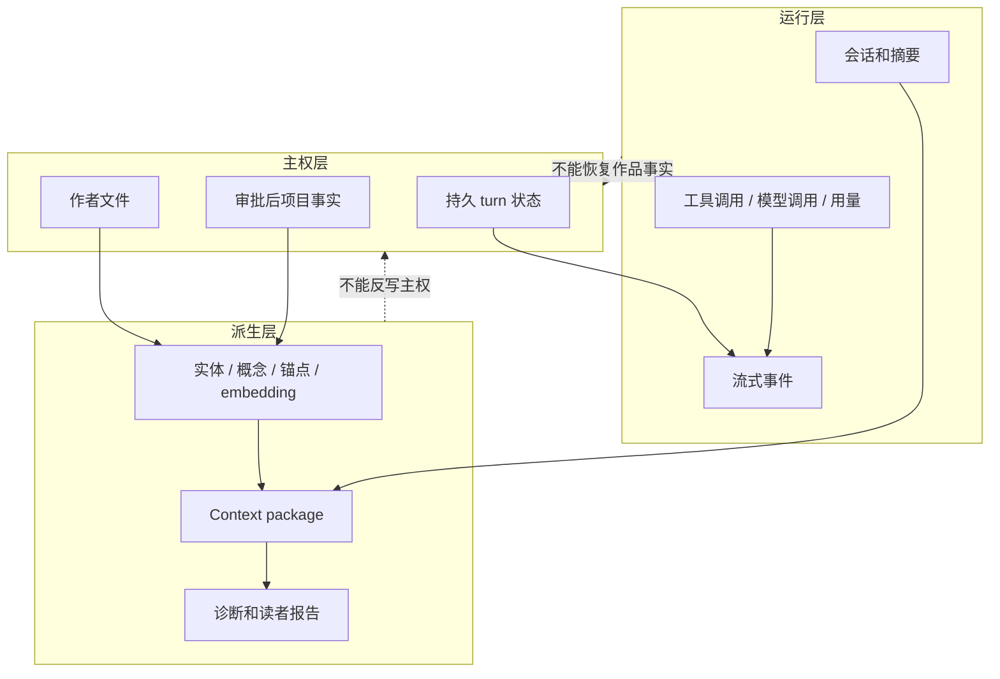

# S00 · System Contract

这是一张系统总图,不是目录。读完本篇,实现者应该能回答三个问题:一次创作请求会穿过哪些层,每层最多能做什么,哪类失败必须停下来让用户或文档重新裁决。

本篇的写法刻意不像其他 spec:它是全局契约地图。细节进入后面的专题文档;这里保留系统的不可让渡规则、读文档的顺序和跨层事故处理方式。

## 十分钟读法

先看这张图。Open Novel 的主路径只有一条:作者提出意图,系统装配事实和 prompt,Agent Runner 受控执行,运行时校验与创作风险信号进入可审定结果,作者审定,项目存储落盘,知识图谱更新,UI 把过程透明展示出来。开发期 harness 和 golden regression 记录并验收这条链路,但不等于每次用户请求里的业务节点。

如果只能记住一件事,就是:系统可以自动分析、自动提议、自动解释,但不能静默改变作品事实。任何看起来“方便”的捷径,只要绕过作者审定、主权边界或可恢复状态,都是架构错误。

## 三条系统律

| 系统律 | 具体含义 | 一旦违反会发生什么 |
|---|---|---|
| 作者文件优先 | 章节、设定、大纲、角色卡等可读文件和审批后事实是作品主权来源 | 派生索引、会话历史、Trace 都不能覆盖作品事实 |
| 提议先于写入 | Agent 输出只能是回答、报告、批阅建议或可审批 proposal | 直接写盘、隐式落盘、模型自批自改都视为阻断级错误 |
| 可解释失败优先于猜测继续 | 关键事实、上下文、索引、结构化输出缺失时必须显式失败或降级 | 不允许用默认值、自然语言猜测或静默裁剪伪装成功 |

这三条系统律高于单篇 spec 的局部便利。后续文档只是在各自领域解释它们如何落地。

## 一次“改角色设定”的完整旅程

用一个具体场景理解系统:作者把主角的能力代价从“失眠”改成“短暂失明”,并要求全书同步。

这个旅程里没有任何一步允许 Agent “顺手改文件”。影响范围由索引和规则先找出,模型只复核和生成候选;用户一次看全再决定;落盘后再刷新派生索引。

## 层与层之间的主权线

主权层决定业务结果。派生层提高查询和写作能力。运行层解释过程。三者可以互相引用,但不能互相伪装。

## 技术路线的边界

| 决策 | 当前路线 | 根层关心的理由 |
|---|---|---|
| 应用形态 | 桌面壳是唯一主产品形态,采用 Tauri(多端 macOS / Windows / Linux),应用单实例单窗口运行;壳内常驻执行宿主拥有 runner、本地数据库、watcher、写入记录、启动恢复扫描和安全凭据,宿主以 Tauri 管理的 sidecar 进程承载(进程形态与 native binding 兼容性经 V03 实查后落定),renderer 只发命令并订阅状态 | 用户数据在本机;路径、权限、长任务、键位和凭据不能依赖普通浏览器标签页生命周期 |
| Agent loop | 自定义 runner 显式控制模型调用、结构化输出、retry、tool loop 和 stream | 不把审批、memory、workflow 交给黑盒框架 |
| LLM 质量闭环 | runtime validation / creative risk 进入用户请求;harness / golden regression 属于记录、回放和开发期合入门禁 | 运行时失败语义和开发期质量门禁不能混成同一个业务节点 |
| 存储 | 作者可读文件 + 本地数据库 + 派生索引 | 兼顾可迁移、可查询和可恢复 |
| 状态机实现 | 状态机库只是实现方式;turn、mode、approval、obligation 和 recovery 的主权语义在 S03/S01/S14 | 不能让库名、前端 tab 或临时 UI 状态定义业务结果 |
| UI | 写作纸面为主体,过程通过状态点、Trace、审批卡、Universal Search 和查询浮层暴露 | 过程透明,但不让日志淹没写作 |
| 明细归口 | 字段、schema、模板全文、工具参数、测试矩阵、golden 明细和 spike 证据进 appendix;接入、恢复、迁移、诊断契约进 platform | 核心 spec 读完必须懂设计,不被字段表打断 |

这条路线不再保留基于浏览器的 Web 调试形态。早期实现可以使用桌面壳开发构建、renderer 热更新、DevTools 和诊断开关来提速,但进程边界、权限、凭据、长任务、stream 恢复、watcher、SQLite 写入隔离和崩溃恢复始终按桌面壳生产形态设计。具体边界由 [I05](./platform/I05-desktop-shell-contract.md) 约束。

具体包版本、字段定义、JSON schema 和命令参数不是本篇职责。它们只有在会改变系统律或失败语义时才回到根层。

## 外部事实审计闸门

有些事实不能靠文档想象,必须在代码前实查。它们不是“实现细节”,因为一旦不成立,主路径会变。

| 审计对象 | 必须证明什么 | 失败后的处理 |
|---|---|---|
| 模型能力 | 上下文长度、结构化输出、流式行为满足核心路径 | 不伪装支持;进入 V03 或换路线 |
| Runner 能力 | stop、tool result、stream callback 能端到端工作 | 不能让 Agent loop 处在半隐式状态 |
| Prompt / tool / harness | prompt cache、tool marker、二次 LLM、replay evidence 和 golden gate 可证明 | 不能让 LLM 质量闭环停在文档愿望 |
| 本地数据库和向量扩展 | native binding、WAL、JOIN、热重载连接稳定 | 写入和索引能力未验证前不进入实现主路径 |
| 文件系统 | workspace 权限、外部编辑监听、原子写/回滚可行 | 不允许出现“UI 成功、文件失败”的假状态 |
| 前端交互 | 编辑器、IME、快捷键、断线恢复符合 design/spec 契约 | 不能让交互层绕过 turn 状态 |

审计证据归 `V03`,测试矩阵归 `V01`,golden 明细归 `V02`;行为契约回写对应的根层 `S/M` 或 `platform/I/R` 文档。只有没有主权文档或需要用户重新裁决的问题才进入 TODO;路线变化必须同步 CHANGELOG。

## 读者导航

`S` 读系统主权,`M` 读用户能力,`platform/I` 读跨边界接入,`platform/R` 读运行可靠性。不要用旧的连续数字理解 spec;编号字母就是文档的阅读姿态。

| 想理解的问题 | 先读 |
|---|---|
| 系统记住什么、Reflector 关闭是什么意思 | [S01 · Runtime State](./S01-runtime-state.md) |
| Agent Runner 怎么运行、结构化输出和 retry 怎么收场 | [S02 · Agent Runner](./S02-agent-runner.md) |
| 一次 turn 怎么审批、取消和收场 | [S03 · Turn Orchestration](./S03-turn-orchestration.md) |
| UI 怎么看见过程、断线怎么恢复 | [S04 · Streaming UI Protocol](./S04-streaming-ui-protocol.md) |
| 实体、锚点、embedding 怎么维护 | [S05 · Knowledge Graph](./S05-knowledge-graph.md) |
| 上下文、分卷、影响分析和 overflow 怎么装配 | [S06 · Context Management](./S06-context-management.md) |
| prompt 分层、优先级和不可信内容围栏归哪 | [S07 · Prompt System](./S07-prompt-system.md) |
| 工具白名单、工具失败和二次 LLM 调用归哪 | [S08 · Agent Tooling Boundary](./S08-agent-tooling-boundary.md) |
| LLM run 如何记录、回放和复现失败 | [S09 · LLM Quality Harness](./S09-llm-quality-harness.md) |
| golden regression 和质量门禁如何阻断合入 | [S10 · Evaluation And Golden Regression](./S10-evaluation-and-golden-regression.md) |
| 五大守则和读者预演怎么进入审批 | [S11 · Creative Engine](./S11-creative-engine.md) |
| 去 AI 味如何不改剧情 | [S12 · Style And Humanizer](./S12-style-and-humanizer.md) |
| 编辑器、命令、焦点、查询怎么协作 | [S13 · Editor And Interaction](./S13-editor-and-interaction.md) |
| 作品文件和数据库怎么物理落盘 | [S14 · Project Storage](./S14-project-storage.md) |
| 审批裁定、写入、恢复和回执怎么留痕 | [S15 · 决策与写入账本](./S15-journal-and-ledger.md) |
| 文件被外部修改后还能不能安全应用建议 | [S16 · 文件版本与编辑安全](./S16-file-version-and-edit-safety.md) |
| 首启、设置、经验管理、危险操作归哪 | [M15 · Onboarding And New Book](./M15-onboarding-and-new-book.md)、[M14 · Settings](./M14-settings.md) |
| 全局搜索如何查角色、阵营、概念、章节和来源 | [M01 · Universal Search](./M01-universal-search.md) |
| 命令面板和快速打开如何分工 | [M02 · Command Palette / Quick Open](./M02-command-palette-and-quick-open.md) |
| 查询浮层如何只解释事实、不写作品 | [M03 · Fact Query](./M03-fact-query.md) |
| 讨论模式如何保证只聊不写 | [M04 · Discuss Mode](./M04-discuss-mode.md) |
| 规划模式如何只动设定和结构 | [M05 · Planning Mode](./M05-planning-mode.md) |
| 写作模式如何进入审批链 | [M06 · Writing Mode](./M06-writing-mode.md) |
| 选区改写和去 AI 味如何不越权 | [M07 · Inline Rewrite / Humanizer](./M07-inline-rewrite-and-humanizer.md) |
| 整批审批如何作为可审定模块落地 | [M08 · Approval Cascade](./M08-approval-cascade.md) |
| Trace 如何成为用户可读的过程证据 | [M09 · Trace Observability](./M09-trace-observability.md) |
| 角色、阵营、概念和世界观如何可见 | [M10 · Knowledge Surface](./M10-knowledge-surface.md) |
| ReaderPanel 如何生成和展示读者预演 | [M11 · ReaderPanel](./M11-reader-panel.md) |
| 经验如何可见、可调、可删 | [M12 · Memory / Learning Management](./M12-memory-learning-management.md) |
| 七个 AI 角色如何开关和限权 | [M13 · Agent Team Controls](./M13-agent-team-controls.md) |
| Settings 和 Developer Mode 如何分层 | [M14 · Settings / Developer Mode](./M14-settings.md) |
| 首启和开书向导如何落地 | [M15 · Onboarding / New Book](./M15-onboarding-and-new-book.md) |
| 项目库和章节轨如何导航 | [M16 · Project Library / Navigation](./M16-project-library-and-navigation.md) |
| 本轮完成、停止或修正后如何留下用户可读记录 | [M17 · Turn Recap / Continuation](./M17-turn-recap-and-continuation.md) |
| 模型 provider 如何接入和审计 | [I01 · LLM Provider Contract](./platform/I01-llm-provider-contract.md) |
| 编辑器适配层如何隔离实现 | [I02 · Editor Adapter Contract](./platform/I02-editor-adapter-contract.md) |
| 文件监听、原子写和冲突如何收场 | [I03 · Filesystem / Watcher](./platform/I03-filesystem-and-watcher.md) |
| 桌面壳和本地权限如何约束 | [I05 · Desktop Shell](./platform/I05-desktop-shell-contract.md) |
| 项目打开、关闭、归档如何定义 | [R01 · Project Lifecycle](./platform/R01-project-lifecycle.md) |
| 迁移升级如何确认与收场 | [R03 · Migration / Upgrade](./platform/R03-migration-and-upgrade.md) |
| 索引坏了如何降级和修复 | [R04 · Index Health / Repair](./platform/R04-index-health-and-repair.md) |
| 诊断包和 Debug Mode 如何保护隐私 | [R05 · Diagnostics / Debug Mode](./platform/R05-diagnostics-and-debug-mode.md) |

## 失败不是错误码

本项目里的“失败语义”不是列错误码,而是回答五个问题:谁还拥有真相,哪些结果已经生效,用户能看到什么,系统能否重试,哪些动作绝对不能自动做。

| 事故类型 | 真相归谁 | 系统能做 | 系统不能做 |
|---|---|---|---|
| Agent 输出坏了 | turn 状态和上下文包 | 重试、解释失败、要求用户调整输入 | 把坏 JSON 当自然语言猜出来 |
| 文件写入坏了 | 审批前快照和文件系统 | 停止落盘、保留 pending/failed 状态 | 标记审批已生效 |
| 索引刷新坏了 | 作者文件和审批后事实 | 标记索引过期、降级查询 | 用旧索引继续高风险生成 |
| stream 断了 | 持久 turn 状态 | 重连后恢复状态和 Trace | 用浏览器内存判断业务结果 |
| 经验学习坏了 | 本次审批结果 | 本次写入照常收尾、标记未学习 | 生成一条模糊经验继续注入 |

## FAQ

**Q: 为什么不把完整表结构直接放在每篇 spec 里?**

A: 因为读者首先需要理解系统行为。字段表会变化,主权边界和失败收场不能散落在字段里。

**Q: appendix 会不会又变成垃圾桶?**

A: 不允许。appendix 只放服务某篇契约的机器级明细;如果明细改变行为,必须回到对应的根层 spec 或 platform 文档。

**Q: 为什么不用通用 Agent 框架接管 workflow?**

A: 这里最关键的是审批、回滚、上下文、流式可观测性和文件主权。它们需要显式控制,不能藏在框架记忆或隐式 workflow 里。

**Q: Agent 能不能在用户授权后自动批量改?**

A: 可以批量生成 proposal,也可以在用户审批后批量落盘;不能跳过“用户看到并审定这一批具体变更”的动作。

**Q: 技术路线之后变了怎么办?**

A: 能力实查失败或实现证据推翻路线时,更新本篇的路线/审计闸门,同步相关根层 spec、platform 文档、TODO 和 CHANGELOG。

## Appendix

- [appendix/README](./appendix/README.md) 定义 active appendix 的范围。
- [appendix/A06-migration-notes](./appendix/A06-migration-notes.md) 记录迁移说明、版本影响摘要和历史归档说明。
- [appendix/V01-test-matrix](./appendix/V01-test-matrix.md) 记录实施前验证矩阵。
- [appendix/V03-external-spikes](./appendix/V03-external-spikes.md) 记录外部事实审计的原始 spike 证据。
