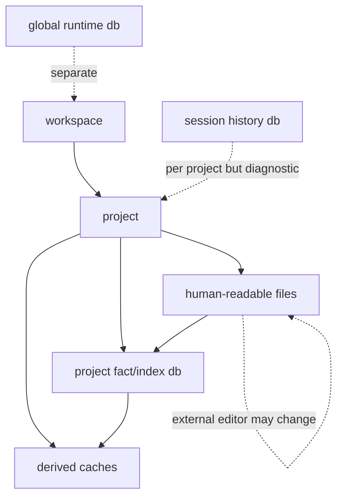
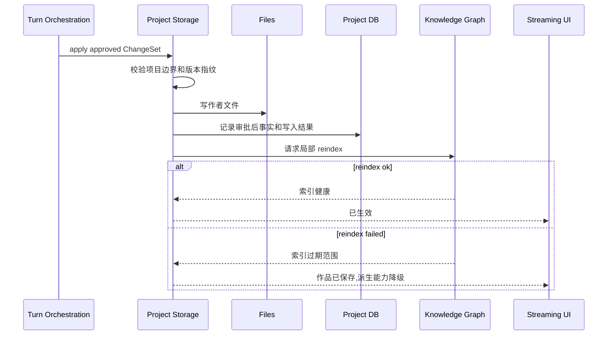
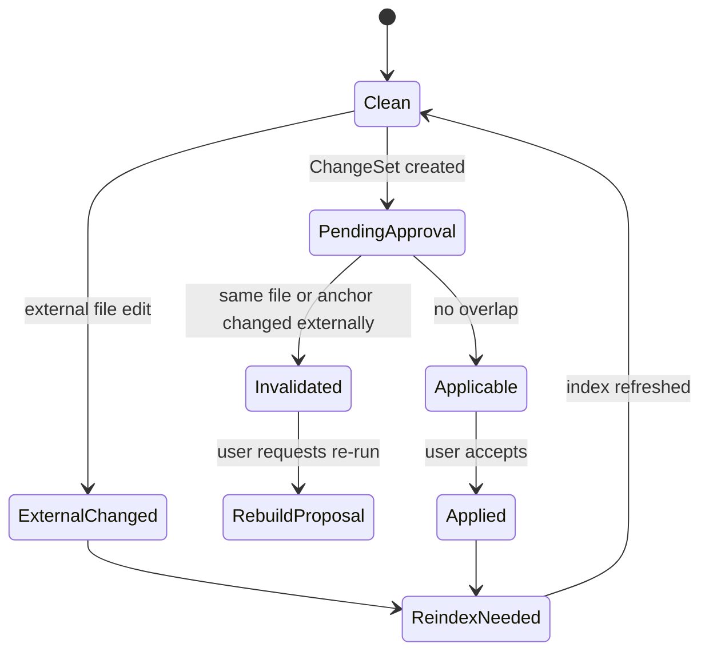

# S01 · Project Storage

这篇不是数据库设计,而是一份“作品事实保管协议”。它解释作者文件、项目事实库和派生索引如何一起工作,以及在外部编辑、写入失败、索引失败时系统如何避免撒谎。

## 两个开场事故

先用两个事故定义存储层。

| 事故 | 如果设计错误 | 本篇要求 |
|---|---|---|
| 作者在外部编辑器改了同一章,同时应用里还有一个待审批改写 | AI 提议被直接套到新文件上,覆盖作者刚改的内容 | 外部编辑让相关审批失效,用户重新审定 |
| 审批通过后文件写成功,索引刷新失败 | UI 显示“全部完成”,但查询和高亮还在旧事实上 | 作品事实生效,索引标记过期,下游能力显式降级 |

Project Storage 的核心价值不是“把数据存起来”,而是让每个事故都有可信的收场。

## 事实账本

| 对象 | 例子 | 是否作品真源 | 读者需要知道什么 |
|---|---|---|---|
| 作者文件 | 章节、设定、角色、大纲、项目元信息 | 是 | 可以被人直接打开、迁移、审查 |
| 审批后项目事实 | 已接受的 ChangeSet、文件版本、落盘记录 | 是 | 解释“这次变更何时生效” |
| 项目索引 | 实体、关系、锚点、引用、embedding | 否 | 只帮助查询和生成,不能覆盖文件 |
| 运行时历史 | thread、trace、tool run、成本 | 否 | 不属于项目存储主权 |

作者文件和审批后事实共同构成作品账本。派生索引是账本的目录和检索卡片,不是第二本账。

## 项目拓扑

运行时会话可以引用项目,但不能成为项目事实。过程历史可以解释一次操作,但不能恢复章节正文。这个隔离让“带走项目文件”和“调试系统过程”不混在一起。

## 落盘剧本

审批通过后的写入必须像事务剧本一样走完,不能边走边宣称完成。

关键点是:落盘成功和 reindex 成功不是同一件事。作品可以已经保存,索引仍然过期;UI 必须区分这两种状态。

## 文件可以被人读,但不能被随意解释

作者文件承担迁移和审查价值,因此正文、设定和大纲要保持人类可读。系统依赖 frontmatter 或等价元信息来识别文件身份、类型、版本和派生属性。

| 情况 | 存储层处理 |
|---|---|
| frontmatter 合法 | 文件进入项目事实和索引刷新路径 |
| frontmatter 缺失但可识别 | 提示修复或进入受限导入流程 |
| frontmatter 损坏 | 阻断高风险生成,不把文件当可信事实 |
| 文件标记为派生 | 防止派生内容伪装成作者原始事实 |
| 编码/换行不一致 | 只做不改变语义的归一化 |

文件可读不等于模型可随意相信。导入资料、用户粘贴正文和外部编辑内容仍是普通内容,不能变成系统指令。

## 外部编辑的冲突判定

系统不自动把旧 proposal 套到新文件。只要外部编辑命中同一文件、同一段落锚点或同一版本指纹,相关审批就失效。

## 失败收场表

| 失败现场 | 已生效的东西 | 用户看到 | 可重试动作 |
|---|---|---|---|
| 路径越界或 workspace 不可写 | 无 | 无法写入项目位置 | 修复路径/权限后重试 |
| 文件写失败 | 无或部分临时状态 | 审批未生效 | 从失败点重试或取消 |
| 项目事实库写失败 | 不得标记完成 | 落盘失败,文件状态需校正 | 回滚文件或重跑事务 |
| reindex 失败 | 作者文件已生效 | 索引过期,查询/高亮降级 | 重新索引 |
| rollback 快照缺失 | 已生效变更保留 | 无法自动撤销 | 人工处理并重新索引 |
| 外部编辑冲突 | 外部文件事实优先 | 待审批内容失效 | 重新生成 proposal |

## 与其他 spec 的握手

| 对方 | Project Storage 给它什么 | Project Storage 从它要什么 |
|---|---|---|
| [S04](./S04-turn-orchestration.md) | 落盘结果、rollback 结果、冲突状态 | 已审批 ChangeSet 和事务意图 |
| [S06](./S06-knowledge-graph.md) | 文件变更范围、版本、派生写入边界 | reindex 健康度和过期范围 |
| [S07](./S07-context-and-query.md) | 可查询的项目事实入口 | 不要把查询结果反写文件 |
| [S10](./S10-editor-and-interaction.md) | 外部编辑、保存、冲突提示 | 用户直接编辑产生的文件变更 |
| [S11](./S11-settings-and-onboarding.md) | workspace/project 生命周期结果 | 导入、导出、删除等危险操作确认 |

## FAQ

**Q: 文件和数据库谁是真源?**

A: 作者可读文件和审批后事实是真源。数据库里既有真源记录,也有派生索引;具体表的主权在 appendix 展开。

**Q: reindex 失败为什么不回滚作品文件?**

A: 因为作者文件已经是作品事实。索引失败影响查询和辅助能力,不应自动撤销作者刚审定的内容。

**Q: 外部编辑是不是应该自动 merge?**

A: 不应该默认自动 merge。小说正文的语义改动很难安全合并,命中待审批区域时应让 proposal 失效并重新审定。

**Q: 过程历史能不能恢复项目?**

A: 不能。过程历史只解释系统做过什么;项目恢复以作者文件、审批后事实和明确快照为准。

**Q: 为什么要标记派生文件?**

A: 防止摘要、报告、缓存或重建产物被误当成作者原创事实,从而污染后续生成。

## Appendix

- [appendix/schema-tables](./appendix/A01-schema-tables.md) 保存文件、frontmatter、项目事实库、派生索引和迁移字段明细。
- [appendix/migration-notes](./appendix/A06-migration-notes.md) 保存 native binding、WAL、连接和迁移审计。
