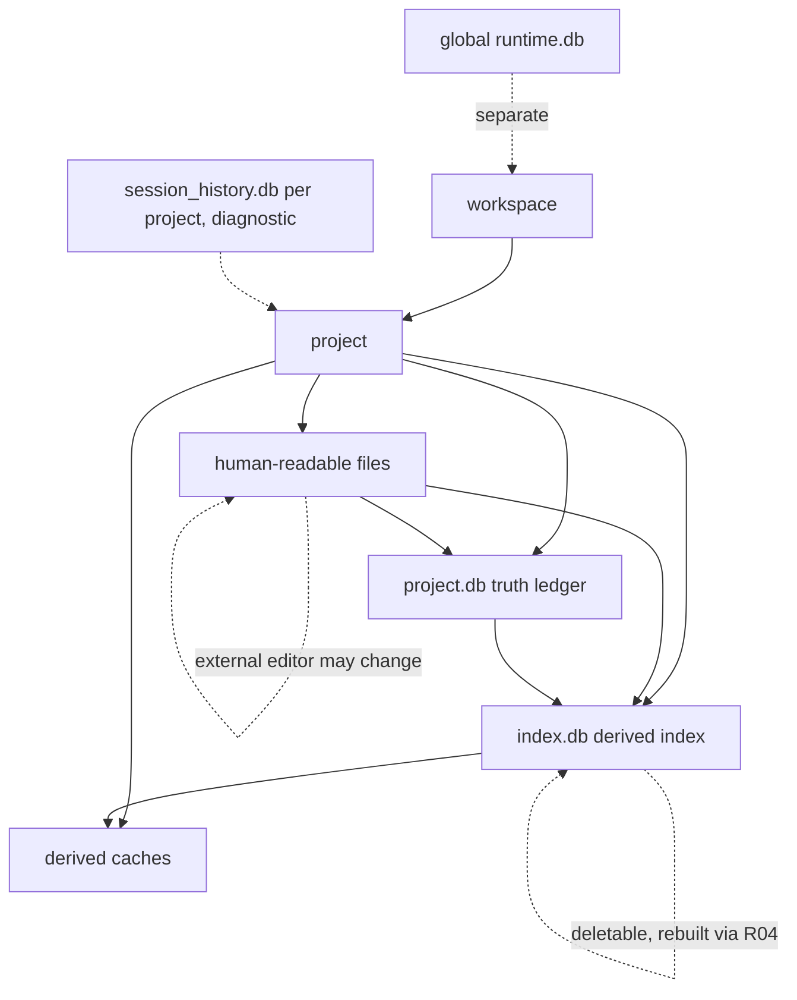
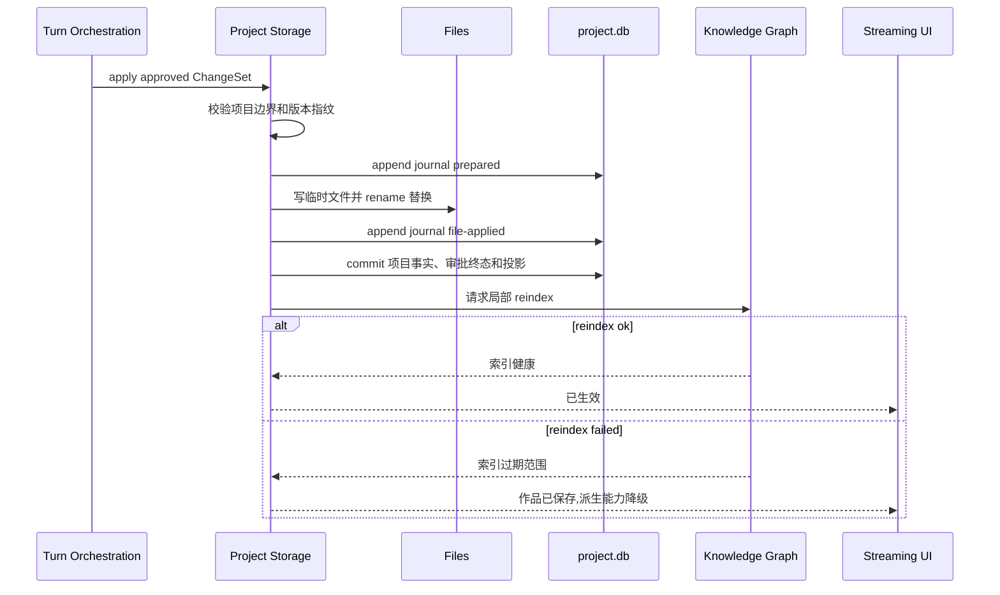
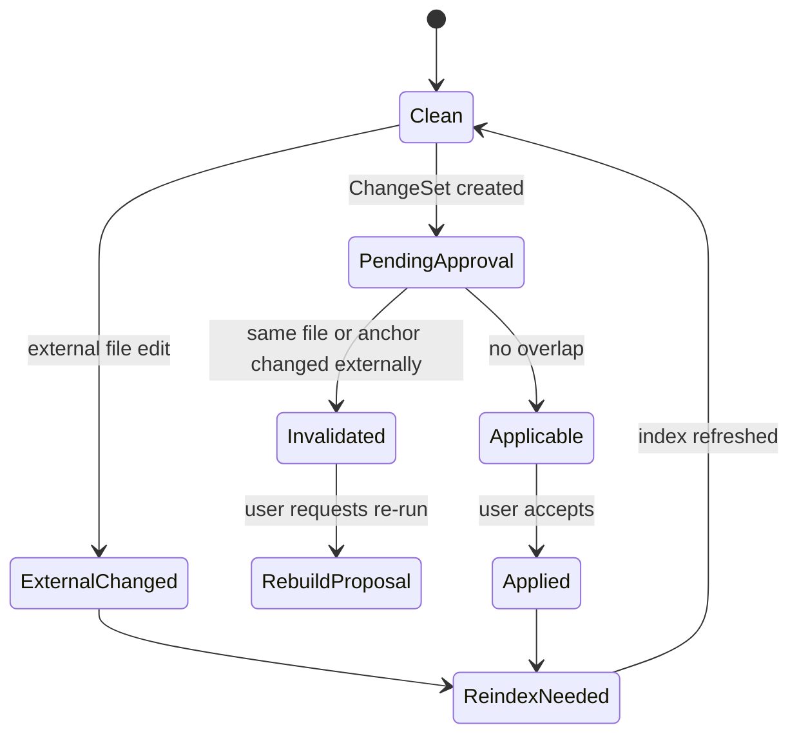

# S01 · Project Storage

这篇不是数据库设计,而是一份“作品事实保管协议”。它解释作者文件、项目事实库和派生索引如何一起工作,以及在外部编辑、写入失败、索引失败时系统如何避免撒谎。

## 两个开场事故

先用两个事故定义存储层。

| 事故 | 如果设计错误 | 本篇要求 |
|---|---|---|
| 作者在外部编辑器改了同一章,同时应用里还有一个待审批改写 | AI 提议被直接套到新文件上,覆盖作者刚改的内容 | 外部编辑让相关审批失效,用户重新审定 |
| 审批通过后文件写成功,索引刷新失败 | UI 显示“全部完成”,但查询和高亮还在旧事实上 | 作品事实生效,索引标记过期,下游能力显式降级 |

Project Storage 的核心价值不是“把数据存起来”,而是让每个事故都有可信的收场。

## 项目写入权

应用是单实例(见 [I05](./platform/I05-desktop-shell-contract.md)):一台机器同一时刻只有一个常驻执行宿主,所有窗口都是同一宿主的 renderer 视图。因此写入权分两层:

**窗口写入权**是宿主进程内的裁决。同一项目同一时刻只有一个可写窗口,保护 active writable turn、pending approval、recap、index repair 和外部编辑冲突处理。

| 场景 | 存储层要求 |
|---|---|
| 第一个窗口打开项目 | 成为可写窗口,可进入写作和审批路径。 |
| 第二个窗口打开同项目 | 默认只读视图,可查询和查看,不可提交审批或写入。 |
| 用户显式切换可写窗口 | 原可写窗口降级为只读视图,新可写窗口重新加载项目状态和 pending 事务;切换不打断运行中的 turn(执行在宿主)。 |
| pending approval 存在 | 切换可写窗口前必须展示 pending 内容和风险,不能静默关闭。 |

Storage 不用“最后写入者获胜”解决冲突。任何绕过写入权的写入都视为外部编辑,按冲突判定让相关审批失效。

生产和开发调试都在桌面壳边界内执行。写入权、SQLite/native binding、watcher cursor、append-only journal 和恢复流程运行在常驻执行宿主中;renderer 不能直接写项目文件或数据库,只能提交命令、展示状态和读取持久结果。桌面壳开发模式可以打开诊断和 mock provider,但不得绕过本篇的写入权、审批、journal 和冲突语义。

**崩溃防护 fencing**是持久化 lease/fencing token 的唯一保留用途。项目事实库持久记录当前宿主实例 id 和 fencing token;每次写作者文件、写项目事实、应用审批、运行 repair job 或执行恢复前,都要携带当前 fencing token。宿主异常退出后,新宿主启动接管时生成新 token 并执行 apply journal 启动扫描(见「Apply Journal」节);旧宿主任何残留的延迟写入因 token 不是最新而被写入路径拒绝。单实例之下不存在跨进程 lease 续约、过期和显式接管协议。

## 事实账本

| 对象 | 落在哪个库 | 例子 | 是否作品真源 | 读者需要知道什么 |
|---|---|---|---|---|
| 作者文件 | 文件系统(Markdown) | 章节、设定、角色、大纲、项目元信息 | 是 | 可以被人直接打开、迁移、审查 |
| 审批后项目事实 | `project.db` | 已接受的 ChangeSet、apply journal、审批终态、obligation、文件指纹 ledger、fencing 记录、持久 turn 状态 | 是 | 解释“这次变更何时生效”;损坏触发 facts-degraded |
| 项目索引 | `index.db` | 实体、别名、概念、关系、时间线、依赖、锚点、embedding、卷摘要、搜索缓存 | 否 | 只帮助查询和生成,不能覆盖文件;整库可删,由 R04 全量重建 |
| 运行时历史 | runtime.db / session_history.db | thread、trace、tool run、用量 | 否 | 不属于项目存储主权 |

作者文件和审批后事实共同构成作品账本。派生索引是账本的目录和检索卡片,不是第二本账。每项目把真源账本和派生索引物理拆成两个数据库文件,正是为了让“账本损坏”和“索引损坏”有不同的命运:前者是事故,后者只是一次重建。

## Append-only apply journal

所有会改变作者文件、项目事实库、审批终态、obligation、recap/activity 投影或恢复水位的动作,都必须先进入 append-only apply journal。Journal 是落盘事实序列,不是调试日志;Trace、Recap、Activity、诊断包和恢复入口都从它投影,不能各自发明一套“这次到底发生了什么”。

每条 journal entry 至少说明:turn id、action id、apply id、来源模式、事务类型、当前 fencing token、输入文件指纹、输出文件指纹、影响文件、项目事实水位、reindex 水位、用户裁定、恢复策略和投影状态。写入过程按三段提交:

| 阶段 | 写什么 | 崩溃后怎么收场 |
|---|---|---|
| prepared | 记录意图、前置条件、输入指纹、临时文件路径和恢复策略 | 启动扫描时若未 touching 原文件,标记 abandoned;用户看到未生效。 |
| file-applied | 临时文件已 rename 替换,输出指纹已知 | 启动扫描必须前滚项目事实和投影,不能把自写结果误判为外部编辑。 |
| committed | 项目事实、审批终态、obligation/recap 投影和 reindex request 已入账 | 允许展示已生效;若 reindex 失败,进入 degraded/repair,不回滚作者文件。 |

跨文件 ChangeSet 不是文件系统原子事务。它通过同一 apply id、每文件 prepared/file-applied 记录和单一 committed 水位表达原子结果:用户侧看到的是整批成功、整批失败、或需要内部恢复;系统内部可以前滚已替换文件并阻断后续写入,直到 journal 恢复到可解释状态。

宿主启动(含崩溃后重启)、恢复和 repair 前必须扫描未完成 journal。只要存在 prepared/file-applied 未收场记录,项目进入恢复流程:先停止新的可写 turn 和审批应用,再按 journal 记录前滚、放弃或要求人工处理。恢复结果同样追加 journal,不能修改旧记录来假装事故没发生。

## 轻量写入事务

作者直接输入、普通保存、小选区 inline accept 和 Humanizer 就地接受不需要整批审批卡,但仍然是作品事实写入。它们走 light apply transaction:

| 来源 | 是否生成 ChangeSet | 必须入账 |
|---|---|---|
| 作者直接编辑并保存 | 不生成审批 ChangeSet | editor action id、文件指纹、锚点变化、activity 摘要、reindex request。 |
| inline review accept | 生成轻量 accepted edit,不进入 cascade card | 原文范围、用户接受版本、undo bridge、风险重检结果。 |
| Humanizer 小改接受 | 生成轻量 accepted edit | diff、不可改事实校验、风格来源、reindex request。 |

Light apply 与审批 apply 共用窗口写入权、fencing token、fingerprint ledger、journal 和 reindex/degraded 收场。差别只在用户交互重量:小改就地审定,大改整批审批。任何 light apply 若触及跨文件、设定、关系、伏笔、事实库治理或阻断级风险,必须升级为 ChangeSet 或 planning prerequisite,不能继续伪装成轻量保存。

Editor undo 不是历史回滚。用户撤销一个已 journal committed 的 light apply 时,系统生成新的反向 light apply entry,向前追加,并重新触发 reindex/obligation 投影。

## 文件指纹与自写回声

每个作者源文件都有持久 fingerprint ledger,记录文件身份、内容指纹、mtime/size 辅助信息、最近一次已确认 watcher 水位、最近一次系统写入 token 和写入完成后的指纹。指纹是判断外部编辑、审批失效和离线窗口重开的基线;mtime/size 只能作为快速筛选,不能单独证明文件未变。

系统写文件时必须生成 write token。watcher 收到同一文件事件后,只有当事件能匹配当前 owner、write token、目标指纹和水位推进,才可标记为自写回声;否则按外部编辑处理。自写回声只能消除重复 reindex 和误报,不能跳过写入结果入账。

外部编辑判定遵循三条规则:

| 判定 | 存储层处理 |
|---|---|
| 指纹不同且无匹配 write token | 外部编辑,命中 pending approval 时使相关审批失效。 |
| 指纹不同但匹配当前 write token | 自写回声,推进指纹 ledger 和 watcher 水位。 |
| 指纹 ledger 缺失或不可信 | 进入 reconcile,相关索引至少标记 stale;高风险写入先阻断。 |

文件与项目事实库冲突时,作者文件优先表达当前正文事实;项目事实库负责解释审批历史、版本指纹、obligation 和恢复账本。不能为了让旧审批历史看起来一致而覆盖作者文件。

## facts-degraded 模式

`facts-degraded` 只由 `project.db` 触发。项目事实库 `project.db` 里的审批历史、版本指纹、obligation、fencing 记录和恢复账本不可完全从 Markdown 文件重建;只要这些真源记录损坏、丢失或校验失败,项目进入 `facts-degraded` 模式。派生索引库 `index.db` 损坏、丢失或版本不兼容不进入 facts-degraded:它走 [R04](./platform/R04-index-health-and-repair.md) 的健康度降级和全量重建,期间项目仍可正常写作,只是依赖索引的能力降级。

`facts-degraded` 下,作者文件仍可只读打开,用户可以直接取用正文文件、查看可解析 frontmatter,并选择恢复路线;系统必须阻断新的可写 Agent turn、审批应用、自动 cascade 和会改写项目事实的 repair。派生索引可以重建,但重建结果不得伪装成丢失的审批历史或 obligation。

`facts-degraded` 只有一条显式出路:

| 出路 | 结果 |
|---|---|
| 以作者文件为准重建最小事实库 | 正文和设定继续作为事实;审批历史、obligation 解决状态和旧版本指纹标记为 lost,相关能力降级,后续变更从新账本向前追加。 |

这条出路必须留下用户可见记录,说明哪些事实被保留、哪些历史不可恢复、哪些审批或 obligation 已失效。

## 项目拓扑

运行时会话可以引用项目,但不能成为项目事实。过程历史可以解释一次操作,但不能恢复章节正文。这个隔离让“带走项目文件”和“调试系统过程”不混在一起。

## 落盘剧本

审批通过后的写入必须像事务剧本一样走完,不能边走边宣称完成。

关键点是:落盘成功和 reindex 成功不是同一件事。作品可以已经保存,索引仍然过期;UI 必须区分这两种状态。

## 文件可以被人读,但不能被随意解释

作者文件承担迁移和审查价值,因此正文、设定和大纲要保持人类可读。系统依赖 frontmatter 或等价元信息来识别文件身份、类型、版本和派生属性。

| 情况 | 存储层处理 |
|---|---|
| frontmatter 合法 | 文件进入项目事实和索引刷新路径 |
| frontmatter 缺失但可识别 | 提示修复或进入受限识别流程 |
| frontmatter 损坏 | 阻断高风险生成,不把文件当可信事实 |
| 文件标记为派生 | 防止派生内容伪装成作者原始事实 |
| 编码/换行不一致 | 只做不改变语义的归一化 |

文件可读不等于模型可随意相信。外部粘贴或拖入的资料、用户粘贴正文和外部编辑内容仍是普通内容,不能变成系统指令。

## 外部编辑的冲突判定

系统不自动把旧 proposal 套到新文件。只要外部编辑命中同一文件、同一段落锚点或同一版本指纹,相关审批就失效。

## 失败收场表

| 失败现场 | 已生效的东西 | 用户看到 | 可重试动作 |
|---|---|---|---|
| 路径越界或 workspace 不可写 | 无 | 无法写入项目位置 | 修复路径/权限后重试 |
| 文件写失败 | 无或部分临时状态 | 审批未生效 | 从失败点重试或取消 |
| 项目事实库写失败 | journal 决定是否 file-applied | 落盘未完成,进入恢复 | 启动扫描前滚/放弃/人工处理 |
| reindex 失败 | 作者文件已生效 | 索引过期,查询/高亮降级 | 重新索引 |
| internal recovery 快照缺失 | 已生效变更保留 | 无法自动生成反向修正 | 人工处理并重新索引 |
| 外部编辑冲突 | 外部文件事实优先 | 待审批内容失效 | 重新生成 proposal |
| 项目事实库真源损坏 | 作者文件仍优先 | facts-degraded,写入和审批阻断 | 以作者文件为准重建最小事实库 |

## 与其他 spec 的握手

| 对方 | Project Storage 给它什么 | Project Storage 从它要什么 |
|---|---|---|
| [S04](./S04-turn-orchestration.md) | 落盘结果、内部恢复结果、冲突状态和修正建议 | 已审批 ChangeSet 和事务意图 |
| [S06](./S06-knowledge-graph.md) | 文件变更范围、版本、派生写入边界 | reindex 健康度和过期范围 |
| [S07](./S07-context-management.md) | 可查询的项目事实入口 | 不要把查询结果反写文件 |
| [S14](./S14-editor-and-interaction.md) | 外部编辑、保存、冲突提示 | 用户直接编辑产生的文件变更 |
| [M14](./M14-settings.md) | workspace/project 生命周期结果 | 删除等危险操作确认 |
| [I03](./platform/I03-filesystem-and-watcher.md) | watcher cursor、外部编辑事件和崩溃防护信号 | 平台层不能绕过存储写入权 |
| [R01](./platform/R01-project-lifecycle.md) | 打开、关闭、可写窗口切换和恢复流程 | 项目 open/close 必须尊重窗口写入权与 fencing 校验 |

## FAQ

**Q: 文件和数据库谁是真源?**

A: 作者可读文件和审批后事实是真源。真源记录在 `project.db`,派生索引在 `index.db`,两者物理分库;具体表的库归属在 appendix 展开。

**Q: reindex 失败为什么不回滚作品文件?**

A: 因为作者文件已经是作品事实。索引失败影响查询和辅助能力,不应自动撤销作者刚审定的内容。

**Q: 外部编辑是不是应该自动 merge?**

A: 不应该默认自动 merge。小说正文的语义改动很难安全合并,命中待审批区域时应让 proposal 失效并重新审定。

**Q: 过程历史能不能恢复项目?**

A: 不能。过程历史只解释系统做过什么;项目恢复以作者文件、审批后事实和明确快照为准。

**Q: 为什么要标记派生文件?**

A: 防止摘要、报告、缓存或重建产物被误当成作者原创事实,从而污染后续生成。

## Appendix

- [appendix/schema-tables](./appendix/A01-schema-tables.md) 保存文件、frontmatter、项目事实库、派生索引和迁移字段明细。
- [appendix/migration-notes](./appendix/A06-migration-notes.md) 保存 native binding、WAL、连接和迁移审计。
