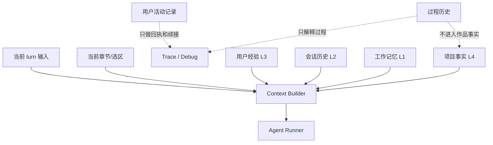
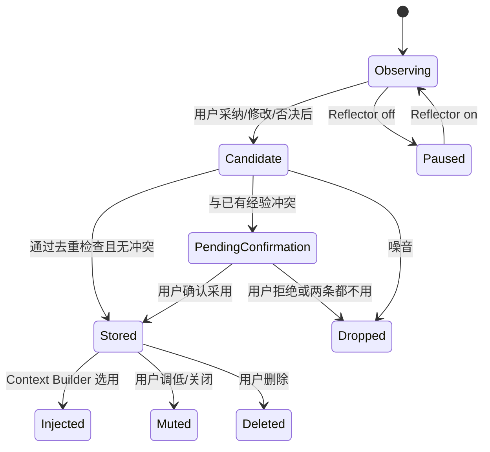
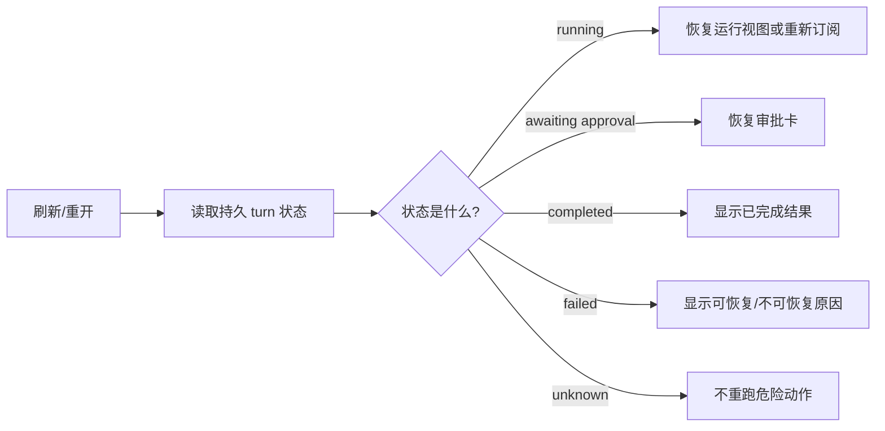

# S02 · Runtime State

这篇回答一个看似简单的问题:系统到底“记住”了什么?答案分四类:对话连续性、长期经验、用户级活动记录、过程证据。它们都叫运行时状态,但只有少数会影响后续生成,没有任何一类能取代作品事实。

## 一位作者第二天回来

作者昨天让系统写了一章,改掉两处 AI 腔,否决了一个角色动机,今天重新打开项目继续写。系统应该做到:

- 记得最近对话,不用作者重复上下文。
- 记得“少用排比式总结”这类已确认偏好。
- 能用作者看得懂的活动时间线说明昨天改了什么、停了什么、还剩什么。
- 能展示昨天那次生成用了哪些 Agent 和工具。
- 不能用昨天的聊天记录覆盖今天项目文件里的事实。

这就是 Runtime State 的边界。

## 记忆分层图

优先级从高到低是:当前显式指令、项目事实、当前任务上下文、用户经验、会话历史。过程历史默认不进入生成上下文,除非某个调试或解释任务明确读取它。

## 三种数据库,三种用途

| 位置 | 保存什么 | 影响生成吗 | 能恢复作品事实吗 |
|---|---|---|---|
| runtime.db | thread、message、压缩摘要、turn recap、跨项目会话恢复状态 | 可以影响对话连续性和续接提示 | 不能 |
| project index/fact store | 项目经验、实体、关系、审批后事实、派生索引 | 可以影响写作和查询 | 只能恢复它拥有主权的项目事实部分 |
| session_history.db | 模型调用、工具调用、trace、成本、错误 | 默认不影响 | 不能 |

Recap 是作者级 changelog,不是作品。过程历史再完整也只是证据,不是作品。会话消息再像“设定”,也不能绕过项目事实层。

持久 turn 状态属于 project fact store。pending approval、approval queue、obligation、mode gate、apply journal 投影和 recovery pointer 都随项目走;runtime.db 只保存跨项目打开、最近项目和 UI 恢复指针,不能成为 pending approval 的唯一来源。项目包导出/导入时,pending 状态必须从项目事实库重校验,不能靠 runtime.db 复活。

runtime.db 里的 recent objects 和 query history 必须按 project id 分区。全局最近项目列表可以跨项目,但任何项目内 search、context、preview cache 都只能读取当前 project id;找不到项目分区时,宁可显示少历史模式,不能把别的书的最近对象注入当前项目。

## Reflector 的生命周期

Reflector 关闭的含义很具体:不再学习新经验。它不等于清空已有经验,也不等于本次生成忽略所有风格偏好。已有经验是否注入,由 Settings 中的权重、关闭和删除动作决定。

经验冲突不自动仲裁。Reflector 发现新候选与既有经验在同一任务、同一作用域下互相否定时,必须进入 PendingConfirmation,在 Settings / Memory 中展示新旧两条、来源 turn 和影响范围,由用户选择采用新经验、保留旧经验或两条都不用。PendingConfirmation 不进入 context 注入,也不能被普通 Agent 当作偏好使用。

## 什么会进入上下文

| 运行时材料 | 进入条件 | 冲突时谁优先 |
|---|---|---|
| 最近消息 | 当前 thread 需要对话连续性 | 当前显式指令 |
| 压缩摘要 | 原始消息太长且摘要可信 | 原始事实和当前指令 |
| 用户经验 | 任务类型匹配、权重有效、未被关闭 | 项目事实和当前显式指令 |
| turn recap | 用户要求续接、查看历史或基于历史生成恢复提案 | 项目事实和当前指令 |
| 过程 trace | 用户问“刚才为什么这样做”或 Debug 展示 | 不参与作品事实 |
| 失败记录 | 用于恢复、提示、诊断 | 持久 turn 状态 |

Agent 不能自己挑 runtime 材料。所有注入都经 [S07](./S07-context-management.md) 的 context builder。

## 恢复不是重放

恢复时不重新让 Router 猜一次用户意图。重跑可能导致重复 proposal、重复写入或重复学习经验。业务结果以持久 turn 状态和项目事实为准。

## 事故处理

| 事故 | 不能做 | 应该做 |
|---|---|---|
| 压缩摘要失败 | 删除原始消息只留空摘要 | 保留原始消息,延后压缩 |
| 经验写入冲突 | 自动覆盖旧经验或重复追加几条相似经验 | 进入待确认,展示新旧经验和来源,等用户选择 |
| recap 写入失败 | 假装已进入用户 changelog | 保留 turn 结果并标记活动记录缺失 |
| 过程日志写失败 | 阻断已审批的文件落盘 | 标记 Trace 不完整 |
| runtime.db 读取失败 | 假装拥有历史上下文 | 以少历史模式运行并提示 |
| Reflector 关闭 | 清空用户已有手感 | 停止学习新经验,已有经验按设置处理 |

## 用户可见面

用户不应该看到运行时表名,但应该能控制这些行为:

| 用户入口 | 展示/控制 |
|---|---|
| Trace | 本次 turn 做过什么、哪里失败、诊断是否完整 |
| Activity / Recap | 项目活动时间线、作者备注、续接入口 |
| Settings / Memory | 学到了哪些经验、来源大意、权重、关闭、删除 |
| 输入条/状态点 | 当前是否有历史缺失、是否待审批、是否失败 |
| Debug Mode | 只读查看 session history、索引健康度、上下文包 |

## FAQ

**Q: 经验是不是跨项目共享?**

A: 当前契约按项目隔离。跨项目共享会带来风格和隐私污染,不在主路径内。

**Q: 用户关闭 Reflector 后,为什么旧经验还会生效?**

A: 因为“停止学习”和“停止使用已学经验”是两件事。后者需要用户在 Memory/Style 中关闭或删除。

**Q: 过程历史能不能作为审计证据?**

A: 可以解释系统过程,但不能替代作者文件、审批记录或项目事实。

**Q: Recap 是不是经验?**

A: 不是。Recap 是作者级活动记录;经验必须来自作者审定或明确反馈,不能因为 recap 存在就自动学习。

**Q: 会话压缩会不会丢重要事实?**

A: 压缩摘要只能辅助对话连续性。项目关键事实必须进入项目事实层,不能只存在于摘要中。

**Q: 如果 runtime 状态坏了,项目还能打开吗?**

A: 应该能。项目文件和项目事实优先;缺失的是对话连续性和过程解释。

## Appendix

- [appendix/schema-tables](./appendix/A01-schema-tables.md) 保存 runtime、activity recap、experience 和 session history 表结构。
- [appendix/event-catalog](./appendix/A03-event-catalog.md) 保存过程事件和 trace 事件明细。
