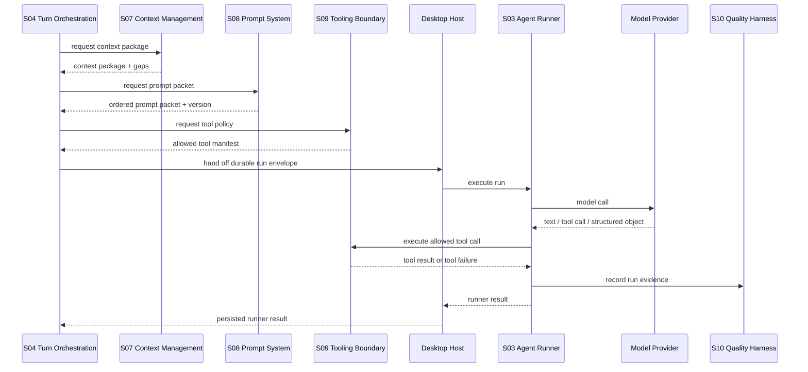
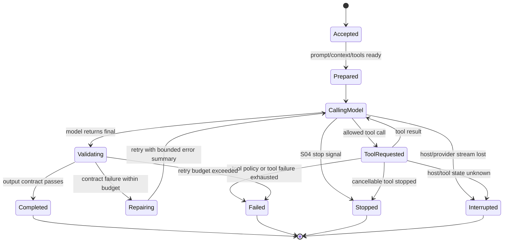
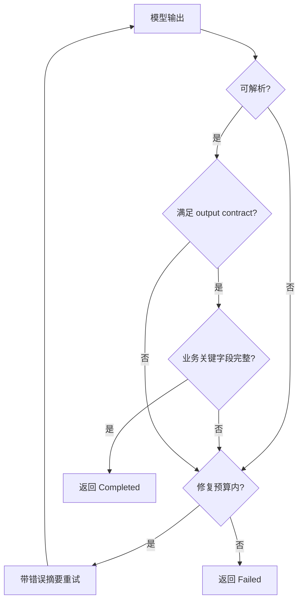

# S03 · Agent Runner

这篇把 Agent Runner 写成一台受控执行器。Runner 只负责把一次已授权的 Agent run 跑完:调用模型、执行允许的工具、收集 step、校验结构化输出、在预算内重试,最后把结果交还给 [S04 · Turn Orchestration](./S04-turn-orchestration.md)。

它不拥有 prompt 优先级、不拥有上下文取舍、不拥有工具权限、不拥有质量门禁,更不能批准写入作品。

Runner 也不是角色清单。持久化角色 id 只有 [M13 · Agent Team Controls](./M13-agent-team-controls.md) 定义的七个 canonical role id;S03 的 `role` 字段只引用这些 id,不另建“13 个 runner”或按能力拆分的隐藏角色。

## Runner 在链路里的位置

Runner 是运行时边界,不是总控。只要结果会改变作品,Runner 的返回值只能成为 proposal、批阅建议或失败状态,等待 S04 进入审定、取消或 recap。

## 执行宿主

Runner 在桌面壳的常驻执行宿主/sidecar 中运行,不绑定 renderer、普通浏览器标签页、开发服务器请求或单条 stream 连接。UI 可以停止、恢复订阅、热更新或重新打开窗口,但这些动作不等于 run 成功、失败或取消;业务结果以持久 run envelope、step 证据和 S04 turn 状态为准。

桌面壳开发模式可以替换 provider、打开 DevTools、加速 renderer 热更新,但不能把 Runner 移出桌面壳边界。开发时的进程重启或调试中断必须标记为开发事故,不能反向定义生产失败语义。

## Runner 拥有什么

| Runner 主权 | 说明 |
|---|---|
| run envelope | 记录本次 role、mode、output contract、prompt version、context package id、tool policy id、model profile 和取消信号。 |
| model loop | 控制一次模型调用、工具调用、继续调用和结束条件,不把循环交给模型自由延展。 |
| structured result | 校验模型输出是否满足本次 output contract;失败只能重试、降级为 failure 或交回 S04。 |
| retry budget | 管理结构化修复、工具失败恢复和 provider transient retry 的上限,防止 doom-loop。 |
| stream step | 把 step、tool call、partial text、failure 和 final result 映射为 [S05](./S05-streaming-ui-protocol.md) 可去重事件。 |
| cancellation | 接收 S04 的 stop/cancel 信号,停止后交回已发生的 step 和未完成状态,不能自行决定写入。 |

Runner 还必须把每个 run 的持久身份交给执行宿主。stream 连接只是观察窗口;执行宿主负责让取消信号、step 写入、恢复读取和最终结果不随 UI 断线丢失。每条 stream step 必须有 turn id、attempt id、step id 和递增序号,使 UI 可以去重和重排,但不能把事件流当事实源。

## Run 内工具结果缓存

Runner 可以在同一 run 内复用工具结果,但缓存只是执行优化,不是新的事实来源。缓存命中必须仍然产生可追踪 step,让 Trace 能解释“这次没有重新调用工具,而是复用了哪一次结果”。

| 边界 | 契约 |
|---|---|
| scope | 缓存只在同一 run envelope、同一 attempt lineage 内有效;跨 turn、跨 run、跨项目和恢复后的新 attempt 不能默认复用。 |
| key | 至少绑定 tool name/version、规范化参数、permission class、context package id、source_refs/fingerprint、model/tool policy id 和 freshness marker。 |
| eligible | 只读、查询、纯格式化或可证明幂等的 internal tool 可缓存;proposal tool、platform side effect、non-cancellable 未知状态和任何写入前置检查不得用旧结果替代新检查。 |
| invalidation | source fingerprint、context package、tool policy、provider/model profile、freshness marker、pending approval 状态或用户输入发生变化时失效。 |
| trace | 命中缓存时记录原 tool_call_id、cache key 摘要、命中原因、失效条件和用户可见摘要;不能把缓存命中伪装成新工具成功。 |

缓存失败或失效不能改变业务结论。Runner 最多重新调用工具或返回需要新鲜证据的 failure;不得用过期结果生成审批、落盘前置或风险解除。

## 宿主重启与 interrupted run

常驻执行宿主崩溃、重启、升级或开发热重载时,Runner 不能让 UI 猜 run 是否完成。每个 accepted run 必须有 durable run envelope 和 heartbeat:

| 宿主事故 | Runner/S04 结果 |
|---|---|
| renderer 刷新或 stream 断线 | run 继续;UI 重新订阅并按 step 身份去重。 |
| host 进程重启,run 尚无 final result | 标记 `interrupted`,保留最后 step、已完成 tool result 和可重试点。 |
| host 重启时 provider call in-flight | 结果未知;不得自动假定成功,进入 recovery/interrupted 投影。 |
| host 重启时 tool in-flight | 由 S09 tool cancelability 决定重试、等待或 manual recovery。 |
| host 重启时已返回 proposal 但未交给 S04 | 从 persisted runner result 恢复;缺 result 时标记 failed/interrupted。 |

`interrupted` 不是普通 failure。S04/S05 必须向用户展示“运行被中断、哪些结果可用、是否可安全重试”。只有幂等且没有 durable change 的 run 可以从 checkpoint 重试;已经进入 apply journal 的流程交给 S01 恢复,Runner 不得重放危险动作。

## Runner 不拥有什么

| 不归 Runner | 主权位置 |
|---|---|
| 哪些事实必须装入、哪些事实可裁 | [S07 · Context Management](./S07-context-management.md) |
| prompt 分层、优先级、不可信内容围栏 | [S08 · Prompt System](./S08-prompt-system.md) |
| 工具白名单、工具权限、二次 LLM 调用边界 | [S09 · Agent Tooling Boundary](./S09-agent-tooling-boundary.md) |
| canonical AI 角色 id、角色开关和成本归因 | [M13 · Agent Team Controls](./M13-agent-team-controls.md) |
| 真实任务回放、输入输出记录、失败复现 | [S10 · LLM Quality Harness](./S10-llm-quality-harness.md) |
| golden regression、质量指标、阻断门禁 | [S11 · Evaluation And Golden Regression](./S11-evaluation-and-golden-regression.md) |
| 审批、落盘、取消计划、recap | [S04 · Turn Orchestration](./S04-turn-orchestration.md) |

## 一次 run 的状态机

`Completed` 不代表作品已改变,只代表 Runner 得到一个可交给 S04 的结果。`Stopped` 也不是失败;它会带上已完成 step 和不可用 artifact 的解释,由 S04 生成 stopped recap 或 cancel plan。`Interrupted` 表示执行宿主或外部调用状态未知,只能交给 S04 recovery 投影,不能自动生成成功结果。

## Tool loop 与 stop 条件

Runner 可以使用外部 SDK 的 step loop,也可以使用手写 while loop,但对上层暴露同一个 `RunnerLoop` 语义:

| 循环点 | 契约 |
|---|---|
| tool result marker | 每个工具结果必须明确回到本次 run,不能被模型当成用户新指令。 |
| step finish | 每一步结束都产生可记录 step,便于 Trace、harness 和失败复现。 |
| stop condition | 达到 final output、工具次数上限、retry budget、取消信号或 provider failure 时必须停。 |
| fallback | 如果 SDK 的 `stopWhen`、tool marker 或 step callback 实查不稳定,实现退回手写 loop,上层契约不变。 |

外部行为实查归 [V03 · External Spikes](./appendix/V03-external-spikes.md);测试矩阵归 [V01 · Test Matrix](./appendix/V01-test-matrix.md)。代码实现前不能把未验证 SDK 行为当作已成立前提。

工具取消分三类:可立即取消、只能到安全点取消、不可取消。Runner 收到 stop signal 后必须把类别和等待状态回传 S04/S05;不可取消工具超时后进入 interrupted 或 manual recovery,不能把“已请求取消”当作“已停止”。

## 结构化输出失败如何收场

“补默认值”只能用于不会影响行为的展示字段。影响审批、落盘、风险、上下文、来源解释或工具调用的字段缺失时,Runner 必须失败,不能把自然语言解释当结构化结果继续编排。

## Retry budget 防 doom-loop

Runner 与 S04 共享同一条防循环规则:自动重试只能修复可证明的 transient 或 contract failure,不能把失败包装成新的无限 turn。

| 预算 | 归属 | 超限后 |
|---|---|---|
| structured repair budget | S03 | 返回 structured-output failure,附最近错误摘要。 |
| tool retry budget | S03 + S09 | 返回 tool failure,保留工具名、来源和失败类型。 |
| provider retry budget | S03 + I01 | 返回 provider failure,不再自动换模型写入。 |
| user retry budget | S04 | 进入用户可见失败或需要修改输入的提示。 |
| heartbeat/watchdog budget | S03 + host | 返回 interrupted,由 S04 展示恢复入口。 |

每次重试都必须记录 `retry_reason`、`attempt_count`、`contract` 和最后一次失败摘要,供 [S10](./S10-llm-quality-harness.md) 复现。任何 retry budget 超限后,系统不能自动生成“再试一次”的新 turn。

## Runner result

Runner result 只表达运行结果,不表达审批决定。

| 结果 | 含义 | 下一站 |
|---|---|---|
| answer | 讨论模式解释、澄清、建议 | S04/S05 展示,不落盘。 |
| report | 守则诊断、读者反馈、查询解释 | S04 决定展示或附到审批解释。 |
| review suggestion | 小选区批阅建议 | S04/S14 进入就地审定路径。 |
| proposal | 章节草稿、设定修改、跨章节 ChangeSet | S04 进入审批或 cascade。 |
| failure | provider、tool、schema、cancel、overflow 等运行失败 | S04 决定失败回执、recap 或恢复入口。 |

完整 schema 归 [A02 · JSON Schemas](./appendix/A02-json-schemas.md)。Runner 只在根层说明哪些结果能被继续编排。

## FAQ

**Q: Router 也是 Agent,为什么不能直接执行动作?**

A: Router 只能返回 action proposal。action 是否可执行、是否危险、是否需要审批,由 S04 判断。

**Q: Agent 能不能自己查数据库补上下文?**

A: 不能随意查。Runner 只能执行 S09 允许的工具,上下文主入口仍是 S07。

**Q: prompt injection 在哪里处理?**

A: S08 定义不可信内容围栏,S09 限制工具能力,S03 只执行已经组装好的 prompt packet 和 tool policy。

**Q: 流式文本能不能边写进编辑器?**

A: 可以展示草稿流。替换作品、进入审批或生成 recap 必须等 Runner result 完整并由 S04 接管。

**Q: 内部辅助 Agent 会不会成为隐藏 Agent?**

A: 不允许。任何二次 LLM 调用都必须由 S09 定义边界,由 S03/S10 记录运行证据,不能绕过 Trace、harness 和审批。

## Appendix

- [A02 · JSON Schemas](./appendix/A02-json-schemas.md) 保存 Runner result、structured output、failure envelope 等 schema。
- [A03 · Event Catalog](./appendix/A03-event-catalog.md) 保存 step、trace、stream 和 failure 事件字段。
- [A04 · Tool Catalog](./appendix/A04-tool-catalog.md) 保存工具参数明细;权限和失败语义由 [S09](./S09-agent-tooling-boundary.md) 定义。
- [A05 · Prompt Templates](./appendix/A05-prompt-templates.md) 保存 prompt 模板全文;prompt 主权由 [S08](./S08-prompt-system.md) 定义。
- [V01 · Test Matrix](./appendix/V01-test-matrix.md) 保存 Runner loop、retry 和 cancellation 的验证矩阵。
